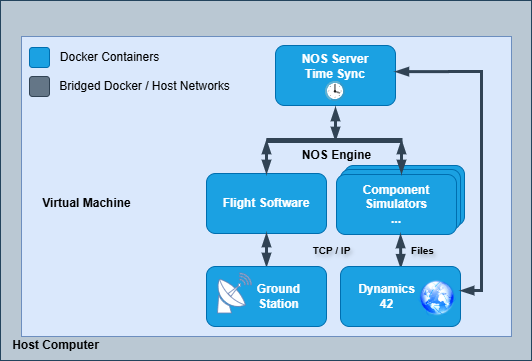
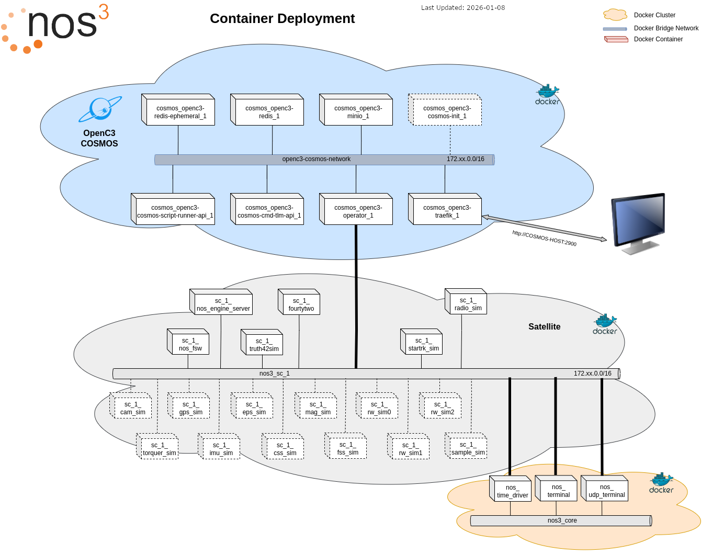

# NOS3 아키텍처(NOS3 Architecture)

NOS3가 실행되면, Linux에 패키지를 직접 설치하고 관리해야 하는 번거로움을 줄이기 위해 Docker 컨테이너들을 새로 생성합니다.



위 이미지는 하나의 Linux 가상 머신(VM) 안에 모든 것이 감싸져 있는 설치 옵션 A를 보여줍니다.
VM 안에서 실행될 때, Docker 컨테이너들은 네트워크로 연결되어 운영 시뮬레이터에 필요한 모듈들을 제공합니다.



NOS3의 모든 프로세스는 (모범 사례에 따라) 각자 자신만의 컨테이너 안에서 실행되며, Docker 네트워크는 서로 다른 컨테이너 그룹들을 분리하는 데 사용됩니다.
그림 상단에는 'COSMOS'라는 이름의 클라우드가 있는데, 현재 버전에서는 이것이 OpenC3, COSMOS, YAMCS 중 하나가 될 수 있으며, 기본값은 YAMCS입니다.
이것은 위성을 명령할 수 있는 지상 소프트웨어입니다.
각 위성은 자신만의 네트워크 안에 배치된 컨테이너 그룹으로 구성되며, 회색 클라우드로 표시되고 'nos3_sc_1'이라는 라벨이 붙어 있습니다.
그리고 여러 위성들 사이에서 공통으로 공유될 수 있는, 보편적으로 필요한 컨테이너 그룹이 존재하며, 이는 'nos3-core'에 할당됩니다.

## 위성(Satellite(s))

각 위성 내부에는 우주선의 여러 부분을 표현하는 다양한 "구성 요소" 시뮬레이터들이 존재합니다.
이 구성 요소 시뮬레이터들은 NOS Engine 미들웨어를 통해 통신하며, 이 미들웨어는 하드웨어 라이브러리(HWLIB)를 통해 비트/바이트 수준의 동작을 모델링하는 인터페이스를 제공합니다.
비행 소프트웨어는 자신이 우주에서 실행되고 있지 않다는 사실을 전혀 알지 못합니다.
동역학 엔진(42)은 우주선의 자세, 방향, 환경 상태를 유지하며 시뮬레이션과 인터페이스합니다.
이 구성 요소 시뮬레이터들은 다양한 결함 시나리오를 테스트하기 위한 백도어를 가질 수 있으며, 이는 NOS Terminal이나 NOS UDP 인터페이스를 통해 접근하여 스크립트로 제어할 수 있습니다.

여러 대의 우주선을 동시에 다루는 것도 개념 증명 차원에서 테스트된 바 있습니다.
설정 파일을 수정하면 이를 재현할 수 있지만, 여러 제약 사항이 존재합니다.

## 미들웨어 - NOS Engine

NOS Engine은 시뮬레이션 전용으로 설계된 메시지 전달 미들웨어입니다.
모듈식 설계 덕분에, 이 라이브러리는 I2C, SPI, CAN Bus를 포함한 특정 통신 프로토콜을 시뮬레이션하도록 확장 가능한 강력한 코어 레이어를 제공합니다.
시간 동기화, 데이터 조작, 결함 주입 같은 고급 기능을 갖춘 NOS Engine은 시뮬레이션의 각 부분들을 연결하고 테스트하기 위한 빠르고 유연하며 재사용 가능한 시스템을 제공합니다.

NOS Engine은 노드와 버스라는 두 가지 기본 객체 유형에 기반한 개념 모델 위에 구축되어 있습니다.
노드란 메시지를 보내거나 받을 수 있는 시스템 내의 모든 종류의 엔드포인트를 말합니다.
시스템 내의 모든 노드는 버스라고 부르는 그룹에 속해야 합니다.
하나의 버스는 임의의 개수만큼 노드를 가질 수 있으며, 버스에 속한 각 노드는 다른 구성원 노드들과 겹치지 않는 고유한 이름을 가져야 합니다.
버스에 속한 노드들은 일종의 샌드박스 안에서 동작합니다. 즉, 같은 버스에 있는 다른 노드와는 통신할 수 있지만, 다른 버스에 속한 노드와는 통신할 수 없습니다.

Within NOS3, NOS Engine은 하드웨어 버스의 소프트웨어 시뮬레이션을 제공하는 데 사용됩니다.
NOS Engine은 각 하드웨어 시뮬레이터가 해당 버스의 노드가 될 수 있도록 하는 인프라를 제공하며, 비행 소프트웨어가 자신의 버스에 있는 하드웨어 시뮬레이터 노드들과 상호작용할 수 있도록 합니다.
NOS Engine은 또한 I2C, SPI, CAN, UART 같은 다양한 프로토콜을 위한 플러그인도 제공합니다.
이 플러그인들 덕분에 각 버스와 그 버스에 속한 노드들은 해당 프로토콜에 특화된 호출과 개념을 사용해 통신할 수 있습니다.

## 동역학(Dynamics)

42는 범용의 다중 물체, 다중 우주선 시뮬레이션입니다.
NOS3에서는 시뮬레이션된 우주선의 움직임을 시뮬레이션하는 역할을 합니다.
42의 시간 진행은 NOS Engine을 통해 구동되며, 42는 NOS3의 일부인 시뮬레이터들에게 궤도력, 자세, 태양 벡터, 자기장 벡터 등의 환경 데이터를 출력으로 제공합니다.
42는 오픈소스 C 코드입니다. NOS3에서는 가상 머신의 /home/jstar/.nos3/42 디렉토리에 설치되어 있습니다.

## 디렉토리 구조(Directory Layout)

NOS3의 최상위 레벨에는 다음이 포함되어 있습니다:
* `cfg` - 미션, 우주선, 시뮬레이터를 위한 설정 파일
* `components` - 하드웨어 구성 요소 앱들을 위한 서브모듈(submodule) 저장소
* `docs` - 프로젝트 관련 각종 문서
* `fsw` - 비행 소프트웨어를 위한 서브모듈 저장소
* `gsw` - 지상국 파일 및 기타 지상 도구를 위한 서브모듈 저장소
* `scripts` - 각종 편의용 스크립트
* `sims` - 공통 시뮬레이터 및 시뮬레이터 플러그인 프레임워크

최상위 NOS3 저장소를 포크하거나 미러링해서 자신만의 용도로 사용하게 되면, 특정 파일들만 수정하는 것이 권장됩니다.
디렉토리 구조는 이를 가능하게 하고, 머지 리퀘스트가 준비되었을 때 빠르게 검토할 수 있도록 다음과 같이 설정되어 있습니다:
* `cfg`, 미션 파라미터를 정의
* `components`, 커스텀 구성 요소를 개발
* `gsw`, 커스텀 절차 및 명령/원격측정 데이터베이스를 개발
* `scripts`, 비행에 필요한 툴체인이 포함되도록 Dockerfile 및 각종 스크립트를 수정

### 기본 프로젝트 구조와 핵심 파일

아래는 기본 NOS3 체크아웃에서 자주 확인할 위치입니다. 릴리스나 미션에 따라 파일이 달라질 수 있으므로, 조사할 때는 문서보다 실제 체크아웃을 기준으로 삼으세요.

| 경로 | 역할 |
| --- | --- |
| `Makefile` | 개발 환경 준비, 빌드, 실행, 종료 등의 최상위 작업을 제공 |
| `cfg/` | 미션·우주선·시뮬레이터 설정. `nos3-mission.xml`은 미션 설정, `nos3_defs/targets.cmake`는 빌드할 앱, `nos3_defs/cpu1_cfe_es_startup.scr`은 시작할 cFS 앱을 지정 |
| `cfg/sims/nos3-simulator.xml` | 시뮬레이터와 각 하드웨어 모델의 설정 |
| `cfg/spacecraft/`, `cfg/InOut/` | 우주선별 설정 및 42 동역학 시뮬레이터 입력 |
| `components/` | 하드웨어 구성 요소 저장소. 이 체크아웃에는 `arducam`, `blackboard`, `cryptolib`, `generic_*`, `mgr`, `novatel_oem615`, `onair`, `sample`, `syn` 등이 있음. `ComponentSettings.cmake`는 공통 빌드 설정 |
| `fsw/` | 비행 소프트웨어. `apps/`의 cFS 앱, `cfe/`, `osal/`, `psp/`, `fprime/` 등 포함 |
| `gsw/` | 지상 소프트웨어와 도구: `ait/`, `cosmos/`, `yamcs/`, `yamcs-studio/`, `OrbitInviewPowerPrediction/` |
| `scripts/` | 설정, 빌드, 실행, 테스트를 돕는 스크립트 |
| `sims/` | 공통 시뮬레이터 프레임워크. `CMakeLists.txt`와 `MissionSettings.cmake`가 빌드 구성을 담당하며, `nos_time_driver/`, `sim_common/`, `sim_terminal/`, `truth_42_sim/`이 핵심 하위 프로젝트 |
| `cfg/build/`, `fsw/build/`, `gsw/build/`, `sims/build/` | 생성되는 설정·빌드 산출물. 일반적인 구조 조사에서는 소스와 구분할 것 |

구성 요소별 비행 앱·지상 명령/원격측정 정의·하드웨어 시뮬레이터는 보통 `components/<이름>/fsw/`, `gsw/`, `sim/`에 모입니다. 새 구성 요소 통합은 [구성 요소 생성 안내](NOS3_Generating_Component.md), 시뮬레이터 구조는 [시뮬레이터 안내](NOS3_Simulators.md)를 참고하세요.

`NOS3.sh`와 `NOS3-Stop.sh`는 `~/nos3`에서 각각 `make launch`, `make stop`을 실행하는 편의 래퍼입니다. 체크아웃 경로가 다르면 이를 그대로 실행하지 말고 최상위 `Makefile`을 확인하세요.

#### 핵심 파일 빠른 안내

| 파일 | 확인할 내용 |
| --- | --- |
| `Makefile` | `prep`, 빌드, `launch`, `stop` 등 최상위 작업과 하위 스크립트 연결 |
| `cfg/nos3-mission.xml` | NOS3 미션/실행 환경 설정 |
| `cfg/nos3_defs/targets.cmake` | cFS 빌드 타깃과 구성 요소 앱 목록 |
| `cfg/nos3_defs/cpu1_cfe_es_startup.scr` | 부팅 시 로드할 cFS 앱과 우선순위 |
| `cfg/sims/nos3-simulator.xml` | 실행할 시뮬레이터, 모델, 통신 연결의 XML 설정 |
| `cfg/InOut/Inp_IPC.txt` | 42와 시뮬레이터 사이의 IPC 설정 예시 |
| `components/ComponentSettings.cmake` | 구성 요소의 공통 C/C++ 빌드 옵션 |
| `components/<이름>/fsw/`, `gsw/`, `sim/` | 구성 요소별 비행 앱, 지상 명령/원격측정 정의, 하드웨어 시뮬레이터 |
| `sims/CMakeLists.txt` | 공통 시뮬레이터를 추가하고 `components/*/sim`을 빌드에 연결 |
| `sims/MissionSettings.cmake` | 시뮬레이터 빌드의 미션별 컴파일러/빌드 설정 |
| `NOS3.sh`, `NOS3-Stop.sh` | `~/nos3` 경로에서 실행/종료 Make 타깃을 부르는 래퍼 |

#### 전체 인벤토리와 파일 본문 자동 생성

문서 저장소 루트에서 아래 명령을 실행하면 `project_inventory/` 아래에 폴더별 페이지를 생성합니다. 생성된 경로는 NOS3 체크아웃의 폴더 계층을 그대로 따르며, 같은 폴더의 파일 본문과 경로는 그 폴더 페이지에 모으고 하위 폴더는 별도 페이지로 연결합니다. 이렇게 하면 파일마다 문서를 만들 때보다 Sphinx 문서 수를 크게 줄일 수 있습니다. UTF-8 텍스트 파일은 전체 본문을 렌더링하고, `build/`, `.git/`, `__pycache__/`, `node_modules/` 아래와 바이너리는 경로와 파일 정보만 표시합니다. 심볼릭 링크 대상은 따라가지 않습니다. 입력 경로와 페이지 개수는 체크아웃에 따라 달라집니다. 결과에는 코드와 로컬 설정이 들어갈 수 있으므로 공개 저장소에 올리기 전에 검토하세요.

```sh
python3 tools/generate_nos3_inventory.py "/home/minseo/nos3 Upload"
```

다른 NOS3 체크아웃을 사용하거나 출력 폴더를 바꾸려면 각각 인수를 지정합니다. 인벤토리 전체를 생성하므로 페이지 파일 수와 빌드 시간이 많아질 수 있습니다.

```sh
python3 tools/generate_nos3_inventory.py "/path/to/nos3" \
  --output "/path/to/NOS3-KR/project_inventory"
```

#### AI 에이전트 조사 요청 템플릿

생성된 인벤토리를 에이전트에게 제공할 경우 아래 요청을 복사해 사용하세요. 전체 본문을 매번 모두 컨텍스트에 넣기보다, 관련 경로와 파일만 읽도록 요청합니다.

```text
이 작업공간의 NOS3 루트를 기준으로 조사해줘. 폴더 구조를 먼저 확인하고,
cfg/, components/, fsw/, gsw/, scripts/, sims/와 Makefile의 역할 및 서로의
연결을 요약해줘. project_inventory/는 실제 파일 내용의 문서화된 스냅샷이므로,
관련된 폴더·파일 페이지만 근거로 사용하고, 경로와 역할을 밝혀줘. build/ 등
생성물은 소스와 구분하고, 문서와 실제 파일이 다르면 실제 체크아웃을 기준으로 알려줘.
조사만 수행하고 실행·삭제·수정은 하지 마.
```
