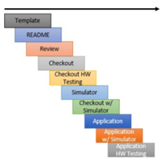

# 구성 요소(Components)

NOS3는 구성 요소(component)라는 기본 개념을 중심으로 구성되어 있습니다.
우주선은 공통 기능으로 이루어진 핵심(core) 집합과, 커스텀 구성 요소 집합으로 이루어지도록 의도되었습니다.
각 구성 요소는 해당 구성 요소의 `fsw` 하위 디렉토리에 배치되는 비행 소프트웨어(FSW) 애플리케이션으로 표현됩니다.
지상 소프트웨어가 구성 요소 애플리케이션을 제어할 수 있도록, 각 구성 요소는 해당 구성 요소의 `gsw` 하위 디렉토리에 배치되는 명령 및 원격측정(command/telemetry) 테이블 모음을 갖습니다.
많은 경우(전부는 아니지만) 구성 요소는 우주선의 하드웨어 부품이므로, 그 구성 요소를 위한 NOS3 하드웨어 시뮬레이터를 해당 구성 요소의 `sims` 하위 디렉토리에 두는 것이 적절합니다.

## 일반(제네릭) 구성 요소(Generic Components)

NOS3는 추가적인 도구와 기술을 구축·개발할 수 있는 예시 참조 미션을 제공하기 위해, 기본 제공되는 일반 구성 요소 세트를 제공합니다.

### 구성 요소 정보(Component Information)

다양한 구성 요소에 대한 상위 레벨의 참조 정보가 정리되어 있습니다.
원격측정(telemetry) 메시지 역시 동일한 범위 내에 있다고 가정하지만, 명령(command) MID의 경우 0x1XXX 형태를, 원격측정의 경우 0x0XXX 형태를 따른다는 점에 유의하세요.

> 💡 **초보자 가이드**
> MID(Message ID)는 각 메시지에 붙는 "우편번호"라고 생각하면 됩니다. 소프트웨어 버스(Software Bus)에 여러 메시지가 오가는데, 이 ID를 보고 어떤 메시지인지 구분합니다.

* 카메라 - Arducam
  * 프로토콜: I2C, SPI
  * MSGID 범위: 0x18C8 - 0x18CA
  * Perf_ID: 105, 106
  * Fprime 기본 ID: 0xF900
* 조도 태양 센서(Coarse Sun Sensors, CSS)
  * 프로토콜: I2C
  * MSGID 범위: 0x1910 - 0x1911
  * Perf_ID: 600, 601
  * Fprime 기본 ID: 0xE300
* 전력 시스템(Electrical Power System, EPS)
  * 프로토콜: I2C
  * MSGID 범위: 0x191A - 0x191B
  * Perf_ID: 401
  * Fprime 기본 ID: 0xE200
* 정밀 태양 센서(Fine Sun Sensors, FSS)
  * 프로토콜: SPI
  * MSGID 범위: 0x1920 - 0x1921
  * Perf_ID: 510, 511
  * Fprime 기본 ID: 0xE400
* GPS(Global Positioning System) - Novatel OEM615
  * 프로토콜: 스트리밍 UART
  * MSGID 범위: 0x1870 - 0x1871
  * Perf_ID: 48
  * Fprime 기본 ID: 0xE800
* 관성 측정 장치(Inertial Measurement Unit, IMU)
  * 프로토콜: CAN
  * MSGID 범위: 0x1925 - 0x1926
  * Perf_ID: 530, 531
  * Fprime 기본 ID: 0xE600
* 자력계(Magnetometer)
  * 프로토콜: SPI
  * MSGID 범위: 0x192A - 0x192B
  * Perf_ID: 540, 541
  * Fprime 기본 ID: 0xEF00
* 라디오(Radio)
  * 프로토콜: 소켓(Sockets)
  * MSGID 범위: 0x1930 - 0x1931
  * Perf_ID: 520
  * Fprime 기본 ID: 0xE100
* 반작용 휠(Reaction Wheel)
  * 프로토콜: UART
  * MSGID 범위: 0x1992 - 0x1993
  * Perf_ID: 77
  * Fprime 기본 ID: 0xE700
* 샘플(Sample)
  * 프로토콜: UART
  * MSGID 범위: 0x18FA - 0x18FB
  * Perf_ID: 500
  * Fprime 기본 ID: 0x0F00
* 스타 트래커(Star Tracker)
  * 프로토콜: UART
  * MSGID 범위: 0x1935 - 0x1936
  * Perf_ID: 550
  * Fprime 기본 ID: 0xE000
* 토커(자기 토크 장치, Torquers)
  * 프로토콜: HWLIB의 TRQ 명령을 통한 PWM
  * MSGID 범위: 0x193A - 0x193B
  * Perf_ID: 505
  * Fprime 기본 ID: 0xE900
* 추진기(Thrusters)
  * 프로토콜: UART
  * MSGID 범위: 0x18EA - 0x18EB
  * Perf_ID: 508
  * Fprime 기본 ID: 0xE500

### 구성 요소 개발(Component Development)

* 템플릿 생성(Template Generation)
  * 새로운 구성 요소를 개발할 때는 NOS3가 제공하는 템플릿 생성기를 사용하는 것으로 시작합니다. 이 템플릿은 구성 요소의 표준 형식과 구조를 정립해서 프레임워크의 나머지 부분과의 일관성 및 호환성을 보장합니다.
* 구성 요소 문서 검토(Component Documentation Review)
  * 하드웨어 구성 요소와 비행 소프트웨어 간의 소프트웨어 인터페이스에 대한 포괄적인 정보를 제공하기 위해, 구성 요소의 문서를 검토하고 업데이트합니다. 구성 요소 readme에는 개발 중 사용된 문서와 버전에 대한 세부 정보, 그리고 포괄적인 테스트 계획이 포함되어야 합니다. 다른 개발자나 팀원이 문서를 검토하여 완전성과 정확성을 확인하는 것이 권장됩니다.
* 독립형 점검 애플리케이션 개발(Standalone Checkout Application Development)
  * 구성 요소를 위한 테스트 환경 역할을 하는 독립형 점검(checkout) 애플리케이션을 개발합니다. 이 애플리케이션은 NOS3 시뮬레이션 안에서 실행되거나 개발 보드 위에서 실행되도록 만들 수 있습니다.
* 하드웨어 및 비행 소프트웨어 통합(Hardware and Flight Software Integration)
  * 하드웨어 확보가 지연되는 경우, 독립형 점검 애플리케이션에서 사용한 것과 동일한 함수 및 하드웨어 라이브러리 호출을 사용해 비행 소프트웨어 애플리케이션 개발을 진행할 수 있습니다. 이 방식을 사용하면 비행 소프트웨어 애플리케이션이 지상 소프트웨어 및 테스트 계획에 문서화된 관련 통합 테스트를 포함한 나머지 소프트웨어 구성 요소들과의 통합 테스트 역할을 주로 수행하게 됩니다. 시뮬레이션은 전통적인 하드웨어 테스트를 대체하는 것이 아니라, 일정과 위험을 줄이는 데 사용되는 추가적인 도구라는 점에 유의하세요.
* 구성 요소 업데이트 및 개선(Component Updates and Refinements)
  * 하드웨어 테스트가 가능해지면, 하드웨어 테스트 단계에서 얻은 통찰과 결과를 바탕으로 구성 요소를 업데이트하는 데 추가 시간을 할당해야 합니다. 여기에는 올바른 기능과 성능을 보장하기 위해 NOS3 프레임워크 내에서 필요한 조정을 하는 것이 포함됩니다.
* 일반 구성 요소(Generic Components)
  * 이 구성 요소들은 시뮬레이션과 교육 자료를 구축하기 위한 표준화된 출발점을 제공합니다. 일반 구성 요소를 포함시킴으로써, NOS3는 기저의 소프트웨어 모듈에 익숙하지 않은 잠재 사용자들에게 표준적인 명령, 원격측정, 인터페이스를 보여줄 수 있습니다.
  * NOS3의 일반 구성 요소들은 프레임워크가 다양한 범위의 우주 미션에 대해 적응력 있고, 유연하며, 계속 관련성을 유지하도록 보장합니다. 이를 통해 개발자와 미션 팀은 처음부터 새로 시작하는 대신, 기존 구성 요소를 빌딩 블록으로 활용하고 특정 미션 요구사항과 최적화에 노력을 집중할 수 있습니다.

## 통합 알고리즘(Integrated Algorithms)

### 자세 결정 및 제어 시스템(Attitude Determination and Control System, ADCS)
* 프로토콜: 해당 없음
* MSGID 범위: 0x1940 - 0x194F
* Perf_ID: 777

### CryptoLib
* 프로토콜: 해당 없음
* MSGID 범위: 0x1915 - 0x1916

CryptoLib는 우주선의 비행 소프트웨어와 지상국 간의 통신을 보호하기 위해, CCSDS 우주 데이터 링크 보안 프로토콜 - 확장 절차(SDLS-EP)를 사용하는 소프트웨어 전용 솔루션을 제공합니다.
CryptoLib는 원래 core Flight System(cFS) 우주선 라이브러리로 설계되었지만, 최근에는 gcrypt를 이용한 텔레커맨드(telecommand) 암호화를 지원하는 등 더 범용적으로 범위가 확장되었습니다.

CryptoLib를 시작하려면 NASA가 관리하는 [GitHub 저장소](https://github.com/nasa/CryptoLib/wiki#what-is-cryptolib)를 방문하면 됩니다.
문서에는 사용법, 설정, 테스트에 관한 자세한 정보가 담겨 있습니다.

[Cryptolib ReadTheDocs](https://nasa-cryptolib.readthedocs.io/en/latest/)

### OnAir

OnAir는 Dr. Evana Gizzi, Dr. James Marshall를 비롯한 NASA 고다드 우주비행센터(GSFC) 팀이 개발한 무료 오픈소스 프레임워크로, 비행 데이터를 활용해 AI 모델을 실행할 수 있게 해줍니다.
CSV 등의 형식을 이용해 오프라인으로도 사용할 수 있지만, Software Bus Network(SBN) cFS 앱과 그 C/Python 브릿지 클라이언트(SBN_Client)를 활용해 NOS3에 통합함으로써, 사용자는 cFS 소프트웨어 버스에서 나오는 패킷을 실시간으로 Python 기반 AI 모델을 실행하는 OnAIR로 흘려보내도록 설정할 수 있습니다.
현재 이 시스템은 개념 증명 차원에서 기본적인 Sample App 패킷만 읽도록 설정되어 있지만, 약간의 재설정을 거치면 사용자가 원하는 어떤 패킷이든 커스텀 모델로 흘려보낼 수 있습니다.

특정 패킷이나 파라미터를 사용하도록 OnAIR를 설정하려면, 먼저 OnAIR 내부에 이를 정의한 뒤 SBN으로 구독(subscribe)해야 합니다.
SBN에서 패킷을 정의하려면 `nos3\components\onair\message_headers.py`로 이동해, 원하는 패킷에 대해 표시된 방식과 유사한 메서드로 구조체를 복제하면 됩니다.
그런 다음 `nos3\components\onair\cfs_sample_tlm.json`으로 이동해 헤더를 입력하고, 하단에 적절한 메시지 ID와 패킷 정보를 입력합니다.
이 작업에 필요한 정보는 각 앱이나 구성 요소의 msgids.h, msg.h, app.h, device.h 파일에서 찾을 수 있습니다.
cfs_sample_tlm.json(또는 그에 해당하는 파일)에서 제공한 메시지 ID가 SBN과 SBN_Client에 전달되면, 이 둘이 내부적으로 해당 패킷을 자동으로 구독하므로, 필요한 설정은 이것으로 충분할 것입니다.
이는 OnAIR 창에서 일치하는 데이터 스트림이 있는지 확인함으로써 검증할 수 있습니다.

이 패킷들을 제대로 활용하려면, 여러분이 만든 구조체를 이용해 수집하려는 원격측정 값을 전달하는 OnAIR 플러그인을 빌드해야 합니다.
그런 다음 AI 모델을 설정하고, 어떤 원격측정 값을 파라미터로 사용할지 선택해서 설정하고 실행하면 됩니다.
다만 세부 사항은 이 가이드의 범위를 벗어나며, OnAIR의 문서나 여러분이 선택한 AI 라이브러리(TensorFlow, Keras, Scikit, PyTorch 등)의 문서에서 확인할 수 있을 것입니다.

### Synopsis
* 프로토콜:
* MSGID 범위: 0x18FC - 0x18FD
* Perf_ID: 560
