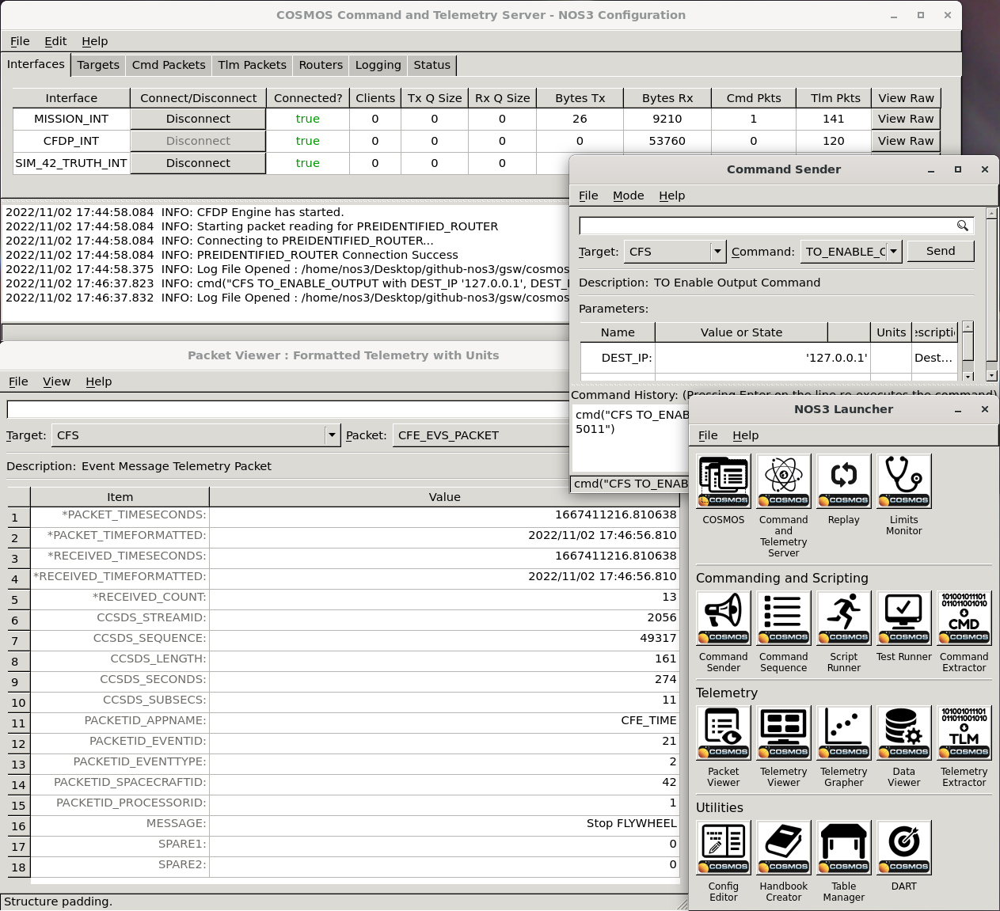
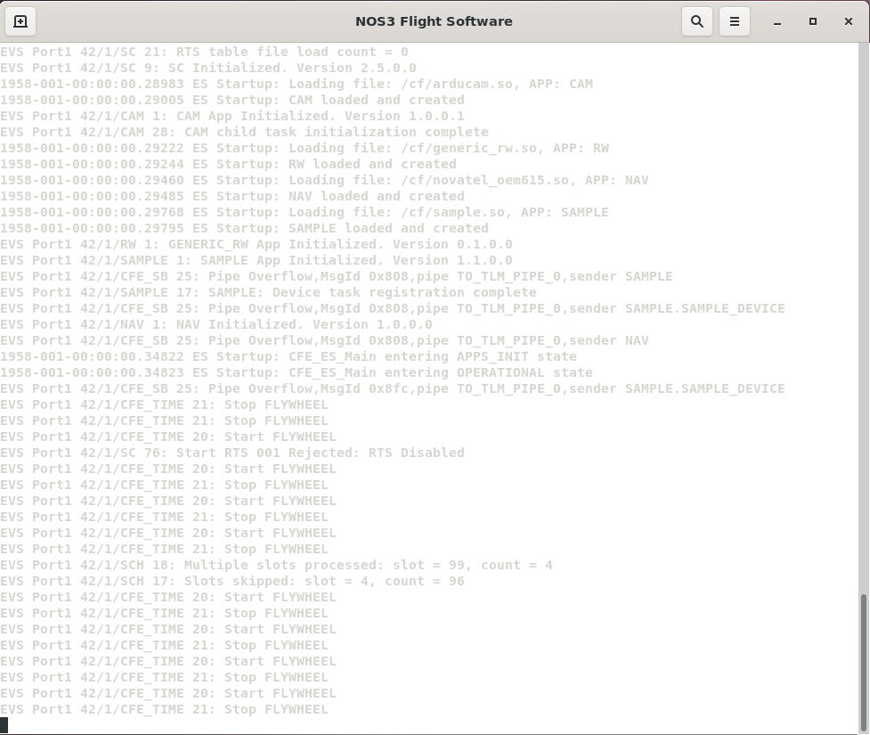
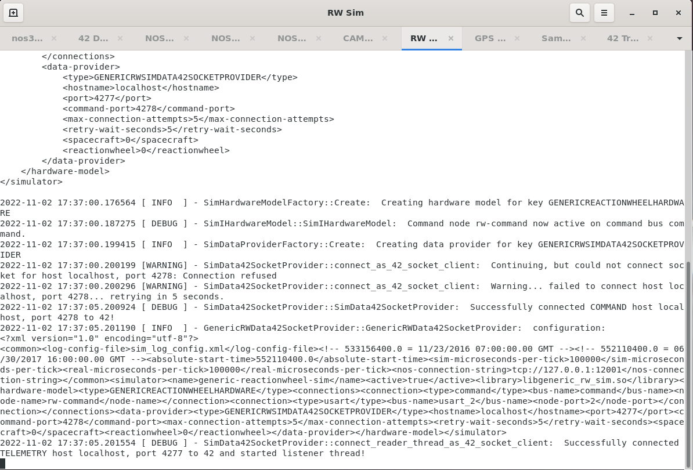
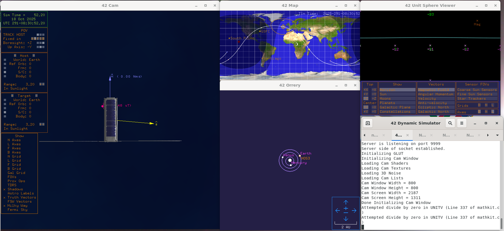
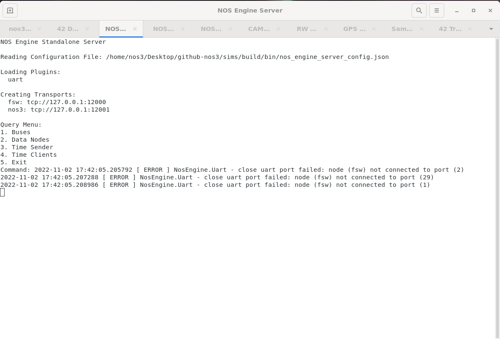

# 실행 파일과 창(Executables and Windows)

`make launch`를 통해 실행하면, NOS3는 화면에 표시되는 창을 가진 수많은 실행 파일들을 시작합니다. 이 창의 개수는 압도적으로 느껴질 수 있습니다. 이 페이지는 이 혼돈스러운 창들 사이에 나름의 질서를 부여해 설명하려는 시도입니다. 실행 파일/창은 다음 범주로 나눌 수 있습니다: COSMOS, 비행 소프트웨어, 시뮬레이터, 42, 그리고 NOS Engine Standalone Server. 각각은 아래 절에서 설명합니다.

## 창 사용법(Window usage)
필요에 따라 서로 다른 창 그룹을 사용하는 다양한 사용 사례가 있습니다.
1. 우주선 운영자(operator) 입장에서는 명령과 원격측정을 통해서만 우주선과 통신할 수 있으므로, COSMOS 창이 주된 관심사가 됩니다.
2. 우주선 구성 요소 개발자 입장에서는 구성 요소 애플리케이션의 기능과 관련된 하드웨어 시뮬레이션에 관심이 있으므로, 비행 소프트웨어 창과 특정 시뮬레이터 창에 관심을 가지게 됩니다. COSMOS 명령 및 원격측정 창에도 관심이 있을 수 있습니다. 또한 하드웨어 시뮬레이터와 주고받는 42의 동역학 데이터에도 관심이 있을 수 있습니다.
3. NOS Engine 하드웨어 통신 버스 관점에서는, NOS Engine Standalone Server 창에서 시스템 내의 버스와 노드를 확인할 수 있습니다.

## COSMOS
COSMOS는 "임베디드 시스템의 명령 및 제어를 위한 사용자 인터페이스(The User Interface for Command and Control of Embedded Systems)"라고 소개됩니다. NOS3에서는 지상국 명령 및 제어 시스템으로 사용되어, NOS3 비행 소프트웨어에 명령을 보내고 원격측정을 수신하는 역할을 합니다. COSMOS는 Ruby Gem으로 설치됩니다. NOS3를 위한 설정은 NOS3 "시스템"을 정의하는 설정 파일들로 만들어지며, 이는 gsw/cosmos/config/system에 위치합니다(이 파일은 gsw/cosmos/config에 있는 다른 여러 설정 파일들을 참조합니다). NOS3가 시작하는 창은 단 하나의 _Legal Agreement(법적 동의)_ 스플래시 화면뿐이지만, 이 창을 확인(confirm)하면 _NOS3 Launcher_ 창이 표시되며, 여기서 _COSMOS Command and Telemetry Server_ 창, 하나 이상의 _Command Sender_ 창, 하나 이상의 _Packet Viewer_ 창 등 다른 많은 창들을 시작할 수 있습니다. 아래 이미지는 _NOS3 Launcher_와 여러 다른 COSMOS 창들을 보여줍니다:

### 비행 소프트웨어(Flight Software)
NOS3 비행 소프트웨어를 위한 터미널 창이 하나 시작됩니다. 이것은 우주선의 단일 보드 컴퓨터에서 실행될 비행 소프트웨어이지만, Linux에서 실행되도록 교차 컴파일(cross compile)되었으며, 실제 비행 하드웨어 센서와 액추에이터 대신, 시뮬레이션된 하드웨어 구성 요소를 가진 소프트웨어 전용 NOS Engine 버스에 비행 소프트웨어를 연결하는 하드웨어 라이브러리를 사용합니다. 아래 이미지는 비행 소프트웨어 터미널을 보여줍니다:

## 시뮬레이터(Simulators)
(NOS Time Driver와 Simulator Terminal을 포함해) 각 시뮬레이터는 자신만의 창에서 시작됩니다(다만 동일한 터미널 안의 탭으로 묶여 있을 수도 있습니다). 모든 시뮬레이터는 소스 코드로부터 빌드되고 설치됩니다. 설치 위치는 sims/build/bin입니다. 시뮬레이터를 위한 다양한 데이터와 설정 파일도 그 위치에서 찾을 수 있습니다. 주요 설정 파일 두 가지는 다음과 같습니다. sim_log_config.xml 파일은 시뮬레이터의 로깅 수준과 위치를 지정합니다. nos3-simulator.xml 파일은 공통 시간, 로깅, 설정 정보와 각 시뮬레이터에 특화된 정보를 포함해 시뮬레이터의 설정을 지정합니다. 특정 정보에는 시뮬레이터의 이름과 활성화 여부, 해당 시뮬레이터의 하드웨어 모델(코드 플러그인을 찾는 데 사용됨), 시뮬레이터의 연결 정보(버스와 이름 또는 주소), 그리고 환경 데이터 제공자 정보 같은 것들이 정의됩니다. 각 시뮬레이터의 정확한 정보는 시뮬레이터, 하드웨어 모델, 그리고 경우에 따라 데이터 제공자에 따라 달라집니다. 시뮬레이터 창에 표시되는 데이터는 해당 시뮬레이터의 로그 데이터입니다. 아래 이미지는 반작용 휠(reaction wheel) 시뮬레이터의 예시 창을 보여줍니다:

## 42
42는 동역학 시뮬레이터입니다. 하나의 터미널 창을 시작한 뒤, 카메라 창, 지도 창, 오러리(orrery, 태양계 모델) 창, 단위 구(unit sphere) 뷰어 창 등 여러 GUI 창을 시작합니다. 아래 이미지는 이러한 창들을 보여줍니다:

42는 범용의 다중 물체, 다중 우주선 시뮬레이션입니다. NOS3에서는 시뮬레이션된 우주선의 움직임을 시뮬레이션하는 역할을 합니다. 42의 시간 진행은 NOS Engine을 통해 구동되며, 42는 NOS3의 일부인 시뮬레이터들에게 궤도력, 자세, 태양 벡터, 자기장 벡터 등의 환경 데이터를 출력으로 제공합니다. 42는 오픈소스 C 코드입니다. NOS3에서는 가상 머신의 /home/jstar/.nos3/42 디렉토리에 설치되어 있습니다. STF-1에 특화된 설정 파일은 cfg/InOut 디렉토리에서 찾을 수 있습니다. 주요 설정 파일은 다음과 같습니다:
1. Inp_Sim.txt – 환경(기준 시점, 중력 모델, 천체 등), 우주선 기준 궤도 및 설정 파일, 우주선 및 설정 파일, 지상국 위치 등의 항목을 정의하는 주요 설정 파일입니다.
2. Orb_LEO.txt – Inp_Sim.txt에서 참조하는 우주선 기준 궤도 파일입니다. 이 파일은 궤도 중심(지구)과 기준 궤도의 케플러 궤도 요소(Keplerian orbital elements)를 지정합니다.
3. SC_NOS3.txt – Inp_Sim.txt에서 참조하는 우주선 정의 파일입니다. 이 파일은 라벨, 궤도 매개변수, 초기 자세, 몸체 매개변수, 센서 매개변수, 액추에이터 매개변수 및 우주선에 특화된 기타 매개변수를 정의합니다.
4. Inp_IPC.txt – 42로 입출력을 주고받기 위한 TCP/IP 또는 파일 관련 매개변수를 정의하는 파일입니다. 이 데이터는 하드웨어 시뮬레이터들이 사용합니다.
5. Inp_Graphics.txt – 표시할 창, 시점 매개변수, 격자·벡터·라벨 같은 다양한 표시 요소, 기타 그래픽 요소 속성 등 42의 GUI 설정을 정의하는 파일입니다.
6. NOS3에서는 사용되지 않는 다른 입력 파일들도 여러 개 있습니다. 여기에는 Inp_Cmd.txt(42를 위한 명령 스크립트 정의), Inp_FOV.txt(시야각 정의), Inp_Region.txt(42를 위한 영역 정의), Inp_TDRS.txt(42를 위한 TDRS 위성 정의)가 포함됩니다.

## NOS Engine Standalone Server
NOS Engine Standalone Server를 위한 터미널 창이 하나 시작됩니다. 이 창은 버스, 데이터 노드, 시간 클라이언트, 시간 송신자를 나열하고 종료하는 기본적인 기능을 가지고 있습니다. NOS Engine Standalone Server는 NOS3가 비행 소프트웨어를 시뮬레이션된 비행 하드웨어와 연결하는 데 사용하는 소프트웨어 시뮬레이션 통신 버스 구조를 제공합니다. NOS Engine Standalone Server는 ITC NOS Engine 패키지가 설치될 때 함께 설치됩니다. 실행 파일 이름은 nos_engine_server_standalone입니다. NOS3에서는 cfg/sims/nos_engine_server_config.json 파일을 이용해 서버를 설정하며, 이 파일은 서버를 위한 플러그인 프로토콜과 URI(Uniform Resource Identifier)를 정의합니다. 이 단일 터미널 창은 다음과 같은 모습입니다:

