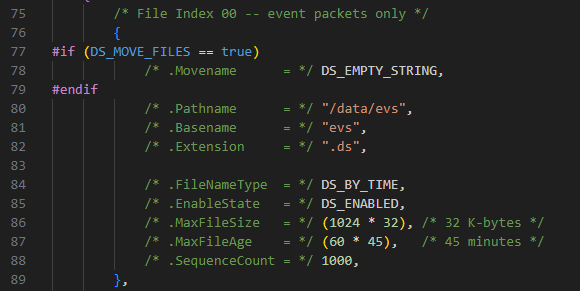
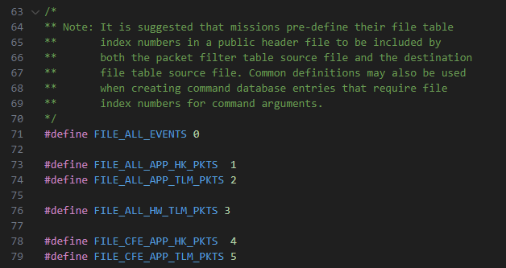
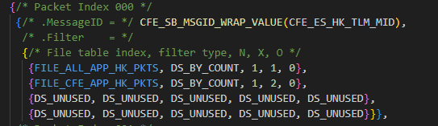
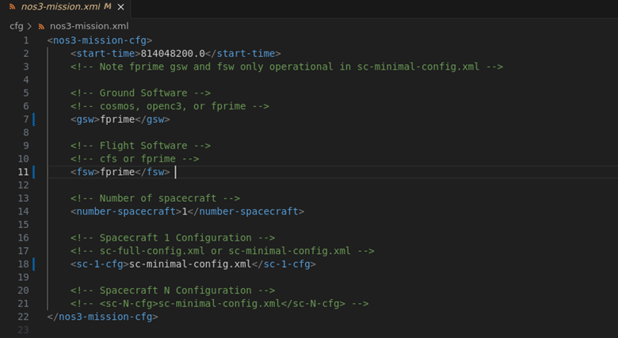
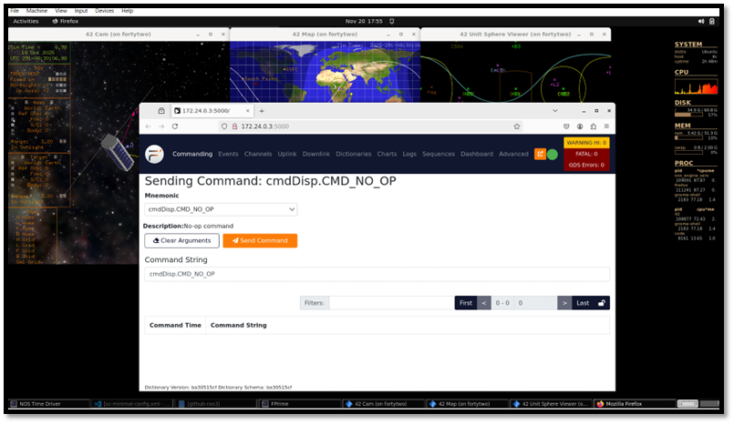
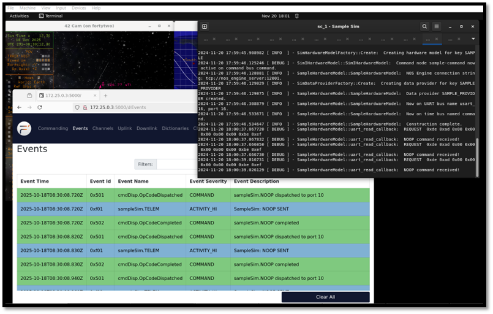

# 비행 소프트웨어(Flight Software)

비행 소프트웨어(Flight Software, FSW)는 미션 전 기간에 걸쳐 우주선을 운영하고 항법(navigate)하는 역할을 담당합니다. NOS3는 사용자가 cFS를 이용해 우주선의 종단 간(end-to-end) 미션을 시뮬레이션할 수 있는 환경을 만들어 줍니다. NOS3 비행 소프트웨어는 기본적으로 cFS를 사용하도록 되어 있지만, 사용자가 또 다른 FSW 프레임워크를 살펴볼 수 있도록 F' FSW 역시 NOS3에 통합되어 있습니다.

## 독립형 점검(Standalone Checkout)
NOS3에서는 독립형 점검(Standalone Checkout)을 이용해 여러분의 구성 요소 시뮬레이션으로 구성 요소의 기능을 검증합니다. 아래 단계를 따라가면 시뮬레이션과 상호작용할 수 있는 간단한 터미널 인터페이스가 만들어집니다. 점검(checkout)은 여러분의 구성 요소를 NOS3 전체에 연결하지 않고도 테스트하는 데 사용되며, 이를 통해 동작에 대한 개념 증명(proof of concept)을 제공합니다.

아래 예시는 샘플(sample) 구성 요소를 참조합니다.

독립형 버전을 빌드하려면, 최상위 NOS3 저장소에서 시작한다고 가정할 때:
* make debug
* cd ./components/sample/fsw/standalone
* mkdir build
* cd build
* cmake ..
  * `cmake` 명령줄에 `-DTGTNAME=cpu1`을 추가하면 타겟 선택을 재정의할 수 있습니다
* make
* exit

독립형 버전을 실행하려면, **최상위** NOS3 저장소에서 시작한다고 가정할 때:

위의 빌드 단계를 따른 다음:
* make
* make checkout
  * gdb 아래에서 NOS Engine, NOS Time Driver, NOS Terminal, Sample Sim, Sample Checkout을 실행합니다
* make stop

## core Flight System (cFS)

작은 core라는 뜻에서 소문자 `c`가 붙습니다 - cFS는 NOS3의 기본값입니다.
이 절에서는 NOS3를 cFS와 인터페이스하는 데 사용된 방법을 설명합니다.

### 운영체제 추상화 레이어(Operating System Abstraction Layer)

core Flight System은 운영체제 추상화 레이어(OSAL)의 구현 덕분에 부분적으로 STF-1 미션을 위한 FSW로 선택되었습니다. OSAL은 비행 소프트웨어 애플리케이션이 운영체제(OS)에 특화된 호출 없이 작성될 수 있도록 하는 API를 제공합니다. cFS를 컴파일할 때는 대상 OS가 지정되며, 빌드 시스템이 적절한 라이브러리를 포함시킵니다. 이 덕분에 FreeRTOS 타겟용으로 작성된 FSW를 Linux에서 실행되도록 빌드할 수 있고, 그 반대도 가능합니다. 이러한 특성 덕분에 OSAL Linux 타겟을 사용할 때 NOS3는 이상적인 개발 환경이 됩니다.

> 💡 **초보자 가이드**
> OSAL은 "번역기" 같은 역할을 합니다. 서로 다른 운영체제마다 파일을 열거나 스레드를 만드는 방식이 조금씩 다른데, OSAL이 이 차이를 감춰주기 때문에, 개발자는 "지금 어떤 OS에서 실행되고 있는지" 신경 쓰지 않고 코드를 짤 수 있습니다.

### 플랫폼 지원 패키지(Platform Support Package)

OSAL 외에도, cFS에는 플랫폼 지원 패키지(PSP)가 포함되어 있는데, 여기에는 OS에 특화되지는 않았지만 메모리, 클록, 타이머 등 특정 비행 보드(flight board)에서 재사용할 수 있는 라이브러리들이 들어 있습니다. NOS3에서 사용되는 PSP는 Linux PSP 릴리스를 수정한 버전입니다. 비행 소프트웨어에서 타이밍을 제어하기 위해 cFS는 여러 타이머를 사용하며, 그 중 핵심은 1Hz 타이머 틱(tick)입니다. Linux가 제공하는 1Hz 타이머를 NOS Engine 시간 틱커(ticker)로 대체함으로써, PSP의 시간을 다른 NOS3 구성 요소들이 실행되는 시간과 동기화할 수 있습니다.

### 하드웨어 라이브러리(Hardware Library)

하드웨어 추상화를 위해 비행 소프트웨어에 구현된 세 번째 구성 요소는 하드웨어 라이브러리(HWLIB)입니다. HWLIB는 I2C, UART 등 구성 요소에 특화된 I/O 호출에 사용됩니다. 하드웨어 라이브러리에는 보통 온보드 컴퓨터(OBC) 제조사가 드라이버 형태로 제공하는 단일 헤더 파일이 포함되어 있으며, 이 파일이 I/O 함수 호출을 정의합니다. cFS를 빌드할 때, CMAKE 빌드 시스템은 빌드 중인 타겟에 해당하는 드라이버 소스를 선택합니다.

### cFS 유산 애플리케이션(cFS Heritage Applications)
다양한 cFS 애플리케이션에 대한 상위 레벨 참조 정보가 정리되어 있습니다.
원격측정 메시지 역시 같은 범위 내에 있으며, 다만 명령을 나타내는 0x1XXX가 붙지 않는다고 가정합니다.
* cf - CCSDS 파일 전송 프로토콜(CCSDS File Delivery Protocol)
  * 프로토콜: CFDP, UDP
  * MSGID 범위: 0x18B3 - 0x18B5
  * Perf_ID 범위: 11-20, 30+x, 40+x
* ci - 명령 수신(Command Ingest)
  * 프로토콜: CCSDS, UDP
  * MSGID 범위: 0x1884-0x1887
  * Perf_ID: 0x0070, 0x0071
* ci_lab - 명령 수신 Lab(Command Ingest Lab)
  * 프로토콜: CCSDS, UDP
  * MSGID 범위: 0x18E0-0x18E1
  * Perf_ID: 32, 33
* ds - 데이터 저장(Data Storage)
  * 프로토콜: CCSDS
  * MSGID 범위: 0x18B8-0x18BC
  * Perf_ID: 38
* fm - 파일 관리자(File Manager)
  * 프로토콜: CCSDS
  * MSGID 범위: 0x188A - 0x188E
  * Perf_ID: 39, 44
* hwlib - 하드웨어 라이브러리(Hardware Library)
  * 프로토콜: CCSDS
  * MSGID 범위: 해당 없음
  * Perf_ID: 50
* lc - 한계 검사기(Limit Checker)
  * 프로토콜: CCSDS
  * MSGID 범위: 0x18A4-0x18A7
  * Perf_ID: 28, 43
* sc - 저장 명령(Stored Commands)
  * 프로토콜: CCSDS
  * MSGID 범위: 0x18A9-0x18AB
  * Perf_ID: 37
* sch - 스케줄러(Scheduler)
  * 프로토콜: CCSDS
  * MSGID 범위: 0x1895-0x1898
  * Perf_ID: 36
* to - 원격측정 출력(Telemetry Output)
  * 프로토콜: CCSDS
  * MSGID 범위: 0x1880-0x1882
  * Perf_ID: 0x0072
* to_lab - 원격측정 출력 Lab(Telemetry Output Lab)
  * 프로토콜: CCSDS
  * MSGID 범위: 0x18E8-0x18E9
  * Perf_ID: 34, 35

## cFS 테이블(cFS Tables)

여러 cFS 앱은 설정을 위해 테이블에 의존합니다. NOS3에서 미리 설정해 둔 주요 테이블은 cf, ds, fm, hk, lc, sc, sch, to, to_lab을 위한 것들입니다. 사용자가 자신의 미션에 맞게 설정하고 싶어 할 가능성이 큰 것은 ds, sc, sch 테이블입니다.

### DS 테이블(DS Tables)
DS(Data Storage, 데이터 저장)는 File 테이블, Filter 테이블, Indices 테이블이라는 세 가지 주요 테이블을 사용합니다. 대부분의 경우 Indices 테이블은 기본값 그대로 두어도 되며, File 테이블과 Filter 테이블이 재설정하고 싶어 할 주요 대상이 됩니다.

DS File 테이블은 `{nos3_base}/cfg/nos3_defs/tables/ds_file_table.c`에 정의되어 있습니다. 이 테이블은 데이터 저장 앱을 위한 파일 정의를 담당하며, 이를 통해 cFS 버스에서 사용자가 정의한 패킷 집합을 파일로 기록해서, 사용자가 분석용으로 따로 저장해 둘 수 있게 해줍니다. 기본적으로 4개의 파일이 완전히 만들어져 있고, 2개는 부분적으로만 정의되어 있으며, 최대 16개(0~15번 인덱스)의 파일을 사용할 수 있습니다.

사용자는 먼저 사용되지 않은 인덱스를 고르고, 상단 목록에 자신이 만들 파일의 인덱스 번호와 이름을 연결하는 `#define`을 추가하는 것부터 시작해야 합니다.



위 이미지는 NOS3의 기본 이벤트 패킷 로그 파일이며, 사용자가 정의할 수 있는 다음과 같은 파일 속성들을 보여줍니다.
* Movename은 시뮬레이터 종료 시 파일을 옮겨 저장할 경로를 정의합니다.
* Pathname은 우주선의 기본 저장 공간(base storage) 내에서 파일을 생성하고 싶은 상대 경로입니다(우주선의 파일들은 `{nos3_base}/fsw/build/exe/cpu1`에서 찾을 수 있습니다).
* Basename은 파일의 기본 파일명을 설정합니다
* Extension은 파일의 확장자를 설정합니다(기본값은 ".ds")
* FileNameType은 파일을 시간 기준으로 롤(roll)할지, 개수 기준으로 롤할지(그에 따라 파일명이 확장됨)를 정의합니다.
* EnableState는 파일이 시작 시 활성화 상태인지 비활성화 상태인지를 정의합니다. 활성화되어 있으면 시뮬레이션 시작 시점부터 데이터를 수집합니다. 비활성화되어 있으면, 데이터 수집을 시작하기 전에 사용자가 명령을 통해 수동으로 활성화해야 합니다
* MaxFileSize는 파일이 롤되기 전까지의 최대 크기를 정의합니다(기본 단위는 바이트이므로, 1024의 배수만큼 늘리면 KB, MB, GB 등이 됩니다)
* MaxFileAge는 파일이 롤되기 전까지의 최대 수명(초 단위)을 정의합니다
* SequenceCount는 개수 기준으로 롤할 때만 사용됩니다. 그렇지 않은 경우 DS_UNUSED로 남겨둘 수 있습니다. 사용되는 경우, 해당 파일의 시작 카운트를 정의합니다

사용자가 원하는 모든 속성을 정의했다면, `{nos3_base}/scripts/fsw/fsw_cfs_launch.sh`로 이동해서 34번째 줄 다음에, 새로 생성할 데이터 디렉토리를 위한 `mkdir` 명령을 위에 있는 것들과 비슷한 형태로 추가해야 합니다. 만약 이미 존재하는 디렉토리에 파일을 생성하는 경우라면 이 단계는 생략할 수 있습니다. 이 작업이 끝나면, 시작 시점에 파일이 생성되긴 하지만, Filter 테이블이 해당 파일로 패킷을 보내도록 이미 설정되어 있지 않으면 데이터가 쌓이지는 않습니다.

DS Filter 테이블은 DS가 어떤 패킷을 어떤 파일로 보내 저장할지를 정의하는 데 사용됩니다. 처음에는 기본 파일에 저장되는 패킷의 작은 부분집합만 정의되어 있지만, 사용자는 패킷을 더 추가할 수도 있고, 새로운 패킷과 기존 패킷을 어떤 테이블로 보낼지도 정의할 수 있습니다.

먼저, `{nos3_base}/cfg/nos3_defs/tables/ds_indices.h`에 File 테이블에 추가한 것과 일치하는 `#define`을 추가해서, 여러분의 테이블 인덱스와 이름을 연결해야 합니다. 이렇게 하면 이후에 그 이름을 사용할 수 있습니다. 아래와 같은 형태입니다:



그런 다음, `{nos3_base}/cfg/nos3_defs/tables/ds_filter_tbl.c`에서 패킷 항목을 편집하면 됩니다. 패킷을 위한 슬롯은 256개(0~255번 인덱스)이며, 그중 기본으로 15개가 정의되어 있습니다. 아래는 이러한 항목 중 하나가 어떻게 생겼는지 보여주는 예시입니다:



각 항목은 다음과 같이 구성됩니다:

* MessageID는 여러분이 추가하고자 하는 패킷의 MID입니다. 이는 각 앱의 소스 코드에 있는 [app]_msgids.h 파일에서 찾을 수 있습니다. 이 파일들은 이미 DS의 빌드 구조에 연결되어 있으므로, 별도의 파일을 추가할 필요는 없습니다. 새 패킷을 추가하려면, 단순히 추가하고 싶은 MID를 찾아서, 사용되지 않은 항목에서 `CFE_SB_MSGID_RESERVED`를, 예시 이미지에 나온 것처럼 `CFE_SB_MSGID_WRAP_VALUE()`로 감싼 원하는 MID로 교체하면 됩니다.
* Filter에는 해당 패킷을 저장하기 위해 전달하고 싶은 파일들에 대한 항목이 들어 있습니다. 각 파일마다 항목이 하나씩 있으며, 다음과 같이 구성됩니다:
  * 위의 `#define` 단계에서 정의한 파일의 인덱스
  * 필터 타입(일반적으로 개수 기준이며, 이 경우 생성되는 모든 패킷을 수집합니다)
  * N: 시퀀스 번호 기준으로 저장할 패킷 비율의 분자
  * X: 시퀀스 번호 기준으로 저장할 패킷 비율의 분모
  * O: 오프셋. 저장할 첫 번째 패킷의 시퀀스 번호를 정의합니다
  예를 들어, N = 1, X = 1, O = 0이면 0번 인덱스부터 모든 패킷을 저장하고, N = 1, X = 2, O = 6이면 6번째 패킷부터 시작해서 하나 걸러 하나씩 패킷을 저장합니다

새로운 패킷과 저장 매개변수를 모두 정의했다면, File 테이블과 디렉토리가 올바르게 만들어져 있는 한, 시작 시점에 파일에 올바른 패킷들이 채워지기 시작할 것입니다.

### SC 상대 시간 시퀀스(RTS) 테이블
RTS 테이블은 SC(Stored Command, 저장 명령) 앱이 사용하며, 사용자가 지상에서 보내는 단 하나의 명령 세트나 한계 검사기(limit checker)의 액션 포인트를 통해 트리거될 수 있는 명령들의 시퀀스를 설정할 수 있게 해줍니다.


## F'

(<https://nasa.github.io/fprime/>의 자료 제공)

F´(또는 F Prime)는 임베디드 시스템과 우주비행 애플리케이션을 신속하게 개발하고 배포하기 위한 소프트웨어 프레임워크입니다.
원래 NASA 제트추진연구소(Jet Propulsion Laboratory)에서 개발되었으며, F´는 여러 우주 애플리케이션에 성공적으로 배포되어 온 오픈소스 소프트웨어입니다.
CubeSat, SmallSat, 계측기(instrument), 전개형 장치(deployable) 등에 사용되어 왔지만 이에 국한되지는 않습니다.

F´는 다음과 같은 특징을 가지고 있습니다:
* 잘 정의된 인터페이스를 가진 컴포넌트 아키텍처
* 큐, 스레드, 운영체제 추상화 같은 핵심 기능을 제공하는 C++ 프레임워크
* 시스템을 설계하고, 시스템 설계로부터 코드를 자동 생성하는 도구
* 비행에 사용할 수 있는(flight-worthy) 표준 컴포넌트 라이브러리
* 단위 테스트 및 시스템 수준 테스트를 위한 테스트 도구

### F-Prime을 사용하도록 NOS3 설정하기

F-Prime과 함께 NOS3를 빌드할 때는, 공유 폴더(shared folder)로 빌드를 시도하기보다는 Linux 환경에 NOS3를 클론(clone)해야 할 수도 있습니다. NOS3 VM의 데스크톱에 있는 github-nos3 공유 폴더를 사용하는 대신, NOS3 VM을 사용해서 `/home/jstar/`에 NOS3를 클론할 수 있습니다. 공유 폴더로 F-Prime을 빌드하면 공유 폴더 때문에 빌드 오류가 발생할 수 있지만, Linux 환경 내부에서 로컬로 빌드하면 NOS3가 성공적으로 빌드되도록 보장할 수 있습니다.

F-Prime을 사용하도록 NOS3를 설정할 때는, 아래와 같이 GSW와 FSW로 F-Prime을 선택하도록 nos3-mission.xml 파일을 수정해야 합니다. 미션 설정을 변경한 뒤에는 파일을 저장하고 nos3/ 디렉토리에서 `make clean`을 실행하세요. `make`를 실행해서 F-Prime FSW/GSW 설정으로 NOS3를 다시 빌드하세요. NOS3가 빌드되면, `make launch`를 실행하고 F-Prime 지상 데이터 시스템 창이 실행될 때까지 기다리세요. 아래는 F-Prime을 빌드하는 데 필요한 NOS3 설정을 보여주는 그림입니다.



참고로, NOS3 사용자가 F-Prime에 세부 구현(fidelity)을 추가하고 싶다면, F-Prime을 다시 빌드할 수 있도록 자동 생성된 파일들을 제거하기 위해 `make clean`을 해야 합니다. NOS3를 클린한 뒤에는, 새로운 추가 사항과 함께 F-Prime FSW를 다시 빌드하기 위해 단순히 `make`를 실행하면 됩니다.

### 샘플 NOOP 명령 보내기

F-Prime GDS 창이 실행되고 나면, F-Prime 비행 소프트웨어가 실행되고 있어야 하며 Sample 구성 요소에 명령을 내릴 수 있습니다. SampleSim NOOP 명령을 보내려면, F-Prime 지상 데이터 시스템의 드롭다운 메뉴에서 `SampleSim.NOOP` 명령을 선택하고 `Send Command`를 클릭하세요. 그러면 F-Prime 지상 데이터 시스템 창의 이벤트(events) 탭에서 `sampleSim.NOOP completed` 이벤트 메시지를 볼 수 있습니다. 아래 그림들은 F-Prime GDS에서 명령을 내리는 모습의 예시를 보여줍니다.





### NOS3에서 F-Prime 구성 요소 만들기

NOS3에서 NOS3 구성 요소를 만들려면, 먼저 nos3/ 디렉토리에서 `make debug`를 실행해 nos3 디버그 세션에 진입하세요.

make debug를 실행한 뒤, `fsw/fprime/fprime-nos3/Components` 디렉토리로 이동하세요.

여기서 다음 명령을 실행해 새로운 F-Prime 구성 요소를 만들 수 있습니다: `fprime-util new –-component`

참고로, F-Prime 프레임워크 도구를 사용해 F-Prime 프로젝트를 만들기 위해 F-Prime 가상 파이썬 환경을 실행할 필요는 없습니다. NOS3는 Docker 컨테이너 안에 F-Prime 도구를 이미 포함시켜 두었기 때문에, F-Prime에서 새 구성 요소를 생성할 때 make debug를 사용하는 것입니다.

F-Prime 프로젝트, 구성 요소, 배포(deployment) 등을 만드는 방법에 대한 더 자세한 정보는 다음의 F-Prime 문서에서 확인할 수 있습니다:
[https://nasa.github.io/fprime/](https://nasa.github.io/fprime/)

Helloworld 튜토리얼은 사용자가 F-Prime을 사용하는 방법과, F-Prime FSW 프레임워크로 개발을 시작하는 방법을 이해하는 데 도움을 줍니다. 이 튜토리얼은 F-Prime 프로젝트를 설정하는 방법을 설명하지만, 사용자는 NOS3에 이미 있는 F-Prime 프로젝트를 사용할 수도 있습니다. 그것은 `fsw/fprime/` 아래에 있는 fprime-nos3/입니다. Helloworld 튜토리얼은 또한 F-Prime gds에서 새 구성 요소를 실행하기 위한 기본적인 F-Prime 연결을 만드는 방법도 설명합니다.

NOS3 개발자들은 F-Prime에서 처음부터 새로 시작하지 않고도 NOS3 구성 요소의 세부 구현(fidelity)을 활용해 NOS3의 시뮬레이션과 통신할 수 있었습니다. 예를 들어, NOS3의 sample 구성 요소를 이용해, 개발자들은 필요한 NOS3 라이브러리와 파일들을 Component/ 및 Deployment/ 디렉토리의 F-Prime cmake 파일에 포함시킬 수 있었습니다. 이를 통해 F-Prime은 NOS3로부터 F-Prime fsw로 필요한 함수 호출을 끌어올 수 있습니다. 예시를 보려면 F-Prime의 Sample 구성 요소를 참고하세요. 기존 NOS3의 세부 구현을 활용해서 F-Prime 구성 요소에서 명령 처리(commanding)가 어떻게 설정되어 있는지 확인할 수 있습니다.

각 구성 요소는 자신만의 cmake 파일을 갖는다는 점을 이해하는 것이 중요합니다. 따라서 NOS3 구성 요소를 기반으로 새로운 구성 요소를 만들 때는, NOS3 구성 요소 디렉토리에서 필요한 파일들을 반드시 포함시켜야 합니다. 또한, F-Prime 구성 요소에서 F-Prime과 공유하는 각 파일은 F-Prime 배포(Deployment)와도 공유해야 합니다. Deployment 디렉토리에는 두 개의 cmake 파일이 있습니다.

### F-Prime NOS3 시간 구성 요소(Nos3Time)

여기서는 자체적인 수동형(passive) F-Prime 구성 요소를 만들어서 NOS3에서 F-Prime으로 시간을 동기화하는 방법을 설명합니다. 이 구성 요소는 `fsw/fprime/fprime-nos3/Components` 아래에서 찾을 수 있습니다. 여기에는 F-Prime의 Nos3Time 구성 요소를 이루는 cpp 파일과 fpp 파일이 있습니다. 이 파일들은 아래에서 더 자세히 설명합니다.

Nos3Time.cpp부터 시작해서, NOS3 시간을 성공적으로 가져와 F-Prime FSW용으로 동기화하기 위한 몇 가지 함수를 F-Prime에 만듭니다.

NOS Engine은 생성된 버스 인터페이스를 통해 시간을 제공합니다.

이 인터페이스는 다음과 같은 nos engine 연결 문자열로 생성됩니다:
```
“tcp://nos-engine-server:12000”
```

이 문자열은 연결의 종류, 연결이 이루어지는 위치, 그리고 사용하는 포트를 나타냅니다. 이 문자열은 Nos3Time.cpp에서 Fprime 버스를 만들 때 사용됩니다.

이어서, 사용자는 Bus Name과 TICKS_PER_SECOND 변수를 설정해야 합니다. 이를 통해 콜백(call-back) 함수를 이용해 구성 요소를 이 버스에 연결할 수 있으며, 위에서 만든 버스에 각 틱(tick)이 채워질 때마다 NOS Engine 시간을 제공받게 됩니다. 이는 NOS Engine의 버스 생성 명령과 콜백 추가 명령을 이용해 이루어집니다:

```
Fprime_Bus = NE_create_bus(hub, ENGINE_BUS_NAME, ENGINE_SERVER_URI);
NE_bus_add_time_tick_callback(Fprime_Bus, Fprime_NosTickCallback);
```

콜백 함수는 다음과 비슷한 형태여야 합니다:

```
void Fprime_NosTickCallback(NE_SimTime time)
{
    pthread_mutex_lock(&Fprime_sim_time_mutex);
    Fprime_sim_time = time;
    pthread_mutex_unlock(&Fprime_sim_time_mutex);
}
```

F-Prime 구성 요소에 국한된 로컬 함수인 FPrime_NosTickCallback()은 틱(각 틱은 100마이크로초)을 가져오는 데 사용됩니다. 그런 다음, 이 문서의 뒷부분에서 설명하는 F-Prime의 time.set 호출에 초(상위 U32)와 마이크로초(하위 U32)를 넣기 위해 간단한 계산이 수행됩니다.

이렇게 하면 버스로부터 시간을 가져와서 시간 변수(Fprime_sim_time)에 저장하게 됩니다. 이 변수는 생성된 버스에서 제공된 틱의 수를 담고 있습니다. 즉, 이 변수는 틱 카운터 변수입니다. 실제 시간으로 변환하려면, F-Prime을 위해 틱을 초와 마이크로초로 변환해야 합니다. 이는 TICKS_PER_SECOND 변수를 이용해 변환을 만듦으로써 수행됩니다. 특정 시작 기준 시점(epoch)을 지정하기 위한 오프셋을 추가할 수도 있습니다.

이 모든 기능은 자체 구성 요소에 담아둔 뒤, 배포 토폴로지(deployment topology)를 통해 기본 POSIX 시간 대신 새로운 시간 구성 요소를 사용하도록 지정할 수 있습니다. 이것이 바로 F-Prime의 기본 PosixTime 구성 요소 대신 Nos3Time 구성 요소를 사용하도록 배포를 조정한 부분입니다. 아래는 배포 토폴로지에서 변경한 주요 줄들입니다.

```
Instances (instances.fpp):
```

```
instance nos3Time: Components.Nos3Time base id 0x4500
```

Topology (topology.fpp):

```
time connections instance nos3Time
```

이 구성 요소가 배포에 통합되고, posix time에 대한 참조가 제거된 뒤에는, 다음과 같이 timeGetPort_handler(components 아래의 Nos3Time.cpp)를 조작한 뒤 구성 요소와 GUI가 새로운 NOS3Time을 사용하게 됩니다:

```
time.set(TB_WORKSTATION_TIME,0, Nos3Time_upper, Nos3Time_lower);
```

참고로, 여기서는 F-Prime 시간 기준 workstation enum을 재정의(override)하고 있지만, 원한다면 사용할 다른 enum을 쉽게 만들 수도 있습니다. 이는 F-Prime FSW의 FpConfig.h에서 이루어질 것입니다. 또한 F-Prime에서 시간을 덮어쓰기 위해 TB_Dont_Care enum을 사용할 수도 있지만, 이 경우 nos engine과 F-Prime 간의 시간 동기화 초반에 약간의 지연이 추가됩니다.

### F-Prime 시퀀싱(F-Prime Sequencing)
F-Prime에서 시퀀스를 만드는 것은 다음 단계로 할 수 있습니다:

1. Fprime GDS의 `Sequences` 탭을 이용해 원하는 시퀀스를 만드세요. .seq 파일 확장자로 적절히 이름을 붙이고 `Save As`로 다운로드하세요.

2. 시퀀스 파일을 `fsw/fprime/fprime-nos3/Sequences/` 폴더에 넣으세요

3. 디버그 모드로 들어가서(`make debug`) `fsw/fprime/fprime-nos3`로 이동하세요. 아래 명령어를 이용해 시퀀스를 .bin 파일로 컴파일하세요.

```
fprime-seqgen Sequences/[filename].seq -d build-artifacts/Linux/deployment/dict/deploymentTopologyDictionary.json
```

시퀀스를 실행하는 방법은 다양합니다:

* Fprime GDS에서, file 매개변수를 `Sequences/___.bin`으로, 원하는 블로킹(blocking) 옵션과 함께 CS_RUN 명령을 사용하세요.

* 시작 스크립트의 경우, `scripts/fsw/fsw_fprime_launch.sh` 끝에 있는 docker exec 명령을 수정해서 원하는 `sequence.bin` 파일을 실행하도록 하세요. 시퀀스 컴파일과 관련된 수정은 Makefile의 `build-fsw`에서 할 수 있습니다.

* `fprime-cli` 명령은 시작 시퀀스가 동작하는 방식과 비슷하게 `CS_RUN` 명령을 통해 수동으로 시퀀스를 실행할 수 있는 기능을 가지고 있습니다.

### F-Prime 문서 링크

* F-Prime github 문서: [https://nasa.github.io/fprime/](https://nasa.github.io/fprime/)
* F-Prime cpp 문서: [https://nasa.github.io/fprime/UsersGuide/api/c++/html/index.html](https://nasa.github.io/fprime/UsersGuide/api/c++/html/index.html)
* F-Prime fpp 문서: [https://nasa.github.io/fprime/UsersGuide/user/fpp-user-guide.html](https://nasa.github.io/fprime/UsersGuide/user/fpp-user-guide.html)
