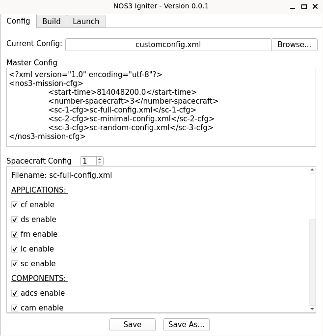
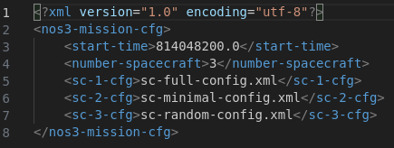
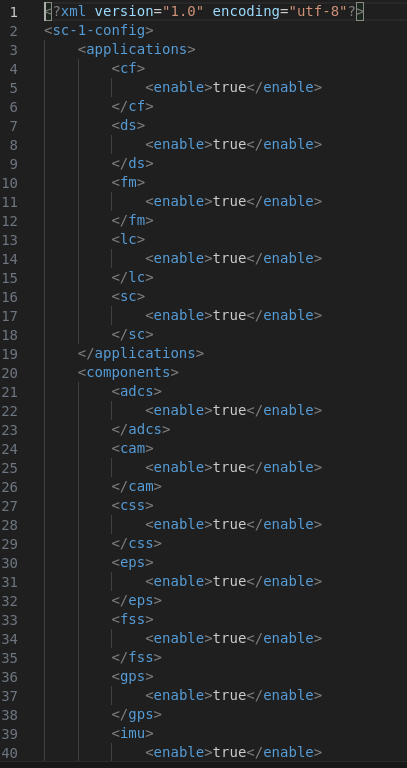
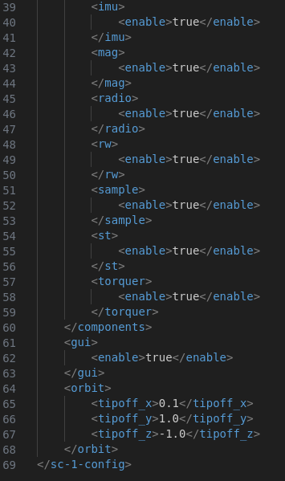
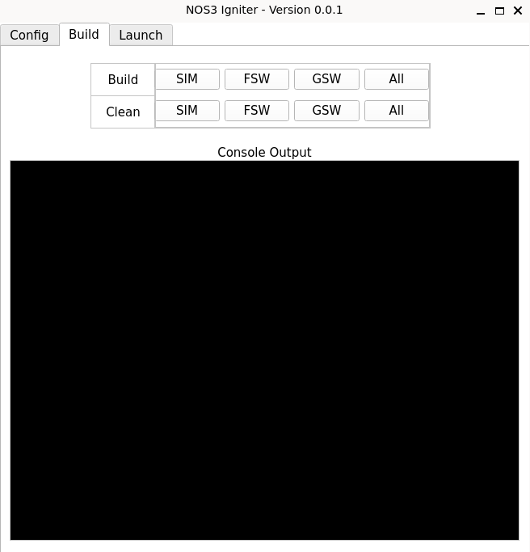
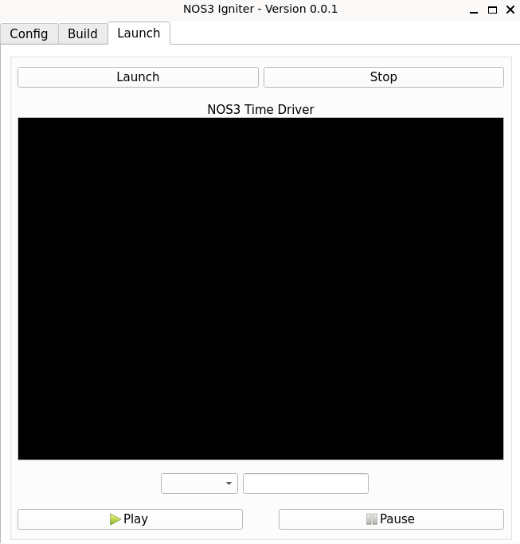

# 시작하기(Getting Started)

## 설치(Installation)

아래에 나열된 각 애플리케이션은 설치 절차를 진행하기 위한 필수 전제 조건입니다:
* 옵션 A: 로컬 가상 머신(VM) 만들기
  * [Git 2.47+](https://git-scm.com/)
  * [Vagrant 2.4.3+](https://www.vagrantup.com/)
  * [VirtualBox 7.1.6+](https://www.virtualbox.org/)
* 옵션 B: 이미 Linux를 사용 중이거나 VM이 있는 경우
  * [Git 2.47+](https://git-scm.com/)
  * docker와 docker compose가 설치된 Linux

단계:
* 명령 프롬프트 또는 터미널을 여세요
* 저장소를 클론하세요 - `git clone https://github.com/nasa/nos3.git`
  * 기본적으로 최신 릴리스 또는 `main` 브랜치가 받아진다는 점에 유의하세요
* 저장소로 이동하세요 - `cd nos3`
* 서브모듈을 클론하세요 - `git submodule update --init --recursive`
* 옵션 A에만 해당
  * `vagrant up`을 실행하고 프롬프트가 돌아올 때까지 기다리세요
    * 이 단계는 인터넷 속도와 호스트 컴퓨터 성능에 따라 몇 분에서 몇 시간까지 걸릴 수 있습니다
  * `vagrant halt`를 실행하세요
  * 명령 프롬프트나 터미널을 닫으세요
  * (선택 사항) VirtualBox에서 수동으로 사용 가능한 자원의 최대 절반까지 늘리세요
  * VirtualBox에서 직접 VM을 시작하세요
  * 비밀번호 `jstar123!`로 `jstar` 사용자에 로그인하세요
  * VirtualBox 툴바에서 `Devices > Upgrade Guest Additions...`를 선택하세요
  * VM을 재부팅한 뒤 아래의 빌드 및 실행 단계를 시도해 보세요

자세한 내용은 [시나리오 - 설치](./Scenario_Install.md)를 참고하세요.

## 실행하기(Running)

새로 만든 VM이나 기존 Linux 환경 안에서:
* 터미널을 여세요 (CTRL + ALT + T)
* 저장소로 이동하세요
  * 옵션 A의 경우 - `cd ~/Desktop/github-nos3`
* 사용할 환경을 준비하세요
  * `make prep`
* 전체를 빌드하세요
  * `make`
* 실행하세요
  * `make launch`
* 살펴보세요
  * 명령 보내기, 원격측정 모니터링, 모드 변경, 결함(fault) 주입 등
* 중지하세요
  * `make stop`
* 빌드 파일을 정리하세요
  * `make clean`
* 필요에 따라 코드를 수정하세요
* 원하는 커스텀 미션이 만들어질 때까지 `make`부터 다시 반복하세요

더 이상 NOS3를 설치해 두고 싶지 않다면, `make uninstall`을 실행해 초기 prep 단계를 되돌릴 수 있습니다.

자세한 내용은 [시나리오 - 데모](./Scenario_Demo.md)를 참고하세요.

## Igniter

Igniter는 `make prep`을 통해 설치되고 표시되며, `make igniter`로 다시 실행할 수 있습니다.

Igniter는 NOS3를 위한 도구로, 간단한 그래픽 사용자 인터페이스(GUI)를 통해 NOS3 설정, 구성 요소, 앱 등을 관리할 수 있게 해주어, 사용자가 원하거나 필요한 구성 요소와 앱만 사용하도록 NOS3를 커스터마이징할 수 있게 해줍니다. 또한 원한다면 성단(constellation) 내의 서로 다른 우주선을 각각 다르게 설정할 수도 있습니다. 설정 파일을 불러온 뒤, 원한다면 GUI에서 각 우주선의 설정을 개별적으로 편집할 수 있습니다. Igniter는 크게 3개의 뷰로 나뉩니다: Configuration(설정) 탭, Build(빌드) 탭, Launch(실행) 탭입니다.

### Configuration 탭

설정을 불러오려면, 현재 설정(current configuration) 박스 옆의 browse를 클릭하고 원하는 설정을 선택하면 됩니다. 설정 파일은 단순한 XML 문서이며, 크게 두 종류로 나뉩니다: Master Config(마스터 설정)와 Spacecraft Configs(우주선 설정)입니다. NOS3에는 Master Config가 하나만 존재하지만, Spacecraft Config는 여러 개가 있을 수 있습니다.

#### Master Config
- Master Config에는 시뮬레이션되는 위성 수, 미션 시작 시간, 그리고 각 개별 우주선 설정에 대한 링크와 관련된 매개변수가 들어 있습니다.

#### Spacecraft Config
- Spacecraft Config에는 각 애플리케이션과 구성 요소를 활성화/비활성화하는 매개변수, 동역학 시뮬레이션을 보기 위해 42 GUI를 활성화하는 매개변수, 궤도 X, Y, Z 매개변수를 설정하는 옵션들이 들어 있습니다.

기본 마스터 설정 파일은 기본 NOS3 디렉토리 안의 *'cfg/nos3-mission.xml'* 경로에 있으며, 기본 구성 요소와 cFS 애플리케이션이 모두 활성화되어 있는 기본 Spacecraft 설정 파일은 기본 NOS3 디렉토리 안의 *'cfg/spacecraft/sc-mission-config.xml'* 경로에 있습니다.

설정은 미션이 빌드되고 실행되기 전에 Igniter GUI 안에서 바로 편집할 수도 있습니다. Save 또는 Save As 버튼이 있어서, 사용자는 이렇게 편집한 설정을 이후 실행에 사용할 수 있습니다. Spacecraft Config XML 파일은 Master Config XML과 같은 디렉토리에 저장됩니다.

### Build 탭

Build 탭에서는 버튼 클릭 한 번으로 비행 소프트웨어, 지상 소프트웨어, 시뮬레이터 매개변수를 각각 따로, 또는 한꺼번에 모두 클린하거나 빌드할 수 있습니다. 이 탭을 사용하면 명령을 실행할 터미널 창이 열리고, 그 뒤 창을 닫으려면 ENTER를 누르라는 프롬프트가 표시됩니다.

*참고: 향후 버전에서는 터미널 출력이 이 탭의 콘솔 출력 섹션에서 보이게 될 예정입니다.*

### Launch 탭

Launch 탭에서는 터미널을 사용하지 않고도 패널 상단의 버튼으로 시뮬레이션을 실행하고 중지할 수 있습니다.

*참고: 향후 버전에서는 Time Driver 출력이 이 탭의 콘솔 출력 탭에 표시될 예정입니다. 그 아래 패널의 옵션들을 이용하면 사용자가 시뮬레이터의 실행 시간을 초 단위로 지정하거나, 시뮬레이터가 자동으로 일시 정지할 시간을 설정할 수 있게 될 것입니다. 이 시간은 여러분 컴퓨터의 시스템 시간을 기준으로 하며, NOS3 VM에서는 UTC 기준입니다. 시뮬레이터는 패널 하단의 버튼으로 수동으로 일시정지하거나 재개할 수도 있게 될 것입니다.*

