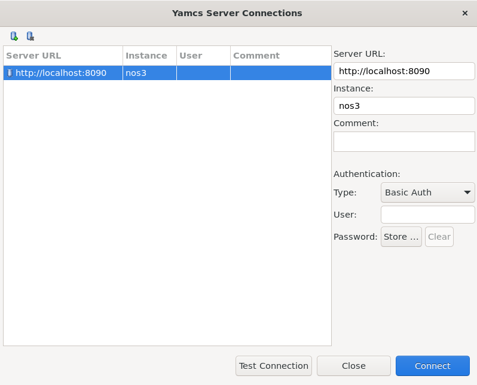
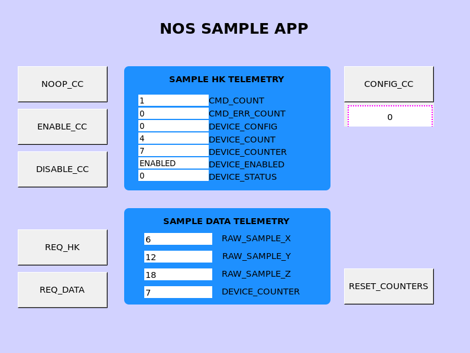
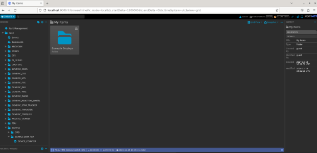
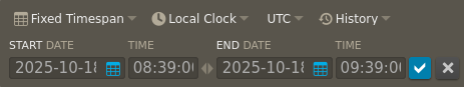
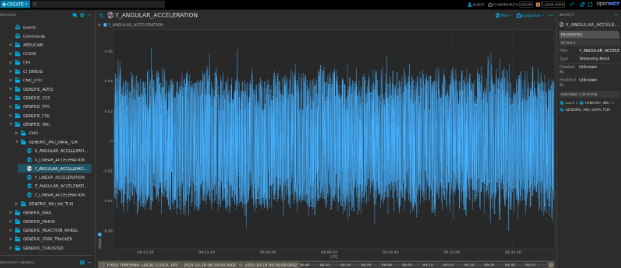
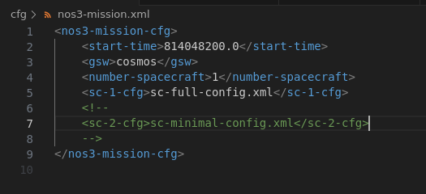
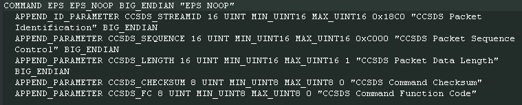

# 지상 시스템(Ground Systems)

NOS3는 기본적으로 YAMCS, COSMOS 4, COSMOS 5, Fprime, AIT 지상 소프트웨어를 지원합니다. 마스터 설정 파일에 이들 사이를 전환할 수 있는 매개변수가 있습니다. COSMOS 4는 더 가볍고 사용하기 쉬운 반면, COSMOS 5는 성능 부하가 더 크고 사용하기가 조금 더 어렵지만 활발하게 개발되고 있습니다.

## YAMCS - Yet Another Mission Control System

Yamcs( /jæmz/ )는 벨기에의 독립 회사인 Space Applications Services가 개발한 오픈소스 미션 관제 소프트웨어이며, 미국 휴스턴에 자회사를 두고 있습니다.
Yamcs는 유연성과 오픈소스 코드라는 기준을 중심으로 개발되어, 손쉬운 확장성, 확장 가능성(scalability), 시간에 따른 적응성을 통해 혁신하고 미션 관제 시스템(MCS) 개발·구현·통합 비용을 줄이는 것을 목표로 합니다.

**우주 표준(Space Standards)**
- CCSDS/OMG XML Telemetric and Command Exchange (XTCE) v1.1, v1.2
- CCSDS 133.0-B-2 Space Packet Protocol
- CCSDS Space Data Link Protocols (AOS/TM/USLP/TC 프레임)
- CCSDS 232.1-B-2 Communications Operation Procedure (COP-1)
- CCSDS File Delivery Protocol (CFDP)
- CCSDS Space Link Extension (FCLTU/RAF/RCF)

### YAMCS Studio 통합(YAMCS Studio Integration)

여러분의 시스템에 맞는 tarball을 받으세요. YAMCS Studio는 Java 11 이상의 JRE를 필요로 한다는 점에 유의하세요.
https://github.com/yamcs/yamcs-studio/releases

tarball을 시스템에 압축 해제한 뒤 ./'Yamcs Studio'를 실행하면 됩니다.
YAMCS studio 사용자 가이드는 이러한 인터페이스를 설정하는 데 훌륭한 자료이며, JSTAR 팀도 이 방법으로 작업을 완료했습니다.
또한 SAMPLE 애플리케이션을 위한 커스텀 OPI 파일도 만들어 두었는데, 이를 통해 버튼을 명령과 원격측정에 연결하는 스크립팅이 어떻게 동작하는지 사용자가 볼 수 있습니다.

사용자는 YAMCS Studio의 Display Builder 안에서 새 프로젝트를 만든 뒤, JSTAR의 NOS_SAMPLE_APP.opi를 가져올 수 있습니다.
OPI 파일을 선택하고 초록색 재생 버튼을 클릭하면 Display Runner로 이동합니다(NOS Sample App OPI 창이 나타납니다).
상단의 Options 리본에서 YAMCS를 선택한 뒤 Connect를 선택하세요. 이는 NOS3와 YAMCS Web GUI가 이미 실행 중이고, 정상 작동하며, 원격측정을 수신하고 있다고 가정합니다.



YAMCS가 성공적으로 연결되면, 사용자는 sample 앱 OPI에서 Enable_CC 명령을 실행해서 원격측정이 표시되는 것을 볼 수 있어야 합니다:



OPI 파일은 현재 nos3 최상위 디렉토리 아래의 `gsw/yamcs-studio`에 저장되어 있습니다.

### YAMCS와 OpenMCT

OpenMCT는 준비하고 사용하는 데 더 많은 사용자 상호작용이 필요합니다. 아래는 시작하기 위한 간단한 안내입니다:

먼저 Node Version Manager를 설치하세요(적절한 버전의 NPM을 더 쉽게 설치할 수 있게 해줍니다):

> `curl -o- https://raw.githubusercontent.com/nvm-sh/nvm/v0.40.1/install.sh | bash `

이제 NPM 명령에 접근할 수 있도록 ~/.bashrc 파일을 소싱(source)해야 합니다:

> `source ~/.bashrc `

Node Package Manager 21 버전을 설치하세요:

> `nvm install 21 `

akhenry의 openmct-yamcs 저장소를 다운로드하세요:

> `git clone https://github.com/akhenry/openmct-yamcs.git `

저장소로 이동해 예시 index.js 파일을 수정하세요:

> `example/index.js `

우리의 YAMCS 인스턴스에 맞도록 YAMCS 설정을 수정해야 합니다:

```
yamcsDictionaryEndpoint: "http://localhost:8090/", 
yamcsHistoricalEndpoint: "http://localhost:8090/", 
yamcsWebsocketEndpoint: "ws://localhost:8090/api/websocket", 
yamcsUserEndpoint: "http://localhost:8090/api/user/", 
yamcsInstance: "nos3", 
yamcsProcessor: "realtime", 
yamcsFolder: "nos3", 
```


아직 NOS3가 설정되고 실행되지 않았다면, 터미널에서 NOS3 디렉토리로 이동해 다음을 실행하세요:

```
make prep 
make  
make launch 
```

openmct-yamcs 저장소 디렉토리로 돌아가세요.

이제 OpenMCT YAMCS 플러그인의 의존성을 설치하고 빌드할 수 있습니다.

터미널을 열고 akhenry/openmct.git 저장소의 기본 디렉토리로 이동하세요. 그런 다음 다음 명령들을 실행하세요:

```
npm install 
npm run build:example:master 
npm start 
```

이제 http://localhost:8090 에서도 YAMCS에 접속할 수 있습니다.

이제 http://localhost:9000 에서 OpenMCT에 접속할 수 있습니다.

---



위와 같은 화면이 보여야 합니다. 여기서부터는 NOS3 시간에 맞도록 시간 창을 조정해야 합니다:


가장 왼쪽의 REAL-TIME LOCAL CLOCK UTC를 클릭하고, 고정된 시간 범위(fixed timespan)로 변경하세요:



시간 범위는 `2025-10-18, 08:39:00`으로 설정해야 합니다.

종료일은 시작일 이후의 아무 시간이나 상관없습니다.

마지막으로, 파란색 체크 표시를 클릭하세요.

---

왼쪽 메뉴를 통해 서로 다른 애플리케이션과 그 원격측정 데이터로 이동할 수 있습니다.

아래는 NOS3 시간 창 안에서 IMU 데이터가 표시되는 예시입니다:



---

## COSMOS 4

COSMOS 4는 Ball Aerospace가 개발한 오픈소스 지상 시스템([COSMOS 4](https://ballaerospace.github.io/cosmos-website))이며, 시뮬레이션된 우주선을 위한 경량 지상 시스템을 제공하기 위해 NOS3에 포함되어 있습니다. COSMOS 4는 기본 디렉토리에 설치되며 gsw/cosmos에서 실행됩니다. COSMOS 4 Launcher와 _COSMOS_ 버튼으로 실행되는 창들은 아래 그림에 나와 있습니다.


### COSMOS 4와 cFS의 명령·원격측정 연결(COSMOS 4 to cFS Command and Telemetry Link Up)

지상국과의 연결은 cFS에 있는 두 개의 애플리케이션으로 완성됩니다. 이는 명령 수신(command ingest, CI) 애플리케이션과 원격측정 출력(telemetry output, TO) 애플리케이션입니다. NOS3에서 이 앱들은 통신을 위해 UDP를 사용하며, 실제 비행 운영을 위한 것은 아닙니다. 통신은 서로 다른 UDP 포트에 연결되는 Debug 채널과 Radio 채널로 더 나뉘는데, 전자는 직접 연결되고 후자는 Radio 구성 요소를 통해 연결됩니다. Debug CI/TO 링크는 기본적으로 활성화되어 있지만, Radio TO 링크는 시작 시 기본적으로 닫혀 있으며 특정 명령 패킷을 보내야만 활성화됩니다. 명령은 COSMOS 4의 Command Sender 도구(핵심 창 중 하나)를 이용해 실행하며, 런처에서 _'COSMOS'_ 키를 클릭하면 열립니다. Radio TO 링크는 'CFS_RADIO'라는 타겟을 이용해 'TO_ENABLE_OUTPUT' 명령 하나로 활성화합니다. 명령을 보내면, 아래 스크린샷처럼 TO 앱이 원격측정이 활성화되었다는 응답을 보냅니다. 'cfg/nos3_defs/tables/to_config.c'에 나열된 원격측정만 캡처된다는 점에 유의하세요. 필요에 따라 해당 테이블을 편집해서 추가 원격측정을 덧붙일 수 있습니다.


Radio TO 링크의 원격측정은 COSMOS CmdTlmServer 창의 'RADIO' 행에서 'Tx Bytes'와 'Rx Bytes' 값이 증가하는 것을 관찰해 확인할 수 있습니다. 명령이 성공적으로 처리되었는지 확인하는 다른 방법으로는 'NOS3 Flight Software' 터미널 창이나 'Radio Sim' 터미널 창의 출력을 살펴보는 것이 있습니다. Radio TO 링크가 활성화되면 두 창 모두 빈번하게 출력이 나타날 것입니다.


## COSMOS 5

COSMOS 5는 OpenC3(원래 Ball Aerospace가 개발)를 통해 제공되는 오픈소스 지상 시스템([COSMOS 5](https://docs.openc3.com/docs))이며, 시뮬레이션된 우주선을 위한 현대적인 웹 기반 지상국을 제공하기 위해 NOS3에 포함되어 있습니다. COSMOS 5는 기본 디렉토리에 설치되며 gsw/cosmos에서 실행됩니다. COSMOS 5 인터페이스는 아래 그림에 나와 있습니다.


### COSMOS 5와 cFS의 명령·원격측정 연결(COSMOS 5 to cFS Command and Telemetry Link Up)

지상국과의 연결은 cFS에 있는 두 개의 애플리케이션으로 완성됩니다. 이는 명령 수신(CI) 애플리케이션과 원격측정 출력(TO) 애플리케이션입니다. NOS3에서 이 앱들은 통신을 위해 UDP를 사용하며, 실제 비행 운영을 위한 것은 아닙니다. 통신은 서로 다른 UDP 포트에 연결되는 Debug 채널과 Radio 채널로 더 나뉘는데, 전자는 직접 연결되고 후자는 Radio 구성 요소를 통해 연결됩니다. Debug CI/TO 링크는 기본적으로 활성화되어 있지만, Radio TO 링크는 시작 시 기본적으로 닫혀 있으며 특정 명령 패킷을 보내야만 활성화됩니다. 명령은 메인 화면에서 접근할 수 있는 COSMOS 5의 Command Sender 도구를 이용해 실행합니다. Radio TO 링크는 'CFS_RADIO'라는 타겟을 이용해 'TO_ENABLE_OUTPUT' 명령 하나로 시작할 수 있습니다. 명령을 보내면 TO 앱이 원격측정이 활성화되었다는 응답을 보냅니다. 이는 아래 스크린샷에서 보여집니다. 'cfg/nos3_defs/tables/to_config.c'에 나열된 원격측정만 캡처된다는 점에 유의하세요. 필요에 따라 해당 테이블을 편집해서 추가 원격측정을 덧붙일 수 있습니다.


### AIT

AIT는 기능은 하는 것으로 보이지만, 현재 유지보수되고 있는 상태는 아닙니다. 단순히 개념 증명 차원에서 제공되는 것입니다. 실제로 활발히 유지보수되는 부분은 기본 설정에 있는 것들뿐입니다.

### F Prime GDS

FPrime(또는 F') 비행 소프트웨어는 JPL이 제공합니다. NOS3 프로젝트 내에서는 현재 유지보수되고 있는 상태가 아닙니다. 현재는 개념 증명 차원에서 제공되고 있습니다. 실제로 활발히 유지보수되는 부분은 기본 설정에 있는 것들뿐입니다. 다만 FPrime은 가까운 미래에 유지보수되어 NOS3의 기본 설정에 통합될 예정입니다.

## 지상 시스템 선택하기(Selecting Ground System)

지상 시스템은 `nos3-mission.xml` 파일(`cfg` 디렉토리에서 찾을 수 있음)의 `gsw` 매개변수를 편집해서 선택할 수 있습니다. 값을 `cosmos`로 설정하면 COSMOS4가 선택되고, `openc3`으로 설정하면 COSMOS 5가 선택됩니다. 이 값을 `yamcs`로 설정하면 YAMCS 지상 소프트웨어를 사용하게 되고, `fprime`으로 설정하면 내장된 Fprime GDS를 사용하게 됩니다(현재는 FPrime FSW와만 호환됩니다).

아래 스크린샷은 COSMOS 4를 실행하는 기본 설정을 보여줍니다. VM에서 NOS3를 이전에 실행한 적이 있다면, 새 GSW로 실행하기 전에 NOS3를 다시 빌드해야 한다는 점에 유의하세요. 이를 위해서는 이전 지상 시스템이 확실히 중지되도록 `make stop-gsw`를 실행한 뒤, `make clean`, `make prep`, `make`를 차례로 실행해야 새 지상 시스템으로 실행할 수 있습니다. `docker ps`를 실행하면 현재 실행 중인 docker 프로세스를 나열해서, 특정 시점에 올바른 GSW 스위트(suite)가 실행되고 있는지 확인할 수 있습니다.




## 패킷 포맷(Packet Formatting)

어떤 지상 시스템을 사용하든 관계없이, cFS로 오가는 모든 통신과 cFS 내부의 모든 통신은 보조 헤더(secondary header)가 활성화된 CCSDS 표준 패킷 형식으로 포맷됩니다. 이 보조 헤더 덕분에 특정 명령을 1차 헤더(primary header)에 지정된 애플리케이션으로 전달할 수 있습니다. COSMOS는 필요에 따라 이 명령과 원격측정 구조를 구성하고 해석할 수 있도록 이에 대한 정보를 알고 있어야 합니다. 예시는 아래에 나와 있습니다:




