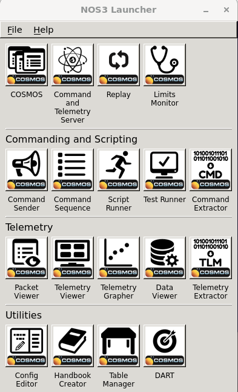
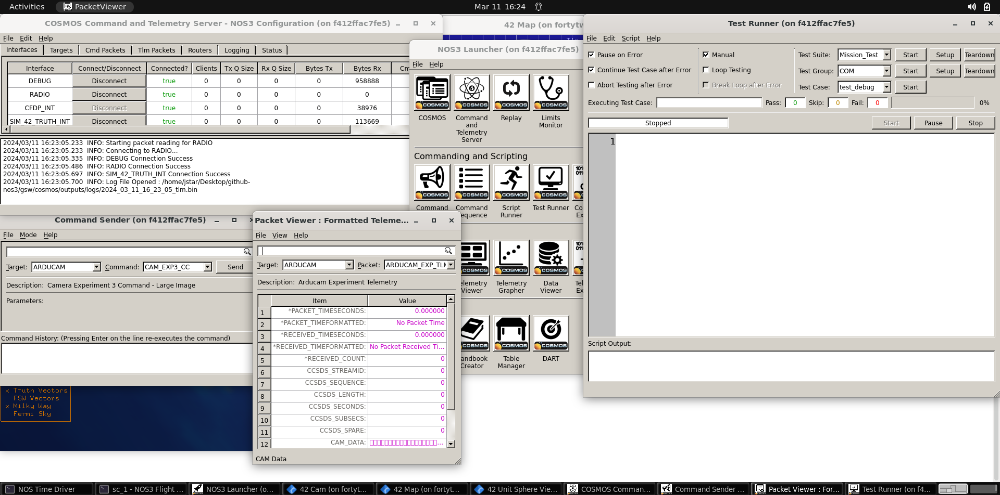
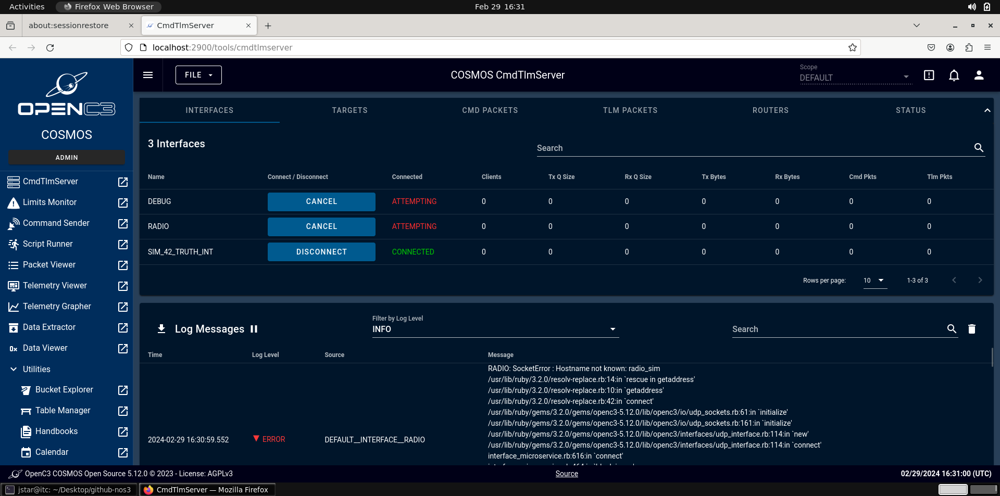
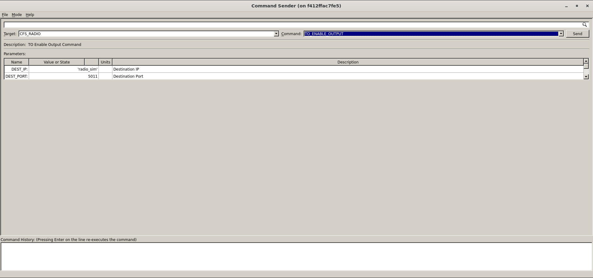
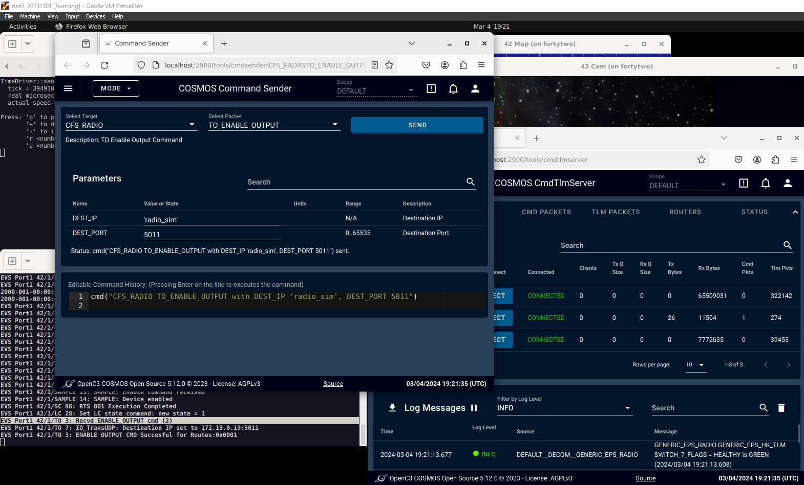
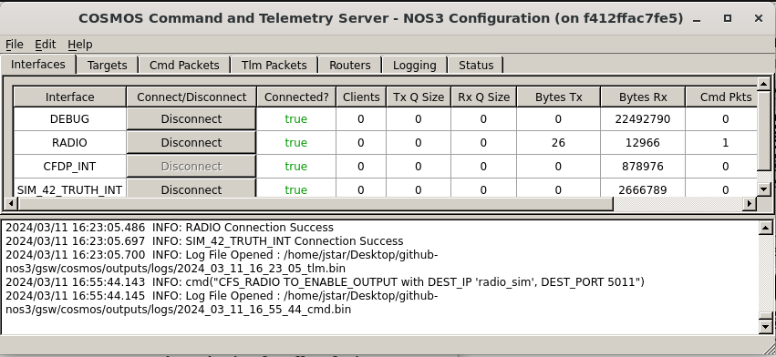
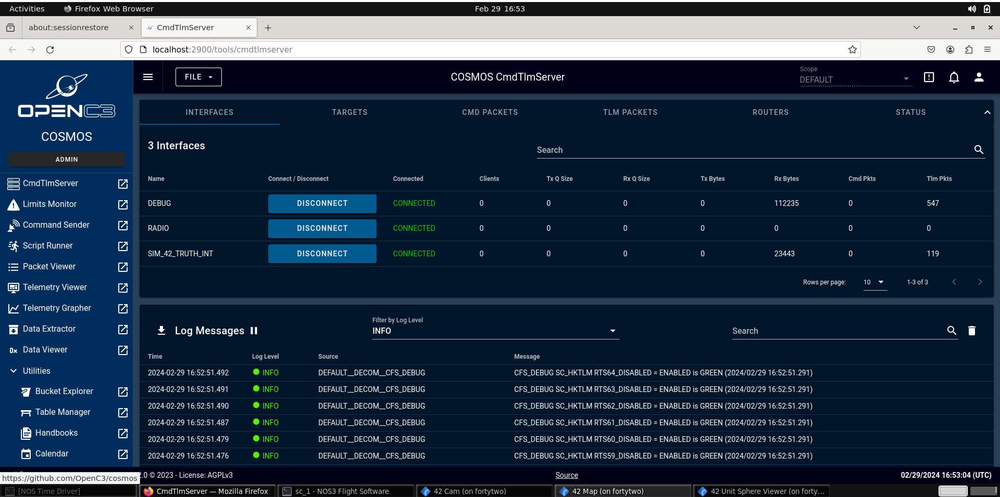
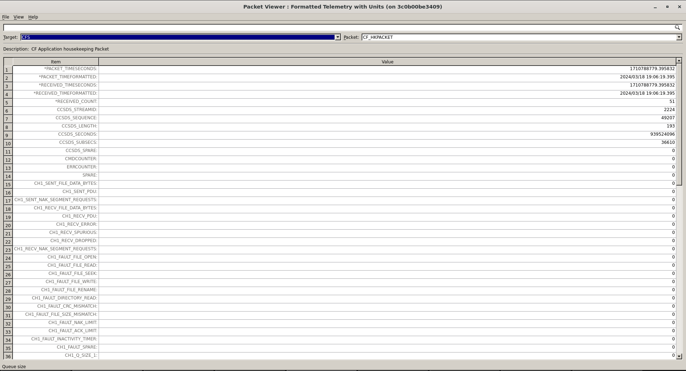
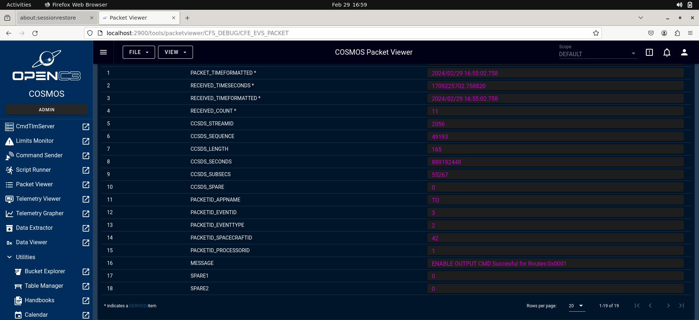

# 시작하기

NOS3 설치, 빌드, 실행하기

## NOS3 설치하기

호스트 컴퓨터에서:

1. [Oracle VirtualBox v6.1+](https://www.virtualbox.org) 설치
2. [Vagrant v2.2+](https://www.vagrantup.com) 설치
3. [Git 1.8+](https://git-scm.com/downloads) 설치

> 💡 **초보자 가이드**
> VirtualBox와 Vagrant는 짝을 이루는 도구예요. VirtualBox는 내 컴퓨터 안에 "가상의 컴퓨터(VM)"를 만들어주는 프로그램이고, Vagrant는 그 가상 컴퓨터를 명령어 몇 줄로 자동 설치·설정해주는 도우미라고 생각하면 됩니다. 덕분에 복잡한 개발 환경을 매번 손으로 세팅하지 않아도 됩니다.

### 클론(Clone)하기

1. 터미널을 열고 저장소(repository)를 받을 위치로 이동합니다

2. 터미널에서 `git clone https://github.com/nasa/nos3.git` 명령으로 저장소를 클론합니다

3. `cd nos3`

4. `git checkout dev`

5. `git submodule update --init --recursive` 명령으로 서브모듈까지 함께 클론합니다

> 💡 **초보자 가이드**
> "서브모듈(submodule)"이란 하나의 Git 저장소 안에 포함된 또 다른 독립적인 Git 저장소를 말해요. 큰 프로젝트가 여러 개의 작은 프로젝트를 부품처럼 가져다 쓸 때 사용합니다. 그래서 그냥 clone만 하면 부품(서브모듈)들은 비어있는 폴더로 남기 때문에, 위 명령어로 한 번 더 받아줘야 해요.

### 프로비저닝(Provision)

6. `vagrant up`을 실행하고 프롬프트(명령 입력 대기 상태)로 돌아올 때까지 기다립니다

  - 인터넷 속도와 호스트 PC 사양에 따라 몇 분에서 몇 시간까지 걸릴 수 있습니다
  - **중요:** 설치 중에는 인터넷 연결이 **반드시** 필요합니다
  - 필요한 패키지들을 자동으로 설치하는 과정에서 VM이 여러 번 재부팅될 수 있으니, 프롬프트가 다시 나타날 때까지 기다려주세요!
  - **가끔 ansible이 제대로 설치되지 않고 "Could not get lock /var/lib/apt/lists/lock" 같은 오류가 발생할 수 있습니다. 이런 경우 `vagrant provision`을 실행해서 ansible을 설치하고 프로비저닝을 다시 진행하세요.**

> 💡 **초보자 가이드**
> "프로비저닝(provisioning)"이란 가상 머신에 필요한 소프트웨어, 설정, 패키지 등을 자동으로 설치하고 준비시키는 과정을 뜻해요. `vagrant up`을 실행하면 Vagrant가 내부적으로 "ansible"이라는 자동화 도구를 이용해 이 작업을 대신 해줍니다.

7. Vagrant가 가상 머신을 VirtualBox에 자동으로 불러오며, 이제 사용할 준비가 됩니다. 다만 가능하다면 VirtualBox에서 사용 전에 RAM과 CPU 코어 수를 늘려주는 것이 좋습니다.

8. **_jstar_** 사용자로 로그인합니다 (비밀번호: **_jstar123!_**) — 이제 작업을 시작할 수 있어요! (필요하다면 **_vagrant_** 사용자도 있으며 비밀번호는 **_vagrant_** 입니다)

## NOS3 빌드하기

NOS3 VM에 로그인합니다. 사용자명 / 비밀번호 : `jstar` / `jstar123!`

1. 호스트 머신에 있는 nos3 저장소에 접근합니다. (앞서 `vagrant up`을 실행했다면 이미 되어 있을 수 있습니다. Vagrant는 nos3 저장소를 VM 안의 `/home/nos3/Desktop/github-nos3` 경로에 마운트합니다.) 게스트 VM에서:
    1. VirtualBox Guest Additions 추가하기:

        1. VirtualBox 메뉴 -> Devices -> Insert Guest Additions CD image... 로 이동
        2. 뜨는 대화 상자에서 `Run` 클릭

    2. nos3 저장소 코드가 담긴 공유 폴더 추가하기:
    
        1. VirtualBox 메뉴 -> Devices -> Shared Folders -> Shared Folders Settings... 로 이동
        2. (+ 기호가 있는 폴더 아이콘으로) 새 공유 폴더를 추가하고 호스트에 있는 nos3 저장소 위치를 선택
        3. `Auto-mount`와 `Make Permanent`를 체크
        4. VM 재부팅

2. NOS3 소프트웨어 빌드하기
    1. 위에서 VM을 재부팅한 뒤, 터미널에서 nos3 공유 폴더로 이동합니다
    2. `make clean` 실행
    3. `make uninstall` 실행
    4. `make config` 실행
    5. `make prep` 실행
    6. 터미널 출력이 끝나면 `make` 실행

> 💡 **초보자 가이드**
> 여기 나오는 `make` 명령어들은 각각 다른 역할을 해요. `make clean`은 이전 빌드 찌꺼기를 지우고, `make config`는 설정 파일을 준비하고, `make prep`은 빌드 전 준비 작업(코드 생성 등)을 하고, 마지막 `make`가 실제로 소스 코드를 컴파일해서 실행 파일을 만드는 단계입니다. 순서대로 실행하는 것이 중요해요.

## NOS3 실행하기

NOS3 VM에서:

1. 터미널에서 nos3 공유 폴더로 이동합니다 (Vagrant가 `/home/nos3/Desktop/github-nos3`에 만들었거나, 위 안내대로 직접 만든 폴더)
2. 터미널에서 nos3 디렉터리 안에 `make launch`를 실행합니다

3. 시뮬레이션을 종료하려면 nos3 디렉터리에서 터미널에 `make stop`을 실행합니다
4. 저장소의 기본 상태로 NOS3를 다시 빌드하려면 먼저 `make clean`을 실행한 뒤 `make prep`, 그다음 `make`를 실행합니다

## COSMOS 실행하기

`make prep`을 실행했고 COSMOS 5가 선택되어 있다면, _NOS3 웹 인터페이스(Web Interface)_ 가 시작됩니다. `make launch`를 실행하면 cFS와 42가 실행되어 COSMOS에 연결됩니다. COSMOS 4를 사용하는 경우에는 make launch 스크립트 중에 COSMOS 4 GUI가 실행됩니다.

> 💡 **초보자 가이드**
> COSMOS는 위성(또는 시뮬레이션된 위성)에 명령을 보내고 텔레메트리(telemetry, 위성이 보내오는 상태 데이터)를 확인할 수 있는 지상 관제 소프트웨어예요. "42"는 NASA에서 만든 위성 동역학·자세 시뮬레이터의 이름입니다 (숫자 42가 프로그램 이름입니다).

COSMOS 4 런처(Launcher)

COSMOS 4 메인 화면

COSMOS 5 웹 UI

COSMOS가 cFS에 명령을 내려 텔레메트리를 COSMOS로 다시 보내도록 하려면:

1. _NOS3 웹 인터페이스_ 에는 기본적으로 COSMOS의 _Command and Telemetry Server_(명령 및 텔레메트리 서버)가 표시되어야 합니다. 만약 그렇지 않다면 해당 화면으로 전환한 뒤 다음이 되어 있는지 확인하세요:

    1. 필요하다면 `make`를 실행한 뒤, `make launch`를 실행합니다. 이 시점에 비행 소프트웨어(Flight Software)가 부팅됩니다.
    2. cFS 터미널들과 42의 동역학 시뮬레이션 창들이 나타나야 합니다.
    3. 나타났다면, _MISSION_INT_ 인터페이스의 _Connected?_ 속성 값이 `true`로 표시되어야 합니다

2. _NOS3 웹 인터페이스_ 에서 COSMOS의 _Command Sender_(명령 송신기)를 열고 다음을 입력합니다:

    1. _Command Sender_ 창에서 _Target_(대상)을 `CFS`로 선택
    2. _Command_(명령)를 `TO_ENABLE_OUTPUT_CC`로 선택
    3. `Send`(전송) 클릭

  _참고: NOS3의 현재 버전에서는 이 디버그 출력이 기본적으로 이미 설정되어 있을 것입니다. 다만 라디오 텔레메트리(Radio Telemetry)를 활성화하려면 동일한 절차를 따르되 `CFS_RADIO`로 이동하여, `DEST_IP`를 `'radio-sim'`으로, `DEST_PORT`를 `5011`로 지정하거나 여러분의 환경에 맞는 값으로 명령을 실행하세요._

COSMOS 4 라디오 활성화

COSMOS 5 라디오 활성화

3. _COSMOS Command and Telemetry Server_ 창에서 아래 데이터 항목들이 갱신되는지 확인하세요:
  1. `Bytes Tx`와 `Cmd Pkts`가 0에서 양수 값으로 바뀌어야 합니다
  2. 텔레메트리가 수신됨에 따라 `Bytes Rx`와 `Tlm Pkts`의 숫자가 계속 올라가야 합니다

라디오가 활성화된 COSMOS 4 Command and Telemetry Server

라디오가 활성화된 COSMOS 5 Command and Telemetry Server

4. _NOS3 웹 인터페이스_ 또는 _COSMOS GUI_ 에서 COSMOS의 _Packet Viewer_(패킷 뷰어)를 엽니다:
  1. _Packet Viewer_ 창에서 _Target_(대상)을 `CFS`로 선택
  2. _Packet_(패킷)을 `CFE_EVS_PACKET`으로 선택
  3. 스크롤하여 _MESSAGE_ 필드가 실시간으로 갱신되는 것을 확인 (16번째 줄)
  4. 다른 애플리케이션들도 텔레메트리 송신 명령을 받으면 해당 텔레메트리 패킷을 볼 수 있습니다
  5. 값이 갱신되지 않고 오래된(stale) 애플리케이션 텔레메트리 필드는 자홍색(fuscia)으로 표시됩니다
  _참고: 라디오의 경우도 동일하게 적용되며, 다만 `CFS` 대신 `CFS_RADIO`로 이동하면 됩니다_

COSMOS 4 EVS 패킷

COSMOS 5 EVS 패킷

### 리셋(Reset)

1. 시뮬레이션을 종료하려면 nos3 디렉터리에서 터미널에 `make stop`을 실행합니다
2. 저장소의 기본 상태로 NOS3를 빌드하려면 먼저 `make clean`을 실행한 뒤 make launch를 실행합니다
3. COSMOS 4와 COSMOS 5 사이에서 지상 소프트웨어(ground software)를 전환할 계획이라면, `make clean`과 `make prep`을 실행하기 *전에* 반드시 `make stop-gsw`를 먼저 실행하세요
