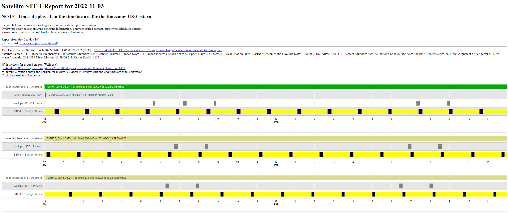

# OIPP
## 궤도, 가시성, 전력 계획 도구 (Orbit, Inview, and Power Planning Tool)

STF-1 임무 운영을 위해 여러 계획 도구들이 개발될 예정입니다. 그 첫 번째가 바로 궤도·가시성·전력 계획(OIPP) 도구입니다. OIPP의 역할은 매일 실행되어 다음 작업을 수행하는 것입니다:

1. STF-1 큐브샛(CubeSat)의 최신 TLE(Two-Line Element, 2행 궤도요소) 데이터 문자열을 가져옵니다.
2. 이 궤도요소를 앞으로 며칠간 전파(propagate)하여, STF-1 지상 안테나와의 가시(in-view) 기간을 계산하고, 앞으로 며칠간 STF-1의 일광 및 식(eclipse, 그림자) 구간을 판단합니다.

> 💡 **초보자 가이드**
> "TLE(Two-Line Element)"는 위성의 현재 궤도 정보를 두 줄의 숫자로 표준화해서 표현한 데이터 형식이에요. "전파(propagate)"는 이 궤도 정보를 이용해 위성이 미래의 특정 시점에 어디에 있을지 수학적으로 계산해 예측하는 것을 말합니다. 마치 현재 위치와 속도를 알면 몇 시간 뒤 어디 있을지 계산할 수 있는 것과 비슷해요.

모든 예측의 정확도는 더 먼 미래로 갈수록 떨어진다는 점에 유의해야 합니다. 따라서 일반적으로 가장 정확한 데이터는 예측 대상 중 가장 가까운 미래(첫째 날)에 대한 것이고, 가장 부정확한 데이터는 가장 먼 미래(마지막 날)에 대한 것입니다. 그래서 먼 미래의 데이터는 대략적인 계획 수립에 사용되고, 가까운 미래의 데이터는 임박한 하루 이틀간의 운영 계획에 사용됩니다.



OIPP는 다음 명령으로 NOS3 가상 머신에서 실행할 수 있습니다:
```
python3 ./gsw/OrbitInviewPowerPrediction/scripts/generate_html_report.py ./gsw/OrbitInviewPowerPrediction/config/stf1-simple.config
```
몇 가지 사전 준비 사항이 있습니다:
1.  `/var/www/html/test` 디렉터리가 존재해야 하며 현재 사용자가 쓰기 권한을 가지고 있어야 합니다
2.  다음 파이썬 pip 모듈들이 설치되어 있어야 합니다:
    1.  pytz
    2.  pyorbital
    3.  geocoder
    4.  openpyxl
    5.  python-dateutil
    6.  matplotlib

OIPP 실행이 완료되면 `/var/www/html/test/stf1` 디렉터리 아래에서 HTML 형식의 OIPP 리포트를 확인할 수 있습니다.