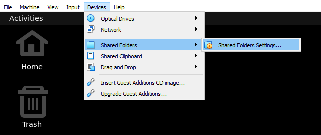
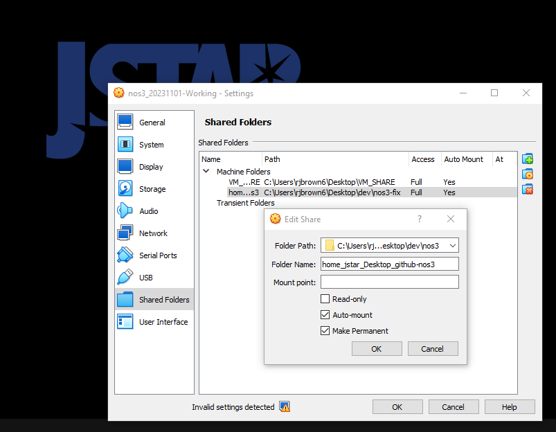

# 워크플로우 & VM 설정

NOS3 사용자/개발자에게 권장되는 워크플로우는 호스트 머신에서 개발하고, VM에서 빌드 및 테스트하는 것입니다(호스트에서 git clone을 하고, 그 git 폴더를 VM 안으로 공유). 이 워크플로우는 빌드 및 테스트를 위한 안정적인 환경을 제공하기 위해 vagrant 가상 머신을 활용합니다. vagrant(`vagrant up`)를 사용하는 경우, VM에는 소스 코드 폴더가 `/home/nos3/Desktop/github-nos3`로 공유되어 있을 것입니다. VirtualBox를 사용해 VM을 시작하는 경우, 다음 방법으로 소스 코드를 VM 안으로 공유할 수 있습니다:

1.  VirtualBox 메뉴 -> Devices -> Shared Folders -> Shared Folders Settings... 로 이동합니다

2.  (+ 기호가 있는 폴더 아이콘으로) 새 공유 폴더를 추가하고 호스트에 있는 nos3 저장소 위치를 선택합니다
3.  `Auto-mount`와 `Make Permanent`를 체크합니다

4.  VM을 재부팅합니다

이 단계들을 완료하면, VM 안에서의 모든 변경 사항이 VM 밖에도 그대로 반영되며, 그 반대의 경우도 마찬가지입니다.
