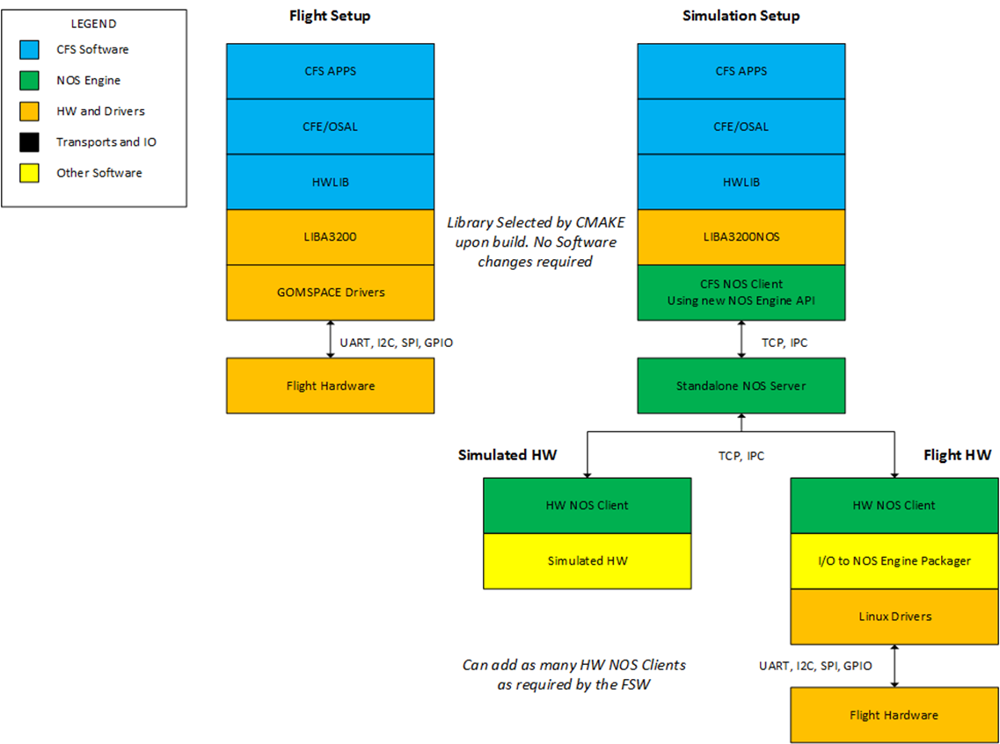

# cFS 비행 소프트웨어 개발

NOS3에서 사용하기 위해 선호되는 비행 소프트웨어(FSW) 프레임워크는 원래 NASA GSFC에서 개발한 오픈소스 Core Flight System(cFS)입니다. 이 섹션에서는 NOS3와 cFS를 연동하는 데 사용된 방법과, 리눅스용으로 컴파일 가능한 어떤 비행 소프트웨어와도 연동할 수 있는 범용적인 방법을 설명합니다.

## cFS와 NOS3

### 운영체제 추상화 계층 (Operating System Abstraction Layer)

Core Flight System은 부분적으로 OSAL(Operating System Abstraction Layer, 운영체제 추상화 계층)의 구현 덕분에 STF-1 임무를 위한 FSW로 선정되었습니다. OSAL은 비행 소프트웨어 애플리케이션이 운영체제(OS) 전용 호출 없이 작성될 수 있도록 해주는 API를 제공합니다. cFS가 컴파일될 때 대상 OS가 지정되며, 빌드 시스템은 그에 맞는 라이브러리를 포함시킵니다. 이 덕분에 FreeRTOS 대상으로 작성된 FSW를 리눅스에서 실행되도록 빌드할 수 있고, 그 반대도 마찬가지로 가능합니다. 이 점이 OSAL의 리눅스 타깃을 사용할 때 NOS3를 이상적인 개발 환경으로 만들어 줍니다.

> 💡 **초보자 가이드**
> "추상화 계층(Abstraction Layer)"이란, 서로 다른 운영체제(리눅스, FreeRTOS 등)마다 조금씩 다른 함수 호출 방식을 하나의 공통된 창구로 감싸주는 중간층이에요. 애플리케이션 코드 입장에서는 "OSAL 함수"만 부르면 되고, 실제로 어떤 OS에서 실행되는지는 신경 쓸 필요가 없습니다. 마치 국가마다 콘센트 모양이 달라도 "멀티어댑터"만 있으면 어디서든 충전할 수 있는 것과 비슷해요.

### 플랫폼 지원 패키지 (Platform Support Package)

OSAL 외에도, cFS는 특정 OS에 종속되지 않지만 메모리, 클럭, 타이머 등 특정 비행 보드에 재사용할 수 있는 라이브러리를 포함하는 PSP(Platform Support Package, 플랫폼 지원 패키지)를 포함합니다. NOS3에서 사용되는 PSP는 리눅스 PSP 릴리스를 수정한 버전입니다. 비행 소프트웨어에서 타이밍을 제어하기 위해, cFS는 여러 타이머를 사용하며 그 중 주된 것이 1Hz 타이머 틱(tick)입니다. 리눅스가 제공하는 1Hz 타이머를 NOS Engine의 시간 티커(ticker)로 교체함으로써, PSP의 시간을 다른 NOS3 구성 요소들이 동작하는 시간과 동기화할 수 있습니다.

### 하드웨어 라이브러리 (Hardware Library)

하드웨어 추상화를 위해 구현된 비행 소프트웨어의 세 번째 구성 요소는 하드웨어 라이브러리(HWLIB)입니다. HWLIB는 I2C, UART 등과 같은 컴포넌트별 I/O 호출에 사용됩니다. 하드웨어 라이브러리는 보통 탑재 컴퓨터(OBC, on-board computer) 제조사가 제공하는 드라이버 형태로, I/O 함수 호출을 정의하는 단일 헤더 파일을 포함합니다. cFS를 빌드할 때, CMAKE 빌드 시스템은 빌드 대상에 해당하는 드라이버 소스를 선택합니다.

예를 들어, Clyde Space EPS(전력 시스템)의 I/O 기능은 사용자 매뉴얼에 잘 정의되어 있으며, 통신은 I2C를 통해 이루어집니다. NanoMind(STF-1의 OBC) I2C 드라이버를 사용해, I2C를 통해 통신하고 문서에 기술된 모든 EPS 기능을 실행하는 epslib.c라는 라이브러리가 작성됩니다. 비행 타깃용으로 컴파일할 때는 CMAKE가 NanoMind 드라이버 소스 코드를 선택하며 실행 파일은 OBC에서 실행될 수 있습니다. 리눅스용으로 컴파일할 때는 CMAKE 빌드가 NOS3 드라이버 소스 코드를 선택하며 실행 파일은 NOS3 환경에서 실행될 수 있습니다. 두 경로 모두에서 HWLIB와 HWLIB를 사용하는 모든 코드는 변경되지 않은 채로 유지되며, 오직 저수준 드라이버만 영향을 받습니다. 아래 다이어그램은 STF-1에 적용된 두 경로의 예시를 보여주며, 여기서 LIBA3200은 NanoMind 소스, LIBA3200NOS는 NOS3 소스입니다.

> 💡 **초보자 가이드**
> 여기서 핵심 아이디어는 "같은 코드, 다른 뒷단"이에요. 애플리케이션 코드(예: GPS 앱)는 항상 똑같은 함수(`uart_read_port` 등)를 호출하는데, 실제로 진짜 위성 하드웨어에 연결할 때는 진짜 드라이버가 실행되고, NOS3 시뮬레이션에서 실행할 때는 시뮬레이션용 가짜 드라이버가 대신 실행됩니다. 덕분에 실제 위성에 올라갈 코드를 그대로 내 컴퓨터에서 테스트해볼 수 있어요.



## cFS를 NOS3에 연결하기

cFS와 함께 NOS3를 사용하려면, 오픈소스 릴리스에 대한 수정이 필요합니다. NOS3 사용법으로 권장되는 방법은 NOS3 사용자 가이드에 설명되어 있으며, 거기서는 이미 이러한 수정이 되어 있습니다. NOS3 릴리스에 포함된 cFS를 사용하지 않는 경우, 레거시 빌드는 현재 지원되지 않으므로 CMAKE 빌드 시스템을 사용하는 것을 권장합니다. 필요한 변경 사항은 아래에 설명되어 있으며, 여기서 `proj`는 통합 대상이 되는 cFS 디렉터리입니다.

1. 빌드할 애플리케이션 목록을 포함하도록 `cfg/nos3_defs` 폴더에 있는 `targets.cmake` 파일을 수정합니다. 아래와 같이 타깃 이름과 시스템을 설정합니다.
```cmake
SET(TGT1_NAME linux)
SET(TGT1_SYSTEM linux)
```
2. `cfg/nos3_defs` 디렉터리에 있는 `toolchain-linux.cmake` 파일을 수정합니다.
3. `fsw/psp/fsw` 디렉터리에 있는 `nos-linux` PSP를 수정합니다.
4. 필요에 따라 `components` 디렉터리에 항목을 추가합니다.
5. `fsw/apps/hwlib`를 새로 만들거나 기존 `fsw/apps/hwlib` 디렉터리를 수정합니다.
   1. `fsw/apps/hwlib`에 있는 `CMakeLists.txt` 파일은 아래에 설명된 것처럼 드라이버 소스 코드를 포함하는 방법에 대한 좋은 예시를 제공합니다.
   2. I/O용 NOS3 드라이버를 저장할 `sim` 폴더를 이 디렉터리에 추가합니다. (아래 드라이버 예시 참고)

## NOS3 드라이버와 그 밖의 FSW

충분히 광범위하게 테스트되지는 않았지만, cFS 외의 다른 FSW에 NOS3를 연결하는 것도 가능합니다. 주요한 두 가지 요구 사항은 I/O 드라이버의 소스 코드가 있어야 한다는 점과, 리눅스에서 컴파일/실행이 가능해야 한다는 점입니다. 이 두 조건이 충족된다면, 앞선 섹션들에서 설명한 것처럼 대상 하드웨어용 드라이버를 NOS3 드라이버로 교체할 수 있습니다.

### NOS3 드라이버 작성하기

새로운 NOS3 드라이버를 작성하는 데 도움이 될 예시를 찾기에 가장 좋은 자료는 NOS3 소스 자체입니다. 이 섹션에서 설명하는 예시에는 UART 드라이버와 STF-1 NAV(항법) 애플리케이션이 사용됩니다. 이 예시에서 NAV 애플리케이션은 cFS용으로 작성되어 `novatel_oem615` 컴포넌트 폴더에 위치하고 있지만, 이 애플리케이션은 다른 어떤 FSW 소스 파일이어도 마찬가지로 적용될 수 있습니다.

#### 애플리케이션과 하드웨어 라이브러리

하드웨어와 통신하는 애플리케이션은 OBC 제조사가 제공한 그대로 정확하게 구현된 I/O 호출을 필요로 합니다. NAV 애플리케이션은 OBC의 UART를 통해 Novatel GPS에 특정 호출을 합니다. NAV 애플리케이션이 GPS의 모든 기능을 사용할 필요는 없으므로, UART에 대한 저수준 호출은 하드웨어 라이브러리 안의 함수로 감싸져 있으며, NAV 앱은 이 라이브러리를 include합니다. 예를 들어 NAV 애플리케이션이 현재 위치/속도/시간 값을 가져오라는 명령을 받으면, 다음 코드 발췌에서 보이는 것처럼 `NOVATEL_OEM615_ChildProcessRequestData` 호출을 하게 됩니다.

```c
int32 NOVATEL_OEM615_ChildProcessRequestData(NOVATEL_OEM615_Device_Data_tlm_t* data)
{
    uint32 status;

    if (OS_MutSemTake(NOVATEL_OEM615_AppData.HkDataMutex) == OS_SUCCESS)
    {
        status = NOVATEL_OEM615_ChildProcessReadData(&NOVATEL_OEM615_AppData.Novatel_oem615Uart, data);

        OS_MutSemGive(NOVATEL_OEM615_AppData.HkDataMutex);
    }
    else
    {
        CFE_EVS_SendEvent(NOVATEL_OEM615_MUT_REQUEST_DATA_ERR_EID, CFE_EVS_EventType_ERROR, 
                "NOVATEL_OEM615: Request device data for child task reported error obtaining mutex");
        status = CFE_ES_RunStatus_APP_ERROR;
    }
    return status;
}
```

`NOVATEL_OEM615_ChildProcessReadData` 함수는 OBC 드라이버에 대한 저수준 UART 호출을 감싸는 래퍼입니다. 이 함수는 다음 코드 발췌에서 볼 수 있습니다. `uart_`로 시작하는 함수 호출들은 OBC 드라이버에서 온 것입니다.

```c
int32_t NOVATEL_OEM615_RequestData(uart_info_t* uart_device, NOVATEL_OEM615_Device_Data_tlm_t* data)
{
    int32_t status = OS_SUCCESS;
    int32_t bytes = 0;
    int32_t bytes_available = 0;
    char *token;

    status = NOVATEL_OEM615_CommandDevice(uart_device, NOVATEL_OEM615_DEVICE_REQ_DATA_CMD, 0);
    if (status == OS_SUCCESS)
    {
        /* check how many bytes are waiting on the uart */
        bytes_available = uart_bytes_available(uart_device);
        if (bytes_available > 0)
        {
            uint8_t* temp_read_data = (uint8_t*)calloc(bytes_available, sizeof(uint8_t));
            /* Read all existing data on uart port */
            bytes = uart_read_port(uart_device, temp_read_data, bytes_available);
            if (bytes != bytes_available)
            {
                #ifdef NOVATEL_OEM615_CFG_DEBUG
                    OS_printf("  NOVATEL_OEM615_RequestData: Bytes read != to requested! \n");
                #endif
                status = OS_ERROR;
                free(temp_read_data);
            }
            else
            {
                /* search uart data for token signifying start of bestxyza gps data packet */
                #ifdef NOVATEL_OEM615_CFG_DEBUG
                    OS_printf(" ALL UART BYTES READ FROM BUFFER: \n");
                    for (int i=0;i<bytes;i++)
                    {
                        OS_printf("%02x", temp_read_data[i]);
                    }
                    OS_printf(" DONE PRINTING ALL UART BYTES READ FROM BUFFER \n");
                #endif
                token = strtok_r((char*)temp_read_data, ",", &saveptr);
                if ((token != NULL) && (strncmp(token, "#BESTXYZA", 9) == 0)) 
                {
                    #ifdef NOVATEL_OEM615_CFG_DEBUG
                        OS_printf(" DATA TOKEN FOUND = %s\n", token);
                    #endif
                    
                    NOVATEL_OEM615_ParseBestXYZA(data);
                }
                else
                {
                    #ifdef NOVATEL_OEM615_CFG_DEBUG
                        OS_printf("  NOVATEL_OEM615_RequestData: No #BESTXYZA token found when reading uart port! \n");
                    #endif
                    status = OS_ERROR;
                    free(temp_read_data);
                }
            }
        }
        else
        {
            #ifdef NOVATEL_OEM615_CFG_DEBUG
                OS_printf("  NOVATEL_OEM615_RequestData: No data available when attempting to read from uart port! \n");
            #endif
            status = OS_ERROR;
        }
    }
    else
    {
        #ifdef NOVATEL_OEM615_CFG_DEBUG
            OS_printf("  NOVATEL_OEM615_RequestData: CommandDevice returned error with status = %s! \n", status);
        #endif
        status = OS_ERROR;
    }
    return status;
}
```

### NOS3 드라이버

위에서 설명한 예시는 Novatel OEM615용 디바이스 드라이버를 제공하는 `hwlib.h` 헤더를 사용합니다. 이 헤더는 UART를 호출하는 어떤 라이브러리에서든 include되며 어느 위치에나 저장될 수 있습니다. 이 경우 하드웨어 라이브러리와 디바이스 드라이버는 모두 `fsw/apps/hwlib/fsw/public_inc/`에 위치합니다.

이 예시에서 GPS 앱이 사용하는 함수는 `uart_bytes_available`과 `uart_read_port`이며, `fsw/apps/hwlib/sim/src/libuart.c`에 정의되어 있습니다. 이 예시를 위해 `uart_bytes_available` 함수를 좀 더 자세히 살펴보겠습니다. 아래 코드 발췌에 이 함수가 나와 있습니다.

```c
/* usart number bytes available */
int32 uart_bytes_available(int32 handle)
{
    int bytes = 0;
    NE_Uart *dev = nos_get_usart_device((int)handle);
    if(dev)
    {
        OS_MutSemTake(nos_usart_mutex);
        bytes = (int)NE_uart_available(dev);
        OS_MutSemGive(nos_usart_mutex);
    }
    return bytes;
}
```

위 함수는 호출한 함수에게 USART 버퍼에서 사용 가능한 바이트 수를 반환하는 데 사용됩니다. 이 코드에서 사용된 `NE_uart_available` 함수는 NOS Engine에서 제공됩니다. UART, I2C, SPI NOS 플러그인에 대한 자세한 내용은 NOS Engine 사용자 매뉴얼에서 확인할 수 있습니다.

### 빌드 시스템

빌드 시스템은 컴파일 대상에 따라 올바른 드라이버 소스 코드를 정확하게 선택할 수 있어야 합니다. 이 경우 cFS와 NOS3 모두 CMake를 사용하며, 이를 통해 이러한 교체를 쉽게 수행할 수 있습니다. 앞서 설명했듯이 `cfg/nos3_defs`의 `targets.cmake` 파일은 드라이버 소스 코드를 포함하는 방법의 예시를 제공하며, CMake 빌드 파일의 예시는 `components/novatel_oem615/fsw/cfs/CMakeLists.tx`에서 찾을 수 있습니다.

