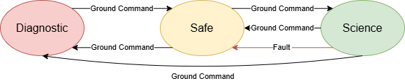
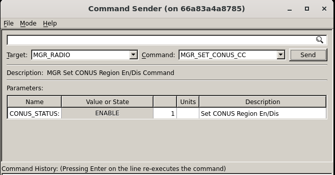
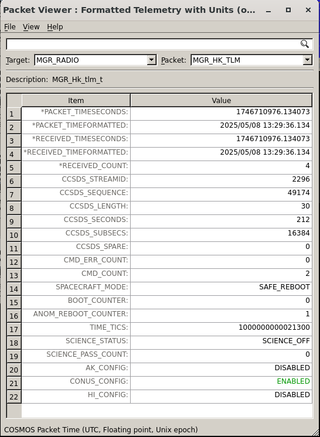

# STF - 운영 개념 (Concept of Operations, ConOps)

NASA Operational Simulator for Space Systems(NOS3)와 함께 제공되는 설계 기준 임무(design reference mission)는 Simulation To Flight(STF)라고 불립니다.
STF는 NOS3의 사용 사례를 시험해보기 위한 문서가 갖춰진 범용 임무 구현체입니다.

## 임무 개요

STF는 과학(science) 중심의 임무입니다.
목표는 가능한 한 많은 과학 데이터를 수집하는 것입니다.
관심 영역의 우선순위를 정하기 위해 전력과 데이터 용량 측면에서 일부 타협이 필요했습니다.
샘플 페이로드는 미국 상공의 강수량을 연구하는 센서라고 가정합니다.
우리는 오직 미국 상공의 강수량에만 관심이 있습니다.
수집 중 생성되는 데이터의 크기 때문에, 지상국과의 교신이 예정될 때까지 수집된 과학 데이터는 위성 내부에 저장됩니다.
우주선은 과학 데이터 수집과 충전 최적화를 위해 지향(pointing)을 수행할 수 있는 수단을 제공합니다.

> 💡 **초보자 가이드**
> "페이로드(payload)"란 위성이 임무를 위해 싣고 있는 핵심 장비(여기서는 강수량 관측 센서)를 말해요. 위성의 나머지 부분(전력, 통신, 자세제어 등)은 이 페이로드가 일을 잘 하도록 지원하는 "버스(bus)"라고 부릅니다.

## 요구사항 (Requirements)

임무 요구사항은 일반적으로 여러 단계(레벨)를 가집니다.
이러한 요구사항 레벨에는 요구사항 자체, 그 근거(rationale), 그리고 레벨 간 추적성(traceability)이 포함됩니다.
아래의 요구사항들은 표준적인 NASA 임무에 필요한 만큼 완전하지는 않지만, STF에는 충분한 수준입니다.

* Level 0 - 임무 목표
  * L0-01: STF는 미국 상공에서 과학 데이터를 수집해야 한다: 미국 본토(CONUS), 알래스카(AK), 하와이(HI).
  * L0-02: STF는 과학 데이터 수집을 미국 인근 지역으로 제한해야 한다.
  * L0-03: STF는 결함 감지 및 수정 기능을 갖춘 자동화된 탑재 과학 활동을 수행해야 한다.
  * L0-04: STF는 최소 3개월간 과학 데이터를 수집해야 한다.
  * L0-05: STF는 모든 과학 데이터를 수집 후 24시간 이내에 지상으로 전송해야 한다.
  * L0-06: STF는 과학 데이터 수집보다 우주선의 상태(health)를 우선시해야 한다.
* Level 1 - 임무 요구사항
  * STF에 대해 추후 결정(TBD)
* Level 2 - 시스템 요구사항
  * STF에 대해 추후 결정(TBD)
* Level 3 - 서브시스템 요구사항
  * STF에 대해 추후 결정(TBD)
* Level 4 - 컴포넌트 요구사항
  * STF에 대해 추후 결정(TBD)

## 우주선 (Spacecraft)

STF 우주선은 핵심 버스(bus)와 과학 페이로드로 나눌 수 있습니다.

### 버스 (Bus)

STF 버스는 서브시스템들의 범용 버전을 포함합니다.
이러한 범용 컴포넌트 혹은 서브시스템들은 향후 상용기성품(COTS, commercial-off-the-shelf) 하드웨어 세대가 선정되었을 때 교체가 가능하도록 해줍니다.
STF의 경우, 물리적인 서브시스템은 다음과 같이 구분됩니다:
* 자세 결정 및 제어 시스템 (ADCS, Attitude Determination and Control System)
  * 우주선의 방향을 결정하고, 과학 활동이나 충전이 최적화되도록 필요한 보정을 수행합니다.
* 통신 (COMMS, Communications)
  * 지상국과 우주선 간의 링크를 유지하여, 명령이 전송되고 텔레메트리가 수신되도록 보장합니다.
* 전력 시스템 (EPS, Electrical Power System)
  * 우주선의 전력 생성, 저장, 분배를 관리하고 모니터링합니다.

### 페이로드 (Payload)

STF 페이로드는 수많은 업데이트를 거쳐왔으며, 임무의 세대마다 계속 발전하고 있습니다.
이 페이로드는 미국 상공의 강수량을 연구하는 센서입니다.
이 페이로드는 자신의 서브시스템 내에서 이상 징후(anomaly)를 감지하면 스스로를 안전한 상태로 만듭니다.
이상이 감지되면 통신은 중단되어야 하며, 운영을 계속하기 전에 전원을 재순환(power cycle)해야 합니다.
계측기의 특성상 이러한 상황은 예상 가능한 것이며, 데이터가 수신된 이후 후처리(post processing) 과정에서 과학팀이 데이터 누락을 처리하게 됩니다.

## 지상 부문 (Ground Segment)

STF 지상 부문은 세 가지 핵심 요소로 구성됩니다.
첫 번째는 상업적으로 제공되는 다양한 물리적 지상국들로, (비용을 지불하면) 우리 궤도의 어느 지점에서든 커버리지를 제공합니다.
두 번째는 우주선의 텔레메트리, 추적, 명령(TT&C, Telemetry, Tracking, and Command)을 수행하는 임무 운영 센터(MOC, Mission Operations Center)입니다.
세 번째는 데이터 후처리를 수행하고 더 높은 수준의 과학 데이터 산출물을 생성하는 과학 운영 센터(SOC, Science Operations Center)입니다.

### 지상국 (Ground Station)

지상국은 우주선과 MOC 사이의 무선주파수(RF) 링크를 제공합니다.
이러한 종류의 네트워크와 데이터를 주고받기 위해 다수의 데이터 유형 변환과 래핑(wrapping)이 이루어집니다.
NOS3의 STF 구현에서는 이에 대한 어떠한 변환도 수행하지 않습니다.
제공되는 상용 API는 단순히 우리 데이터를 받아 패키징하고 전송하며, 무선 하드웨어가 이를 다시 원래 제공된 형태로 변환하는 작업을 처리합니다.

### 임무 운영 센터 (MOC)

MOC는 우주선으로부터 오는 데이터를 모니터링하고 교신 패스(pass)를 설정하는 역할을 합니다.
STF의 경우, 단순히 데이터를 보내는 것만으로도 패스가 시작됩니다.
우리는 이 상업 지상국을 매우 많이 이용하는 사용자이다 보니, 그들이 지상국에서 항상 우리를 추적하고 있는 것처럼 보이며 우주선과의 링크가 마치 손실 없는 것처럼 제공됩니다.

### 과학 운영 센터 (SOC)

SOC는 원시 데이터를 저장하는 방식, 다양한 과학 데이터 산출물로 후처리하는 방식, 그리고 그 데이터를 대중에게 공개하는 방식을 계속해서 바꾸고 있습니다.
이 문서는 이러한 절차들이 아직 유동적으로 정해지고 있던 시기에 작성되었으며, 그런 이유로 이에 대한 세부 사항은 다른 곳에서 다루도록 생략되었습니다.

## 운영 (Operations)

우주선 운영자(spacecraft operator)는 우주선의 일상적인 관리, 제어, 모니터링을 담당하는 훈련된 전문가입니다.
전통적으로 우주선에는 운영자가 필요했지만, 최근에는 "라이트 아웃(lights out)" 운영, 즉 무인 자동 운영을 향한 움직임이 관측되고 있습니다.
이러한 "라이트 아웃" 혹은 자율 운영은 STF 임무의 목표이지만, 이는 우주선이 궤도에 오르고 각종 절차가 검증된 이후에 개발될 예정입니다.
문제가 발생했을 때 운영자가 콘솔로 가서 이를 해결할 수 있도록 알림이 생성될 것입니다.

### 우주선 모드

STF 우주선은 세 가지 모드를 가집니다:
* 진단(Diagnostic) 모드
  * 우주선의 모든 구성 요소가 비활성화됩니다
  * 우주선은 자유롭게 텀블링(tumbling, 회전)하도록 방치됩니다
  * 수동으로 진입 및 종료됩니다
* 안전(Safe) 모드
  * 우주선을 태양 방향으로 향하게(sun point) 하는 데 필요한 최소한의 구성 요소만 활성화됩니다
  * 우주선은 재충전을 최적화하기 위해 태양을 향합니다
* 과학(Science) 모드
  * 데이터 수집을 위해 과학 페이로드를 활성화할 수 있습니다
  * 충전과 과학 데이터 수집을 위한 하위 모드가 내부에 존재하며, 위치에 따라 자동으로 전환됩니다
  * 다수의 추가적인 결함 감지 기능이 있으며, 하나라도 감지되면 안전 모드로 전환됩니다

### 발사 및 커미셔닝 (Launch and Commissioning)

앞서 언급했듯이, 초기 커미셔닝(commissioning, 궤도상 초기 점검 및 시운전)은 우주선 운영자가 수행합니다.
우주선은 "안전(Safe)" 모드로 발사됩니다.
커미셔닝 활동에는 표준 운영이나 정상 운영을 활성화하고 과학 데이터 수집을 수행하기 전에, 우주선의 각 물리적 구성 요소를 개별적으로 테스트하는 작업이 포함됩니다.

### 정상 운영 (Nominal Operations)

정상적인 경우 우주선은 과학 모드 내의 하위 모드들 사이를 자율적으로 전환합니다.
어떤 결함이라도 감지되면 우주선은 안전 모드로 되돌아갑니다.
우주선 운영자는 원인을 조사하고, 과학 모드로 복귀하기 전에 필요한 수정 조치를 취해야 합니다.

### 과학 모드 (Science Mode)

과학 모드는 특정 관심 지역 상공에서의 데이터 수집을 기반으로 합니다.
이 예시에서는 세 개의 서로 다른 지역, 즉 알래스카, 하와이, 미국 본토(CONUS) 상공에서 샘플 계측기를 켜는 것에 관심이 있습니다.
우리는 관심 지역 위에 경계 상자(box)를 그려 지역 경계를 정하고, GPS 좌표를 이용해 계측기를 자동으로 켜야 할 적절한 시점과, 관심 지역을 벗어날 때 과학 활동을 중단해야 할 시점을 파악함으로써 이를 달성합니다.
따라서 과학 모드가 제대로 작동하려면 GPS로부터 위도와 경도 값이 필요합니다.

과학 모드는 지상 명령을 통해 설정됩니다. 우주선이 안전 모드에 있는 동안, 운영자는 MGR_SET_CONUS_CC와 같은 적절한 명령을 보내 원하는 과학 지역을 설정할 수 있습니다.

지역 상태는 패킷 뷰어(Packet Viewer)를 사용해 어떤 지역이 활성화되어 있고 어떤 지역이 비활성화되어 있는지 확인함으로써 검증됩니다.

과학 지역이 설정되고 커미셔닝이 완료되었다면, 운영자는 MGR 앱에 모드를 과학 모드로 설정(Set_Mode to Science)하라는 명령을 보낼 수 있습니다.

어느 정도 자세한 수준에서 설명하면, 리밋 체커(Limit Checker) 앱은 액션포인트(Actionpoints, APs)를 이용해 과학 활동에 필요한 기능을 언제 수행할지 결정합니다. 리밋 체커의 액션포인트가 트리거되면, 이는 비행 소프트웨어로 일련의 명령이 전송되도록 만듭니다. 이러한 일련의 이벤트를 상대 시간 시퀀스(RTS, Relative Time Sequences)라고 부릅니다.
아래는 모드, 액션포인트, 그리고 그와 연관된 RTS의 예시를 어느 정도 자세한 수준으로 보여줍니다.

#### 패스별 운영 (Per Pass Operations)
교신 패스(pass) 전에, 우주선 운영자는 교신 시작 및 종료 시각을 미리 기록해두어야 합니다.
운영자는 업로드할 예정인 파일이 있는지 확인하고, 그 파일들이 올바른 위치에 존재하는지 확인해야 합니다.
운영자는 업링크할 명령과 파일, 다운링크할 텔레메트리와 파일을 포함해 해당 패스에 대한 목표 계획을 세워야 합니다.
각 패스는 짧은 시간(저궤도(LEO)에서 대략 8분 정도)일 수 있으므로, 운영자는 패스 동안 어떤 데이터를 다운링크할지, 그리고 패스 중 어떤 다른 작업을 수행할지를 미리 정해두어야 합니다.
운영자는 위성을 명령/제어할 콘솔에 로그인하여, 공식적으로 연결되기 전에 모든 지상 소프트웨어 애플리케이션과 창이 정상 작동하고 준비되어 있는지 확인해야 합니다.

패스 동안 우주선 운영자가 가장 먼저 해야 할 일은 우주선의 무선 송신기(radio transmitter)에 명령을 내리는 것입니다.
그다음으로 해야 할 일은 우주선이 어떤 모드에 있는지, 배터리의 충전 상태, 그리고 그 밖의 오류 지표를 포함한 주요 상태(health and status) 텔레메트리를 요청하고 확인하는 것입니다.
운영자는 또한 명령이 수행되고 텔레메트리가 수신됨에 따라 명령 및 텔레메트리 카운터가 증가하고 있는지도 확인해야 합니다.
이러한 필수 정보가 수집되면, 우주선 운영자는 상대 시간 시퀀스를 시작하거나 중지하는 명령, 텔레메트리 수집을 시작하는 명령, 파일을 업링크 또는 다운링크하는 명령, 우주선 및 탑재 실험의 상태를 명령하는 등의 명령을 내려야 합니다.
우주선 운영자는 또한 남은 저장 공간을 모니터링하고, 다운링크가 확인된 파일/텔레메트리를 삭제하는 등 우주선의 탑재 저장소도 관리해야 합니다.
우주선 운영자는 패스 동안 우주선의 상태와 건강 상태도 모니터링해야 합니다.
본질적으로 각 패스는 우주선의 모드와 전반적인 상태를 확인하는 것으로 시작한 다음, 우주선이나 탑재 실험의 상태를 변경하는 명령을 보내는 순서로 진행되어야 합니다. 이 후자의 범주에는 우주선에서 지상으로 데이터를 다운링크하는 작업도 포함되며, 이는 대부분의 패스에서 대부분의 시간을 차지할 가능성이 높습니다.

패스가 끝날 무렵, 우주선 운영자는 우주선의 무선 송신기를 비활성화해야 합니다.
패스가 끝난 후, 우주선 운영자는 패스 동안 수신한 텔레메트리와 파일을 처리하는 데 필요한 모든 절차도 시작해야 합니다.

### 비상 대응 운영 (Contingency Operations)
지상 소프트웨어, 지상국, 또는 우주선 소프트웨어에서 이상 징후(anomaly)가 발생할 수 있습니다.
이러한 예로는 지상 소프트웨어가 지상국에 연결되지 않는 경우, 우주선 무선 장치가 명령에 반응하지 않는 경우, 실험 장비가 작동하지 않는 경우, 또는 다른 우주선 구성 요소가 고장난 경우 등이 있습니다.
이상이 경미한 경우, 우주선 운영자는 실시간으로 이를 수정할 수 있습니다.
그렇지 않은 경우, 우주선 운영자는 기체가 안전한 상태인지 확인한 뒤 문제를 오프라인으로 가져가 이상 현상을 더 자세히 연구할 수 있습니다.
여기에는 이상 현상을 해결하기 위한 향후 패스 계획을 수립하는 데 도움을 줄 더 경험 많은 인력을 투입하고, 이상 현상이 해결된 후 이상 보고서(anomaly report)를 작성하는 작업이 포함될 수 있습니다.

### 임무 종료 (End-of-Life)

STF 기체가 더 이상 운영이 불가능할 정도로 성능이 저하되면, 기체를 더욱 안전하게 만들고 재진입을 준비하기 위한 몇 가지 특별한 조치가 취해질 것입니다.
여기에는 EPS가 배터리 충전을 계속하지 못하도록 비활성화하는 것과, 추력기(thruster)를 이용해 조기 대기권 재진입을 유도하여 기체가 다른 기체와의 충돌 위험이 되지 않도록 대기 중에서 소각되게 하는 것이 포함됩니다.
