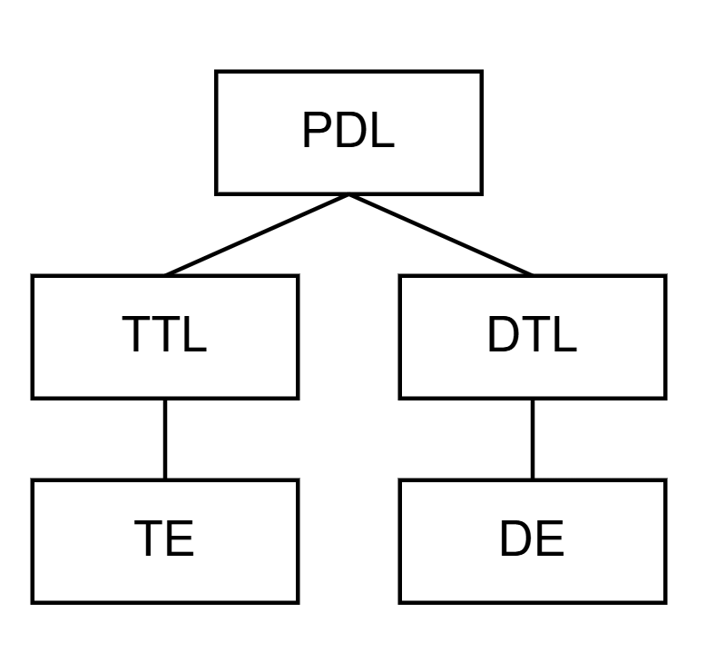
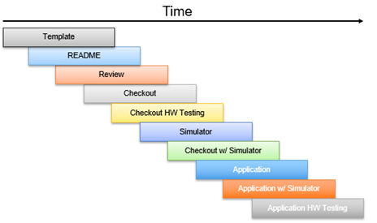

# STF - 소프트웨어 개발 계획
참고: Simulation To Flight (STF)는 Class A 관행을 따르고자 하는 설계 기준 임무입니다

## 필요 자료

| 웹사이트/지원 시스템 | 참조 번호/URL |
| ---------------------- | ---------------------- |
| NASA 소프트웨어 엔지니어링 및 보증 핸드북 | NASA-HDBK-2203: https://swehb.nasa.gov/ |
| NASA 소프트웨어 엔지니어링 요구사항 | NPR 7150.2D: https://nodis3.gsfc.nasa.gov/displayDir.cfm?t=NPR&c=7150&s=2D |
| NASA 소프트웨어 보증 및 소프트웨어 안전 표준 요구사항 | NASA-STD-8739.8B: https://standards.nasa.gov/sites/default/files/standards/NASA/B/0/NASA-STD-87398-RevisionB.pdf |

## 소프트웨어 관리 접근 방식

다음 섹션에서 설명하는 관리 접근 방식은 승인된 프로세스와 일치합니다. PDL이 이 작업을 관리할 일차적인 책임을 지며, PDT의 다른 구성원들은 필요에 따라 지원을 제공합니다.

### 제품 개발 팀 (Product Development Team):

PDL, 다른 리드들, 개발자들, 테스터들, 지원 인력으로 구성되어 함께 일하는 팀을 제품 개발 팀(PDT)이라고 부릅니다. PDT는 시스템과 관련된 모든 산출물을 개발, 통합, 테스트, 인도하기 위해 구성됩니다.

이 섹션에서는 PDT의 조직, 역할과 책임, 그리고 교육 계획을 설명합니다.

### 조직 (Organization):

프로젝트 개발 팀(PDT)은 PDL이 이끌며, 개발 팀 리드(DTL)가 이끄는 개발 엔지니어(DE)들로 구성된 하나 이상의 개발 팀과, 테스트 팀 리드(TTL)가 이끄는 테스트 엔지니어(TE)들로 구성된 테스트 팀으로 구성됩니다.

### 역할, 책임, 권한, 그리고 책임 소재 (Roles, Responsibilities, Authority, and Accountability):

| 역할 | 역할 설명 |
| ---------------------- | ---------------------- |
| PDL | Product Development Lead(제품 개발 리드) - 프로젝트 관리 활동을 담당하고 팀을 이끄는 사람. 이 역할은 주로 프로젝트 관리 역할입니다. 프로젝트 내에서 다음 프로세스 영역들에 일차적인 책임을 집니다: 프로젝트 계획; 프로젝트 모니터링 및 통제; 측정 및 분석; 리스크 관리; 의사결정 분석 해결. 요구사항 개발, 관리, 설계, 구현, 검증(verification), 검증(validation)과 같은 기술적 활동을 이끌고 모니터링하는 데도 일차적인 책임을 집니다.|
| DTL | Development Team Lead(개발 팀 리드) - 특정 서브시스템(들) 또는 시스템(들)을 개발하는 팀을 이끕니다. 요구사항 분석과 상위 수준 설계를 수행합니다. 서브시스템 리드 또는 시니어 개발자라고도 불립니다. 설계 및 구현 프로세스 영역에 일차적인 책임을 집니다. 요구사항 개발 및 관리에서 PDL을 지원합니다. 리뷰를 수행하고 팀을 지원함으로써 검증 및 검증(validation)을 지원합니다. 담당하는 서브시스템(들)/시스템(들)에 대해 다음 프로세스 영역에서 PDL을 지원할 수 있습니다: 계획 수립; 모니터링 및 통제; 측정 및 분석; 리스크 관리. |
| TTL | Test Team Lead(테스트 팀 리드) - 전체 비행 또는 지상 시스템의 통합 및 테스트를 담당합니다. 독립적인 테스트 팀을 이끕니다. 검증 및 검증(Verification and Validation) 프로세스 영역에 일차적인 책임을 집니다. 테스트 영역에 대해 다음 프로세스 영역에서 PDL을 지원할 수 있습니다: 계획 수립; 모니터링 및 통제; 측정 및 분석; 리스크 관리. |
| DE | Development Engineer(개발 엔지니어) - 상세 설계, 구현, 통합, 빌드 통합 테스트를 담당합니다. 요구사항 엔지니어링을 지원합니다.|
| TE | Test Engineer(테스트 엔지니어) - 빌드 검증 테스트, 시스템 검증(validation) 테스트, 인수 테스트의 실행 및 결과 평가를 담당합니다. 우주선 통합 및 테스트 활동을 지원합니다. 소프트웨어 테스터라고도 불립니다.|

## 소프트웨어 기술적 접근 방식

### 프로젝트 생명주기 (Project Life Cycle):
PDT는 이 프로젝트에서 진화적 개발(Evolutionary Development) 모델을 사용할 것입니다. 아래 표는 각 생명주기 단계를 해당 단계 동안 수행되는 주요 활동, 생산되는 주요 산출물, 관여하는 주요 이해관계자, 그리고 해당 단계를 벗어나기(즉, 완료하기) 위한 기준으로 설명합니다. 이 작업에 대한 문서는 각 단계 표의 "산출물(Products)" 부분에 제공되는 문서 목록에 반영되어 있습니다.

| 단계 | 설명 | 환경 | 산출물 | 주요 이해관계자 | 종료 기준 |
| ---------------------- | ---------------------- | ---------------------- | ---------------------- | ---------------------- | ---------------------- |
| 개념 정의 | PDT는 프로젝트와 협력하여 시스템 개념과 상위 수준 요구사항을 이해하고, 이전 시스템들과의 유사점을 찾음으로써 개념적 아키텍처를 수립합니다. 가능한 한, PDT는 자신의 경험을 활용하여 시스템에 영향을 미치는(혹은 시스템으로부터 영향을 받는) 트레이드오프를 프로젝트가 결정하도록 안내합니다. | 요구사항 설계 환경 | · 운영 개념  · 개념 리뷰 자료  · 서명자들이 서명하고 승인한 SDP  | · PDT  · 프로젝트 관리  · 부서 관리  -사용자  | · 개념 리뷰 자료가 검토되고 승인됨  · 조치 항목(Action Items)이 배정되고 완료 일정이 잡힘  |
| 요구사항 및 아키텍처 정의 | PDT는 프로젝트와 긴밀히 협력하여 시스템에 대한 소프트웨어 요구사항을 이해하고 문서화합니다.   인터페이스 및 성능 요구사항을 포함한 소프트웨어 요구사항은 프로젝트 요구사항으로부터 도출되어 문서화됩니다. 요구사항은 완전성, 일관성, 실현 가능성, 테스트 가능성을 기준으로 분석되고 검토됩니다. 소프트웨어 설계 결정에 영향을 미칠 가능성이 있는 요구사항(예: 특별한 타이밍 요구사항, 체크포인트 재시작)이 식별됩니다. 상위 수준 요구사항이 어떻게 소프트웨어 요구사항으로 이어지는지 보여주는 요구사항 추적 매트릭스(RTM)가 만들어집니다. | 요구사항 설계 환경 | · 요구사항 문서  · 요구사항 추적 매트릭스 (RTM)  · 소프트웨어 요구사항 리뷰 (SRR) 자료  | · PDT  · 프로젝트 관리  · 부서 관리  -사용자  | · SRR 자료가 검토되고 승인됨  · SRR 조치 요청(RFA)이 배정되고 완료 일정이 잡힘  · 요구사항이 기준선(baseline)으로 확정되어 형상 관리 대상이 됨  |
| 구현 | 새로운 유닛(unit)은 요구사항과 설계로부터 코딩되며, 재사용되는 유닛에 대한 수정이 필요에 따라 이루어집니다. 소스 코드는 표준에 따라 동료 검토(peer-review) 및 검사됩니다. PDT는 안전한 코딩 관행을 식별, 기록, 구현하고, 정적 분석 도구의 결과를 이용해 소프트웨어 코드가 프로젝트의 코딩 표준을 충족하는지 검증해야 합니다.  예상 결과를 포함한 유닛 테스트 계획과 절차가 작성됩니다. 새로운 유닛과 수정된 유닛은 표준에 따라 유닛 테스트를 거칩니다. 유닛 테스트 보고서가 작성되고 문서화됩니다. PDT는 유닛 테스트 결과가 재현 가능하도록 보장해야 합니다.  시스템 구성 요소들이 하나의 빌드로 통합됩니다. 빌드 통합 테스트 절차가 작성되고 실행되며, 테스트 결과가 검토됩니다. 문제 보고서가 작성되고 필요에 따라 수정됩니다. | 개발 환경 | · 소스 코드  · 유닛 테스트 드라이버, 유닛 테스트 계획, 유닛 테스트 데이터, 유닛 테스트 보고서  · 빌드 통합 테스트 절차 및 테스트 결과  · 테스트 계획 (최종본)  · 사용자 가이드 (초안) · 통합 및 테스트를 마친 소프트웨어 실행 파일  · 재사용 후보  | · PDT  · 프로젝트 관리  · 부서 관리  | (각 빌드마다)  · 지정된 빌드에 대한 각 유닛의 유닛 테스트가 유닛 테스트 계획에 따라 성공적으로 실행됨. · 빌드 통합 테스트가 승인된 빌드 통합 테스트 절차에 따라 성공적으로 실행됨. · 빌드 통합 테스트 보고서가 검토되고 승인됨.  |
| 릴리스 통합 및 테스트 | 시스템 테스트 시나리오와 상세 테스트 절차가 작성되고, 동료 검토되며, 수정됩니다.  필요한 테스트 소프트웨어 및/또는 테스트 장비가 구성, 테스트되며 적정성과 정확성이 검증됩니다.  시스템 테스트는 테스트 계획과 관련 절차에 따라 수행됩니다. 시스템 테스트 결과가 기록되며, 시스템 테스트 보고서가 작성되고 검토됩니다. 문제 보고서가 작성되고 필요에 따라 수정됩니다.  장기 유지보수로의 전환, 특히 유지보수가 개발팀과 별도의 팀에 의해 수행될 경우(지속 엔지니어링)에 대한 준비를 수행합니다.  시스템과 관련 문서가 인도를 위해 패키징됩니다.  시스템 테스트가 개발팀의 책임이 아닌 경우 이 표의 이 부분은 조정될 수 있습니다 - 이 경우 시스템 테스트를 계획하고 수행하는 조직을 여기에 명시하기만 하면 됩니다.   | 테스트 환경 | · 시스템 테스트 절차, 테스트 결과, 테스트 보고서  · 문제 보고서  · 인수 테스트 준비 리뷰 (ATRR) 자료 · 인도 패키지  | · PDT  · 프로젝트 관리  · 부서 관리  · 사용자  | · 최종 시스템 테스트가 성공적으로 실행됨  · 시스템 테스트 보고서가 완성됨  · ATRR 자료가 검토되고 승인됨  · 문제 보고서가 제출됨  · 모든 중대한(critical) 문제 보고서가 구현, 인도, 검증, 검증(validation)됨.  |
| 운영, 유지보수, 퇴역 | PDT는 인도 후 테스트 지원 과정에서 필요에 따라 컨설팅 및 테스트 결과 분석과 같은 기술 지원을 제공합니다. 이러한 테스트로 인해 변경이 필요한 경우, 문제 보고서가 생성되고 승인될 수 있습니다. 이러한 문제 보고서에 대한 해결책 선정 및 수정 사항 구현 이후, 업데이트된 시스템을 재검증하기 위해 필요에 따라 테스트를 업그레이드하며 빌드 테스트와 시스템 테스트가 반복됩니다. | 테스트 환경 | · 소스 코드 · (필요시) 업데이트되고 테스트된 소프트웨어 실행 파일  · (필요시) 문서 업데이트 · 사용자 가이드 (최종본)  | · PDT  · 프로젝트 관리  · 부서 관리  · 사용자  | 해당 없음 |

### 생명주기 리뷰 (Life Cycle Reviews):
PDL은 프로젝트 이해관계자들과 함께 소프트웨어 활동, 상태, 성과 지표, 평가/분석 결과에 대한 리뷰를 정기적으로 개최하며 이슈가 해결될 때까지 추적합니다 [SWE-018] [SWE-143].

PDT는 시스템 산출물을 검증(validation)하기 위한 메커니즘으로 각 단계 종료 시점의 생명주기 리뷰를 수행합니다. 각 리뷰에서 논의될 주제에 맞게, 프로젝트 대표자, PDT와 독립적인 주제 전문가, 사용자, 관리자, 그리고 그 밖의 관심 있는 당사자들로 구성된 리뷰 패널이 선정됩니다.

각 리뷰마다 조치 요청(RFA)이 기록되며, PDL이 이를 PDT 구성원들에게 분석 및 응답을 위해 배정합니다.
PDT는 다음의 공식 마일스톤 리뷰를 수행하거나 참여합니다:
- 임무 CDR (상세 설계 검토)
- 임무 환경 시험 전 리뷰 (Pre-Environmental Review)
- 임무 선적 전 리뷰 (Pre-Ship Review)

### 소프트웨어 설계 (Software Design):
이 프로젝트는 하위 수준 유닛들이 코딩, 컴파일, 테스트될 수 있도록 이를 설명하는 소프트웨어 설계를 개발, 기록, 유지할 것입니다 [SWE-057] [SWE-058] [SWE-143].

STF는 core Flight System(cFS)과, 이것이 제공하는 여러 표준 애플리케이션들(아래 참고), 예를 들어 데이터 저장(DS), 파일 매니저(FM), 리밋 체커(LC), 스토어드 커맨드(SC), 스케줄러(SCH) 등을 활용할 것입니다. STF 전용 애플리케이션을 개발하기 위해 표준화된 워크플로우를 따를 것입니다:

### 소프트웨어 워크플로우 (Software Workflow):

위의 워크플로우는 NASA Operational Simulator for Space Systems(NOS3) 환경 덕분에 신속한 개발과 프로토타이핑을 가능하게 합니다. 이는 본질적으로 개발을 가능하게 해주는 가상의 우주선이며, STF 작업의 출발점으로 기준선이 설정되었습니다.

### 소프트웨어 구현 (Software Implementation):
이 프로젝트는 이 문서 뒷부분에서 설명하는 환경과 도구를 사용하여 요구사항과 설계를 소프트웨어 코드로 구현할 것입니다 [SWE-060]. 개발팀은 코드 품질, 유지보수성, 안전성, 코딩 스타일을 보장하고 안전한 코딩 관행을 포함하기 위해 다음 소프트웨어 코딩 표준을 사용할 것입니다 [SWE-061] [SWE-207]:
- GSFC Code 582, C Coding Standards (https://ntrs.nasa.gov/citations/20080039927)

이 코딩 표준(들)은 소프트웨어 동료 검토에서 검토 기준으로도 사용될 것입니다. 코딩 표준 규칙은 정적 코드 분석기를 실행하여 확인될 수도 있습니다.

### 정적 코드 분석 (Static Code Analysis):
이 섹션에서는 코딩 표준 준수, 순환 복잡도(cyclomatic complexity) 목표, 그리고 소프트웨어 품질에 영향을 미칠 수 있는 그 밖의 문제들을 위해 프로젝트가 정적 코드 분석 도구를 사용하는 방식을 설명합니다 [SWE-135].
이 소프트웨어 프로젝트에 사용될 도구는 GCOV 도구입니다. PDT의 안전한 코딩 표준 준수 여부는 정적 코드 분석을 사용하여 평가될 것입니다 [SWE-185]. 소스 코드의 사이버보안 취약점과 약점을 평가하기 위한 정적 코드 분석은 각 릴리스 전에 수행됩니다.

### 릴리스 계획 (Release Plan):
PDT는 시스템을 개발하기 위해 점진적(incremental) 접근 방식을 사용할 것입니다. 이 접근 방식을 사용하면, 소프트웨어 구성 요소들은 일련의 빌드로 개발, 통합, 테스트됩니다. 프로젝트에 인도되는 빌드를 릴리스라고 부릅니다.

| 릴리스 | 포함된 기능 |
| ---------------------- | ---------------------- |
| 1.0 | 상세 설계 검토(CDR) 릴리스 |
| 2.0 | 환경 시험 전 리뷰 릴리스 |
| 3.0 | 선적 전 리뷰 릴리스 |

통합 및 테스트 리드와 임무 시스템 엔지니어들이 식별한 특정 테스트에 필요한 만큼, 추가적인 소규모 릴리스가 완료될 것으로 예상됩니다.

## 개발 및 테스트 환경
이 섹션에서는 PDT가 시스템을 개발하고 테스트하는 데 사용할 시설, 장비, 라이브러리, 도구를 설명합니다.

### 개발 및 테스트 시설과 장비:
앞선 섹션에서 언급했듯이, NASA Operational Simulator for Space Systems(NOS3)는 STF에서 개발의 출발점을 제공하기 위해 활용되었습니다. 이 환경은 소프트웨어의 모든 개발과 테스트를 위한 단일 환경을 제공하기 위해 필요한 툴체인과 그 밖의 개발 도구를 포함하도록 맞춤화되었습니다.

## 검증 및 검증 (Verification and Validation):

PDT는 프로젝트 생명주기 전반에 걸쳐 팀이 생성한 산출물을 검증(verification)하고 검증(validation)할 것입니다. PDL은 이 작업을 수행할 PDT를 지정합니다. 다음 섹션들은 PDT가 사용할 계획인 검증 및 검증(validation) 방법을 설명합니다.

**검증(Verification)**은 산출물이 그것에 지정된 요구사항을 올바르게 반영하는지 확인하는 것입니다. 검증 방법의 예로는 동료 검토/검사와 테스트가 있습니다.

**검증(Validation)**은 소프트웨어 제품 또는 제품 구성 요소가 실제 운영 환경에서 의도된 용도를 충족하는지 입증하는 것입니다. 방법의 예로는 대상 플랫폼에서의 인수 테스트, 고정밀도 시뮬레이션, 수학적 모델에 대한 분석, 운영 시연이 있습니다.

> 💡 **초보자 가이드**
> Verification(검증)과 Validation(검증)은 한글로는 둘 다 "검증"으로 옮겨지지만 영어 원문에서는 뚜렷이 구분되는 개념이에요. Verification은 "요구사항대로 제대로 만들었는가(Did we build it right?)"를 확인하는 것이고, Validation은 "애초에 필요한 것을 만들었는가(Did we build the right thing?)"를 확인하는 것입니다. 문서 전체에서 원문 영단어를 병기해 두었으니 참고하세요.

참고: 임무 소프트웨어 시스템의 경우, "모든 임무 소프트웨어 시스템에는 철저한 검증 및 검증(validation) 프로세스가 적용되어야 한다. 이 프로세스는 고객/임무 운영 개념과 과학 요구사항을 구현 요구사항 및 시스템 설계로 추적해야 하며, 모든 임무 요소에 대한 요구사항 기반 테스트와 종단 간(end-to-end) 시스템 운영 시나리오 테스트를 포함해야 한다."

### 테스트 접근 방식 (Test Approach):
이 프로젝트의 테스트 접근 방식은 다음을 사용하여 정의되고 유지될 것입니다 [SWE-065]:
1. 소프트웨어 테스트 계획
2. 소프트웨어 테스트 절차
3. 소프트웨어 테스트 (테스트 절차를 수행하기 위해 특별히 작성된 코드 포함)
4. 소프트웨어 테스트 보고서

PDT는 소프트웨어 요구사항 변경 사항과 일치하도록 테스트 및 검증 계획, 절차를 업데이트해야 합니다 [SWE-071].

PDT는 다음 섹션들에서 정의된 포괄적이고 명확하게 정의된 소프트웨어 및 시스템 테스트 세트를 수행할 것입니다 [SWE-066].

참고: "소프트웨어 빌드 테스트, 시스템 테스트, 인수 테스트는 소프트웨어 설계자 및 개발자로부터 독립적인 자격을 갖춘 테스터가 수행해야 한다."

### 유닛 테스트 (Unit Testing):
STF 유닛 테스트 가이드라인: FSW 애플리케이션의 STF 임무 특화 코드에 대해 100% MC/DC 커버리지.

유닛 테스트는 PDT 개발자들에 의해 설계되고 개발됩니다. 이 테스트들은 유효한 입력과 유효하지 않은 입력(단일 및 다중 오류 포함) 모두를 사용해 함수를 실행합니다. 오류 조건이 설정되며, 오류 처리/복구가 검증됩니다. 가능한 경우, 유닛 테스트에는 분기(branch, 경로) 테스트도 포함됩니다. 안전에 중요한(safety-critical) 소프트웨어의 경우, 유닛 테스트는 코드 커버리지에 대해 정해진 요구사항을 따라야 합니다. 유닛 테스트는 PDL이 STF 유닛 테스트 가이드라인에 근거해 결과를 인증할 때 성공한 것으로 간주됩니다 [SWE-062].

유닛 테스트는 NOS 환경에서 PDT 개발자들에 의해 수행됩니다. 유닛 테스트 계획은 재현 가능할 만큼 충분한 수준으로 문서화될 것입니다 [SWE-186]. 유닛 테스트 계획과 결과는 검토되며, 필요에 따라 코드에 대한 수정이 이루어질 것입니다. 이월되는 모든 오류는 문제 보고서로 문서화될 것입니다.

### 코드 커버리지 (Code Coverage):
PDL은 소프트웨어에 대한 적절한 코드 커버리지 측정 방법이 선정되고, 구현, 추적, 기록, 보고되도록 보장할 것입니다 [SWE-189] [SWE-190].

프로젝트에 안전에 중요한(safety-critical) 소프트웨어가 있는 경우, PDL은 식별된 모든 안전에 중요한 소프트웨어 구성 요소에 대해 MC/DC(Modified Condition/Decision Coverage) 기준을 사용한 100% 코드 테스트 커버리지가 이루어지도록 보장할 것입니다 [SWE-219]. STF 비행 소프트웨어는 안전에 중요한 것으로 분류되지는 않지만, MC/DC는 측정되고 추적되고 있습니다. 일정이 허용한다면 전체 커버리지 달성이 PDT의 목표입니다.

PDT는 코드 커버리지를 추적, 기록, 보고하기 위해 다음 NOS 코드 커버리지 도구(들)를 사용할 것입니다 [SWE-189]:
- GCOV

### 빌드 테스트 (Build Testing):

빌드 테스트는 PDT 테스터들에 의해 설계됩니다. 이 테스트들은 소프트웨어 빌드가 설계된 대로 작동하는지, 그리고 모든 기능적, 성능적, 그 밖의 품질 요구사항이 충족되는지 검증합니다. 첫 빌드 이후의 빌드에 대해서는, 이 테스트들에 이전에 테스트된 기능들이 새 빌드로 인해 나쁜 영향을 받지 않았음을 검증하는 회귀 테스트(regression test)가 포함됩니다 [SWE-191]. 위험한 사건, 원인, 또는 완화 기법으로 추적되는 소프트웨어 요구사항도 빌드 테스트에 포함될 것입니다 [SWE-192].

보안 취약점 및 보안 약점 분석에서 식별된, 필요한 소프트웨어 사이버보안 완화 구현에 대해 소프트웨어가 테스트되고, 테스트 결과가 기록될 것입니다 [SWE-159]. 빌드 테스트는 유닛 테스트 요구사항에 따라 유닛 테스트 계획부터 결과까지 실행되었음을 PDL이 인증할 때 성공적으로 완료된 것으로 간주됩니다.

빌드 테스트 계획은 테스트 계획서(Test Plan)에 문서화되며, 이는 빌드 테스트 중에 따라야 할 테스트 시나리오와 절차를 설명합니다 [SWE-065]. 테스트 절차는 각 테스트 단계, 사용될 데이터, 각 단계에서 예상되는 결과를 식별합니다. 테스트 계획서는 빌드가 충족해야 할 요구사항을 계획, 시나리오, 절차가 완전히 테스트하는지 검증하기 위해 PDT 테스터들이 작성하고 동료 검토/검사할 것입니다.
빌드 테스트는 NOS 환경에서 PDT 테스터들에 의해 수행됩니다.
빌드 테스트 결과는 빌드 테스트 보고서에 기록될 것입니다. 이 보고서는 PDL이 검토하고 분석할 것입니다 [SWE-068].

### 시스템 테스트 (System Testing):
시스템 테스트는 PDT 테스터들에 의해 설계됩니다. PDT는 대상 플랫폼 또는 고정밀도 시뮬레이션에서 소프트웨어 시스템을 검증(validate)할 것입니다 [SWE-073]. 이 테스트들은 예를 들어 장기 지속 테스트, 스트레스 테스트, 정상/비정상 테스트를 사용하여 이상 징후와 실패를 감지하기 위해, 운영 사용을 위해 구성된 완전히 통합된 시스템의 종단 간(end-to-end) 기능을 실행합니다. 시스템 테스트는 시스템 테스트 계획부터 결과까지 실행되었음을 PDL이 인증할 때 성공적으로 완료된 것으로 간주됩니다.

시스템 테스트 계획은 테스트 계획서에 문서화되며, 이는 시스템 테스트 중에 따라야 할 테스트 시나리오와 절차를 설명합니다. 이 계획서는 테스트 절차가 시스템의 정상, 이상, 비상 운영을 완전히 테스트하는지 검증하기 위해 PDT 테스터들이 작성하고 동료 검토/검사할 것입니다.

시스템 테스트는 NOS 환경에서 PDT 테스터들에 의해 수행됩니다. 시스템 테스트 결과는 시스템 테스트 보고서에 기록될 것입니다.

참고: "비행 중 변경 가능한 모든 소프트웨어에 대해, 임무 운영 센터와 비행 관측 장비를 사용한 코드 변경의 사전 비행, 종단 간 시연이 있어야 한다."

### 시뮬레이터 대 하드웨어 (Simulator vs Hardware):

위에서 설명한 테스트 절차들은 코드 품질과 기능성을 보장하기 위해 NOS 환경에서 실행됩니다. 테스트들은 NOS로 시뮬레이션된 하드웨어에서 실행되지만, 테스트는 실제 물리적 하드웨어에서도 다시 실행되어야 합니다. 하드웨어에서 얻은 결과가 시뮬레이션 결과보다 우선시됩니다. NOS는 제한된 하드웨어 테스트베드를 가지고도 임무 개발을 더 효율적으로 진행시키기 위한 도구 역할만 할 뿐입니다.

