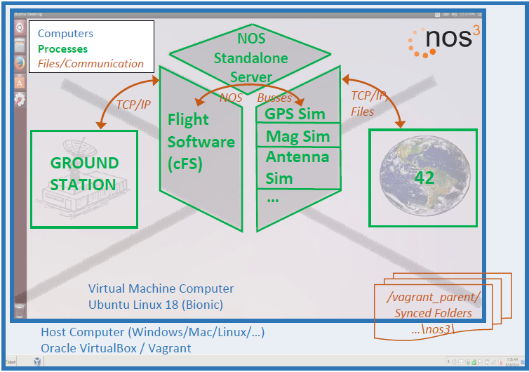

# STF - 검증 및 검증(Verification and Validation, V&V) 계획

## 1 소개
이 검증 및 검증(V&V) 계획은 NASA Operational Simulator for Space Systems(NOS3)와 그 설계 기준 임무인 Simulation to Flight(STF)에 적용됩니다.
NOS3에 대한 더 자세한 내용은 Read the Docs 위키와 3절에 설명되어 있습니다.

### 1.1 목적과 범위
NOS3는 소프트웨어 개발, 통합 및 테스트(I&T), 임무 운영/훈련, 검증 및 검증(V&V), 소프트웨어 시스템 점검 등의 영역을 지원하기 위해 NASA의 Katherine Johnson Independent Verification and Validation(IV&V) Facility에서 개발한 도구 모음입니다.
NOS3는 소프트웨어 개발 환경, 다중 타깃 빌드 시스템, 운영자 인터페이스/지상국, 동역학 및 환경 시뮬레이션, 그리고 우주선 하드웨어의 소프트웨어 기반 모델을 제공합니다.
NOS3는 다양한 사용 사례가 시연되는 STF라는 예시 임무 구현체를 제공합니다.

이 계획의 목적은 요구사항 준수를 확립할 활동(검증, verification)을 식별하고, 시스템이 고객의 기대에 부합함을 확립하는 것(검증, validation)입니다.

### 1.2 책임과 변경 권한
NASA Independent Verification and Validation(IV&V) 소속 Jon McBride Software Testing and Research(JSTAR) 팀이 이 계획의 유지 관리를 담당합니다.
이 그룹은 이 계획에 대한 변경 사항을 승인할 권한을 가집니다.

## 2 적용 문서 및 참조 문서
### 2.1 적용 문서
1. [Read the Docs 위키](https://nos3.readthedocs.io/en/latest)
2. [STF 운영 개념](STF_ConOps.md)

### 2.2 참조 문서
1. [소프트웨어 개발/관리 계획](Software_Development_Management_Plan.md)

### 2.3 우선순위
충돌이 발생하는 경우, 적용 문서가 이 문서보다 우선합니다.
이 문서는 참조 문서보다 우선합니다.

## 3 시스템 설명
### 3.1 시스템 요구사항 전개(Flowdown)
이 시스템의 요구사항은 운영 개념/아키텍처, 사용자 매뉴얼 및 개발자 가이드, 그리고 요구사항 문서로부터 나옵니다.

### 3.2 시스템 아키텍처
NOS는 위성과 그것을 제어하는 데 사용되는 운영 지상 시스템의 완전한 모델을 제공합니다.
이 위성 모델은 위성 비행 소프트웨어의 개발을 가능하게 합니다.
이 모델에는 태양 센서, 스타 트래커, 추력기, 페이로드 등 위성 상의 다양한 하드웨어 구성 요소를 위한 시뮬레이터가 포함되어 있습니다. 아래 다이어그램은 NOS 아키텍처를 나타냅니다.

이 시스템의 시스템 아키텍처에 대한 자세한 내용은 운영 개념/아키텍처 문서에서 확인할 수 있습니다.

## 4 검증 및 검증(V&V) 프로세스
### 4.1 검증 및 검증(V&V) 관리 책임
NASA IV&V JSTAR 팀이 NOS의 검증 및 검증(V&V)을 담당합니다.

### 4.2 검증 및 검증(V&V) 방법
#### 4.2.1 분석 (Analysis)
분석: 계산된 데이터나 하위 시스템 구조의 최종 제품 검증(validation)에서 도출된 데이터를 기반으로, 설계가 요구사항을 충족하는지 예측하기 위한 수학적 모델링 및 분석 기법의 사용.

#### 4.2.2 검사 (Inspection)
검사: 완성된 최종 제품에 대한 육안 검사. 검사는 일반적으로 물리적 설계 특징이나 특정 제조사 식별 정보를 검증하는 데 사용됩니다.
예를 들어, 안전 아밍 핀(arming pin)에 검은 글씨로 "비행 전 제거(Remove Before Flight)"라고 스텐실로 인쇄된 빨간 깃발이 있어야 한다는 요구사항이 있다면, 아밍 핀 깃발에 대한 육안 검사를 통해 이 요구사항이 충족되었는지 판단할 수 있습니다.

#### 4.2.3 시연 (Demonstration)
시연: 최종 제품의 사용이 개별적으로 명시된 요구사항(검증, verification)이나 이해관계자의 기대(검증, validation)를 달성함을 보여주는 것.
이는 일반적으로 성능 능력에 대한 기본적인 확인이며, 상세한 데이터 수집이 없다는 점에서 테스트와 구분됩니다.
시연에는 물리적 모델이나 모형(mock-up)의 사용이 포함될 수 있습니다. 예를 들어, 모든 조종 장치가 조종사의 손에 닿아야 한다는 요구사항은 조종석 모형이나 시뮬레이터에서 조종사가 비행 관련 작업을 수행하도록 함으로써 검증될 수 있습니다.
시연은 또한 시스템 성능의 극한 한계에서 운용할 수 있는 능력을 보여주는 일회성 이벤트를 수행하는 테스트 파일럿과 같은, 고도로 숙련된 인력이 실제로 최종 제품을 운용하는 것일 수도 있습니다.

#### 4.2.4 테스트 (Test)
테스트: 성능을 검증(verify)하거나 검증(validate)하기 위한 상세 데이터를 얻거나, 추가 분석을 통해 성능을 검증(verify)하거나 검증(validate)하기에 충분한 정보를 제공하기 위해 완성된 최종 제품을 사용하는 것.

## 5 검증 및 검증(V&V) 구현
### 5.1 시스템 설계와 검증 및 검증(V&V) 흐름
구성 요소 개발의 일반적인 흐름은 다음과 같습니다:
1.  점검용(checkout) 애플리케이션 개발
2.  점검용 애플리케이션을 이용한 시뮬레이터 개발 및 테스트
3.  점검용 애플리케이션의 코드를 재사용하는 비행 소프트웨어 개발
4.  지상 소프트웨어 명령 및 텔레메트리 데이터베이스 개발
5.  지상 소프트웨어 및 시뮬레이터를 이용한 비행 소프트웨어 테스트
6.  지상 소프트웨어 및 실제 하드웨어를 이용한 비행 소프트웨어 테스트

### 5.2 테스트 대상물 (Test Articles)
비행 소프트웨어 소스 코드가 테스트 대상물입니다.
이는 실제로 비행에 사용될 소프트웨어이지만 리눅스 환경용으로 다시 컴파일된 것입니다.
또한, 비행 소프트웨어의 명령 및 제어에 사용되는 지상 소프트웨어의 명령 및 텔레메트리 데이터베이스도 테스트 대상물로 취급될 수 있습니다.

### 5.3 지원 장비 (Support Equipment)
NOS 시스템에는 지상 소프트웨어 시스템인 AMMOS(Advanced Multi-Mission Operations System) Instrument Toolkit(AIT), COSMOS, OpenC3, 또는 YAMCS(Yet Another Mission Control System)와 42 동역학 소프트웨어가 필요합니다.
또한, 테스트 대상 구성 요소들의 시뮬레이션이 테스트를 위해 필요합니다.

### 5.4 시설 (Facilities)
모든 하드웨어가 소프트웨어로 시뮬레이션되므로 NOS 검증 및 검증(V&V)에는 특별한 시설이 필요하지 않습니다.
git, Vagrant, VirtualBox가 설치된 표준 엔지니어링 노트북이면 NOS 검증 및 검증(V&V)을 수행하기에 충분합니다.
실제 하드웨어를 이용한 테스트의 경우, 지상 소프트웨어는 노트북에서 실행되며 그 노트북은 무선 또는 유선 연결을 통해 실제 하드웨어에 연결됩니다.

## 6 시스템 검증 및 검증(V&V)
### 6.1 완전한 시스템 통합
NOS는 전체 시스템에 대해, 또는 구성 요소별로 비행 및 지상 소프트웨어의 검증 및 검증(V&V)을 수행하는 데 사용될 수 있습니다.

#### 6.1.1 개발/엔지니어링 유닛 평가
NOS는 주로 개발용 또는 엔지니어링용 유닛에 대한 평가를 수행할 필요성을 없애줍니다.
이는 리눅스용으로 재컴파일된 실제 비행 코드를 평가할 수 있는 능력을 제공합니다.

#### 6.1.2 검증(Verification) 활동
##### 6.1.2.1 검증 테스트
테스트가 주된 검증 방법이 될 것입니다.
가능한 한 UT-Assert 프레임워크를 사용해 자동화되어야 하며, 가능하다면 합격/불합격(pass/fail) 결과를 제공해야 합니다.

##### 6.1.2.2 검증 분석
소프트웨어의 올바른 동작을 검증하기 위해 더 깊은 분석이 필요한 경우 분석이 사용될 것입니다.

##### 6.1.2.3 검증 검사
검사는 거의 사용되지 않을 것입니다.

##### 6.1.2.4 검증 시연
단순한 합격/불합격 기준이 없는 더 큰 종단 간(end-to-end) 유형의 요구사항을 검증하기 위해 필요한 경우 시연이 사용될 것입니다.

#### 6.1.3 검증(Validation) 활동
##### 6.1.3.1 테스트를 통한 검증(Validation)
테스트가 주된 검증(validation) 방법이 될 것입니다.
가능한 한 UT-Assert 프레임워크를 사용해 자동화되어야 하며, 가능하다면 합격/불합격 결과를 제공해야 합니다.

##### 6.1.3.2 분석을 통한 검증(Validation)
소프트웨어의 올바른 동작을 검증(validate)하기 위해 더 깊은 분석이 필요한 경우 분석이 사용될 것입니다.

##### 6.1.3.3 검사를 통한 검증(Validation)
검사는 거의 사용되지 않을 것입니다.

##### 6.1.3.4 시연을 통한 검증(Validation)
단순한 합격/불합격 기준이 없는 더 큰 종단 간 유형의 시나리오를 검증(validate)하기 위해 필요한 경우 시연이 사용될 것입니다.

## 7 프로그램 검증 및 검증(V&V)
비행 소프트웨어와 지상 소프트웨어가 NOS 환경에서 검증되고 검증(validate)되고 나면, 비행 컴퓨터를 포함한 실제 비행 하드웨어에서도 검증되고 검증(validate)될 수 있습니다.

## 8 시스템 인증 산출물
검증 및 검증(V&V) 활동의 산출물에는 테스트 계획, 테스트 절차, 테스트 보고서, 그리고 완성된 요구사항 추적 매트릭스가 포함됩니다.

## 부록 A: 약어 및 축약어
- AIT: AMMOS Instrument Toolkit
- AMMOS: Advanced Multi-Mission Operations System
- I&T: 통합 및 테스트 (Integration and Test)
- IV&V: 독립 검증 및 검증 (Independent Verification and Validation)
- JSTAR: Jon McBride Software Testing and Research
- NOS3: NASA Operational Simulator for Space Systems
- RTM: 요구사항 추적 매트릭스 (Requirements Traceability Matrix)
- V&V: 검증 및 검증 (Verification and Validation)
- YAMCS: Yet Another Mission Control System

## 부록 B: 용어 정의
검증(Validation, 제품에 대한): 이해관계자의 기대와 운영 개념에 근거하여 제품이 의도된 목적을 달성함을 입증하는 과정.
테스트, 분석, 시연, 검사의 조합으로 판단될 수 있습니다. ("내가 올바른 제품을 만들고 있는가?"라는 질문에 답합니다.)

검증(Verification, 제품에 대한): 사양(specification) 준수에 대한 증명.
검증은 테스트, 분석, 시연, 검사 또는 이들의 조합으로 판단될 수 있습니다. ("내가 제품을 올바르게 만들었는가?"라는 질문에 답합니다.)

## 부록 C: 요구사항 검증 매트릭스
추후 작성 (TODO)

## 부록 D: 검증(Validation) 매트릭스
추후 작성 (TODO)
