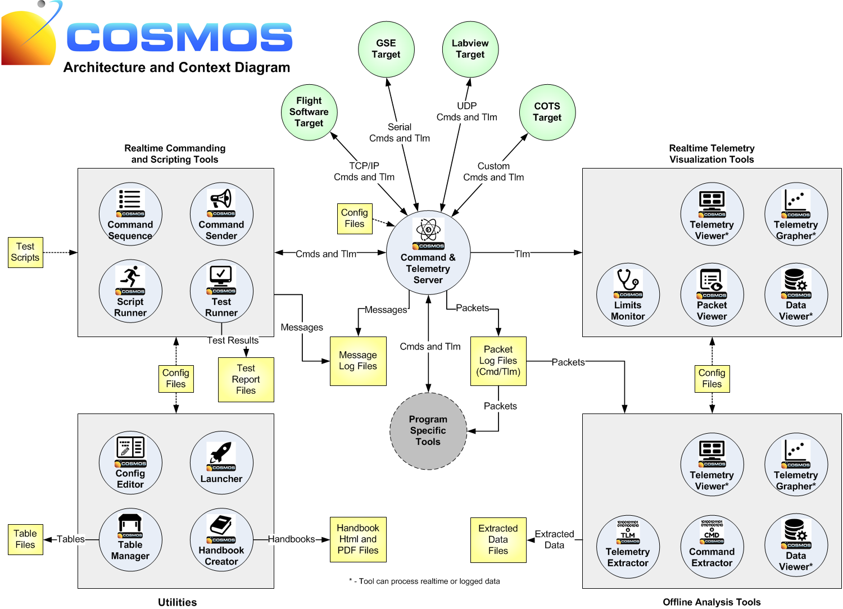
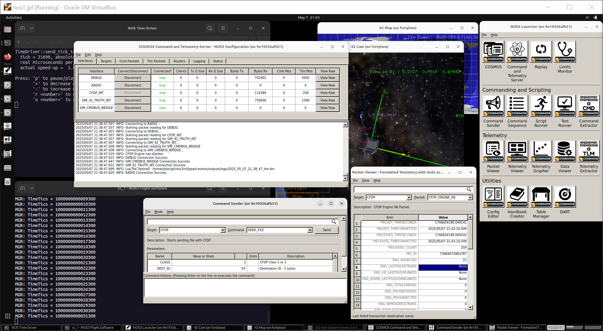
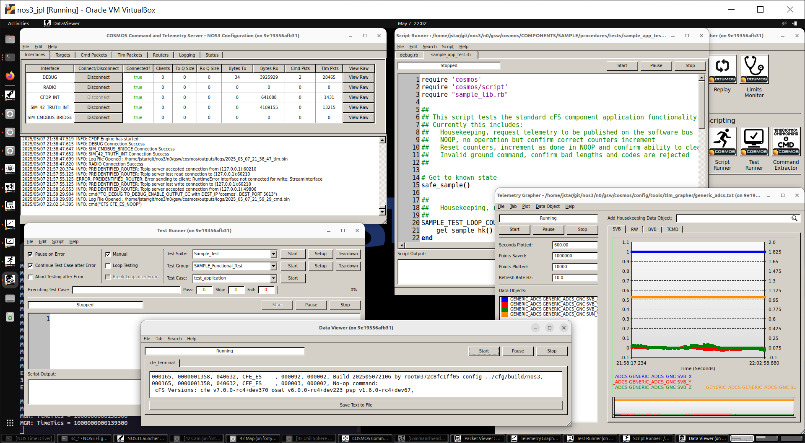

# 시나리오 - COSMOS

이 시나리오는 NASA Operational Simulator for Space Systems(NOS3)에 구현된 Ball Aerospace의 COSMOS 지상 소프트웨어(GSW)에 대한 개요를 제공하기 위해 작성되었습니다.
COSMOS는 Ball Aerospace가 개발한 종합적인 지상 소프트웨어 모음으로, 임베디드 시스템, 특히 우주선에 대한 명령 및 제어 기능을 제공합니다.
NOS3 환경에서 COSMOS는 주된 지상 소프트웨어 인터페이스 역할을 합니다.

이 시나리오는 2025년 5월 26일에 마지막으로 업데이트되었으며, 당시 `dev` 브랜치[a3e7c100]를 기준으로 합니다.

## 학습 목표

이 시나리오를 마치면 다음을 할 수 있어야 합니다:
* COSMOS 지상 소프트웨어 도구를 이용한 종단 간(end-to-end) 명령 및 텔레메트리 처리를 시연합니다.
* NOS3 환경 내에서 주요 COSMOS 애플리케이션(Command Sender, Packet Viewer, Test Runner)을 탐색하고 활용합니다.
* 우주선의 기능을 검증하기 위한 기본적인 자동화 테스트 절차를 만들고 실행합니다.
* cFS 애플리케이션 및 하드웨어 구성 요소와 통신하기 위해 COSMOS 인터페이스를 설정합니다.
* 실시간 텔레메트리를 모니터링하고 우주선 상태를 분석합니다.

## 사전 요구사항

시나리오를 실행하기 전에 다음 단계를 완료하세요:
* [시작하기](./NOS3_Getting_Started.md)
  * [설치](./NOS3_Getting_Started.md#installation)
  * [실행](./NOS3_Getting_Started.md#running)
* [시나리오 - 데모](./Scenario_Demo.md)

## 둘러보기

COSMOS는 다양한 임베디드 시스템을 제어하는 데 사용할 수 있는 애플리케이션 모음입니다. 이러한 시스템에는 테스트 장비(전원 공급 장치, 오실로스코프, 스위치형 전원 스트립, UPS 장치 등)부터, 개발 보드(Arduino, Raspberry Pi, Beaglebone 등), 그리고 인공위성까지 무엇이든 포함될 수 있습니다.

COSMOS는 클라이언트-서버 아키텍처를 구현하며, Command and Telemetry Server가 있고, 다른 다양한 도구들은 일반적으로 데이터를 가져오는 클라이언트 역할을 합니다. Command and Telemetry Server는 대상(Target, 초록색 원)에 연결되어 통신하며, 명령을 보내고 텔레메트리(상태 데이터)를 받습니다. 대상(Target)은 여러분이 제어하려고 하거나 상태를 얻으려고 하는 대상 항목입니다. 서버에서 대상으로 향하는 화살표는 인터페이스(Interface)를 나타내며, 이는 TCP/IP, 시리얼, UDP/IP, 또는 여러분이 직접 정의하는 커스텀 인터페이스일 수 있습니다. 노란색 상자는 설정 파일, 로그 파일, 리포트 등의 데이터 항목을 나타냅니다.

초기 NOS3 데모에서도 COSMOS가 사용되었지만, 많은 세부 사항들이 생략되었습니다. 그래서 아래에서는 이전 시나리오의 일부를 다시 다루되, 훨씬 더 자세하게 들어가 보겠습니다.
터미널에서 NOS3 저장소의 최상위 레벨로 이동한 상태에서:
* `make clean`
  * 이제 설정을 변경했으므로, 혹시 다른 시나리오에서 남은 이전 파일들이 있을 경우를 대비해 여기서 clean을 한다는 점에 유의하세요.
* `make`
* `make launch`

먼저, COSMOS 런처(Launcher)를 살펴봅시다.
런처 자체는 사용하지 않는 도구를 제거하거나, 여러분의 임무에 특화된 특별한 버튼을 만들 수 있도록 설정 가능합니다.
[./gsw/cosmos/config/tools/launcher/launcher.txt](https://github.com/nasa-itc/gsw-cosmos/blob/nos3-dev/config/tools/launcher/launcher.txt)에는 NOS3에서 기본적으로 사용되는 특정 버전이 담겨 있습니다.
이 런처 설정 파일을 보면, 왼쪽 상단의 "COSMOS" 버튼이 실제로는 여러 가지 일을 한다는 것을 알 수 있습니다.

왼쪽 상단의 "COSMOS" 버튼을 클릭했을 때 열리는 구성 요소들을 살펴봅시다:
* Command and Telemetry Server (명령 및 텔레메트리 서버):
  * 이 구성 요소는 비행 시스템과의 데이터 교환을 위한 인터페이스(NOS3에서는 주로 UDP)와 프로토콜을 처리하는 중앙 통신 허브입니다.
* Command Sender (명령 송신기):
  * 이 구성 요소는 운영자가 대상에 명령을 검색, 선택, 전송할 수 있게 해주며, NOS3에서는 표준(디버그) 인터페이스와 RADIO 인터페이스 옵션을 모두 제공합니다.
* Packet Viewer (패킷 뷰어):
  * 이 구성 요소는 원시(raw) 텔레메트리 값과 파생(derived) 텔레메트리 값을 자동 업데이트 및 단위 변환과 함께 표시하는 실시간 텔레메트리 시각화 도구를 제공합니다.

이 도구들 각각은 운영자에게 유용한 여러 기능을 가지고 있습니다:
* Command and Telemetry Server:
  * 통신 링크가 끊어졌는지 확인하는 가장 빠른 수단이므로, 이 창은 항상 보이도록 해두는 것이 중요합니다.
  * 또한 빨강/초록 한계값(limit)이 설정되어 있다면, 이는 이벤트 로그에 표시됩니다.
  * 지상에서 보낸 모든 명령도 여기에 기록됩니다. 이를 통해 (패스를 자동화하기 위해) 실행 중인 스크립트에 문제가 있는지 비교적 쉽게 확인할 수 있습니다.
  * 다른 탭들은 사람이 읽기 쉬운 형태와 원시 16진수 형태 모두로 특정 명령과 텔레메트리를 확인하는 데 유용합니다.
* Command Sender:
  * 상단에 검색창이 있다는 점에 유의하세요. 수동으로 검색하는 대신 여기에 명령을 입력할 수 있습니다.
  * 각 구성 요소의 대상은 서로 분리되어 있습니다. NOS3에서는 특정 대상에 대해 관례적으로 사용해야 할 올바른 인터페이스를 나타내기 위해 `_RADIO`를 뒤에 붙이기로 했습니다.
    * `_RADIO`라는 문구는 이 인터페이스가 실제 우주선의 운영자가 경험하는 것과 유사한 방식으로 진행되는 인터페이스임을 나타냅니다. `_RADIO`가 없는 인터페이스는 우주선에 직접 연결된 것을 시뮬레이션합니다.
  * 명령을 더 쉽게 수정하려면 이 창의 크기를 조정해야 할 수도 있다는 점에 유의하세요(일반적으로 먼저 더 넓게 만들어 보세요).
* Packet Viewer:
  * 항목이나 값 위에 마우스를 올려두면, 해당 항목에 대한 주석/관련 텍스트가 패킷 뷰어 하단에 나타나는 것을 확인할 수 있습니다.
  * 항목이나 값을 우클릭하면 다음을 할 수 있습니다:
    * 16진수 값, 데이터 타입, 단위 등의 세부 정보를 봅니다.
    * 해당 특정 값을 시간에 따라 그래프로 그립니다(기본적으로 메타데이터 시간을 사용한다는 점에 유의).
  * 앞에 *가 붙은 항목은 COSMOS가 실제로 수신된 데이터에 추가한 메타데이터라는 점에 유의하세요. 여기서 제공되는 시간 역시 벽시계(wall clock) 시간이 아니며, 이는 혼란을 줄 수 있습니다. 따라서 Packet Viewer에 표시되는 시간 대신, 어떤 분석을 하든 우주선 시간을 사용하는 것이 권장됩니다.

우주선 운영자가 알아두면 좋은 몇 가지 추가 도구들은 다음과 같습니다:
* Data Viewer (데이터 뷰어):
  * 로그 파일, 메모리 덤프, 이벤트 메시지에 대한 텍스트 기반 데이터 시각화.
* Telemetry Grapher (텔레메트리 그래퍼):
  * 설정 가능한 축과 표시 옵션을 갖춘, 시간에 따른 텔레메트리 값의 그래픽 표현을 제공합니다.
* Test Runner (테스트 실행기):
  * 스위트(suite), 그룹, 케이스로 구성된 자동화 테스트 절차를 실행하며, 명령 실행과 텔레메트리 검증에 대한 상세 리포트를 생성합니다.
* Script Runner (스크립트 실행기):
  * Ruby를 사용해 자동화된 운영 절차, 디버깅 도구, 그리고 테스트 중 열 제어와 같은 지속적인 작업을 만듭니다.

이 외에도 다른 도구들이 있지만, 이 정도면 초기 시나리오 세트를 진행하기에 충분할 것입니다.

---
### 추가 참고 자료

Ball Aerospace의 COSMOS와 관련된 문서는 다음 링크에서 확인할 수 있습니다:
* [Ball Aerospace Cosmos](https://ballaerospace.github.io/cosmos-website/docs/v4/)
