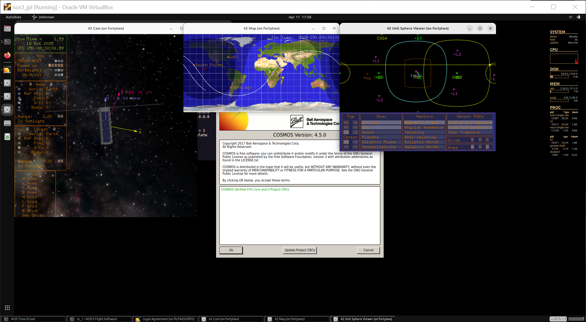
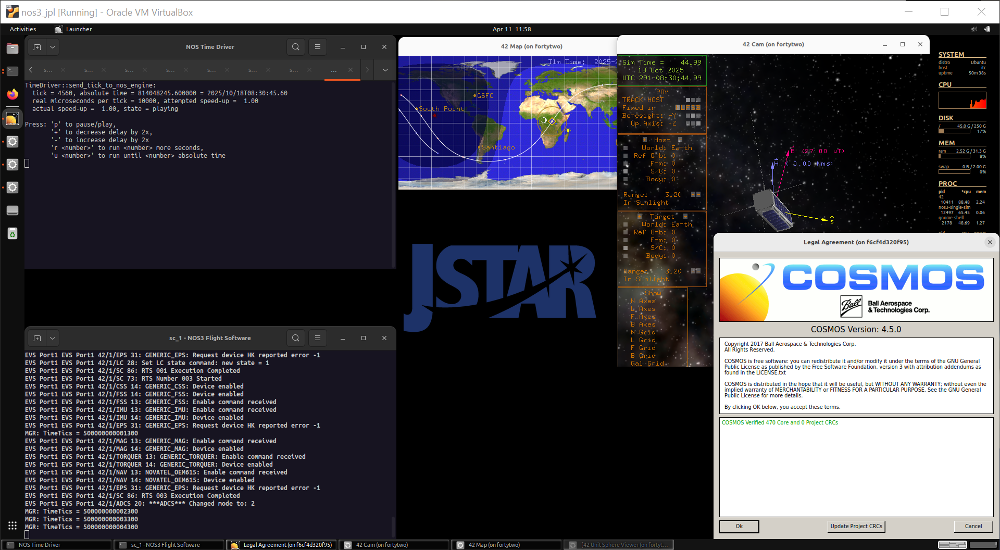

# 시나리오 - 커미셔닝 (Commissioning)

이 시나리오는 우주선의 커미셔닝(초기 점검 및 시운전)을 수행하는 데 도움이 되는 기본적인 COSMOS 스크립트를 작성하는 방법에 대한 아이디어를 사용자에게 제공하기 위해 작성되었습니다.

실제 상황에서는 발사 이후, 그리고 정식 운영 이전 시기가 우주선의 상태를 평가하고 검증하는 중요한 시간이 됩니다.
과학 활동을 시작하기 전에, 서브시스템들이 정상 상태와 건강 상태인지 점검해야 합니다.
이것이 확인되면, 과학 활동을 수행할 수 있고 우주선에 대한 기본적인 '제어'는 과학팀이 주도할 수 있게 됩니다.

이 시나리오는 2025년 9월 15일에 마지막으로 업데이트되었으며, 당시 `dev` 브랜치[422f66ec]를 기준으로 합니다.

## 학습 목표

이 시나리오를 마치면 다음을 할 수 있어야 합니다:
* 프롬프트(prompt), wait_check, 메시지 박스를 사용하는 간단한 COSMOS 스크립트를 작성합니다.
* COSMOS 스크립팅을 이용해 명령을 보내고 텔레메트리를 수신합니다.
* 우주선 커미셔닝과 점검의 기본적인 목표를 이해합니다.

## 사전 요구사항

시나리오를 실행하기 전에 다음 단계를 완료하세요:
* [시작하기](./NOS3_Getting_Started.md)
  * [설치](./NOS3_Getting_Started.md#installation)
  * [실행](./NOS3_Getting_Started.md#running)
* 이 시나리오를 위한 추가적인 파일 변경이나 특별한 설정은 필요하지 않습니다

## 둘러보기

터미널에서 NOS3 저장소의 최상위 레벨로 이동한 상태에서:
* `make`


* `make launch`



* 그런 다음, 사용하기 편하도록 창들을 정리합니다:



이제 COSMOS 지상 소프트웨어를 시작합니다:
* `Ok` 버튼을 클릭한 다음, 나타나는 NOS3 런처 창의 왼쪽 상단에 있는 `COSMOS` 버튼을 클릭합니다.
* 이 NOS3 런처는 최소화해도 되지만, 닫지는 마세요.
* 우리는 지금 수행하려는 작업에 COSMOS 창을 활용하는 데 집중할 것입니다. 원한다면 환경을 단순하게 만들기 위해 42 GUI 창들을 최소화해도 됩니다.

---
### 중요한 커미셔닝 데이터 식별하기

커미셔닝은 임무마다 다릅니다. 어떤 경우는 스크립트로 자동화되어 있고, 어떤 경우는 사람이 직접 수행합니다.
기본적인 수준에서, 우리는 우주선의 건강 상태를 확인하고, 향후 과학 모드를 위해 준비시키고자 합니다.
실제 상황에서는 커미셔닝을 통해 생성된 데이터를, 과학 활동 진행에 대한 '청신호'를 주기 전에 다양한 서브시스템 팀들이 분석해야 할 수 있습니다.

우주선이 건강한 상태임을 확인하기 위해 필요한 최소한의 정보가 무엇인지 논의하고 식별해봅시다.
몇 가지 기본적인 질문에 답하는 방식으로 이를 진행하겠습니다:
* 전력이 얼마나 있는가?
* 우주선은 스스로 어떤 상태에 있다고 인식하고 있는가?
* 이상한 재부팅이 발생하고 있는가?
* 계측기를 잠깐 켤 수 있는가?
* 과학팀이 진행해도 좋다고 할 때 바로 시작할 수 있도록 과학 모드를 설정할 수 있는가?

위 질문들을 이용해, 몇 분 동안 COSMOS Packet Viewer에서 다음 패킷들을 살펴보세요: EPS, MGR, SAMPLE.
* 이 질문들에 답하는 데 필요하다고 파악한 패킷 필드는 무엇인가요?

---
### 커미셔닝 스켈레톤(skeleton) 작성하기

* VSCode와 같은 텍스트 에디터에서 gsw/cosmos/config/targets/MISSION/procedures로 이동하여 'my_commissioning.rb'라는 새 파일을 만듭니다
* (다음 단계들에서 도움이 필요하다면 'commissioning.rb' 스크립트를 참고할 수 있습니다)
* 첫 줄에 'require 'mission_lib''라고 작성합니다

이제 우리가 커미셔닝에서 수행할 작업을 이해하는 데 도움이 되도록 Ruby 주석을 추가해봅시다. 아래 줄들을 사이사이에 한두 줄의 빈 줄을 두고 추가하세요
* `# 라디오 켜기`
* `# 전력 확인`
* `# 상태 확인`
* `# 이상한 재부팅 확인`
* `# 계측기 켜기`
* `# 향후 사용을 위한 과학 지역 설정`
* `# 라디오 끄기`

---
### 라디오 활성화하기
라디오를 활성화하려면 스크립트에 다음 줄들을 추가하세요:
```
cmd("CFS_RADIO TO_ENABLE_OUTPUT with DEST_IP 'radio-sim', DEST_PORT 5011")
cmd("CFS_RADIO TO_RESUME_OUTPUT")
wait_check_packet("CFS_RADIO", "CF_HKPACKET", 1, 5) 
```


### 전력 상태 확인하기

다른 항목들을 점검하는 데 사용할 수 있는 템플릿을 하나 만들어봅시다.
EPS 전압 확인을 통해 이를 진행하겠습니다.

```
# 전력 확인
prompt("배터리 전압 확인을 진행합니다. 계속하려면 OK를 누르세요.")
wait_check_packet("GENERIC_EPS_RADIO", "GENERIC_EPS_HK_TLM", 1, 10) 
battery_bus_voltage = tlm("GENERIC_EPS_RADIO GENERIC_EPS_HK_TLM BATT_VOLTAGE")
message_box("배터리 버스 전압은 #{battery_bus_voltage} 볼트로 보고되었습니다.", "OK", false)
```

위에서 우리가 만든 것은 다음을 수행하는 블록입니다:
* 텔레메트리 값을 확인할 준비가 되었는지 점검합니다.
* 해당 텔레메트리 패킷의 최신 값을 기다립니다.
* 그리고 마지막으로, 그 값을 화면에 명확하게 출력합니다.

다음과 같이 부분적으로 완성된 스크립트를 실행해보세요:
* "Script Runner"를 실행합니다
* "File->Open->MISSION/procedures"를 선택하고, "my_commissioning.rb"를 선택한 다음 "Open"을 클릭합니다
* "Start"를 클릭합니다

이제, EPS 전압 확인을 템플릿으로 삼아, 상태와 이상 재부팅 확인에 필요한 항목들을 채워넣으세요. 다음 텔레메트리 값을 사용하세요:
* MGR_RADIO MGR_HK_TLM SPACECRAFT_MODE
* MGR_RADIO MGR_HK_TLM ANOM_REBOOT_COUNTER

### 템플릿의 일부로서의 명령

명령을 수행하는 방법에는 여러 가지가 있지만, 여기서는 간단하게 하겠습니다.
계측기를 켜고 과학 활동을 설정하는 블록을 아직 완성해야 합니다!
* COSMOS 스크립팅은 다음과 같은 문법으로 손쉽게 명령을 보낼 수 있게 해줍니다: _cmd("SAMPLE_RADIO SAMPLE_ENABLE_CC")_
* 이 정보를 이용해, 다음을 수행하는 계측기용 명령 블록을 작성하세요:
  1) 계속 진행할 권한을 묻는 프롬프트를 생성합니다
  2) 샘플 계측기를 활성화합니다

      "SAMPLE_RADIO SAMPLE_ENABLE_CC" 명령을 사용하세요
  
  3) 언제 다시 끌지에 대해 진행 여부를 묻는 프롬프트를 생성합니다
  4) 샘플 장치를 비활성화할지 묻는 프롬프트를 생성합니다
  5) 샘플 계측기를 비활성화합니다

      "SAMPLE_RADIO SAMPLE_DISABLE_CC" 명령을 사용하세요

이제 과학 모드를 설정하겠습니다. 이 명령과 위 명령들의 차이점은, 과학 모드 명령은 인자(argument)를 받는다는 것입니다. 반면 위 명령들에서는 인자가 필요하지 않았습니다.

* 과학 지역 활성화 명령의 예시는 다음과 같습니다: `cmd("MGR_RADIO MGR_SET_AK_CC with AK_STATUS ENABLE")`
* 위 예시를 템플릿으로 사용하여, 다음을 수행하는 새 섹션을 스크립트에 작성하세요:
  1) 과학 지역을 설정해도 되는지 묻는 프롬프트를 표시합니다
  2) AK(알래스카)를 활성화합니다
  3) CONUS(미국 본토)를 활성화합니다
  4) HI(하와이)를 활성화합니다

      이 과학 지역들이 활성화되었는지 "MGR MGR_HK_TLM" 패킷을 확인하여 검증하세요.

부분적으로 완성된 스크립트를 다시 실행해보세요.

### 라디오 켜고 끄기

이제 거의 다 되었습니다!
* 송신을 위해 라디오를 켜고 끄는 것은 일부 임무에서 매우 중요한 부분입니다.
* 라디오가 켜진 채로 남아 있으면, 우주선에 치명적일 수 있습니다.
    
    우리는 이미 라디오를 켜는 명령을 스크립트에 추가했습니다

* 마지막으로 해야 할 일은 라디오를 끄는 것입니다. 파일 끝에 다음을 수행하는 블록을 추가하세요:
  1) 라디오를 꺼도 되는지 권한을 묻는 프롬프트를 표시합니다
  2) 텔레메트리 출력을 비활성화하는 CFS_Radio 명령을 보냅니다

      "CFS_RADIO TO_DISABLE_OUTPUT" 명령을 사용하세요

**이제 최종 스크립트를 실행하여 어떻게 작동하는지 확인해봅시다!**
