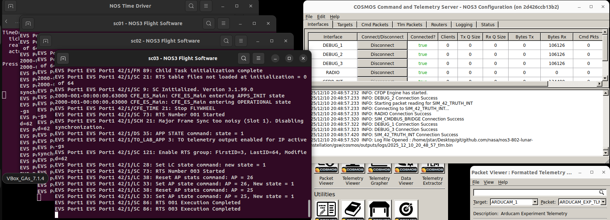
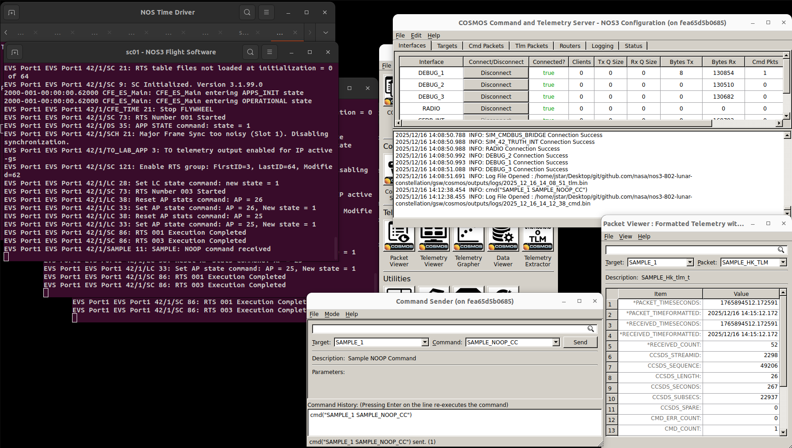
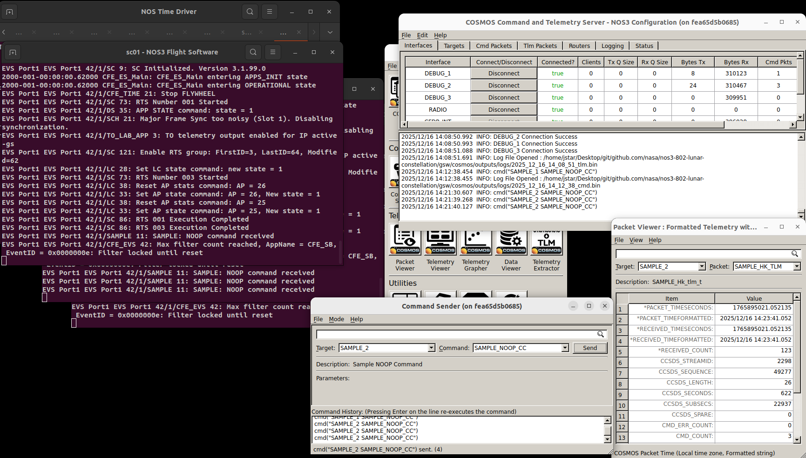
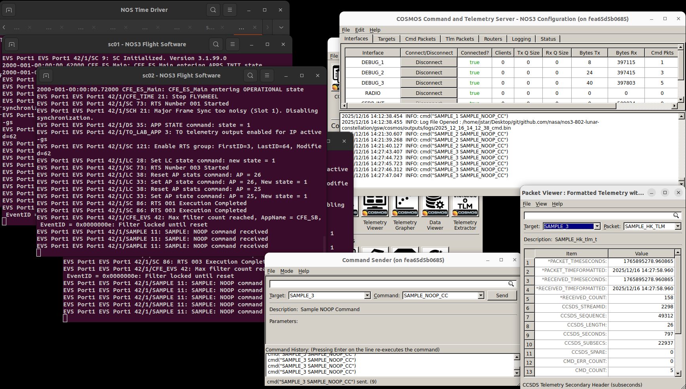
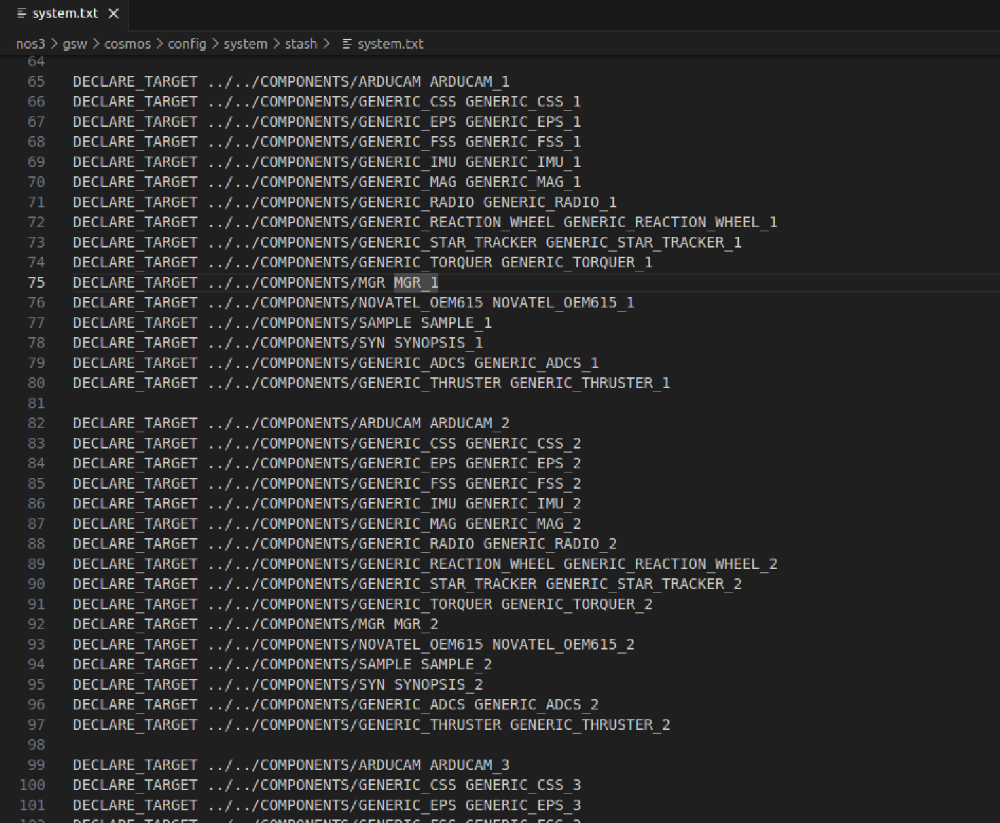
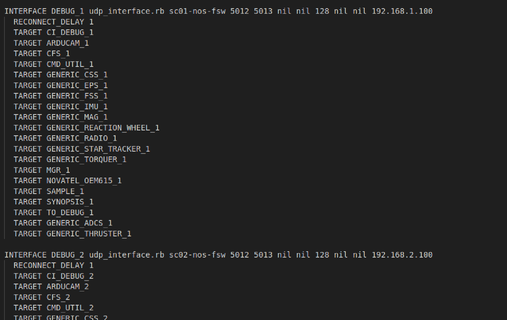

# 시나리오 - 달(Lunar) 궤도 위성군(Constellation) 구성

이 시나리오는 여러 대의 위성이 하나의 군집(Constellation)을 이루어 동작하는 구성으로 NOS3를 실행하는 방법을 보여주기 위해 만들어졌습니다.
이번 시나리오에서는 이 위성들이 지구-달 L2 지점(Earth-Moon L2 point) 주변 궤도를 도는 상황을 다룹니다.

> 💡 **초보자 가이드**: 지구-달 L2 지점은 지구와 달의 중력이 절묘하게 균형을 이루는 우주 공간상의 한 지점입니다. 마치 두 사람이 줄다리기를 하는 줄 위에서 딱 힘의 균형이 맞는 지점에 물체를 올려두면 계속 그 자리 근처에 머무르는 것과 비슷합니다. 이런 지점은 연료를 적게 쓰면서 특정 위치를 유지할 수 있어 심우주 탐사 임무에 자주 활용됩니다.

이 시나리오는 2026년 6월 17일에 마지막으로 업데이트되었으며, 당시 `nos3-multiple-spacecraft` 저장소(https://github.com/nasa-itc/nos3-multiple-spacecraft) 의 `NOS3-Multiple-Spacecraft` 브랜치(커밋 [dae7e75]) 를 기반으로 작성되었습니다.

## 학습 목표
이 시나리오를 마치면 다음을 할 수 있게 됩니다:
* 하나의 지상국에서 여러 대의 위성을 동시에 명령(Command)하기
* 하나의 지상국에서 여러 대의 위성으로부터 텔레메트리(Telemetry, 원격 측정 데이터) 수신하기

## 사전 준비 사항
시나리오를 실행하기 전에 다음 단계를 완료하세요:

* [시작하기](./NOS3_Getting_Started.md)
  * [설치](./NOS3_Getting_Started.md#installation)
  * [실행](./NOS3_Getting_Started.md#running)

## 실습 과정
이 시나리오를 위해서는 `nos3-multiple-spacecraft` 저장소(https://github.com/nasa-itc/nos3-multiple-spacecraft) 에서 `NOS3-Multiple-Spacecraft` 브랜치로 전환해야 합니다.
이번 시나리오만의 특징으로, `make uninstall`을 먼저 실행한 뒤 `make prep`을 실행해야 합니다.
그 다음에는 평소처럼 `make`와 `make launch`를 실행하면 됩니다.
실행하면 `sc0N - NOS3 Flight Software`라는 제목의 세 개의 비행 소프트웨어(Flight Software) 창이 열리는 것을 확인할 수 있습니다. 여기서 `N`은 1, 2, 3 중 하나입니다.

> 💡 **초보자 가이드**: "Flight Software(비행 소프트웨어, 줄여서 FSW)"란 실제로 위성 안에 탑재되어 위성을 제어하는 소프트웨어를 말합니다. NOS3에서는 이 소프트웨어를 컴퓨터 안에서 가상으로 똑같이 돌려볼 수 있게 해줍니다.

마찬가지로 COSMOS를 실행하면 명령/텔레메트리 서버(Command and Telemetry Server)에 세 개의 텔레메트리 디버그 인터페이스(`DEBUG_1`, `DEBUG_2`, `DEBUG_3`)가 표시됩니다.
아래 그림에서 이를 확인할 수 있습니다.

 

COSMOS 명령/텔레메트리 서버 창의 `Bytes Rx` 열을 확인하면 텔레메트리가 정상적으로 수신되고 있는지 검증할 수 있습니다.

다음으로, 세 개의 비행 소프트웨어 인스턴스(instance) 각각에 명령을 보낼 수 있음을 보여드리겠습니다.
Packet Viewer(패킷 뷰어)에서 타겟(target) `SAMPLE_1`과 패킷 `SAMPLE_HK_TLM`을 선택하세요.
현재 명령 카운트 `CMD_COUNT`는 0이어야 합니다.
이제 Command Sender(명령 전송기) 창에서 타겟 `SAMPLE_1`과 명령 `SAMPLE_NOOP_CC`를 선택하세요.

> 💡 **초보자 가이드**: `NOOP`(No Operation, "아무 동작도 하지 않음")은 특별한 작업을 수행하진 않지만, 명령이 정상적으로 도착하고 처리되는지 확인하는 용도로 자주 사용되는 명령입니다. 마치 전화 통화 중에 "여보세요, 들리나요?"라고 확인차 묻는 것과 비슷합니다.

Command Sender 창에서 `Send`(전송) 버튼을 클릭하세요.
그러면 `sc01 - NOS3 Flight Software` 창에서 `SAMPLE: NOOP command received`라는 메시지가 표시되고, Packet Viewer의 `CMD_COUNT`가 1로 증가하는 것을 확인할 수 있습니다.
아래에서 이를 확인할 수 있습니다:

이제 위성 2에 대해서도 동일한 명령과 텔레메트리를 확인해 보세요.
타겟을 `SAMPLE_2`로 하여 `SAMPLE_NOOP_CC` 명령을 보내고, `sc02 - NOS3 Flight Software` 창과 타겟/패킷을 `SAMPLE_2`/`SAMPLE_HK_TLM`으로 설정한 Packet Viewer를 확인하세요.
명령을 세 번 보내고, 비행 소프트웨어가 세 번 모두 수신했는지, `CMD_COUNT`가 3으로 증가했는지 확인하세요.
아래에서 이를 확인할 수 있습니다:

마지막으로, 위성 3에 대해서도 같은 방식으로 확인해 보세요.
명령을 5번 보내고, 5번 모두 수신되었는지, `CMD_COUNT`가 5로 증가했는지 확인하세요.
아래에서 이를 확인할 수 있습니다:

참고로 이 기능은 현재 위에서 언급한 브랜치에서만 지원되지만, NOS3 팀은 향후 릴리스에 다중 위성 지원 기능을 포함시킬 계획입니다.

## 배경 지식

기본적인(단일 위성) NOS3 시나리오를 달을 중심으로 한 위성군 시나리오로 바꾸기 위해서는 여러 파일을 수정해야 합니다.

이 파일들은 다섯 가지 범주로 나뉩니다: 최상위 설정(Top Level Configuration), 42 설정, 시뮬레이션 설정, 비행 소프트웨어 설정, 지상 소프트웨어 설정입니다.

> 💡 **초보자 가이드**: 여기서 "42"는 NASA에서 개발한 위성 자세/궤도 동역학 시뮬레이터의 이름입니다(숫자 42는 소설 『은하수를 여행하는 히치하이커를 위한 안내서』에서 따온 이름입니다). 즉, 위성이 실제로 우주 공간에서 어떻게 움직이고 회전하는지를 물리적으로 계산해주는 프로그램이라고 생각하면 됩니다.

여기서 언급하는 모든 파일은 github의 `https://github.com/nasa-itc/nos3-multiple-spacecraft` 저장소에 있는 `NOS3-Multiple-Spacecraft` 브랜치에 이미 올바르게 수정되어 있습니다.
아래는 이 시나리오를 위해 수정하거나 추가해야 하는 파일들에 대한 설명입니다.

### 최상위 설정 (Top Level Configuration)
수정해야 하는 최상위 설정 파일은 `cfg/nos3-mission.xml`입니다.
다음과 같은 변경이 필요합니다:
  * 먼저 `<scenario>`를 "STF1"에서 "Gateway"로 변경합니다.
      * 이렇게 하면 42를 위한 설정 파일로 `cfg/InOut/Inp_Sim.txt` 대신 `cfg/InOut/Inp_Sim_Gateway.txt`가, `cfg/InOut/Inp_Graphics.txt` 대신 `cfg/InOut/Inp_Graphics_Gateway.txt`가 사용됩니다.
  * 다음으로 `<number-spacecraft>`를 "1"에서 "3"으로 변경합니다.
  * 마지막으로, `<sc-1-cfg>`와 같은 위성 설정 타겟을 추가하고, `<sc-2-cfg>`와 `<sc-3-cfg>`를 값 "spacecraft/sc-mission-config.xml"로 추가합니다.

### 42 설정
여기서 첫 번째로 필요한 변경은 `cfg/InOut/Inp_Sim.txt`를 업데이트하는 것입니다. `cfg/InOut/Inp_Sim.txt`를 백업한 후 다음과 같이 변경하세요:
  * 11번째 줄을 "Orb_NRHO.txt"로 변경하여, 위성이 평소의 지구 중심 궤도 대신 달의 근직선 헤일로 궤도(Near Rectilinear Halo Orbit, NRHO)를 사용하도록 합니다.
      * `cfg/InOut/Orb_NRHO.txt` 파일은 NOS3에 이미 포함되어 있으며 달 NRHO 궤도를 지정합니다.

> 💡 **초보자 가이드**: NRHO(근직선 헤일로 궤도)는 달 주위를 도는 특수한 궤도 형태로, 실제로 NASA의 Gateway 우주정거장이 사용할 예정인 궤도입니다. 일반적인 원형 궤도와 달리 길쭉한 타원 모양을 그리며, 연료 소모를 최소화하면서도 달과 지구 모두와 오랫동안 통신할 수 있는 장점이 있습니다.

  * 13번째 줄을 "1"에서 "3"으로 변경하고, 14, 15, 16번째 줄은 각각 "SC_Gateway.txt", "SC_Gateway2.txt", "SC_Gateway3.txt"가 되도록 합니다.
      * `cfg/InOut/SC_Gateway.txt`, `cfg/InOut/SC_Gateway2.txt`, `cfg/InOut/SC_Gateway3.txt` 파일은 NOS3에 이미 포함되어 있으며, 각각 특정한 궤도 오프셋과 서로 다른 위성 모델을 담고 있습니다.
  * 이 파일들은 또한 위성 본체(body)나 각종 센서/구동기(actuator)의 파라미터를 변경할 수 있는 위치이기도 합니다.

다음으로, `cfg/InOut/Inp_Graphics.txt`를 업데이트해야 합니다.
이 파일을 백업한 후 다음 변경을 진행하세요:
  * 여기서 주로 변경할 부분은 16번째 줄로, 수정된 위성 모델에 맞는 적절한 시점(POV) 범위를 지정하는 것입니다.

마지막으로 `cfg/InOut/Inp_IPC.txt` 파일을 변경해야 합니다.
위성 2와 3의 시뮬레이터에 대한 IPC(프로세스 간 통신) 연결을 추가해야 합니다.
이를 위해서는 센서/구동기 IPC 파라미터 15개 블록을 위성 2와 3용으로 복제한 뒤, 적절한 위성 접두사를 "SC[0]"에서 "SC[1]" 또는 "SC[2]"로 변경해야 합니다.
또한, 서버 포트가 서로 겹치지 않고 시뮬레이션 설정 파일(`sc-1-nos3-simulator.xml`, `sc-2-nos3-simulator.xml`, `sc-3-nos3-simulator.xml`)에 지정된 포트 번호와 일치하도록 변경해야 합니다.
편의를 위해 이러한 변경이 이미 반영된 `Inp_IPC_MultipleSC.txt` 파일이 제공됩니다.
이 파일을 `Inp_IPC.txt`로 복사해서 사용하기만 하면 됩니다.

### 시뮬레이션 설정
각 위성마다 하나의 `.xml` 파일이 필요합니다.
따라서 이 시나리오를 위해서는 `cfg/sims/sc-1-nos3-simulator.xml`, `cfg/sims/sc-2-nos3-simulator.xml`, `cfg/sims/sc-3-nos3-simulator.xml`을 `cfg/sims/nos3-simulator.xml`을 기반으로 생성해야 합니다:
  * `cfg/sims/sc-1-nos3-simulator.xml`은 `cfg/sims/nos3-simulator.xml`의 정확한 복사본이어야 합니다.
  * `cfg/sims/sc-2-nos3-simulator.xml`은 `cfg/sims/nos3-simulator.xml`의 복사본이되, 시뮬레이터 데이터 제공자(provider) 포트가 42 설정 파일 `Inp_IPC.txt`에 지정된 포트 번호와 겹치지 않고 일치하도록 변경되어야 합니다.
  * `cfg/sims/sc-3-nos3-simulator.xml` 역시 `cfg/sims/nos3-simulator.xml`의 복사본이되, 마찬가지로 시뮬레이터 데이터 제공자 포트를 고유하게 변경해야 합니다.
편의를 위해 이미 적절히 변경된 `sc-1-nos3-simulator.xml`, `sc-2-nos3-simulator.xml`, `sc-3-nos3-simulator.xml` 파일이 제공됩니다.

### 비행 소프트웨어 설정
각 위성을 실행 중인 비행 소프트웨어 도커(Docker) 컨테이너로 구성하기 위해 `fsw_cfs_launch.sh` 스크립트를 수정해야 합니다.
참고: 각 컨테이너는 동일한 방식으로 구성되며, NOS3에서 동일한 cFS 비행 소프트웨어 구성을 실행합니다.

단일 위성 모드로 다시 돌아가고 싶다면, 원본 `fsw_cfs_launch.sh` 스크립트를 여러분의 환경에 잘 백업해 두세요.
편의를 위해 이미 적절한 변경이 반영된 `fsw_cfs_launch_multiple_sc.sh` 파일이 제공됩니다.
다중 위성 파일을 사용하려면 `fsw_cfs_launch_multiple_sc.sh`를 `fsw_cfs_launch.sh`로 복사하기만 하면 됩니다.

### 지상 소프트웨어 설정
다음으로, 각 위성에 필요한 타겟(target)을 포함하도록 Cosmos를 수정해야 합니다.

먼저 `nos3/gsw/cosmos/config/system/stash`에 있는 `system.txt` 파일을 수정해야 합니다.
해당 파일에 이미 있는 타겟을 복제하여 필요한 타겟을 추가하세요.
**Component** 타겟을 3번 복제하고, 각 위성에 맞게 이름을 다시 지정하면 됩니다.
예를 들면:

세 대의 위성에 대해 모든 타겟을 복제했다면, 이제 이를 cosmos의 cmd_tlm_server에 추가합니다.

다음으로 `/nos3/gsw/cosmos/config/tools/cmd_tlm_server/stash` 경로에 있는 `cmd_tlm_server.txt`를 수정합니다.
디버그 인터페이스 1, 2, 3에 대해 기존 타겟 정의를 3번 복제해야 합니다.
각 인터페이스에 알맞은 위성 비행 소프트웨어 컨테이너의 호스트 이름을 지정하고, 앞서 수정한 CFS Launch 스크립트에 정의된 올바른 IP 주소로 바인딩(bind)해야 함에 유의하세요.
이렇게 하는 이유는 Cosmos가 3개의 서로 다른 컨테이너로부터 동시에 포트 5013번으로 들어오는 비행 소프트웨어 명령과 텔레메트리를 처리할 수 있도록 하기 위함입니다.

