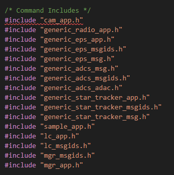
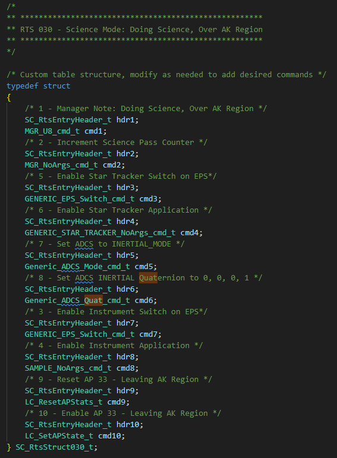
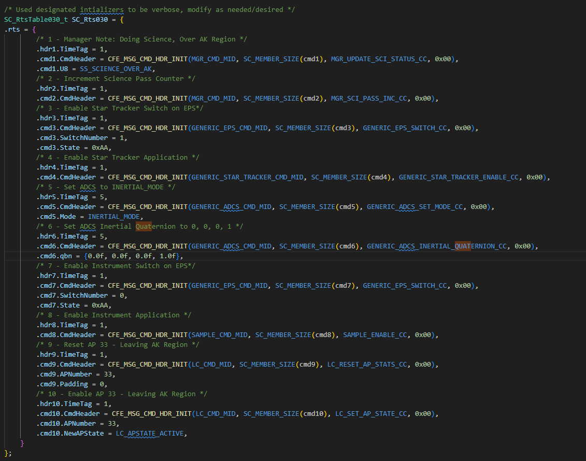
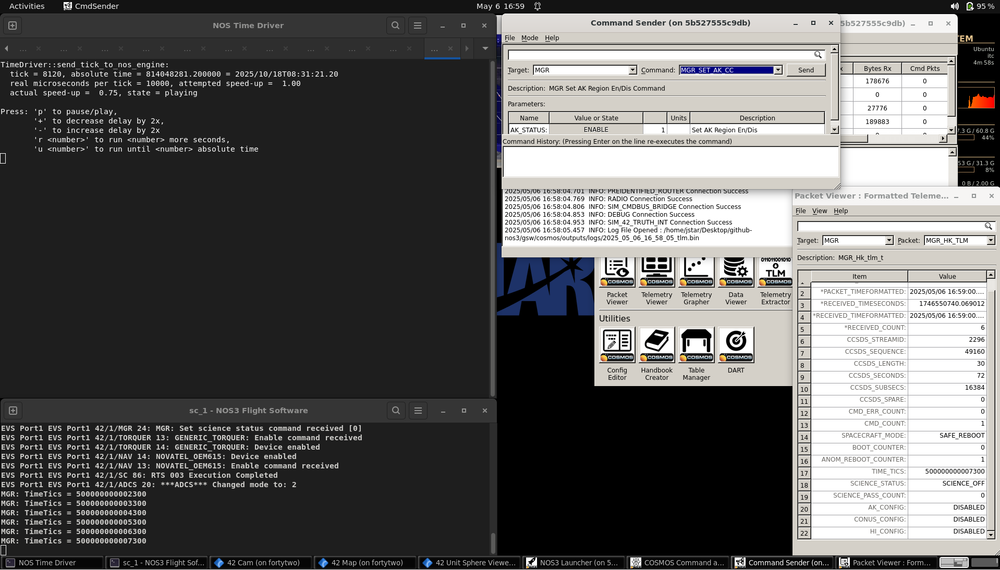
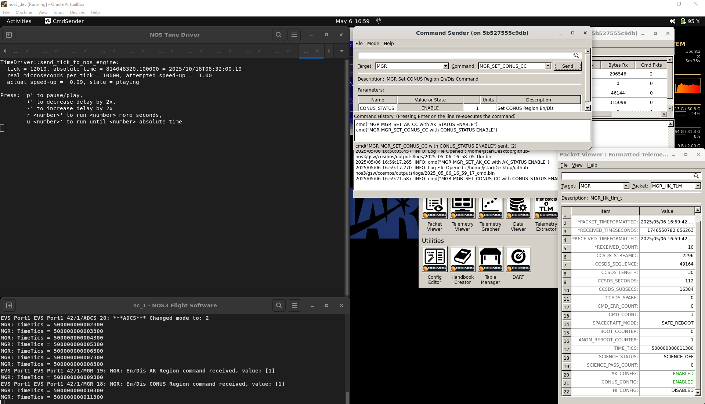
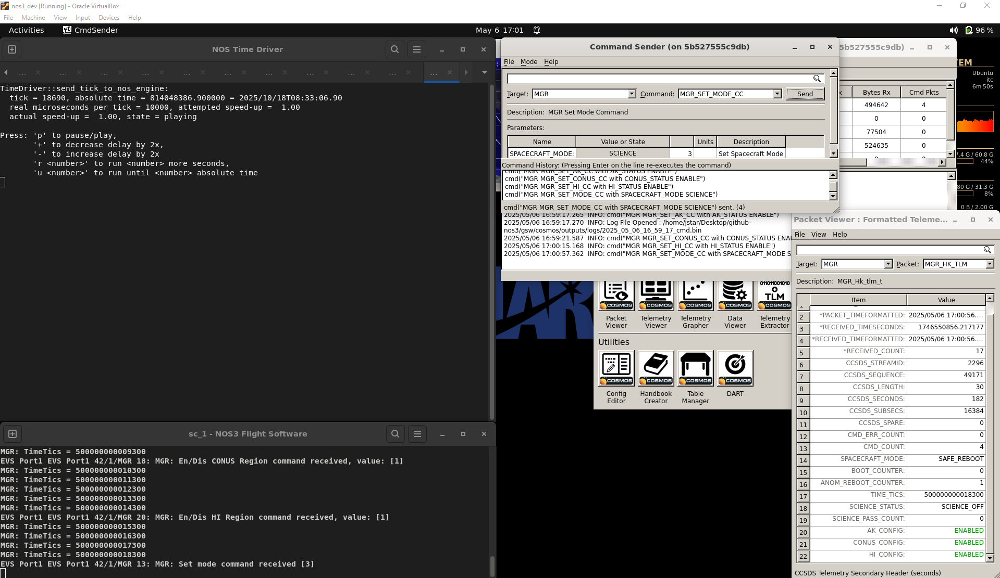
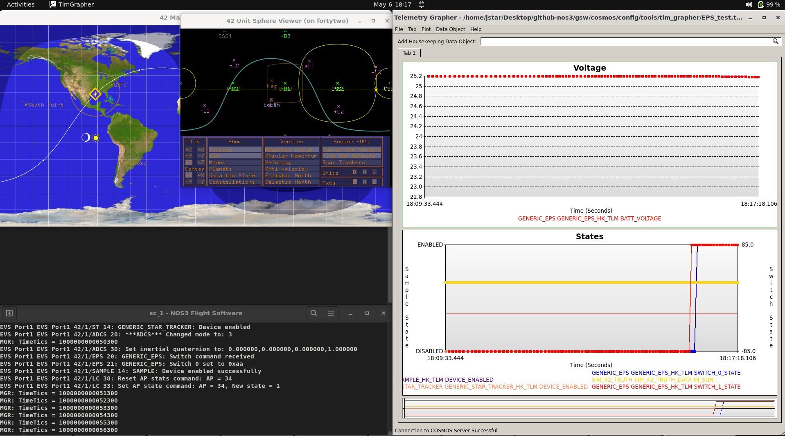
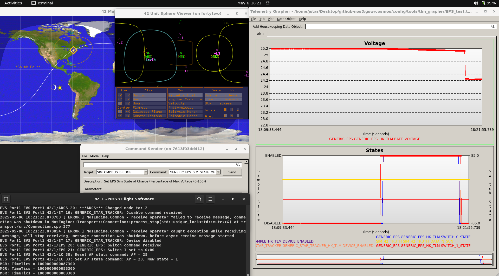
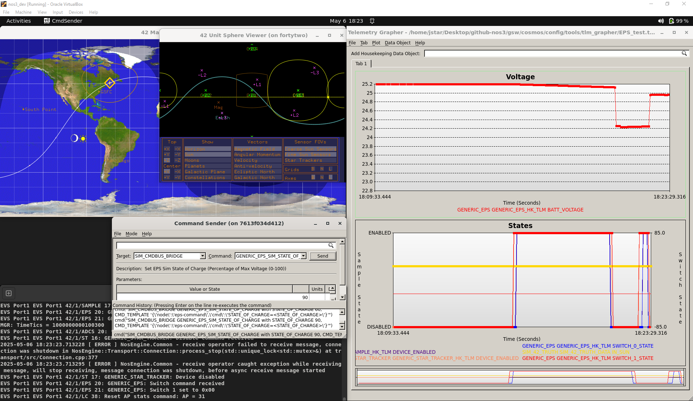

# 시나리오 - 과학 관측 모드에서 ADCS 명령하기

이 시나리오는 변화하는 과학 목표에 맞춰 기존 임무를 어떻게 조정하는지 보여주기 위해 만들어졌습니다. 구체적인 예시로, Science Mode(과학 관측 모드) 중에 다른 지향(pointing) 방식을 요청받는 상황을 다룹니다.

> 💡 **초보자 가이드**: ADCS(Attitude Determination and Control System, 자세결정 및 제어 시스템)는 위성이 우주 공간에서 "어느 방향을 바라보고 있는지"를 파악하고, 원하는 방향으로 자세를 조정하는 시스템입니다. 사람이 몸의 방향을 바꾸려고 팔다리를 움직이는 것처럼, 위성은 반작용휠이나 자기토커(magnetorquer) 같은 장치를 이용해 방향을 바꿉니다.

이 시나리오는 2025년 6월 9일에 마지막으로 업데이트되었으며, 당시 `dev` 브랜치(커밋 [a3e7c100])를 기반으로 작성되었습니다.

## 학습 목표
이 시나리오를 마치면 다음을 할 수 있게 됩니다:
* 원하는 동작을 확실히 구현하기 위해 변경 작업 전에 효과적으로 계획하는 방법을 이해하기:
  * 의도한 동작을 커버하기 위해 해야 할 모든 것을 파악하기.
  * 이후에 상태가 알려진(known) 상태로 잘 복원되도록 보장하기.
* 새로운 파라미터에 맞게 기존 RTS를 수정하는 방법 이해하기.
* NOS3에서 이러한 변경 사항과 관련된 예외 상황(edge case)을 테스트하는 방법 이해하기.

> 💡 **초보자 가이드**: RTS(Relative Time Sequence, 상대 시간 시퀀스)는 위성에게 "이 명령을 먼저 하고, 몇 초 뒤에 이 명령을, 또 몇 초 뒤에 이 명령을..." 하는 식으로 여러 명령을 미리 정해둔 시간 간격에 따라 자동으로 실행시키는 일종의 "매크로" 또는 "자동화 스크립트"라고 생각하면 됩니다.

## 사전 준비 사항
시나리오를 실행하기 전에 다음 단계를 완료하세요:

* [시작하기](./NOS3_Getting_Started.md)
  * [설치](./NOS3_Getting_Started.md#installation)
  * [실행](./NOS3_Getting_Started.md#running)

시작하기 전에 아래 내용도 함께 살펴보시길 권장합니다:
- [STF - 빠르게 훑어보기](./STF_QuickLook.md)
* [시나리오 - ADCS 실습](./Scenario_ADCS_Walkthrough.md)
* [시나리오 - 과학 관측 모드 중 장치 결함](./Scenario_Fault_Science.md)

## 실습 과정

정기 임무 운영 중, 과학팀(Science Team)은 기존에 구현된 태양 지향각(sunpoint angle)이 과학 데이터 수집을 위한 최적의 회전 자세가 아니라는 것을 발견했습니다. 이에 따라 과학팀은 운영팀(Operations Team)에게 과학 데이터를 수집하는 동안 위성이 회전 사원수(quaternion) `[0, 0, 0, 1]` 방향을 향하도록 요청합니다.

> 💡 **초보자 가이드**: "사원수(Quaternion)"는 3차원 공간에서 물체의 회전/방향을 표현하는 수학적 방법입니다. 오일러각(roll, pitch, yaw)과 비슷한 역할을 하지만, 계산상 짐벌락(gimbal lock) 같은 문제가 없어 항공우주 분야에서 널리 쓰입니다. 여기서는 "특정한 방향으로 위성을 고정해서 바라보게 하라"는 좌표값 정도로 이해하면 충분합니다.

운영팀의 일원인 우리는 새로운 임무 파라미터가 충족되고 새로 생기는 예외 상황들도 모두 처리되도록 기존 RTS 테이블을 수정해야 합니다.

### 1단계 - 계획 수립
임무 동작을 변경하기 전에, 정확히 무엇을 해야 하는지, 어떻게 해야 하는지, 어디를 변경해야 하는지, 그리고 이 조정으로 인해 새롭게 발생할 수 있는 예외 상황을 반드시 고려해야 합니다.

#### A부: 범위 결정하기
Science Mode는 특정 LC 감시점(watch point)을 통과할 때 트리거되는 RTS 테이블에 의해 제어됩니다. 우리는 Science Mode가 트리거되는 시점이나 방식이 아니라 Science Mode _동안_의 동작만 변경하는 것이므로, 관련된 LC 감시점이 아니라 Science Mode 동작을 관리하는 RTS 테이블만 수정하면 됩니다.

#### B부: 동작을 위한 수정 사항 결정하기
범위를 정했으니, 이제 기본 설정과 다른 관성 지향(inertial pointing)을 위해 무엇이 필요한지 생각해 봅시다:
* 관성 지향은 위성의 스타 트래커(Star Tracker, 별 추적기)로부터 얻은 데이터를 이용해 현재의 사원수 값을 결정합니다.
* 이를 통해 ADCS가 지정된 사원수 방향으로 위성 자세를 조정할 수 있습니다.

> 💡 **초보자 가이드**: 스타 트래커(Star Tracker)는 하늘의 별들을 카메라로 촬영하고, 그 별자리 패턴을 미리 저장된 별 지도와 비교하여 "지금 위성이 정확히 어느 방향을 보고 있는지"를 매우 정밀하게 알아내는 센서입니다. 마치 밤하늘의 별자리를 보고 자신이 어느 방향을 보고 있는지 아는 것과 비슷합니다.

빠르게 훑어보기(Quick Look) 문서를 참고하면, EPS 스위치 1(EPS Switch 1)이 스타 트래커에 연결되어 있으며, 이 스위치와 스타 트래커 앱은 기본적으로 꺼져 있음을 알 수 있습니다.
따라서 다음이 필요함을 알 수 있습니다:
* 스위치 1을 `0xAA`(즉 `170`)으로 설정하여 스타 트래커와 연결된 EPS 스위치를 켭니다.
* 스타 트래커 앱을 활성화합니다.
* ADCS 모드를 Inertial(관성)로 설정하고, ADCS의 지향용 관성 사원수를 `[0, 0, 0, 1]`로 설정합니다.

#### C부: 예외 상황 고려하기
마지막으로, Science Mode 동안 그 동작을 달성하기 위해 무엇이 필요한지 결정했으니, 이제 이러한 변경으로 인해 생기거나 생길 수 있는 새로운 문제와 예외 상황을 고려해야 합니다:
* Sample(샘플) 및 그 스위치와 마찬가지로, Science Mode를 벗어날 때 스타 트래커의 앱과 스위치도 비활성화되어야 합니다:
  * 그렇지 않으면 전력을 낭비하고, 위성 충전이 불가능해지거나 최소한 비효율적인 충전이 될 수 있습니다.
* Science Mode를 벗어나면 ADCS 모드는 Sunsafe(태양 안전 모드)로 복원되어야 합니다:
  * 이렇게 하면 과학 관측을 하지 않을 때 충전 각도가 최적화됩니다.
  * 또한 (결함, 지상 명령, 혹은 단순히 지리적 이유 등) 어떤 이유로든 활성 Science Mode를 벗어날 경우 항상 안전하다고 알려진 상태에 있게 됩니다.
이는 곧 활성 Science Mode를 벗어나거나 Science Passive Mode로 돌아갈 때와 관련된 모든 RTS 테이블도 수정해야 함을 의미합니다.

이렇게 신중히 계획한 뒤, 이제 변경 사항을 구현할 준비가 되었습니다.

### 2단계: 구현
어떤 RTS 테이블을 수정해야 하는지 확인하려면, Quick Look 문서를 참고하거나 코드 자체를 확인하면 됩니다(Sample Switch/App Toggle 등 관련 명령을 검색). 다음과 같이 확인됩니다:
* RTS 테이블 30, 31, 32는 Active Science Mode(활성 과학 모드)로 진입하는 경우입니다.
* RTS 테이블 27, 29, 33, 34, 35는 Active Science Mode를 벗어나는 경우입니다.

앞의 그룹과 뒤의 그룹은 각각 고유한 변경 사항 세트를 가지게 되며, 수정하는 테이블에 따라 RTS 번호가 달라질 수 있습니다.

#### A부: Inertial Mode 활성화 및 설정하기
계획에서 논의했듯이, 이 과정에는 4개의 추가 명령이 필요합니다:
* EPS 스위치 1 활성화.
* 스타 트래커 cFS 애플리케이션 활성화.
* ADCS 모드를 `INERTIAL_MODE`로 설정.
* ADCS 관성 사원수를 `[0, 0, 0, 1]`로 설정.
  * _참고: 이를 위해 사원수 명령의 ADCS 명령 구조를 원래 사용하던(그리고 ADCS의 다른 부분에서는 여전히 사용 중인) `double` 대신 `float`으로 바꿔야 했습니다. 이는 현재 `double`이 cFS 테이블과 호환되지 않기 때문입니다. 다만 이는 향후 변경될 수도 있습니다._

이를 달성하려면 각 RTS 테이블의 세 부분을 변경해야 합니다:
* 파일의 `#include` 섹션에 스타 트래커와 ADCS에 필요한 헤더를 추가해야 합니다. 아래와 같습니다:
  
* 그런 다음, 해당 섹션의 RTS에 추가 명령과 헤더를 넣고, 기존 헤더/명령의 위치를 조정합니다:
  
* 마지막으로, RTS의 실제 실행 섹션에 해당 명령과 헤더의 정의를 추가하고, 기존 명령들의 위치를 조정합니다.
  

변경 사항은 RTS 테이블 30에서만 보여드렸지만, 실제로는 RTS 테이블 30, 31, 32 모두에 적용해야 합니다. 명령 내용은 동일하지만, 그 테이블이 수행하는 다른 작업에 따라 위치는 달라질 수 있습니다(다만 이번 경우 이 세 테이블은 상당히 유사합니다). 각 테이블을 직접 살펴보면서 그 변경이 해당 테이블에서 어떻게 적용되는지 확인해 볼 수 있습니다.

#### B부: Inertial Mode 비활성화 및 Sunsafe로 복원하기
계획에서 논의했듯이, 이 과정에는 3개의 추가 명령이 필요합니다:
* 스타 트래커 cFS 애플리케이션 비활성화
* EPS 스위치 1 비활성화
* ADCS 모드를 `SUNSAFE_MODE`로 설정

이를 달성하려면 각 RTS 테이블의 세 부분을 변경해야 합니다:
* 파일의 `#include` 섹션에 스타 트래커와 ADCS에 필요한 헤더를 추가해야 합니다.
  
* 그런 다음, 해당 섹션의 RTS에 추가 명령과 헤더를 넣고, 기존 헤더/명령의 위치를 조정합니다.
  
* 마지막으로, RTS의 실제 실행 섹션에 해당 명령과 헤더의 정의를 추가하고, 기존 명령들의 위치를 조정합니다.
  

위와 마찬가지로 변경 사항은 RTS 테이블 33에서만 보여드렸지만, 실제로는 테이블 27, 29, 33, 34, 35에 모두 적용해야 합니다. 명령 내용은 동일하지만, 그 테이블이 수행하는 다른 작업에 따라 위치는 달라질 수 있습니다. 각 테이블을 직접 살펴보면서 그 변경이 해당 테이블에서 어떻게 적용되는지 확인해 볼 수 있습니다.

### 3단계: 의도한 동작 검증하기
이제 NOS3를 실행하고, COSMOS를 실행한 뒤, 여러 지역에서 데이터 수집을 활성화하고 Science Mode로 진입하도록 명령하여 동작을 테스트해볼 수 있습니다. 그런 다음:

* Telemetry Grapher(텔레메트리 그래퍼)를 EPS_TEST 프리셋으로 실행하세요.
* 스타 트래커의 Enabled(활성화) 값과 EPS 스위치 1 상태를 하단 테이블에 추가하세요:
  * 스타 트래커의 Enabled 값은 왼쪽 축에 두어야 합니다.
  * EPS 스위치 1 상태는 오른쪽 축에 -85.0만큼 이동(shift)하여 두어야 합니다:
    * 스타 트래커 Enabled는 Sample Enabled 설정과 비슷하게, EPS 스위치 1은 EPS 스위치 0의 설정과 비슷하게 구성해야 합니다.

위성이 Science Active(과학 활성) 상태로 진입하면 다음을 확인하세요:
* 4개의 변수가 모두 낮은(비활성) 상태에서 높은(활성) 상태로 바뀌었는지.
* 위성이 CONUS(미국 본토)를 벗어나거나, (수동 등으로) Science Passive Mode로 전환되거나, 충전 상태가 60% 아래로 떨어지면(Sim Bridge 명령으로 유발 가능) 관련 RTS가 실행을 마친 뒤 스위치들이 비활성 상태로 돌아가는 것을 확인하세요.

### 결론
여기까지 오셨다면, 새로운 요구사항에 맞춰 임무를 변경하는 사고 과정과 이를 위해 RTS 테이블을 조정하는 방법에 익숙해지셨을 것입니다. 앞으로 이어질 시나리오들에서는 이를 바탕으로 실제 비행 중에 발생할 수 있는 더 복잡한 시나리오들을 다루어 보겠습니다.

