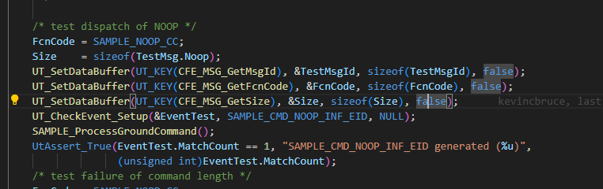
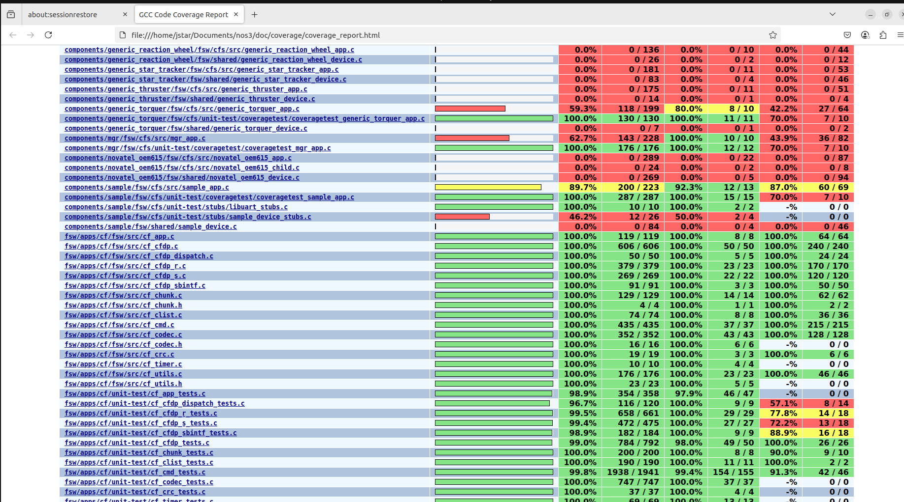

# 시나리오 - 단위 테스트(Unit Test) 작성

이 시나리오는 NOS3 내의 특정 컴포넌트에 대한 단위 테스트 프레임워크를 만드는 방법을 보여주기 위해 만들어졌습니다.

> 💡 **초보자 가이드**: 단위 테스트(Unit Test)란 프로그램의 아주 작은 한 부분(함수 하나, 기능 하나)이 의도한 대로 정확히 동작하는지 자동으로 확인하는 코드입니다. 마치 자동차를 완성하기 전에 나사 하나, 부품 하나씩 미리 검사해보는 것과 같습니다.

이 시나리오는 2025년 6월 10일에 마지막으로 업데이트되었으며, 당시 `dev` 브랜치(커밋 [b87b2f92])를 기반으로 작성되었습니다.

## 학습 목표

이 시나리오를 마치면 다음을 할 수 있게 됩니다:
* NOS3 위성 컴포넌트와 그 명령들의 기능을 확인하는 단위 테스트 작성하기.
* 완전히 새로운 컴포넌트에 대한 단위 테스트를 만들거나 기존 테스트 스위트에 추가하기.
* 컴포넌트 내 관련된 모든 파일에 대해 완전한 커버리지(coverage) 달성하기.

## 사전 준비 사항
시나리오를 실행하기 전에 다음 단계를 완료하세요:
* [시작하기](./NOS3_Getting_Started.md)
  * [설치](./NOS3_Getting_Started.md#installation)
  * [실행](./NOS3_Getting_Started.md#running)

`make code-coverage` 명령은 NOS3가 Linux 환경에 직접 클론(clone)되어 있는 경우에만 실행할 수 있습니다.
호스트에서 VirtualBox로 공유 폴더를 사용하는 경우(설치 옵션 A)에는 이 명령이 동작하지 않습니다.

## 실습 과정

### 파일 구조 살펴보기
NOS3 저장소의 최상위 경로로 이동한 터미널에서:
* `cd /nos3/components/sample/fsw/cfs/unit-test`
* 컴포넌트의 cfs 디렉토리 안에 unit-test 디렉토리가 없다면, sample에서 복사하거나 샘플 스크립트로 생성하세요.
* 작업 중인 unit-test 폴더가 fsw/cfs/ 디렉토리 내에 있는지 확인하세요.

unit-test 폴더에 들어갔다면:
* `ls` 명령을 실행하세요.
* 출력으로 `CMakeLists.txt  coveragetest/  inc/  stubs/`가 보여야 합니다. 파일이 빠져 있다면 sample 컴포넌트에서 복사하거나 샘플 스크립트로 생성하세요.
* `CMakeLists.txt` 파일을 여세요.
* 이름이 여러분이 작업 중인 컴포넌트와 일치하는지 확인하세요. 일치하지 않으면 맞게 변경한 뒤 파일을 닫으세요.
* `coveragetest/`로 이동해서 다시 `ls`를 실행하세요. 이 디렉토리 안에 `coveragetest_sample_app.c`와 `sample_app_coveragetest_common.h` 두 파일이 보여야 합니다. `coveragetest_sample_app.c`가 바로 여러분이 단위 테스트를 작성할 파일입니다.
* `coveragetest`에서 나오려면 `cd ..`, 그리고 `cd inc`로 들어가 `ut_sample_app.h`를 여세요. 여기에 포함(include)된 파일 이름들이 여러분이 작업하려는 컴포넌트와 일치하는지 확인하세요.
* 마지막으로 `cd ..`, `cd stubs`, `ls`를 실행하세요. `libuart_stubs.c`와 `sample_device_stubs.c`가 보여야 합니다.
* 두 파일 모두 여러분이 작업 중인 컴포넌트 이름과 일치하는지 다시 확인하세요.
* `cd ..` 후 `cd coveragetest/`로 이동하세요.
* `coveragetest_sample_app.c`를 여세요.

---
### 단위 테스트 작성하기
`coveragetest_sample_app.c` 파일 내부를 살펴보세요. 이 파일이 실제로 단위 테스트를 작성하는 곳입니다.
* coveragetest 파일 안에는 `Test_SAMPLE_AppMain`, `Test_SAMPLE_AppInit`, `Test_SAMPLE_ProcessCommandPacket`, `Test_SAMPLE_ReportHousekeeping` 등 기존 함수들의 배열이 보일 것입니다.
* 이 함수들은 `sample/fsw/cfs/src/sample_device.c` 파일에 있는 비슷한 이름의 함수들과 직접 상호작용하도록 이렇게 나뉘어 있습니다.

---
### NOOP 테스트 예시
다음은 `Test_SAMPLE_ProcessGroundCommand` 함수 안에서 볼 수 있는 구체적인 테스트 예시입니다:

* `FcnCode`는 명령 코드(command code)입니다. 이는 NOS3의 동작 원리를 이해하는 핵심 요소로, 비행 시스템이 어떤 명령이 전송되었는지 알 수 있게 해주며 - 이 경우에는 - 어떤 명령이 테스트되고 있는지를 지정합니다.
* `Size = sizeof(TestMsg.Noop)`는 명령의 길이를 설정하는 방법입니다. 핵심은 인자가 없는 명령들은 모두 같은 크기를 공유한다는 점입니다. 인자를 가진 명령(이 경우 config)은 함수 상단의 union 구조체에서 다른 크기를 지정해야 합니다.
* 다음 세 줄:
  `UT_SetDataBuffer(UT_KEY(CFE_MSG_GetMsgId), &TestMsgId, sizeof(TestMsgId), false);`
  `UT_SetDataBuffer(UT_KEY(CFE_MSG_GetFcnCode), &FcnCode, sizeof(FcnCode), false);`
  `UT_SetDataBuffer(UT_KEY(CFE_MSG_GetSize), &Size, sizeof(Size), false);`
  는 cfs로 전송할 명령 문자열을 지정하며, 이 명령이 `sample_device.c` 파일로 전달되는 방식입니다.
* `SAMPLE_ProcessGroundCommand();`는 명령을 실행합니다.
* `UtAssert_True(EventTest.MatchCount == 1, "SAMPLE_CMD_NOOP_INF_EID generated (``%u)",` 는 결과를 검사합니다.
                  `(unsigned int)EventTest.MatchCount);`

---
### 테스트 빌드/실행 및 커버리지 리포트 생성

`make code-coverage` 명령은 NOS3가 Linux 환경에 직접 클론되어 있는 경우에만 실행할 수 있습니다.
호스트에서 VirtualBox로 공유 폴더를 사용하는 경우(설치 옵션 A)에는 이 명령이 동작하지 않습니다.

* `make clean`
* `make config`
* `make debug`
* `make code-coverage -j`
* `exit`
* `firefox docs/coverage/coverage_report.html`

`coverage_report.html` 파일은 디렉토리 내 모든 파일에 대한 코드 커버리지와 테스트 결과를 보여줍니다.

이 파일을 열면 다음과 같은 모습이어야 합니다:

