# 시나리오 - 데모(Demonstration)

이 시나리오는 NASA Operational Simulator for Space Systems(NOS3)에 대한 전체적인 개요를 제공하기 위해 만들어졌습니다.
이 시나리오는 NOS3 내에서 비행 소프트웨어(FSW), 지상 소프트웨어(GSW), 시뮬레이션 간의 상호작용을 보여줍니다.
또한 다양한 사용 사례를 다루기 위해 앞으로 개발되어 환경에 추가될 다른 시나리오들의 템플릿 역할도 합니다.

이 시나리오는 2025년 8월 29일에 마지막으로 업데이트되었으며, 당시 `dev` 브랜치(커밋 [422f66ec])를 기반으로 작성되었습니다.

## 학습 목표

이 시나리오를 마치면 다음을 할 수 있게 됩니다:
* FSW, GSW, 시뮬레이터를 포함해 NOS3 실행하기.
* COSMOS를 이용해 명령을 보내고 텔레메트리 수신하기.
* 시뮬레이션된 하드웨어 컴포넌트와 상호작용하기.
* FSW, GSW, 시뮬레이터 간의 상호작용이 성공적인지 검증하기.
* NOS3 시나리오의 기본 아키텍처 이해하기.

## 사전 준비 사항

시나리오를 실행하기 전에 다음 단계를 완료하세요:
* [시작하기](./NOS3_Getting_Started.md)
  * [설치](./NOS3_Getting_Started.md#installation)
  * [실행](./NOS3_Getting_Started.md#running)

이 시나리오에는 추가적인 파일 변경이나 특별한 설정이 필요하지 않습니다.

## 실습 과정

NOS3 저장소의 최상위 경로로 이동한 터미널에서:
* `make`

* `make launch`

* 사용하기 편하도록 창들을 정리하세요:

이제 COSMOS 지상 소프트웨어를 시작합니다:
* 나타나는 NOS3 Launcher 창에서 `OK` 버튼을 클릭한 뒤, 왼쪽 상단의 `COSMOS` 버튼을 클릭하세요.
* 이 NOS3 Launcher는 최소화해도 되지만, 닫지는 마세요.

기본적으로 우리는 sun-safe(태양 안전) 모드로 진입합니다. 여러 가지 방식으로 이를 확인할 수 있습니다:
* FSW 콘솔에서:
  * 시작 중에 이벤트가 발생하면서 많은 로그가 출력되므로, 메시지를 보려면 터미널을 위로 스크롤해야 할 수 있습니다.
  * 위성이 안정 상태(steady state)에 도달하면 초기화 이후 콘솔 출력이 잦아듭니다.
  * Mode 2가 sun-safe 모드입니다:
  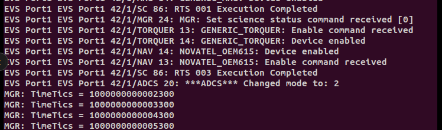
* GSW 텔레메트리에서:
  * COSMOS Packet Viewer를 사용하면 원하는 Target과 Packet을 선택해 보고된 내용을 확인할 수 있습니다.
  * 텍스트가 분홍색으로 표시된다면, 데이터를 아직 수신하지 못했거나 데이터가 오래되어 "stale"(오래된 상태) 상태임을 의미합니다.
  * 텔레메트리 패킷 `GENERIC_ADCS`, 텔레메트리 포인트 `MODE`는 위성이 현재 어떤 모드에 있는지를 나타냅니다:
  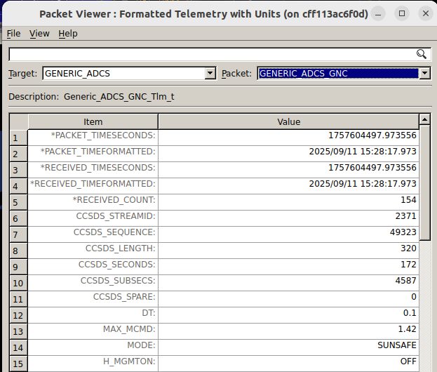
* 42에서 시각적으로:
  * 42 Cam 창 안에서 클릭 후 드래그하면 위성 주변을 회전하며 볼 수 있습니다.
  * 스크린샷에서 볼 수 있듯이, Sunsafe 모드는 위성의 +x축(b1)을 태양 벡터(s)와 정렬시킵니다.
  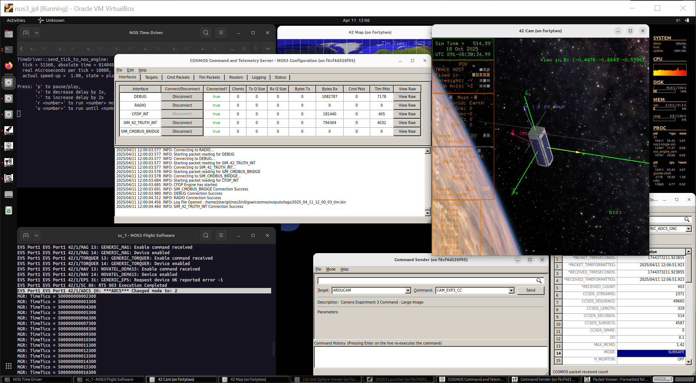

---
### 위성에 명령 보내기

위성에 명령을 보낼 수 있는지 확인해 봅시다:
* CFS `CFE_ES_NOOP` 명령은 FSW 콘솔에 보기 좋은 출력을 남기므로, 이를 통해 쉽게 확인할 수 있습니다.
  * 이를 보려면 FSW 콘솔을 창 하단으로 다시 스크롤해야 할 수 있습니다.
* 또한, 해당 애플리케이션에 속한 명령 카운터가 텔레메트리에서 증가하는지(텔레메트리 패킷 `CFS`, 텔레메트리 포인트 `CMDCOUNTER`) 살펴봄으로써 확인할 수 있습니다:

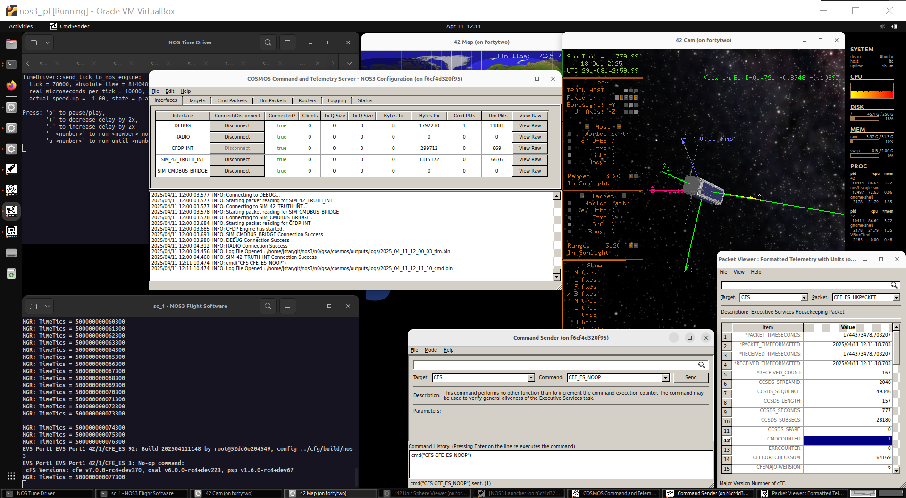

* 방금 보낸 명령은 DEBUG 인터페이스를 통해 전송되었음에 유의하세요:
  * 위 이미지에서 COSMOS Command and Telemetry Server의 `Bytes Tx` 열을 통해 이를 확인할 수 있습니다.
  * 이 DEBUG 인터페이스는 위성에 물리적으로 직접 연결된 것과 같은 상황을 흉내 냅니다. 개발과 테스트에는 유용하지만, 실제 상황과는 다릅니다.

이번엔 무선(radio)이 송신하도록 명령해 봅시다:
* 일반적으로 위성 무선은 항상 명령을 수신 대기하지만, 활성화하지 않으면 송신은 하지 않습니다.
* Command Sender에서 `CFS`의 `TO_ENABLE_OUTPUT` 명령을 사용하도록 변경해봅시다:
  * 기본 인자값인 `DEST_IP` 'radio_sim'과 `DEST_PORT` '5011'을 그대로 사용하면 됩니다.
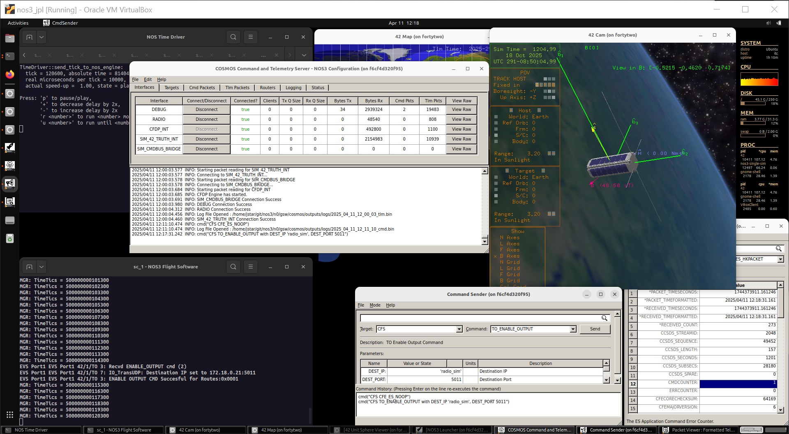

* COSMOS Command and Telemetry Server에서 `Bytes Rx`는 늘어나고 있지만 `Bytes Tx`는 늘어나지 않는다는 점에 유의하세요.
* 이는 표준 CFS 타겟이 디버그 인터페이스를 사용하기 때문입니다.

이번에는 CFS_RADIO 타겟을 이용해 또 다른 NOOP을 보내봅시다:
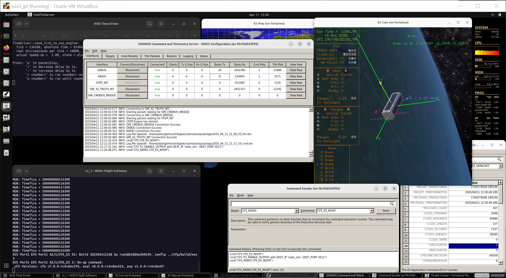

* 이제 COSMOS Command and Telemetry Server에서 예상대로 동작하는 것을 볼 수 있습니다.

디버그 인터페이스와 일치하는 무선(radio) 텔레메트리를 실제로 수신하고 있는지 확인해봅시다:
* COSMOS NOS3 Launcher(세 번째 줄, 첫 번째 칸)를 통해 다른 Packet Viewer 창을 열어 `CFS_RADIO` 패킷으로 이동한 뒤, `CFS`(디버그) 패킷의 값과 비교해보세요.

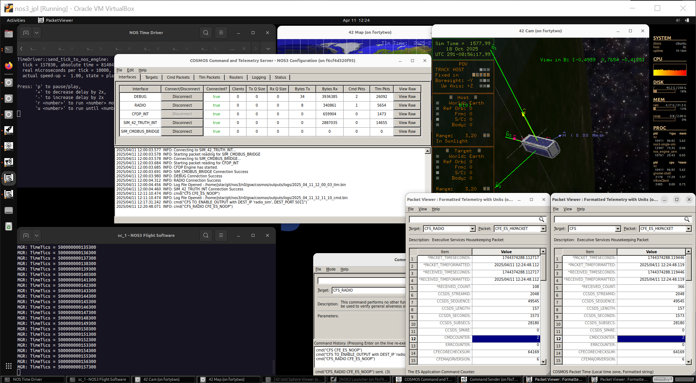

---
### Sample(샘플) 컴포넌트

샘플 계측기(instrument payload)를 명령할 수 있는지 확인해봅시다:
* 이는 표준 NOS3 컴포넌트로, FSW, GSW, 그리고 42 동역학 제공자(dynamics provider)와 대화하는 시뮬레이터가 함께 실행되고 있음을 의미합니다.
* 터미널 창 오른쪽의 드롭다운 화살표를 이용해 터미널 탭을 `sc_1 - Sample Sim`으로 바꾸고 크기를 조정하세요.
* 또한 Packet Viewer를 `SAMPLE`의 `SAMPLE_HK_TLM` 패킷으로 바꾸고, Command Sender로 `SAMPLE`의 `SAMPLE_NOOP_CC`를 보낼 준비를 하세요.

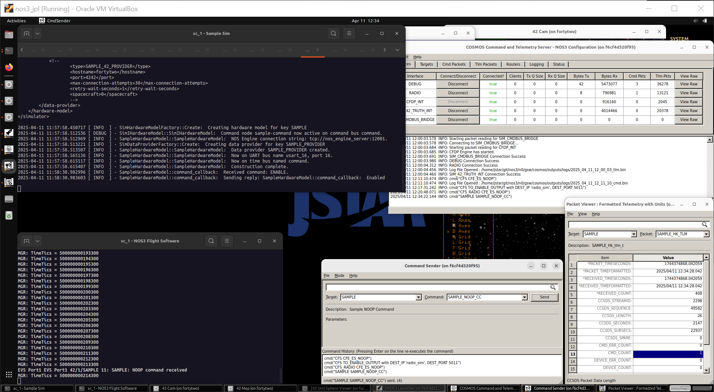

* FSW 콘솔에서, 그리고 `CMD_COUNT` 증가를 관찰함으로써 명령이 성공적으로 전송된 것을 확인할 수 있지만, 시뮬레이터에는 아무것도 나타나지 않습니다:
  * 이는 NOOP, 즉 No Operation(아무 동작도 하지 않음) 명령 자체 때문입니다.
  * NOOP은 cFS 애플리케이션 전반에서 표준적으로 쓰이며, 단순히 해당 애플리케이션이 살아 있고 명령을 수신 대기 중임을 증명할 뿐입니다.
  * 하지만 이 NOOP 명령은 FSW 애플리케이션 이외의 어떤 것과도 상호작용하지 않습니다.
* Sample HK 텔레메트리를 보면 `DEVICE_*`로 시작하는 일련의 텔레메트리 포인트가 있음을 눈치채셨을 겁니다:
  * 이는 애플리케이션이 장치(device) 자체와 통신하는 것과 관련된 값들입니다.

샘플 계측기를 활성화하기 전에는 Packet Viewer의 데이터가 분홍색으로 표시됩니다. 이는 데이터를 아직 수신하지 못했거나 데이터가 오래되어 "stale"(오래된) 상태임을 나타냅니다:

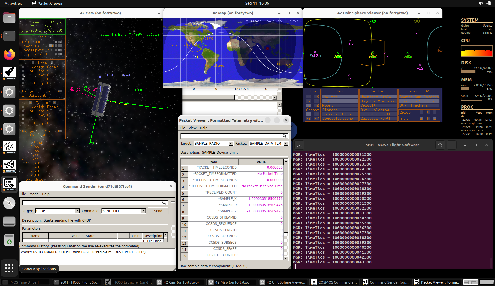

샘플 애플리케이션을 활성화하고 어떻게 되는지 살펴봅시다.

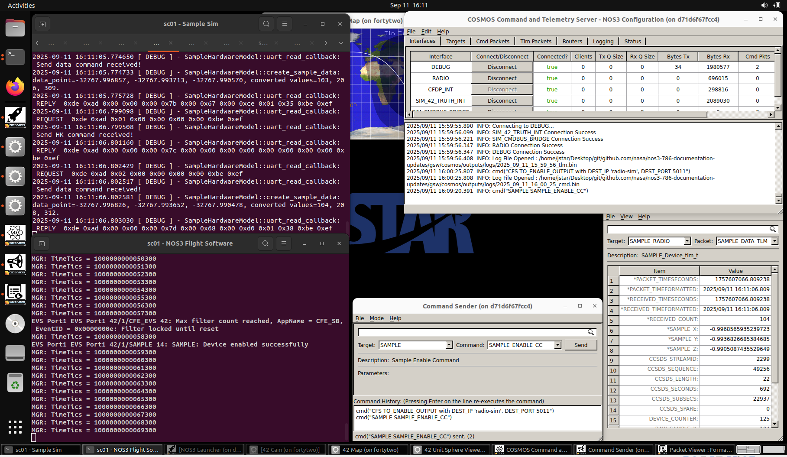

* 이제 샘플 시뮬레이터가 샘플 애플리케이션과 통신하고 있습니다:
  * 샘플 애플리케이션은 정해진 주기로 장치에 데이터를 요청합니다.
* 좋습니다. 그럼 이제 일부러 무언가를 망가뜨려 볼까요?
  * Command Sender에서 SIM_CMD_BUS_BRIDGE 타겟으로 변경하세요.
  * 이 인터페이스를 통해 시뮬레이터를 직접 명령할 수 있어서, 비행 소프트웨어가 어떻게 반응하는지 볼 수 있습니다.

상태값(status)을 5로 설정하는 SAMPLE_SIM_SET_STATUS 명령을 보내봅시다.

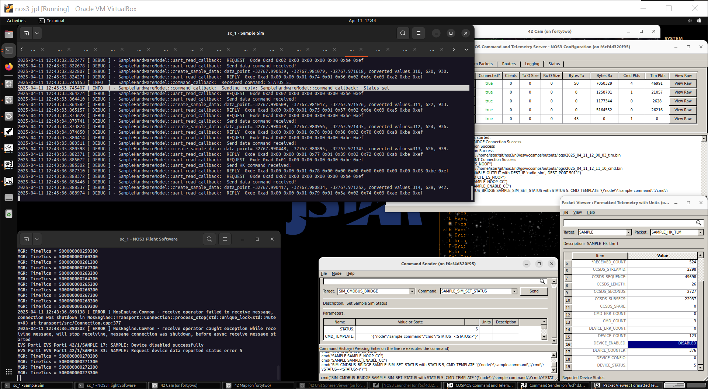

* 샘플 시뮬레이터에게 상태를 5로 바꾸도록 성공적으로 명령했습니다:
  * 샘플 시뮬레이터가 상태 변경 명령을 수신한 것을 확인할 수 있습니다.
  * FSW 콘솔에는 `Device disabled successfully`와 `Request device data reported status error 5`라는 메시지가 표시됩니다.
  * [샘플 컴포넌트 README](https://github.com/nasa-itc/sample/blob/275edcf55cf5b1d7d0c3e0c4978927b5814529a7/README.md)를 살펴보면 그 이유를 알아낼 수 있습니다!

---
### ADCS

샘플은 이 상태로 두고, 이제 자세결정 및 제어 시스템(Attitude Determination and Control System, ADCS)을 다뤄봅시다.
* 간단히 말해, ADCS는 다양한 컴포넌트(일반적으로 센서와 구동기(actuator)라고 부름)를 이용해 위성의 방향이나 궤도를 바꿉니다.
먼저 ADCS가 아무 동작도 하지 않도록 비활성화해서 자유롭게 만져봅시다:
* 만약 여러분이 일식(eclipse) 중이라면 위성이 태양의 위치를 모르기 때문에(추측할 만큼 똑똑하지 않음) 태양을 향할 수 없다는 점에 유의하세요.
* Command Sender에서 `GENERIC_ADCS`의 `GENERIC_ADCS_SET_MODE_CC` 명령을 `GNC_MODE` `PASSIVE`(0)로 보내세요.

* 위성이 더 심하게 흔들리는(tumbling) 것처럼 보이며, 이는 42 Cam에서 확인할 수 있습니다:
  * ADCS가 사용하는 여러 컴포넌트를 자유롭게 다루려면 ADCS를 passive로 명령하는 것이 중요합니다.
  * 그렇지 않으면 ADCS가 1Hz마다 이 컴포넌트들에 텔레메트리를 요청하고 새 명령을 보내면서 우리와 충돌하게 됩니다.

`GENERIC_REACTION_WHEEL`의 `GENERIC_RW_SET_TORQUE_CC` 명령을 이용해 반작용휠(reaction wheel)이 회전하도록 명령하고 어떤 일이 일어나는지 봅시다:

동작하는 것 같습니다!

> 💡 **초보자 가이드**: 반작용휠(Reaction Wheel)은 위성 내부에서 회전하는 바퀴로, 이 바퀴를 빠르게 돌리거나 멈추면 그 반작용으로 위성 본체가 반대 방향으로 회전합니다. 피겨스케이트 선수가 팔을 몸에 붙이면 더 빨리 회전하는 원리와 비슷하게, 각운동량 보존 법칙을 이용한 장치입니다.

이번엔 음(negative)의 토크를 보내서 그 축에서 위성을 안정시킬 수 있는지 봅시다:

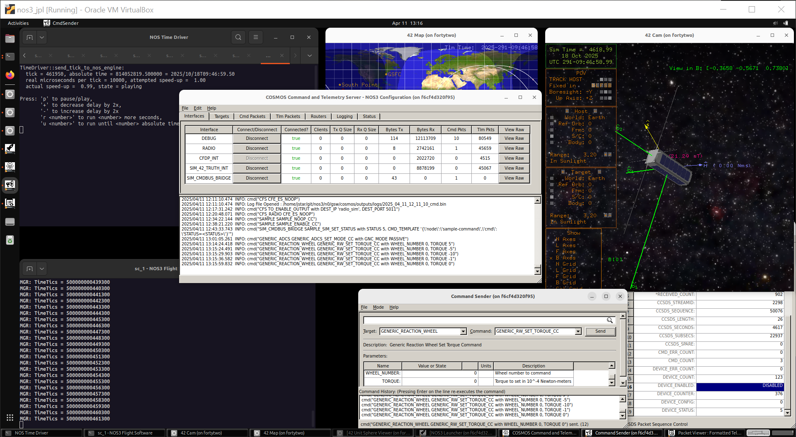

* 거의 다 됐지만, 수동으로 이걸 맞추기는 정말 어렵습니다.

만약 다시 태양 쪽에 있다면, ADCS를 다시 켜서 나머지 일을 대신 마무리해주는지 봅시다:
* `GENERIC_ADCS`의 `GENERIC_ADCS_SET_MODE_CC`를 `GNC_MODE` `SUNSAFE_MODE`(2)로 보내세요.

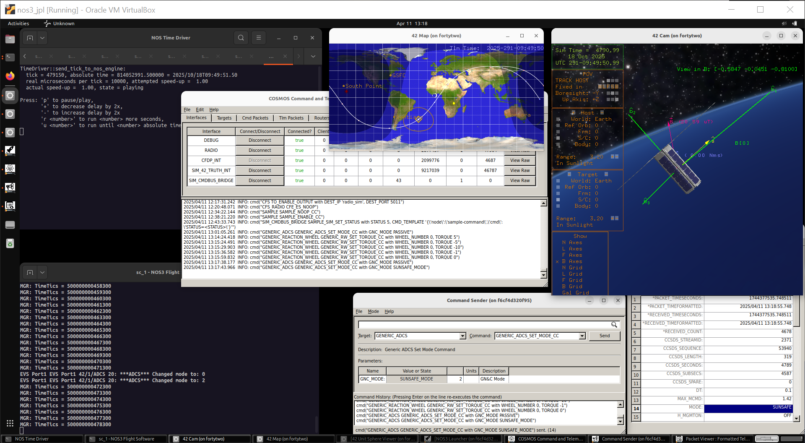

여기까지 잘 따라오셨다면 축하드립니다!
이제 여러분은 NOS3 위성 운영자입니다.
