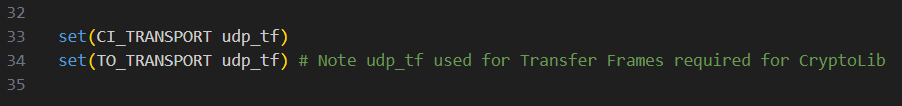
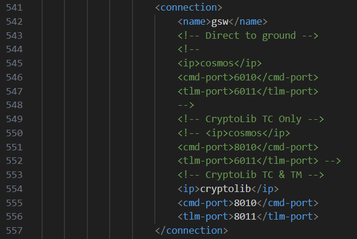
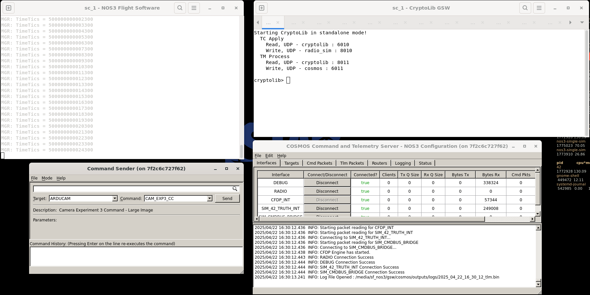
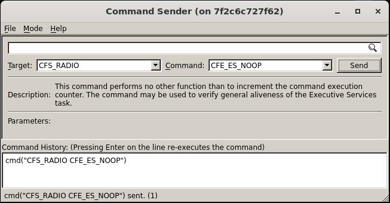
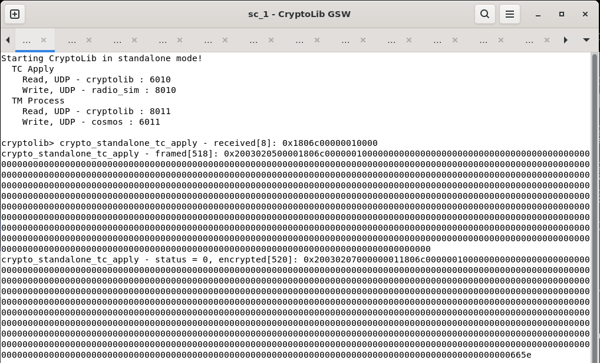
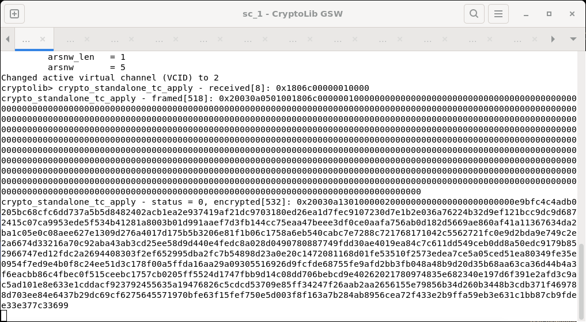
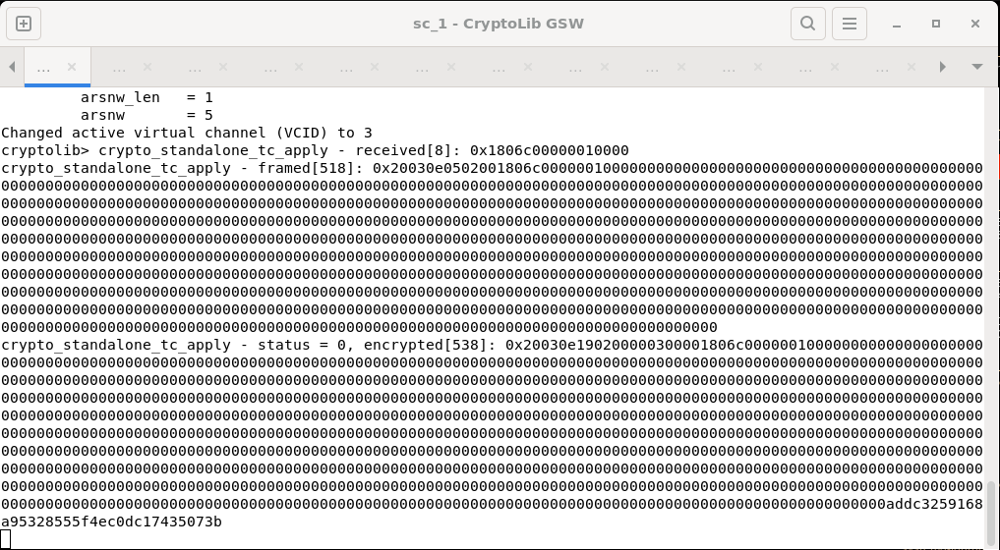
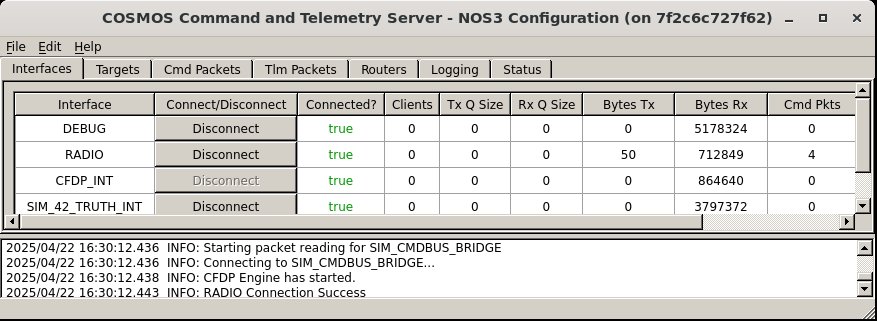
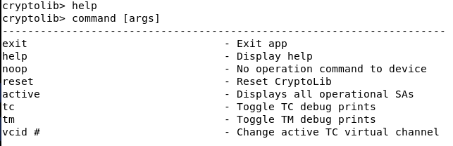

# 시나리오 - 명령 암호화(Command Encryption)

이 시나리오는 NOS3에서의 명령 암호화 과정을 안내하고, CryptoLib를 소개하기 위해 만들어졌습니다.

> 💡 **초보자 가이드**: CryptoLib는 위성으로 보내는 명령과 위성에서 내려받는 텔레메트리를 암호화하거나, 진짜 발신자가 맞는지 인증하는 기능을 제공하는 라이브러리입니다. 마치 우편으로 편지를 보낼 때 봉투를 봉인하거나(암호화), 서명을 남겨서 위조되지 않았음을 증명하는 것(인증)과 비슷합니다.

이 시나리오는 2025년 4월 22일에 마지막으로 업데이트되었으며, 당시 `619-scenario---command-encryption-walkthrough` 브랜치(커밋 [2dfbc17])를 기반으로 작성되었습니다.

## 학습 목표

이 시나리오를 마치면 다음을 할 수 있게 됩니다:

* CryptoLib를 통해 가상 채널(virtual channel) 전환하기
* CryptoLib를 이용해 암호화되거나 인증된 명령을 보내고 텔레메트리 수신하기
* FSW, GSW, 시뮬레이터 사이에서 암호화와 복호화가 성공적으로 이루어지는지 검증하기

## 사전 준비 사항

시나리오를 실행하기 전에 다음 단계가 완료되었는지 확인하세요:
* [시작하기](./Getting_Started.md)
  * [설치](./Getting_Started.md#installation)
  * [실행](./Getting_Started.md#running)

### CryptoLib 설정값

이 섹션은 이번 시나리오에서 무엇을, 왜 업데이트했는지를 담고 있습니다.

`NOS3/cfg/nos3_defs/toolchain-amd64-nos3.cmake`로 이동해서 아래 그림처럼 34번째 줄(`TO_TRANSPORT`)을 `udp`에서 `udp_tf`로 변경하세요.
이렇게 하면 NOS3가 CryptoLib가 이해할 수 있는 형식으로 텔레메트리를 구성하도록 강제됩니다.

다음으로 `NOS3/cfg/sims/nos3-simulator.xml`로 이동해서 아래 그림처럼 554~556번째 줄(`CryptoLib TC & TM`)의 주석을 해제하세요.
다른 옵션들은 주석 처리된 상태로 두었는지 확인하세요.
이렇게 하면 CryptoLib를 통한 암호화된 명령 전송과 텔레메트리 수신에 알맞은 포트가 설정됩니다.

## 실습 과정

NOS3 저장소의 최상위 경로로 이동한 터미널에서:
* `make`

* `make launch`

* 사용하기 편하도록 창들을 정리하세요

* 이제 COSMOS 지상 소프트웨어를 시작합니다
  * 나타나는 NOS3 Launcher 창에서 `Ok` 버튼을 클릭한 뒤, 왼쪽 상단의 `COSMOS` 버튼을 클릭하세요
  * 이 NOS3 Launcher는 최소화해도 되지만, 닫지는 마세요

### 명령 보내기

명령을 보내기 시작하려면 `NOS3 Flight Software`와 `CryptoLib GSW` 터미널, 그리고 `Command Sender`와 `COSMOS Command and Telemetry Server` 창으로 이동하세요.

CryptoLib는 기본적으로 디버그 출력이 있는 clear-mode(평문 모드) 명령 전송을 위해 설정되어 있습니다.
no-op(아무 동작 안 함) 명령을 보내려면, `Command Sender` 창에서 `CFS_RADIO` 타겟과 `CFE_ES_NOOP` 명령을 선택한 후 명령을 전송하세요.

암호화된 명령을 보내려면, CryptoLib 창에서 `vcid 2`를 입력하세요.
이렇게 하면 사용 중인 가상 채널(virtual channel)이 바뀝니다. 이제 앞서 보낸 명령을 다시 보내보세요.

인증된(authenticated) 명령을 보내려면, CryptoLib 창에서 `vcid 3`을 입력한 뒤 앞서의 명령을 다시 보내세요.

### 텔레메트리 출력 활성화하기

CryptoLib를 통해 텔레메트리 출력을 활성화하려면, `Command Sender` 창에서 `CFS_RADIO` 타겟과 `TO_ENABLE_OUTPUT` 명령을 선택한 뒤 명령을 전송하세요.
이렇게 하면 패킷들이 CryptoLib를 통해 복호화됩니다.

> 디버그 출력을 끄려면, CryptoLib 창에 `tm`이라고 입력하세요.

이제 `COSMOS Command and Telemetry Server` 창에서 `RADIO` 인터페이스의 `Bytes RX` 필드가 증가하는 것을 볼 수 있습니다.

### 그 외 CryptoLib 명령들

CryptoLib 창에 `help`를 입력하면 사용 가능한 다른 모든 CryptoLib 명령을 볼 수 있습니다.

축하합니다. 명령 암호화 실습을 끝까지 완료하셨습니다!
