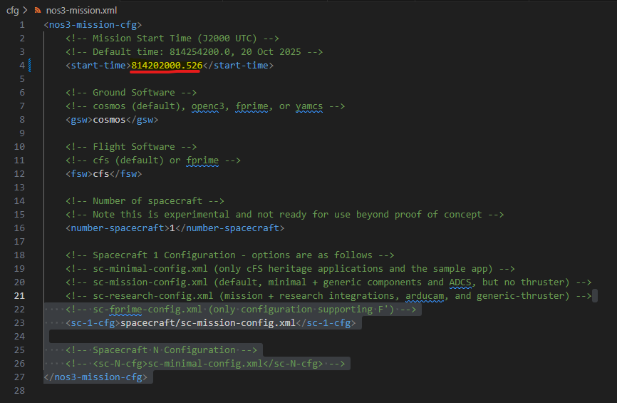
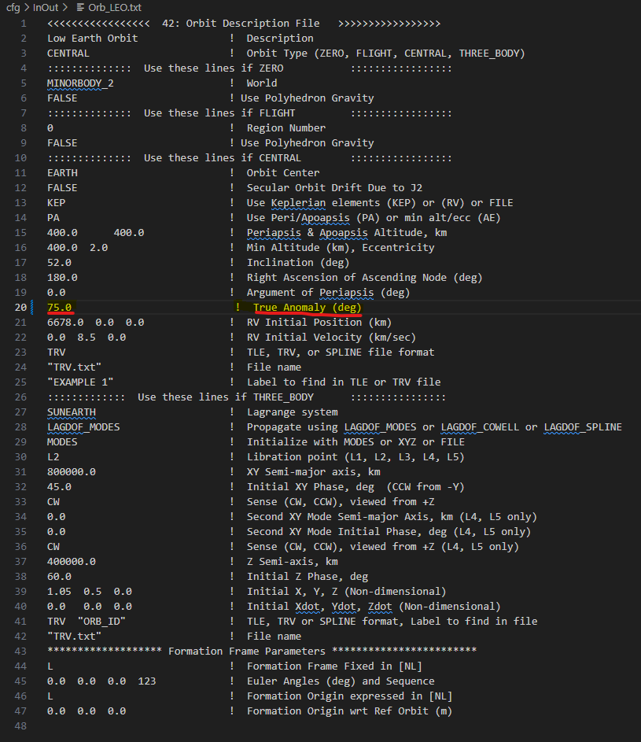
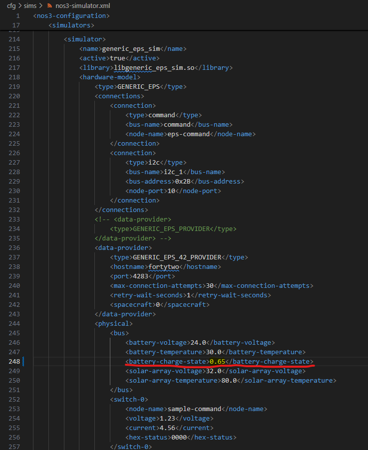
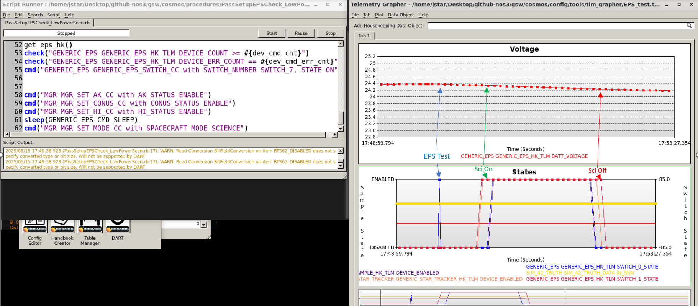
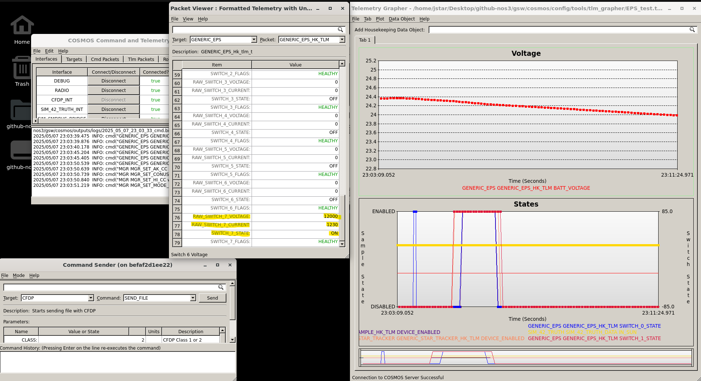
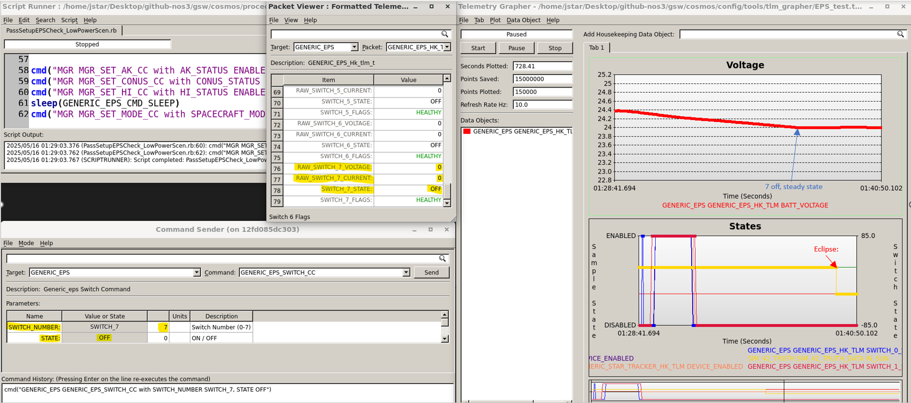
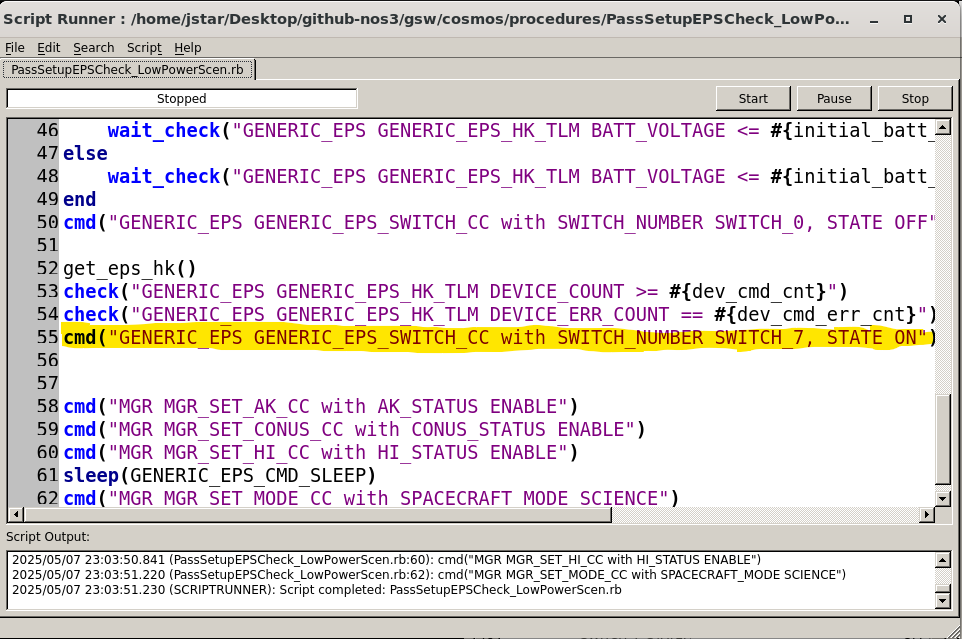

# 시나리오 - 저전력(Low Power)

이 시나리오는 비행 중 발생하는 긴급 상황, 특히 저전력과 관련된 상황을 어떻게 식별하고 해결하는지 보여주기 위해 만들어졌습니다.

이 시나리오는 2025년 6월 10일에 마지막으로 업데이트되었으며, 당시 `dev` 브랜치(커밋 [a3e7c100])를 기반으로 작성되었습니다.

## 학습 목표
이 시나리오를 마치면 다음을 할 수 있게 됩니다:
* 제한된 정보만으로 복잡한 상황을 분석해 이상 현상의 원인을 파악하기.
* 우주 임무 운영에서의 저전력 비상 대책 배우기.
* 이러한 이상 현상을 바로잡기 위해 비행 중인 임무를 패치(patch)하는 방법 배우기.

## 사전 준비 사항
시나리오를 실행하기 전에 다음 단계를 완료하세요:

* [시작하기](./NOS3_Getting_Started.md)
  * [설치](./NOS3_Getting_Started.md#installation)
  * [실행](./NOS3_Getting_Started.md#running)

시작하기 전에 아래 시나리오들도 살펴보시길 권장합니다:
* [STF - 빠르게 훑어보기](./STF_QuickLook.md)
* [시나리오 - ADCS 실습](./Scenario_ADCS_Walkthrough.md)
* [시나리오 - 비행 중 패치](./Scenario_Patching.md)
* [시나리오 - 과학 관측 모드에서 Sample 비활성화에 대한 FDC 검사 추가](./Scenario_Fault_Science.md)
* [시나리오 - 과학 관측 모드에서 ADCS 명령하기](./Scenario_Controlling_ADCS_During_Science.md)

## 실습 과정
이 시나리오의 목표는 이전 시나리오들에서 얻은 지식을 바탕으로, 임무 운영 중 궤도상에서 발생하는 저전력 문제를 식별하고 해결하는 것입니다. 다음과 같은 상황이 주어집니다:

여러분은 STF 임무의 소프트웨어 유지보수 팀 소속입니다. 위성은 발사되어 정상 가동(commissioning)을 마쳤고, 미국 상공을 지나며 운영 중입니다. 전력 상태는 시간이 지나면서 서서히 줄어들었지만 여전히 정상 범위 안에 있으며, 과학 데이터 수집이나 패스(pass)가 이루어지지 않는 낮 동안에는 여전히 충전이 되고 있습니다. 임무 운영 센터(MOC)는 EPS 시스템 테스트를 기반으로 지상에서 보낸 EPS(전력 시스템) 정기 부분 점검을 실시했다고 보고합니다. 이 점검을 진행하고 다음 패스를 준비하기 위해 과학 관측 모드를 다시 활성화하던 중, 저전력 상태로 인해 Active Science(활성 과학 관측)가 억제되었습니다. 위성은 정상적으로 충전되지도 않고, 오히려 계속 방전되고 있습니다. 곧 일식(eclipse)에 진입할 예정이라, 충전을 막고 있는 원인이 해결된다고 가정하더라도 다시 충전할 수 있게 되기 전에 위성이 위험할 정도로 낮은 전력 상태로 떨어질 수 있다는 우려가 있습니다. MOC로부터 상황을 진단하고 임무를 살리기 위한 비행 중 패치를 제공하라는 요청을 받습니다.

### 1단계 - 시나리오 설정
이 시나리오를 설정하려면 NOS3에 몇 가지 설정 변경이 필요합니다:
* 먼저, `cfg/nos3_mission.xml`에서 임무 시작 시간을 `814202000.526`으로 설정하세요.
* 이렇게 하면 미국 상공에서 저녁/야간 과학 관측 패스가 발생하는 상황으로 설정됩니다.

* `cfg/InOut/Orb_LEO.txt` 파일의 `True Anomaly`(진근점이각) 파라미터를 `0.0`에서 `75.0`으로 변경하세요.
* 이렇게 하면 위성이 알래스카 근처 위치에서 시작합니다.

* 마지막으로 `cfg/sim/nos3-simulator.xml`의 EPS 섹션 아래에 있는 `<battery-charge-state>` 파라미터를 `1.0`에서 `0.65`로 변경하세요.
  * `1.0`은 100% 충전 상태를, `0.65`는 65% 충전 상태를 의미합니다.
  * 이렇게 하면 위성이 이미 저전력 상태에 있는 것처럼 시뮬레이션됩니다.

이제 평소처럼 NOS3를 다시 빌드하고 실행하세요. 42 GUI와 FSW 콘솔을 최소화하고 모든 정보를 COSMOS로만 확인하는 것도 유용할 수 있습니다. 이렇게 하면 MOC 운영자의 관점과 가장 비슷한 시점에서 볼 수 있습니다.
**참고: 향후에는 `make cosmos-operator`로 NOS3를 운영자 모드(operator mode)로 실행하고, 모든 것이 제대로 실행되는지 터미널의 안내를 따를 수 있습니다. 이렇게 하면 처음부터 더 운영자에 가까운 모드가 되지만, 42 GUI는 여전히 실행됩니다. 다만 이 기능은 아직 개발 중이므로, 일단은 평소처럼 `make launch`를 사용하는 것이 좋습니다.**

* 30초 정도 기다린 뒤 Script Runner와 Telemetry Grapher를 여세요.
* Telemetry Grapher에서 `EPS_test.txt`를 실행한 뒤 Start를 누르세요.
  * 이렇게 하면 전력 수준과 스위치/일광(in sun) 상태를 그래프로 추적할 수 있습니다.
* 그런 다음 Script Runner로 가서 open을 누르고 `cosmos/procedures`로 이동하세요.
* 새로 열린 창에서 `PassSetupEPSCheck_LowPowerScen.rb`를 선택하고, 열리면 Start를 누르세요.
  * 이는 MOC가 실행했던, 문제를 유발한 것으로 보이는 설정 및 테스트 파일입니다.
  * 원래 목적은 EPS를 테스트한 뒤 과학 관측 모드를 설정하는 것이었습니다.
시뮬레이터를 계속 실행하면서, 과학 관측 패스가 시작된 이후(예상대로) 전력이 떨어지기 시작하지만, 이후 과학 관측 패스가 예상보다 일찍 멈추는데도 전력이 계속 소모되는 것을 관찰하세요. 이 시점이 바로 밤이 다가오는 상황에서 진단을 시작해야 하는 지점입니다:

### 2단계 - 식별 및 진단(Triage)
이 섹션에서는 COSMOS의 여러 도구와 논리적인 사고 과정을 결합해 문제를 일으키는 지점을 정확히 짚어내는 방법을 다룹니다.

#### A부: 가능성 있는 문제 짚어내기
낮 시간에도 불구하고 예기치 못한 전력 소모가 발생하는 것으로 보이므로, 가장 먼저 살펴봐야 할 곳은 EPS 텔레메트리입니다:
* Packet Viewer 창으로 가서, Target 드롭다운에서 `GENERIC_EPS`로 이동하세요.
* 스크롤하며 살펴보세요(패킷은 하나뿐일 것입니다).
* 스위치 0과 1은 꺼져 있어야 하지만, 원래 사용되지 않아야 할 스위치 7이 켜져 있고 상당한 전력을 소모하고 있는 것을 발견할 수 있습니다.

이 단계에서의 임시 해결책은 Command Sender로 가서 스위치 7을 수동으로 끄도록 명령한 뒤, Telemetry Viewer에서 실제로 꺼졌는지 확인하는 것입니다. 이렇게 하면 전력 소모가 더 안전한 수준으로 줄어들 것입니다.

#### B부: 원인 찾기
문제를 파악하고 임시로 해결했다면, 다음으로 해야 할 일은 무엇이 이 문제를 일으켰는지 파악하는 것입니다. 가장 유력한 두 원인은 다음과 같습니다:
* 스위치를 잘못 활성화시키는 결함이 있는 RTS 테이블.
* 잘못된 지상 명령.
이번 경우, 패스를 준비하기 위해 실행했던 스크립트를 확인해보면 스위치 7을 켜는 잘못된 스위치 명령을 발견할 수 있을 것입니다. 이것이 문제의 원인으로 보이므로, 향후 패스를 위해 이를 제거하거나 수정해야 합니다.

만약 이 잘못된 명령이 지상 스크립트에 *없었다면*, 다음으로 확인해야 할 곳은 In-Flight Patching(비행 중 패치) 시나리오에서 논의한 것처럼, 오류가 수정된 RTS 테이블의 백업 버전이 현재 탑재된 것을 덮어쓰기 위해 실제로 업링크되었는지 여부입니다.
이번 경우에는 문제가 해결되었지만, 그 오류가 상당히 심각하고 오랫동안 발견되지 않을 경우 매우 심각한 결과를 초래할 수 있기 때문에, 운영팀은 향후 발생할 수 있는 운영자 실수가 위성을 완전히 죽이는 결과로 이어지지 않도록 안전장치(failsafe)를 추가하는 것이 현명하다고 판단합니다.

### 3단계 - 안전장치(Failsafe) 계획하기
이전 시나리오들에서 강조했듯이, 임무 동작을 변경하기 전에는 정확히 무엇을 해야 하는지, 어떻게 해야 하는지, 어디를 변경해야 하는지, 그리고 이 새로운 동작으로 인해 생길 수 있는 예외 상황을 고려해야 합니다.

#### A부: 범위 결정하기
이번 경우에는 배터리가 임계 수준 아래로 떨어지면 알려진 안전 상태로 진입하는 새로운 비상 대책을 추가하고자 합니다. 또한 기존의 전력 관련 트리거들이 완전히 결정된(known) EPS 상태로 가도록 만들고 싶을 수 있지만, 이는 여러분의 재량에 달려 있습니다. 항전(Avionics)팀은 위성 배터리가 25% 아래로 떨어지지만 않으면 복구 가능하다고 보고합니다. 따라서 40%는 극단적인 전력 손실 시 알려진 안전 상태로 진입하되 하룻밤을 버티고 재충전할 수 있는 안전한 컷오프 여유로 판단됩니다.

이는 곧, 기존의 60% Watchpoint와 유사하게 설계된 40% 전력용 새로운 LC Watchpoint가 필요하며, 이것이 Science Mode 진입 시 활성화되도록 해야 함을 의미합니다. 그런 다음, 이 Watchpoint가 트리거되면 Safe Mode로 전환하는 새로운 RTS를 만들어야 합니다. 마지막으로, 기존의 60% 저전력 Science Pause(과학 관측 일시정지)에 추가적인 안전 조치를 넣고 싶다면 해당 RTS도 수정해야 합니다.

#### B부: 동작을 위한 수정 사항 결정하기
범위를 결정했으니, 이제 이러한 변경에 필요한 것을 생각해봅시다. FDC 검사 시나리오에서 보여드린 것처럼, 40% 전력에 대한 새로운 Watchpoint를 추가하고 이것이 활성화되도록 LC 테이블과 RTS 테이블을 수정하거나 추가해야 합니다. 그런 다음, 모든 Safe Mode 전환 시 (현재 사용하지 않는 것들을 포함해) 모든 스위치를 끄는 새로운 명령을 추가해야 합니다. 기존 RTS들은 스위치 0과 1만 끄므로, 스위치 2부터 7까지에 대한 새로운 명령을 추가해야 합니다. 새로운 Safe Mode 진입 테이블에도 스위치 0부터 7까지, 그리고 관련된 애플리케이션(이 경우 Sample과 스타 트래커)이 각각 꺼지거나 비활성화되도록 해야 합니다.

#### C부: 예외 상황 고려하기
마지막으로, Science Mode 동안 원하는 동작을 달성하기 위해 무엇이 필요한지 결정했으니, 이제 활성 Science Mode를 벗어나거나 Safe Mode로 전환할 때 생길 수 있는 새로운 문제와 예외 상황을 고려해야 합니다. 이 변경의 특성상 대부분의 예외 상황은 커버되겠지만, 이러한 변경이 모든 Safe Mode 전환 및 (필요하다고 판단되는 경우) 모든 전력 관련 전환에 추가되었는지 확인해야 합니다. 또한, 원래의 문제가 복사-붙여넣기 오류로 인한 것이었을 수 있으므로, 새로운 테이블에서 이러한 실수를 피하기 위해 각별한 주의가 필요합니다. 이것이 바로 NOS3와 같은 시뮬레이션 소프트웨어에서 테스트하는 것이 실제 운영에서 매우 큰 가치를 발휘하는 또 다른 지점입니다 - 모든 예외 상황이 테스트되고, 패치가 의도치 않은 부작용이나 실패 지점을 만들지 않는다는 것을 확인하기 위해서입니다.

### 4단계: 구현
구현 방식은 이전 교훈들을 바탕으로 여러분이 직접 결정하도록 남겨두지만, 몇 가지 일관된 기본 단계는 있습니다. 다음을 진행하면 됩니다:
* `cfg/nos3_defs/tables/lc_def_wdt.c`에 Watchpoint를 추가하세요. Watchpoint 27을 참고할 수 있으며, 15번과 같이 사용되지 않는 슬롯을 사용하세요.
* `cfg/nos3_defs/tables/lc_def_adt.c`에 Actionpoint를 추가하세요. Actionpoint 27을 참고할 수 있으며, 15번과 같이 사용되지 않는 슬롯을 사용하세요.
* `cfg/nos3_defs/tables/sc_rts015.c`와 같은 새로운 RTS 테이블을 추가하세요. RTS 27(`sc_rts027.c`)을 참고할 수 있습니다.
* 필요에 따라 기존 RTS 테이블을 수정하여 이 Watchpoint를 사용하도록 하세요.
그런 다음, 시스템을 재부팅하고 그 방식으로 새 테이블을 컴파일하거나, NOS3 같은 테스트 환경에서 테이블을 컴파일한 뒤 실행 중에 컴파일된 .tbl 파일을 복사하고, (In Flight Patching 시나리오에서 보여준 것처럼) CFDP와 cFS의 기존 테이블 명령을 이용해 새 테이블을 즉시(hot swap) 교체해야 합니다.

### 5단계: 의도한 동작 검증하기
이 모든 작업이 끝났다면, NOS3를 실행하고 COSMOS를 실행한 뒤, 여러분의 패치가 적용된 상태로 1단계에서 설명한 저전력 시나리오를 다시 실행하여 동작을 확인할 수 있습니다. 그런 다음 텔레메트리를 관찰하며 40%에서 여러분의 모드에 진입하는지 확인하세요. 또한 60% 전력에서 모든 스위치를 끄는 명령을 추가했다면, 위성이 science passive로 진입한 후 남은 낮 시간 동안 충전이 재개되는지 확인하세요. 또한 Sim Bridge 명령을 통해 충전 상태를 수동으로 40%로 설정하고 안전장치가 트리거되는지 확인하여 패치를 테스트할 수도 있습니다.

### 결론
이번 시나리오를 통해, 이전의 모든 교훈을 종합하여 실제 시나리오를 해결하고 이를 성공적으로 완수하는 데 대한 자신감을 얻었을 뿐만 아니라, 지상 운영자가 사용할 수 있는 데이터만으로 비상 상황의 원인을 찾아내는 방법에 대해서도 더 잘 이해하게 되었을 것입니다.
