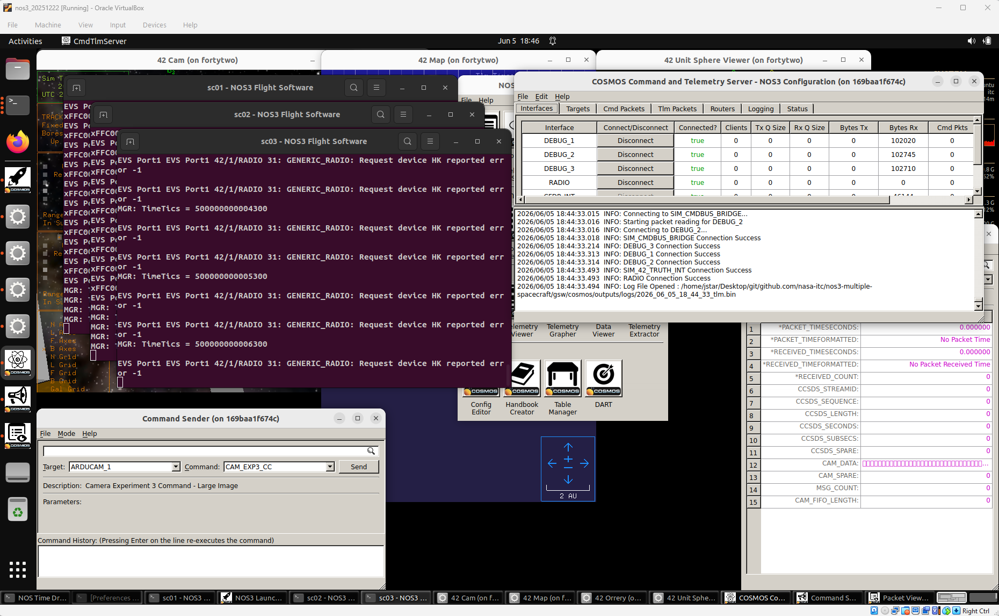
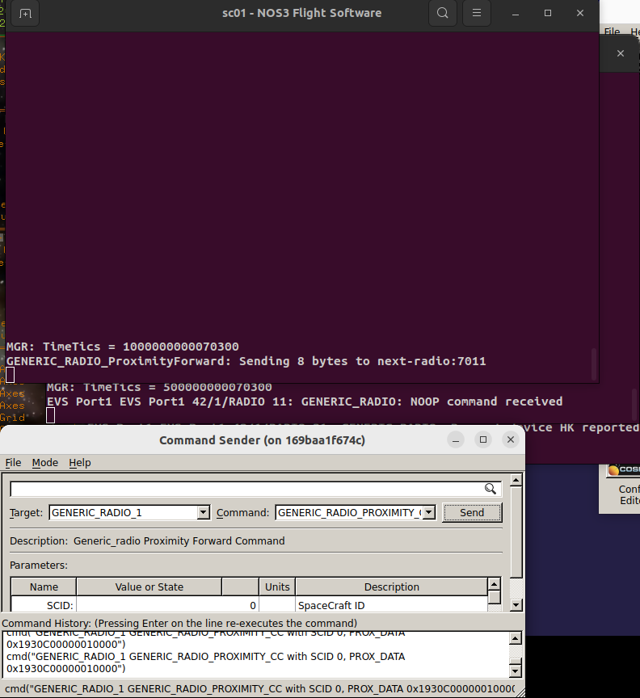

# 시나리오 - 다중 위성(Multiple Spacecraft)

이 시나리오는 여러 대의 위성을 한 번에 다루는 방법을 보여주기 위해 만들어졌습니다.

이 시나리오는 2026년 6월 8일에 마지막으로 업데이트되었으며, 당시 `nos3-multiple-spacecraft` 저장소(https://github.com/nasa-itc/nos3-multiple-spacecraft) 의 `NOS3-Multiple-Spacecraft` 브랜치(커밋 [dae7e75])를 기반으로 작성되었습니다.

## 학습 목표
이 시나리오를 마치면 다음을 할 수 있게 됩니다:
* 하나의 지상국에서 여러 대의 위성 명령하기.
* 하나의 지상국에서 여러 대의 위성으로부터 텔레메트리 수신하기.
* 한 위성으로 보낸 명령이 다른 위성으로 전달(forward)되도록 하기.

## 사전 준비 사항
시나리오를 실행하기 전에 다음 단계를 완료하세요:

* [시작하기](./NOS3_Getting_Started.md)
  * [설치](./NOS3_Getting_Started.md#installation)
  * [실행](./NOS3_Getting_Started.md#running)

이 시나리오 전에 아래 내용도 함께 살펴보시길 권장합니다:
* [STF - 빠르게 훑어보기](./STF_QuickLook.md)
* [달 궤도 위성군 구성](./Scenario_Constellation_with_Lunar_Focus.md)

## 실습 과정
이 시나리오를 위해서는 `nos3-multiple-spacecraft` 저장소(https://github.com/nasa-itc/nos3-multiple-spacecraft) 에서 `NOS3-Multiple-Spacecraft` 브랜치로 전환해야 합니다.
이번 시나리오만의 특징으로, `make uninstall`을 먼저 실행한 뒤 `make prep`을 실행해야 합니다.
그 다음에는 평소처럼 `make`와 `make launch`를 실행하면 됩니다.
실행하면 `sc0N - NOS3 Flight Software`라는 제목의 세 개의 비행 소프트웨어 창이 열리는 것을 확인할 수 있습니다. 여기서 `N`은 1, 2, 3 중 하나입니다.
마찬가지로 COSMOS를 실행하면 명령/텔레메트리 서버에 세 개의 텔레메트리 디버그 인터페이스(`DEBUG_1`, `DEBUG_2`, `DEBUG_3`)가 표시됩니다.
아래 그림에서 이를 확인할 수 있습니다.

 

COSMOS 명령/텔레메트리 서버 창의 Bytes Rx 열을 확인하면 텔레메트리가 정상적으로 수신되고 있는지 검증할 수 있습니다.

Constellation with Lunar Focus(달 궤도 위성군) 시나리오와 동일하게 각 비행 소프트웨어 인스턴스에 명령을 보낼 수 있다는 점에 유의하세요. 과정이 동일하므로 여기서는 반복하지 않습니다.

이 시나리오는 하나의 위성으로 보낸 명령이 다음 위성으로 전달된다는 점이 독특합니다. 방법은 다음과 같습니다:
* Command Sender 창에서 타겟 `GENERIC_RADIO_1`과 명령 `GENERIC_RADIO_PROXIMITY_CC`를 선택한 뒤 `Send` 버튼을 누르세요.
아래 그림에서 이를 확인할 수 있습니다.

이 그림에서 `Command Sender`로부터 명령이 전송되는 것을 볼 수 있습니다. `sc01-NOS3 Flight Software` 창에서는 `GENERIC_RADIO_ProximityForward` 명령이 표시되며, 다음 무선(radio, 이 경우 sc02의 무선)에 8바이트를 전송했음을 보여줍니다. 그 아래 `sc02-NOS3 Flight Software` 창에서는 위성 2의 비행 소프트웨어가 `NOOP` 명령을 수신했음을 보여줍니다.

`Command Sender`에서 보내는 명령을 편집하여 두 번째 무선에 다른 종류의 명령을 전달하도록 하거나, 다른 위성에 명령을 보내 전달하게 만들 수 있습니다. 위성 1의 다음 무선은 위성 2의 무선이고, 위성 2는 위성 3에 전달하며, 위성 3은 다시 1로 전달하여 순환을 완성합니다. 위성이 더 추가되면 이 순환은 자동으로 확장됩니다.

## 배경 지식
다중 위성 시나리오 설정에 대한 배경 지식은 Scenario Constellation with Lunar Focus를 참고하세요.
