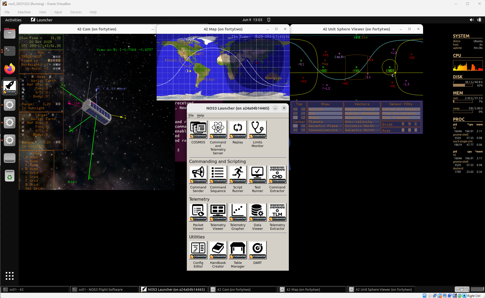
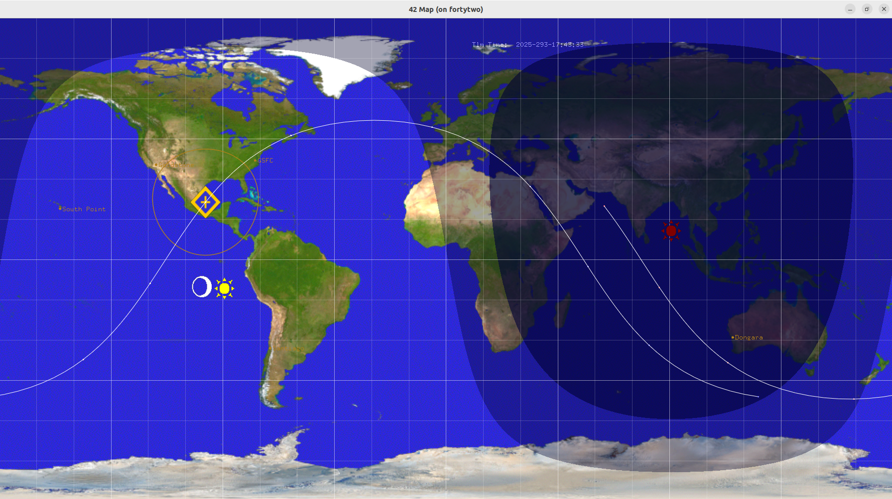
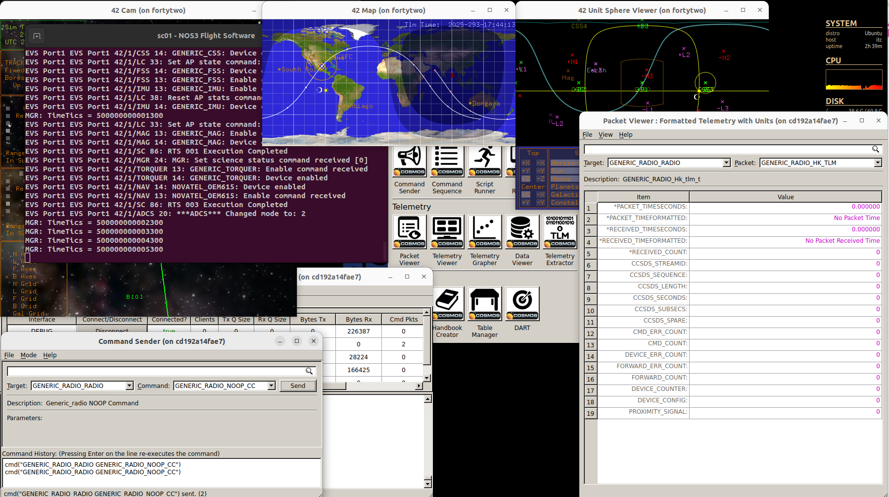
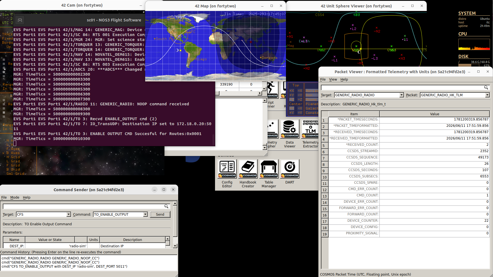
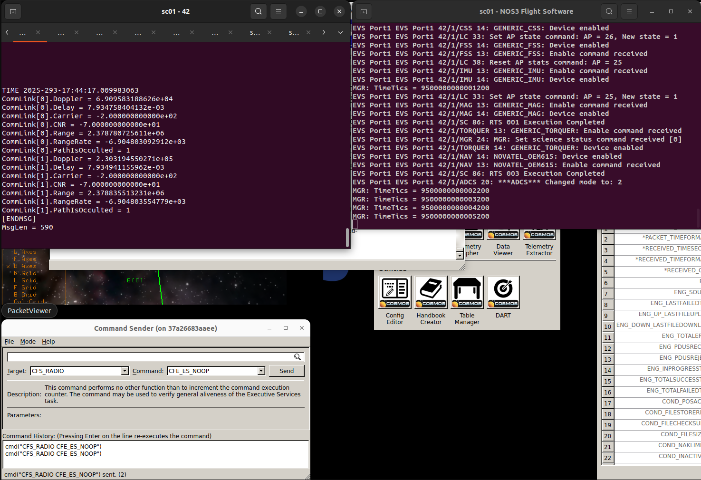
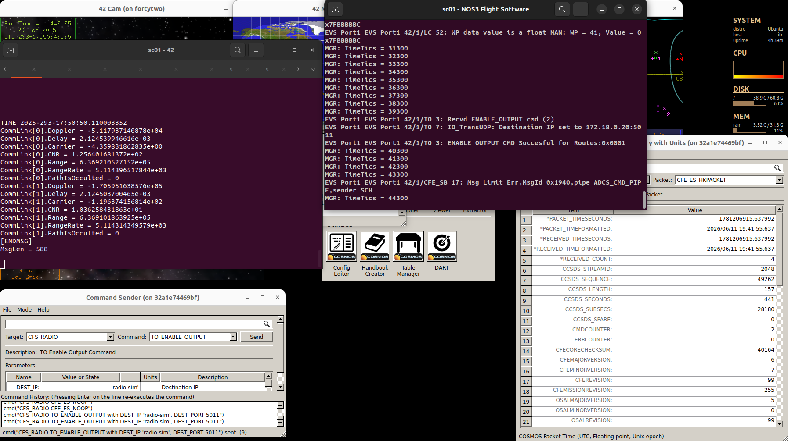
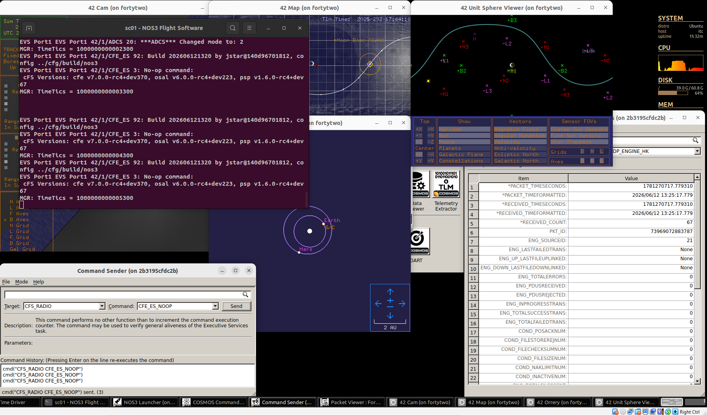

# 시나리오 - 무선(R/F) 가시권(Inview)과 지연(Delay)

이 시나리오는 NOS3의 다음 기능들을 설명하고 보여주기 위해 만들어졌습니다:
 * 지상국 상공에서 위성의 진행 상황을 추적하고, 위성이 지상국의 가시권(in view) 안에 있을 때만 무선 통신을 허용하는 기능.
 * 최소 반송파 대 잡음비(Carrier to Noise Ratio, CNR) 요구사항을 기반으로 지상국과 위성 간 통신을 제한하는 기능.
 * 지상국과 위성 사이의 빛의 속도에 따른 통신 지연(speed-of-light delay)을 모델링하는 기능.

> 💡 **초보자 가이드**: 전파는 빛과 같은 속도로 이동하지만, 우주에서는 거리가 매우 멀기 때문에 신호가 도달하는 데 실제로 시간이 걸립니다. 예를 들어 달까지는 약 1.3초, 화성까지는 수 분이 걸릴 수 있습니다. 또한 위성이 지구 반대편에 있으면 지상국의 안테나가 위성을 "볼 수" 없기 때문에, 위성이 지상국 상공을 지나가는 특정 시간대에만 통신이 가능합니다. CNR(반송파 대 잡음비)은 신호가 잡음(noise)에 비해 얼마나 강한지를 나타내는 값으로, 이 값이 너무 낮으면 신호가 잡음에 묻혀 통신이 불가능해집니다.

이 시나리오는 2026년 6월 11일에 마지막으로 업데이트되었으며, 당시 `dev` 브랜치(커밋 [`645d9bec`])를 기반으로 작성되었습니다.

## 학습 목표

이 시나리오를 마치면 다음을 할 수 있게 됩니다:
 * 위치와 지상 가시권에 따라 시뮬레이션된 위성 무선과의 통신을 제한하도록 NOS3 설정하기.
 * 반송파 대 잡음비(CNR)에 따라 시뮬레이션된 위성 무선과의 통신을 제한하도록 NOS3 설정하기.
 * 위성 무선과 지상 사이의 빛의 속도에 따른 통신 지연 관찰하기.

## 사전 준비 사항

시나리오를 실행하기 전에 다음 단계를 완료하세요:
* [시작하기](./NOS3_Getting_Started.md)
  * [설치](./NOS3_Getting_Started.md#installation)
  * [실행](./NOS3_Getting_Started.md#running)

## 실습 과정

가시권(inview)이나 반송파 대 잡음비를 기준으로 무선 기능을 제한하는 능력, 그리고 빛의 속도에 따른 지연을 시뮬레이션하는 능력 모두 설정 가능하다는 점에 유의하세요. 기본값은 꺼져 있으므로, 가장 먼저 이를 켜야 합니다:
 * 먼저 `cfg/sims/nos3-simulator` 파일로 이동하세요.
 * 그 파일에서 `GENERIC_RADIO_42_PROVIDER`를 검색하세요.
 * `uplink-close-criteria`와 `downlink-close-criteria`를 `occulted`로 변경하세요.
 * 또한 `uplink-delay-on`과 `downlink-delay-on`을 true로 변경하세요.

NOS3 저장소의 최상위 경로로 이동한 터미널에서 make clean과 make를 실행하세요:
 * `make clean`
 * `make`

다음으로 (`make launch`로) NOS3를 실행하고, `NOS3 Launcher` 창의 `COSMOS` 버튼을 이용해 COSMOS를 여세요:

다음으로, 42 map 창을 살펴보세요.

위성의 위치는 안에 십자가가 있는 노란색 다이아몬드로 표시됩니다.
위성을 둘러싼 주황색 원은 어느 순간이든 위성이 보이는(가시권에 있는) 지구 상의 영역을 나타냅니다.
이 시나리오에서는 GSFC가 지상국이며, GSFC 라벨이 붙은 주황색 점으로 표시됩니다.
시나리오 시작 시점에는 GSFC 점이 위성의 주황색 가시권 원 안에 있지 않다는 점에 유의하세요.

GSFC가 위성의 가시권 밖에 있는 동안, 타겟 `GENERIC_RADIO_RADIO`를 이용해 `GENERIC_RADIO_NOOP_CC` 명령을 위성에 보내 보세요.
명령이 비행 소프트웨어 창에 나타나지 않는 것을 확인하세요.
위성이 지상국의 가시권 밖에 있기 때문에 무선이 이 명령이 발생하지 않은 것으로 필터링한 것입니다.
또한 Packet Viewer 창을 살펴보면, 두 개의 generic radio 패킷(`GENERIC_RADIO_RADIO`와 `GENERIC_RADIO_HK_TLM`) 모두 텔레메트리를 수신하지 못하는 것을 볼 수 있습니다.
이는 위성이 지상국의 가시권 밖에 있기 때문입니다.
아래 그림에서 이 결과를 확인할 수 있습니다:

42 Map 창을 지켜보면, GSFC가 약 17:44:30에 위성의 가시권에 들어오는 것을 볼 수 있습니다.
가시권에 들어오면, 앞서와 같은 명령(`GENERIC_RADIO_RADIO`, `GENERIC_RADIO_NOOP_CC`)을 다시 보내보세요.
이제 NOOP 명령이 수신됩니다. 아래 그림의 `sc01 - NOS3 Flight Software` 창에서 이를 확인할 수 있습니다.
또한 `CFS`의 `TO_ENABLE_OUTPUT` 명령을 보내세요. 이 작업이 완료되면, 아래 `Packet Viewer`에 표시된 것처럼(`GENERIC_RADIO_RADIO`와 `GENERIC_RADIO_HK_TLM`을 확인해보세요) `GENERIC_RADIO_RADIO` 인터페이스로 텔레메트리가 수신되기 시작합니다:

이제 `make stop`을 실행해 시나리오를 중지하세요.

다음으로, 반송파 대 잡음비(CNR)를 이용해 무선을 제한하는 것을 보여드리겠습니다.
이는 (다시) `cfg/sims/nos3-simulator.xml` 파일을 편집하여 수행합니다:
 * 그 파일에서 `GENERIC_RADIO_42_PROVIDER`를 검색하세요.
 * `uplink-close-criteria`와 `downlink-close-criteria`를 `cnr`로 변경하세요.
 * 또한 `cfg/InOut/Inp_IPC.txt` 파일을 편집하세요. 그 파일에서 `Radio IPC`를 검색하세요. `Echo to stdout`을 `FALSE`에서 `TRUE`로 변경하세요.
`make`를 실행하여 시나리오 소프트웨어를 다시 빌드한 뒤, `make launch`로 다시 실행하세요.
다시 `NOS3 Launcher` 창의 `COSMOS` 버튼을 이용해 COSMOS를 여세요. `sc01 - 42`와 `sc01 - NOS3 Flight Software` 창을 화면에 띄워두세요.
이제 `CFS_RADIO` 타겟에 `CFE_ES_NOOP` 명령을 보내보세요.
 * `sc01 - NOS3 Flight Software` 창까지 명령이 전달되지 않는 것에 유의하세요.
 * 또한 `sc01 - 42` 창에서 `CommLink[0].CNR` 값이 `cfg/sims/nos3-simulator.xml` 파일의 임계값 15보다 낮다는 것도 확인하세요. 이 때문에 명령이 전달되지 않는 것입니다.
계속 업데이트되는 창을 더 쉽게 보기 위해, `NOS Time Driver` 창에서 `p` 키를 눌러 시간을 일시정지할 수 있습니다.
아래 그림은 이 결과를 보여줍니다:

`sc01 - 42` 창을 지켜보면, `CommLink[0].CNR` 값이 약 17:45:15에 15를 초과하는 것을 볼 수 있습니다.
이 시점에는 명령을 보낼 수는 있지만 아직 텔레메트리를 수신할 수는 없습니다. 텔레메트리 다운링크가 언제 활성화되는지 확인하려면 `CommLink[1].CNR`을 지켜보세요.
그 값은 약 17:50:34에 15를 초과하고, 이후 Packet Viewer에서 텔레메트리가 다운링크되기 시작하는 것을 볼 수 있습니다.
아래 그림은 이 결과를 보여줍니다:

다음으로, 무선 시뮬레이션에서의 업링크 지연 모델링을 관찰해 보겠습니다.
이를 위해서는 심우주(deep space) 시나리오가 필요합니다. 지구 궤도 위성의 경우 지연이 거의 무시할 수준이기 때문입니다.
먼저 `make stop`을 실행하여 현재 실행 중인 시나리오를 종료하세요.
다음으로 다시 `cfg/nos3-mission.xml` 파일을 수정하겠습니다.
 * `scenario` 값을 `STF1`에서 `DeepSpace`로 변경하세요.
다음으로 `make clean`과 `make`를 실행하세요.
`make launch`를 실행해 시나리오를 시작하세요.
`COSMOS` 버튼으로 COSMOS를 여세요.
`sc01 - NOS3 Flight Software` 창을 앞으로 가져오세요.
`Command Sender`에서 타겟 `CFS_RADIO`에 `CFE_ES_NOOP` 명령을 실행하세요.
`sc01 - NOS3 Flight Software` 창에서 명령 수신이 1초 남짓 지연되는 것을 볼 수 있습니다.
이는 골드스톤(Goldstone, 지구상의 지상국)에서 (달을 도는) 위성까지 빛이 도달하는 데 걸리는 시간과 일치합니다.
아래 그림에서 이를 확인할 수 있습니다:

이것으로 이 시나리오의 학습 목표를 완료했습니다.
