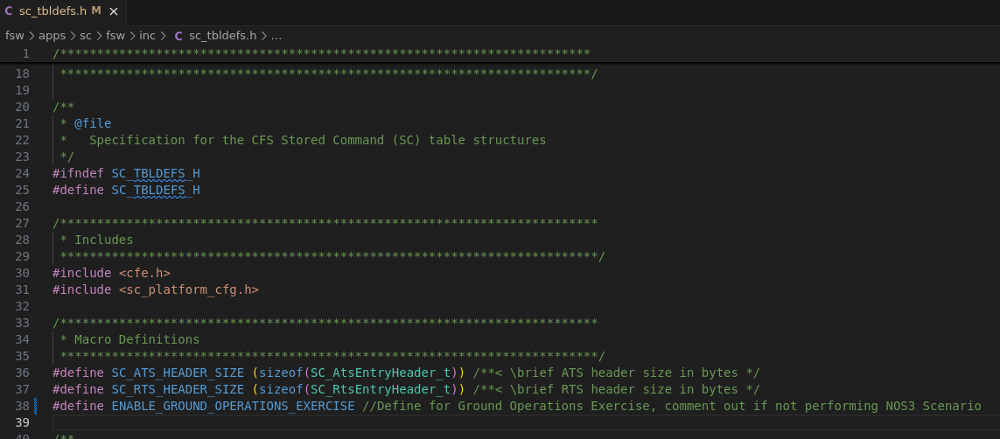

# 시나리오 - 무작위 오류가 있는 지상 운영(Ground Operations with Random Errors)

이 시나리오는 실습(lab exercise)용으로 설계되었습니다. 여러분은 위성을 명령하고 감시하는 책임을 가진 지상 운영자입니다. 평소 업무를 수행하던 중 위성에서 이상 현상을 발견하게 됩니다. 이 실습은 오직 COSMOS GSW만을 사용해 위성을 성공적으로 유지하고, 오류를 식별하며, 위성이 예상대로 정상 상태에 있도록 해결책을 제공하는 것을 목표로 합니다.

이 시나리오는 2025년 6월 20일에 마지막으로 업데이트되었으며, 당시 `dev` 브랜치를 기반으로 작성되었습니다.

## 학습 목표

이 시나리오를 마치면 다음과 같은 목적으로 COSMOS GSW를 효과적으로 사용할 수 있게 됩니다:
* 위성 명령하기.
* 텔레메트리 감시하기.
* 이상 현상 디버깅하기.
이 모든 것을 위성이 시뮬레이션된 궤도에 있는 동안 수행합니다.

## 사전 준비 사항

시나리오를 실행하기 전에 다음 단계를 완료하세요:
* [시작하기](./NOS3_Getting_Started.md)
  * [설치](./NOS3_Getting_Started.md#installation)
  * [실행](./NOS3_Getting_Started.md#running)
* 이 시나리오는 사용자가 COSMOS로 위성을 명령하고 텔레메트리를 확인하는 방법을 이미 알고 있다고 가정합니다.

## 실습 과정
이 시나리오는 위성의 지상 운영을 시뮬레이션하도록 의도되었습니다. GSW(COSMOS)를 활용해 위성 전체의 상태(health)를 감시하는 것이 지상 운영자로서 여러분의 역할입니다.

이 시나리오를 활성화하려면 NOS3에서 주석 처리가 해제되어야 하는 매크로가 있습니다. 이 매크로는 **nos3/fsw/apps/sc/fsw/inc/sc_tbldef.h**에서 찾을 수 있습니다. 아래를 참고하세요:

매크로의 주석을 해제한 뒤, `nos3-mission.xml`(`sc-mission-config.xml`)에서 NOS3가 기본 임무 설정으로 되어 있는지 확인하세요. 그런 다음 NOS3 프로젝트 디렉토리 안의 터미널에서 **make clean**과 **make**를 실행하여 빌드하세요.

**COSMOS 창을 제외한 모든 창을 즉시 최소화하세요!**

위성 지상 운영을 정상적으로 재현하기 위해 COSMOS를 제외한 모든 것을 최소화합니다. 이 실습을 위해 이 창들을 계속 최소화된 상태로 유지해 주세요.

또한 이 실습을 위해, 우리는 궤도 패스에 대해 무제한의 시간이 있으며 따라서 위성과 지속적으로 통신할 수 있다고 가정합니다. 실제로는 궤도 패스의 시간대가 제한적입니다.

힌트: 10개의 "오류" 또는 이상 현상이 촉발되어 있습니다. 이러한 이상 현상을 식별하고, 위성을 명령하여 해결하거나 위성을 정상 상태로 되돌리는 것은 여러분의 몫입니다.

막힌다면, fsw 창이 위성 내부에서 무슨 일이 일어나고 있는지 파악하는 데 도움을 줄 것입니다.

## 결론

이제 사용자는 지상 운영자로서 위성의 이상 현상을 식별하고 위성 전체의 상태와 안전을 감시할 수 있게 되었습니다.

