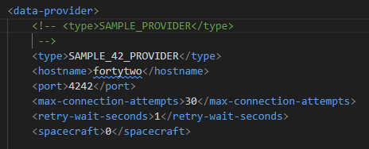
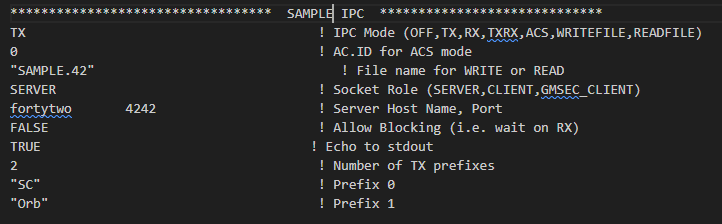
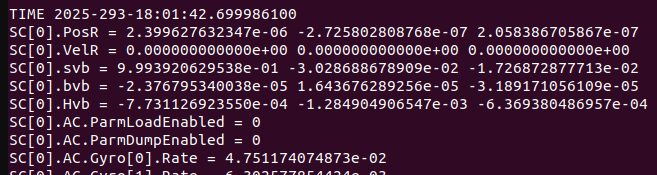
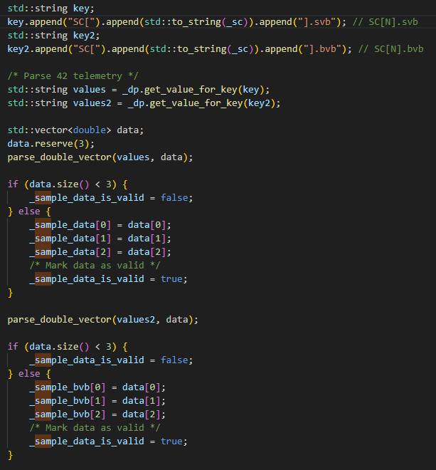
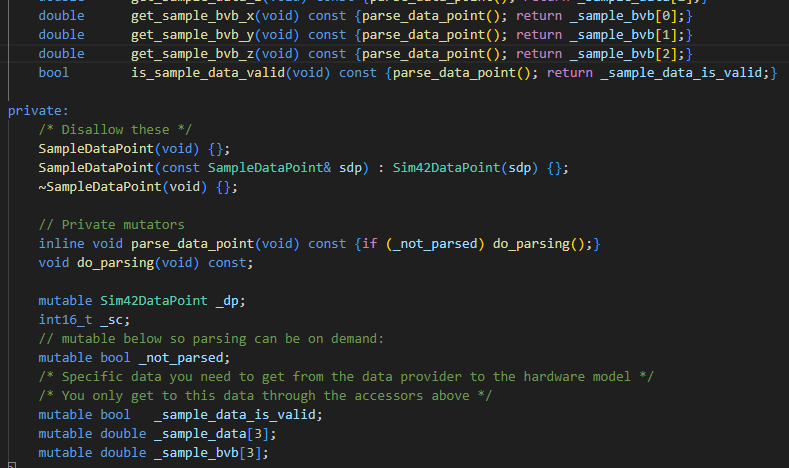
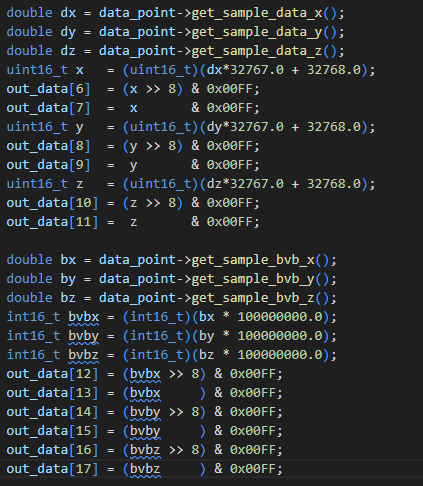
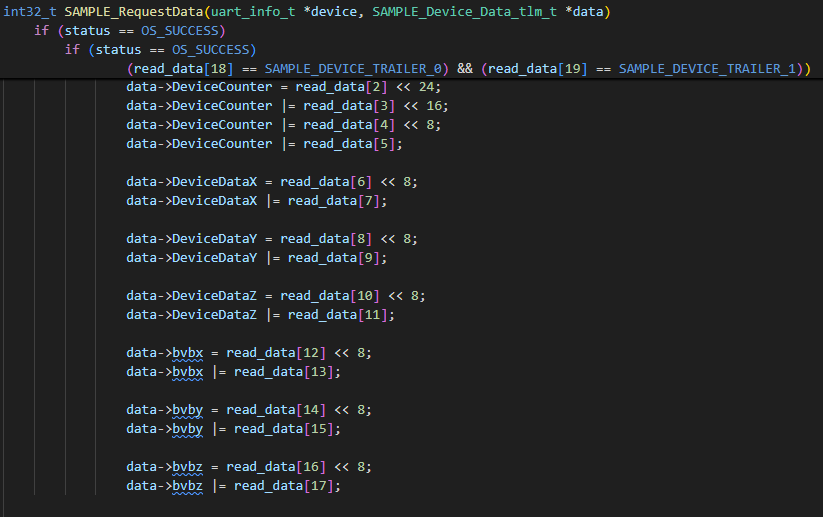
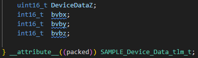
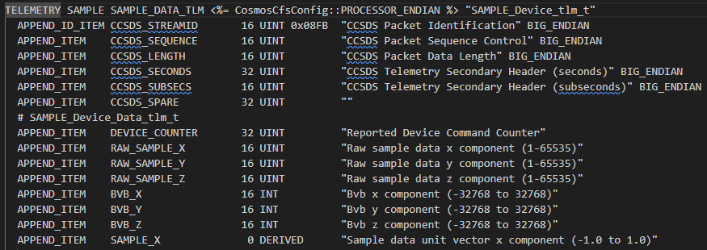
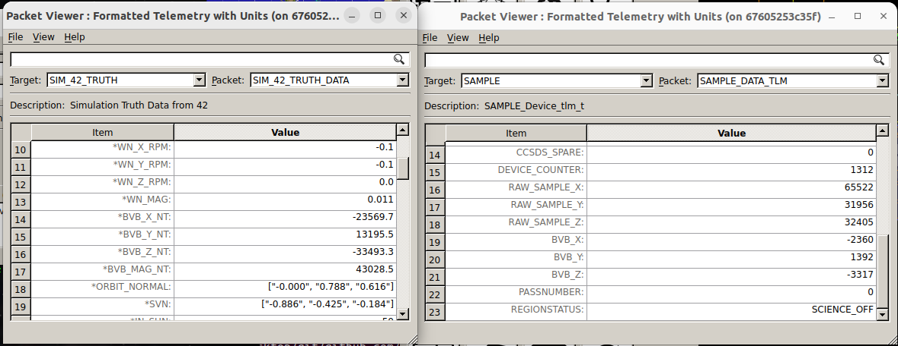

# 시나리오 - 시뮬레이터 확장 (Simulator Expansion)

이 시나리오는 시뮬레이터를 확장하는 방법을 설명하기 위해 작성되었습니다.
이번 시나리오에서는 42의 추가 데이터를 사용하도록 Sample 시뮬레이터를 확장해 봅니다.
데이터가 전체 시스템을 어떻게 통과하는지 확인할 수 있습니다. 데이터는 42에서 시작하여 시뮬레이터로 전달되고, 시뮬레이터는 컴포넌트 애플리케이션과 통신한 다음 해당 컴포넌트 애플리케이션이 COSMOS 텔레메트리(Telemetry)를 발행합니다.

이 시나리오는 2025년 6월 6일에 마지막으로 업데이트되었으며 당시 `dev` 브랜치 [53d4627]를 활용했습니다.

> 💡 **초보자 가이드: 42 시뮬레이터와 COSMOS, Telemetry가 뭔가요?**
> - **42**: NASA에서 개발한 우주비행체 자세 및 궤도 시뮬레이터입니다. 위성이 우주 공간에서 어떻게 움직이고 기울어지는지 물리적으로 계산해 줍니다.
> - **COSMOS**: 위성이나 시스템의 상태를 모니터링하고 명령을 보낼 수 있는 지상국(Ground Station) 사용자 인터페이스/소프트웨어입니다.
> - **Telemetry(텔레메트리/원격 측정 데이터)**: 위성이 자신의 상태(센서값, 온도, 위치 등)를 지상국으로 보충 전달하는 데이터 패킷을 의미합니다.

## 학습 목표

이 시나리오를 마치면 다음 작업을 수행할 수 있게 됩니다:
* 42 창에서 42 출력을 켜기.
* 42로부터 추가 데이터를 가져오도록 Sample 시뮬레이터 기능 향상하기.
* 비행 소프트웨어(FSW)에 추가 데이터를 제공하도록 Sample 시뮬레이터 기능 향상하기.
* 시뮬레이터로부터 추가 데이터를 수신하고, 이 데이터에 대한 추가 텔레메트리를 제공하도록 Sample 비행 소프트웨어 기능 향상하기.
* 추가 데이터에 대한 텔레메트리를 확인할 수 있도록 Sample 텔레메트리 정의 수정하기.
* NOS3를 실행하고 Sample 텔레메트리에서 추가 데이터를 확인하기.

## 사전 준비 사항 (Prerequisites)

시나리오를 시작하기 전에 다음 단계를 완료하세요:
* [시작하기](./NOS3_Getting_Started.md)
  * [설치](./NOS3_Getting_Started.md#installation)
  * [실행](./NOS3_Getting_Started.md#running)
* 이 시나리오를 진행하기 위한 추가 파일 변경이나 특별한 설정은 필요하지 않습니다.

## 단계별 실습 (Walkthrough)

추가적인 42 데이터를 사용하기 전에, 42가 어떤 데이터를 제공하는지 확인해보는 것이 좋습니다. NOS3가 실행 중일 때 42에서 들어오는 모든 데이터를 볼 수 있도록 42 터미널 창에서 42 출력을 켜보겠습니다.

### 42 창에서 42 출력 켜기

먼저, 42 데이터 제공자(Data Provider)를 활성화합니다:
* `cfg/sims/nos3-simulator.xml` 파일을 수정합니다.
  * "sample_sim" 시뮬레이터 섹션을 찾습니다.
  * "SAMPLE_PROVIDER" 섹션을 주석 처리하고 "SAMPLE_42_PROVIDER" 섹션의 주석을 해제합니다:

다음으로 42 데이터가 이동할 목적지를 올바르게 알고 있는지 확인해야 합니다:
* `cfg/InOut/Inp_IPC.txt` 파일을 수정합니다.
* 이전 섹션과 동일하게 11줄로 구성된 섹션을 맨 끝에 추가합니다.
  * 파일 이름을 "SAMPLE.42"로 변경합니다.
  * 호스트 포트를 `4242`로 변경하고 표준 출력(echo to stdout)을 `TRUE`로 설정합니다.

이제 테스트를 진행합니다:
* 2번째 줄의 숫자를 현재 값보다 1 큰 값으로 변경합니다.
* `make`를 실행한 후 `make launch`를 실행합니다.
이제 42 터미널 창에 42의 출력 데이터가 표시되어야 합니다:

`make stop`을 실행하여 정리합니다.

### 42로부터 추가 데이터를 가져오도록 Sample 시뮬레이터 기능 향상하기

이제 데이터를 볼 수 있게 되었으므로 자기장 벡터(bvb) 정보를 가져오는 기능이 유용하다고 판단했습니다:
* `components/sample/sim/src/sample_data_point.cpp` 파일을 수정합니다.
* "SC[0].bvb" 데이터를 추출하기 위한 키(Key)를 추가합니다.
* 해당 키의 값을 가져오는 코드를 추가합니다.
* "bvb" 데이터를 파싱하고 저장하는 로직을 추가합니다.

* "SampleDataPoint" 클래스에 "_sample_bvb" 배열을 추가하고 Getter 메서드를 추가합니다(`sample_data_point.hpp`). 이 파일은 `components/sample/sim/inc` 경로에서 찾을 수 있습니다.

### Sample 시뮬레이터 확장하기

Sample 시뮬레이터가 이제 선택한 추가 데이터를 수신하고 있지만, 아직 어디에도 사용되거나 전송되지 않고 있습니다. 이 데이터를 FSW(비행 소프트웨어)로 전달하도록 변경할 수 있습니다:
* `components/sample/sim/src/sample_hardware_model.cpp` 파일을 수정합니다.
* `create_sample_data()` 메서드의 out_data에 "bvb" 데이터를 추가합니다. 메서드 상단에 정의된 out_data 크기(`out_data.resize(14, 0x00)`)를 기존 14에서 20으로 늘려야 함을 잊지 마세요.

이제 테스트를 위해 전체 시스템을 실행합니다:
* `make clean`, `make`, 그리고 `make launch`를 차례로 실행합니다.
* 42 창에 42 출력이 표시되어야 하며, sample sim 창에는 42 데이터를 가져오기 위한 연결 상태가 표시되어야 합니다.
* `make stop`을 실행합니다.

### Sample 비행 소프트웨어(FSW) 기능 향상하기

다음으로 sample_device의 기능을 확장합니다:
* `components/sample/fsw/shared/sample_device.c` 파일을 수정합니다.
* `SAMPLE_RequestData()` 함수 내에 "bvb" 데이터 읽기 로직을 추가합니다.
**참고: 데이터 버퍼의 크기를 늘렸으므로 적절한 트레일러 메시지(Trailer Message)를 찾기 위해 read_data의 인덱스 18과 19를 확인하도록 조건문을 변경합니다.**

* `components/sample/fsw/shared/sample_device.h` 파일을 수정합니다.
* `SAMPLE_Device_Data_tlm_t` 구조체에 "bvb" 멤버를 추가합니다.

### Sample 텔레메트리 정의 확장하기

마지막으로 bvb 데이터를 포함하도록 Sample 텔레메트리 정의를 확장합니다:
* `components/sample/gsw/SAMPLE/cmd_tlm/SAMPLE_TLM.txt` 텔레메트리 정의 파일을 수정합니다.
* "SAMPLE_DATA_TLM" 텔레메트리 패킷에 "bvb" 텔레메트리 포인트를 추가합니다.

### NOS3 실행 및 Sample 텔레메트리에서 추가 데이터 확인하기

위와 같이 시뮬레이터 확장이 완료되면 NOS3를 실행하여 테스트할 수 있습니다. 다음과 같은 화면이 나타나야 합니다:

### 결론

이번 시나리오에서는 Sample 앱에 42 데이터를 추가로 도입해 보았습니다. 이러한 과정은 새로운 시뮬레이터를 완전히 처음부터 만들거나 기존 시뮬레이터를 확장/향상시킬 때도 거의 동일하게 적용됩니다.