# 시나리오 - ADCS 둘러보기

이 시나리오는 NOS3의 기본적인 자세 결정 및 제어 시스템(ADCS)을 둘러보기 위해 작성되었습니다.

이 시나리오는 2025년 6월 10일에 마지막으로 업데이트되었으며, 당시 `dev` 브랜치[a3e7c100]를 기준으로 합니다.

## 학습 목표
이 시나리오를 마치면 다음을 할 수 있어야 합니다:

* 자세 결정 및 제어와 센서 퓨전(sensor fusion) 구성 요소의 기본을 이해합니다.
* 몇 가지 기본적인 ADCS 모드와 그 작동 방식을 이해합니다.
* ADCS가 자신의 기능을 수행하기 위해 활용하는 다양한 센서와 액추에이터를 이해합니다.
* cFS 버스와, 센서 퓨전 구성 요소가 데이터를 받아들이고 다른 구성 요소에 명령을 내리는 데 이를 어떻게 활용할 수 있는지 이해합니다.

## 사전 요구사항
시나리오를 실행하기 전에 다음 단계를 완료하세요:

* [시작하기](./NOS3_Getting_Started.md)
  * {ref}`설치 <installation>`
  * {ref}`실행 <running>`

## 둘러보기

### 소개
자세 결정 및 제어 시스템(ADCS)은 NOS3의 다른 구성 요소들과는 다릅니다. 이는 센서나 액추에이터와 직접 인터페이스하기보다는 센서 퓨전 구성 요소 역할을 하기 때문입니다. ADCS는 다양한 센서와 액추에이터로부터 입력을 받아, 이를 이용해 지정된 대로 우주선의 방향을 잡고 항법을 수행합니다. NOS3의 ADCS에는 네 가지 주요 모드가 탑재되어 있습니다: Passive(수동), Sunsafe(태양 안전), Inertial(관성), BDOT.

> 💡 **초보자 가이드**
> "센서 퓨전(sensor fusion)"이란, 여러 종류의 센서에서 들어오는 정보를 하나로 종합해서 더 정확하고 신뢰할 수 있는 하나의 결론(여기서는 "우주선이 지금 어느 방향을 보고 있는가")을 얻어내는 기법이에요. 센서 하나만 믿으면 오차나 오작동에 취약하지만, 여러 센서 정보를 함께 활용하면 훨씬 안정적인 판단이 가능합니다.

### 모드
* Passive(수동) 모드는 우주선에 대한 ADCS의 제어를 끄고, 운영자가 수동으로 액추에이터를 명령하도록 남겨둡니다.

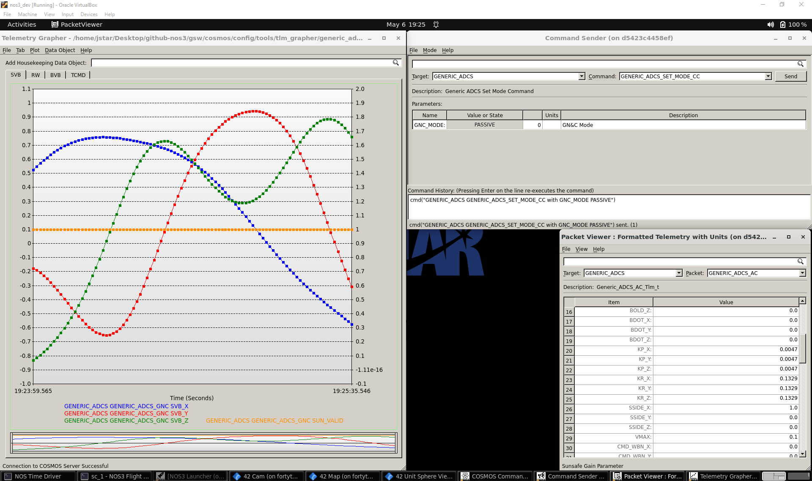

* Sunsafe(태양 안전) 모드는 정밀 태양 센서(Fine Sun Sensor)와 조악 태양 센서(Coarse Sun Sensor)를 활용해 우주선이 햇빛을 받고 있는지, 그리고 우주선의 본체 좌표계(body frame)와 태양 단위 벡터 사이의 방향을 판단합니다. 그런 다음 반작용 휠(reaction wheel)과 자기토커(magnetorquer)를 이용해 우주선이 충전에 최적인 자세를 유지하도록 지향시킵니다.

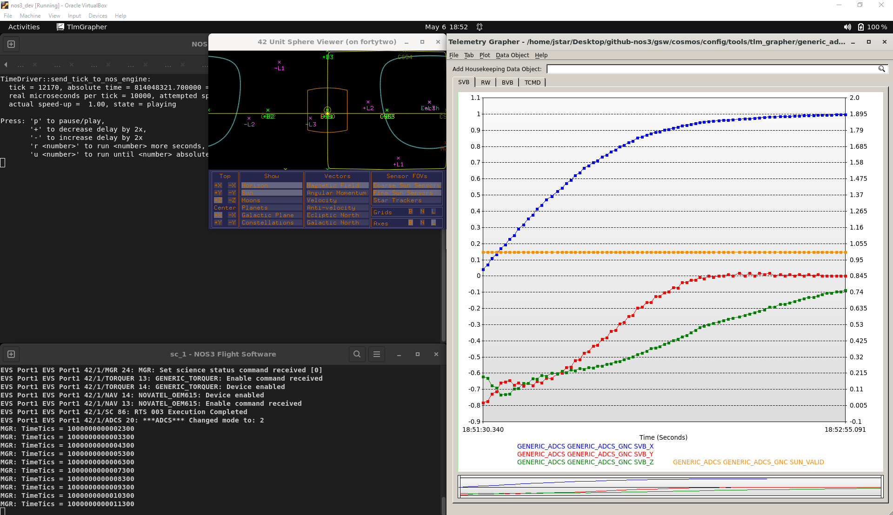

* Inertial(관성) 모드는 스타 트래커와 관성 측정 장치(IMU)의 데이터를 반작용 휠, 자기토커와 함께 활용하여 관성 기준 좌표계에 대해 우주선의 방향을 잡습니다.

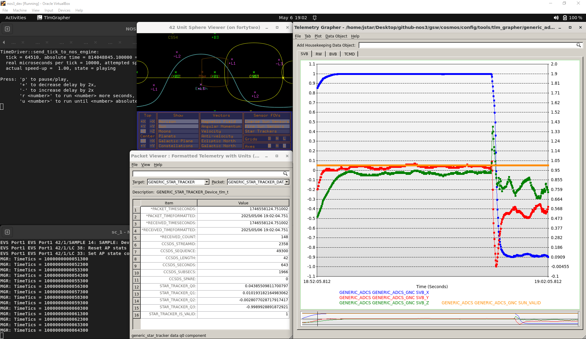

* BDOT 모드는 IMU와 자력계(Magnetometer)의 데이터를 반작용 휠, 자기토커와 함께 사용해 우주선을 안정화시키고 회전 속도를 0으로 만듭니다.

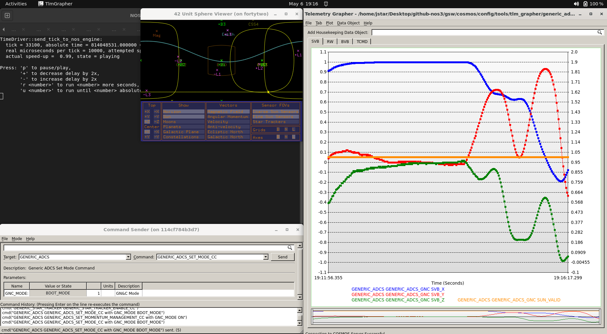

### 센서
* 조악 태양 센서(CSS)는 우주선의 각 면마다 하나씩 위치하며, 그 위에 얼마나 많은 빛이 비치고 있는지에 따라 전압 출력을 제공합니다. 이를 통해 특정 면이 햇빛을 받고 있는지 대략적으로 알 수 있습니다.

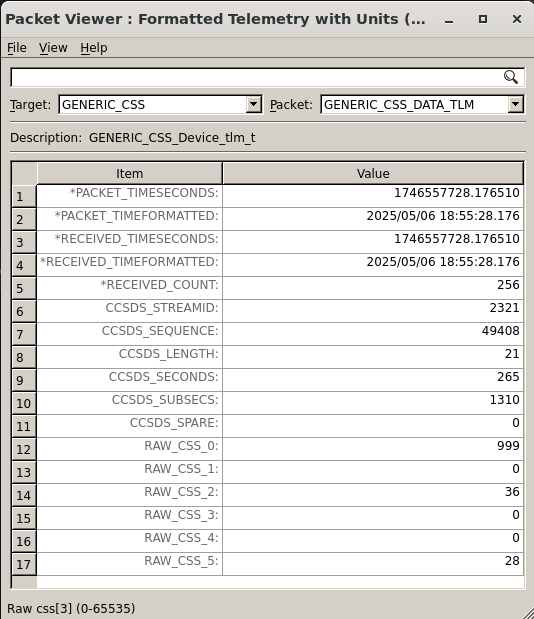

* 정밀 태양 센서(FSS)는 센서가 햇빛을 받고 있는 한, 태양에 대한 우주선의 방향을 더 정확하게 읽어냅니다.

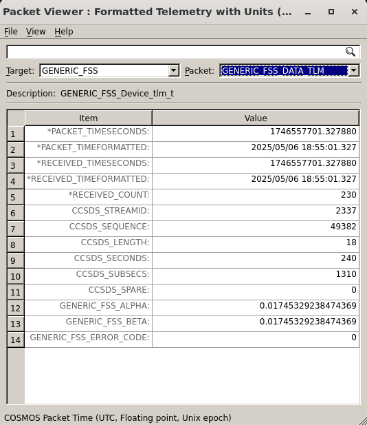

* 관성 측정 장치(IMU)는 가속도계와 자이로스코프를 활용해 각각 선형 가속도와 각속도를 측정합니다.

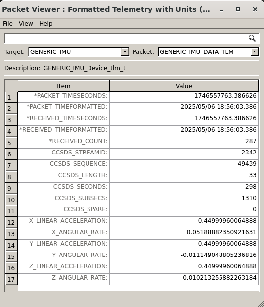

* 자력계(MAG)는 지구 자기장에 대한 우주선의 방향을 측정합니다. 이를 통해 우주선의 본체 좌표계를 지구 자기장과 연관지어, 각 자기토커가 어느 방향으로 우주선을 움직일지를 알 수 있습니다.

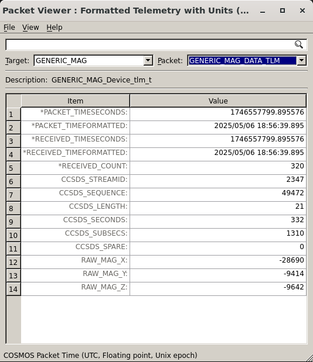

* 스타 트래커(ST)는 별들의 이미지와 별 목록(star catalog)을 이용해 고정된 관성 기준 좌표계에 대한 우주선의 방향을 판단합니다.

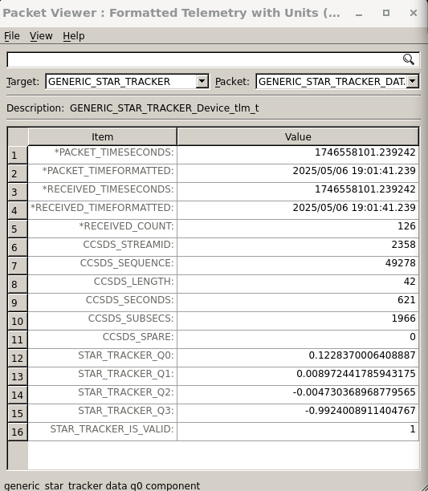

### 액추에이터
* 반작용 휠(RW)은 회전하여 토크를 발생시킴으로써 우주선이 회전하고 스스로를 지향할 수 있게 해주는 플라이휠입니다. 각 축마다 하나씩 있으며, 해당 축에서 어느 방향으로든 회전할 수 있습니다.

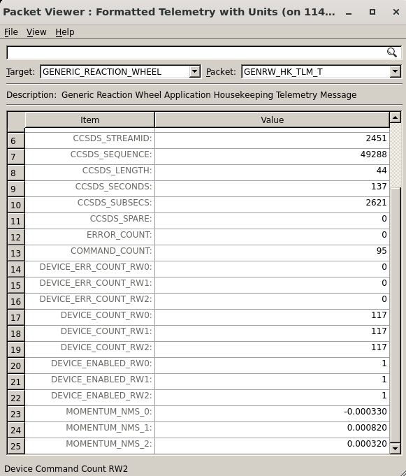
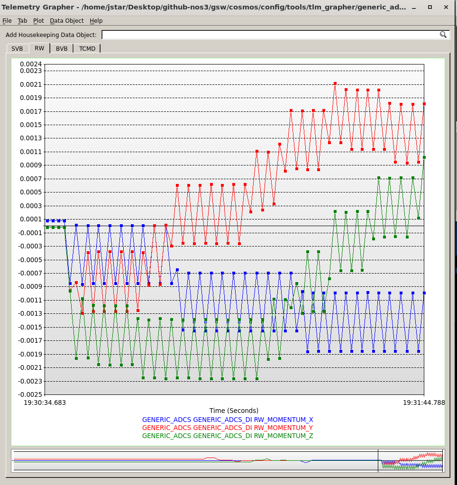
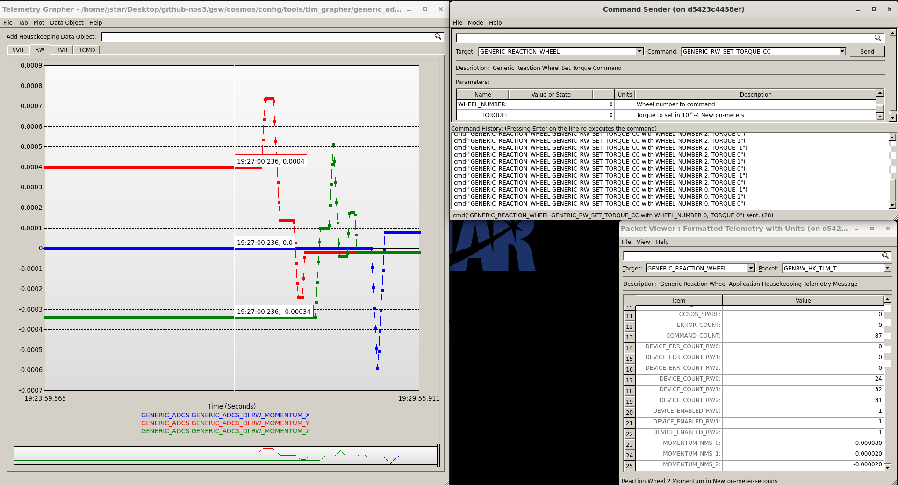

* 자기토커(Magnetorquer), 또는 토커(Torquer)는 전자석과 지구 자기장을 이용해, 지구 자기장에 정렬된 형태로 반작용 휠보다 약한 토크를 만들어냅니다. 다만 반작용 휠은 한계치에 도달하기 전까지만 일정량의 토크를 처리할 수 있기 때문에, 토커는 반작용 휠에서 각운동량을 서서히 덜어내는 데 사용될 수 있습니다.

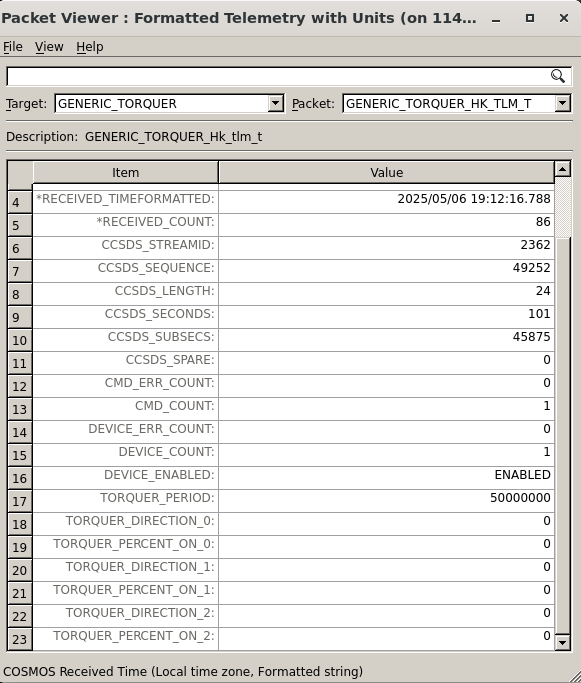
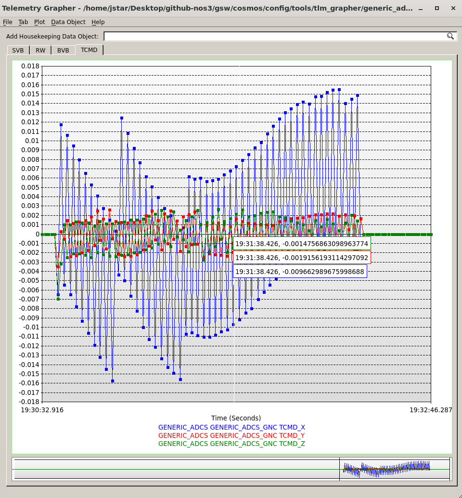

* 추력기(Thruster)는 이 예시 임무에서는 ADCS와 연결되어 있지도, 완전히 개발되어 있지도 않지만, 실제로는 선형 축에서의 궤도 조정과 항법을 가능하게 해줍니다. 여러 개를 함께 사용하면 회전축에서의 조정도 가능하게 해줄 수 있으며, 지구 궤도에서 자기토커가 하는 것과 유사한 목적(각운동량 덜어내기)을 달성하는 역할로 심우주 임무에서 사용됩니다.

### 입력 처리와 출력
이 임무는 cFS를 사용하므로, 버스 기반 아키텍처 위에 구축되어 있습니다. 모든 메시지는 하나의 단일 버스에 게시되며, 다른 구성 요소들은 이를 구독할 수 있습니다. 이 때문에 ADCS의 센서 퓨전은 ADCS 내 다양한 센서들의 메시지를 구독하는 방식으로 작동하며, 이를 통해 데이터를 자신에게 읽어들여 그에 따라 동작합니다. 이 구독 과정은 **/nos3/components/generic_adcs/fsw/cfs/src/generic_adcs_app.c**의 `Generic_ADCS_AppInit` 메소드에서 일어납니다. 그곳에서 볼 수 있듯이, 센서/액추에이터(MAG, FSS, CSS, IMU, RW, Torquer, ST)에 해당하는 다른 cFS 앱들을 구독하지만, ADCS와 연관된 다양한 42 설정, 구체적으로는 Inp_DI.txt, Inp_ADAC.txt, Inp_DO.txt도 구독하거나 초기화합니다. 이는 ADCS가 동역학 시뮬레이터와 올바르게 연결되도록 보장합니다.

그런 다음 ADCS 앱이 명령을 처리할 때, 자신의 지상 명령과 텔레메트리 요청은 걸러내고, 앞서 언급한 센서들로부터 오는 각 텔레메트리 패킷을 확인합니다. 이 시점에서, 그 패킷들에 대해 인제스트(ingest) 메소드를 호출해 데이터를 자신의 "*구조체(struct)*"로 파싱해내고, 자신의 텔레메트리 값을 업데이트합니다. 더 자세한 내용을 원한다면 "generic_adcs_ingest.c" 파일을 살펴보세요. 이 파일은 **/nos3/components/generic_adcs/fsw/cfs/src/generic_adcs_ingest.c**에서 찾을 수 있습니다.

이 데이터는 이후 ADAC(Attitude Determination and Attitude Control, 자세 결정 및 자세 제어) 메소드에서 내부적으로 사용됩니다. 이는 스케줄러와 함께 호출되며, 위에서 언급한 앱 내의 동일한 함수에서 파싱되어, **/nos3/components/generic_adcs/fsw/cfs/src/generic_adcs_adac.c** 내의 한 메소드를 호출합니다. 이 메소드는 인제스트된 데이터를 내부 데이터 구조체로 불러오고 ADCS가 어떤 모드에 있는지 판단합니다. 다음으로, 관련 함수를 호출하여 원하는 결과를 달성하기 위해 어떤 액추에이터 명령을 내보내야 할지 그 데이터를 이용해 판단하고, 그 명령들을 구성합니다.

그런 다음, ADAC가 구성한 이 명령들은 출력 메소드를 통해 전송되며, 이 메소드는 cFS 버스를 통해 전송될 수 있는 적절한 CCSDS 패킷을 구성합니다. 이 패킷들은 이후 관련 액추에이터에서 수신되고 처리되어 원하는 효과를 만들어냅니다. 더 자세한 내용을 원한다면 "generic_adcs_output.c" 파일을 살펴보세요. 이 파일은 **/nos3/components/generic_adcs/fsw/cfs/src/generic_adcs_output.c**에서 찾을 수 있습니다.

### 예시
Sunsafe 모드의 경우, ADCS 시스템은 FSS와 CSS로부터 태양 벡터 값과 그 유효성 신호를 받아들입니다. 그런 다음 이 텔레메트리를 활용하여 우주선이 햇빛을 받고 있는지, 그리고 우주선의 본체 좌표계와 태양 단위 벡터 사이의 방향을 판단합니다. 그런 다음 ADCS는 우주선이 태양을 제대로 마주하도록 지향시키기 위한 토크 명령을 보냅니다. 코드에서 이것이 어떻게 작동하는지 보고 싶다면 **/nos3/components/generic_adcs/fsw/cfs/src/generic_adcs_adac.c**의 'AC_sunsafe' 메소드를 살펴보세요. 이 파일은 **/nos3/components/generic_adcs/fsw/cfs/src/**에서 찾을 수 있습니다.
