# 시나리오 - 과학 관측 모드 중 장치 결함(Device Fault)

이 시나리오는 위성이 결함 감지 및 수정(Fault Detection & Correction, FDC)을 수행하는 방법을 예시로 보여주기 위해 만들어졌습니다. 또한 Actionpoint(AP, 실행점), Watch Point(WP, 감시점), Real-Time Sequence(RTS, 실시간 시퀀스)를 정의하고, cFS FSW의 Limit Checker(LC, 한계값 검사기)와 Stored Command(SC, 저장 명령) 애플리케이션에서 이들이 어떻게 쓰이는지 예를 들어 보여줍니다.

> 💡 **초보자 가이드**: 결함 감지 및 수정(FDC)은 위성이 스스로 "어? 뭔가 이상한데?"를 감지하고, 사람이 개입하지 않아도 자동으로 안전한 상태로 대처하는 능력을 말합니다. 위성은 지상관제사가 실시간으로 지켜볼 수 없는 시간이 많기 때문에, 이런 자동 대응 능력이 매우 중요합니다.

이 시나리오는 2025년 6월 6일에 마지막으로 업데이트되었으며, 당시 `dev` 브랜치(커밋 [a3e7c100])를 기반으로 작성되었습니다.

## 학습 목표

이 시나리오를 마치면 다음을 할 수 있게 됩니다:
* 위성이 결함을 감지하고 스스로 리셋하는 결함 감지 및 수정 시나리오 구현하기.
* Watchpoint(감시점) 만들기.
* Actionpoint(실행점) 만들기.
* RTS 만들기.

## 사전 준비 사항

시나리오를 실행하기 전에 다음 단계를 완료하세요:
* [시작하기](./NOS3_Getting_Started.md)
  * {ref}`설치 <installation>`
  * {ref}`실행 <running>`
* 이 시나리오에는 추가적인 파일 변경이나 특별한 설정이 필요하지 않습니다.
* 이 시나리오는 사용자가 COSMOS로 위성을 명령하는 방법, Packet Viewer를 통해 텔레메트리를 확인하는 방법, FSW 터미널 창을 찾는 방법을 이미 알고 있다고 가정합니다.

## 실습 과정

우리에게는 이상하게 동작하는 위성이 하나 있습니다. 지상에서 통합 및 시험을 진행할 때는 모든 것이 정상적으로 동작했습니다. 하지만 궤도에 오른 후, 우리의 과학 계측기(Science Instrument)가 간헐적으로 멈춰버리고 있습니다 - 그리고 이 계측기는 위성이 존재하는 이유 그 자체입니다.

텔레메트리를 검토한 결과, 우리 과학자들은 다음 두 조건이 모두 충족되면 이 오류를 감지할 수 있다는 것을 발견했습니다:
* 위성이 과학 관측 모드에 있음 - 즉, Manager의 Spacecraft_Mode가 'Science'로 설정됨.
* 장치가 제대로 통신하고 있지 않음 - 즉, Sample_HK_TLM의 Device_Status 필드가 0이 아님.

과학자들은 이 상황에서 가장 안전한 대처 방법은, 위성 건강 상태를 평가하고 최대한 지연 없이 과학 관측을 재개할 수 있도록 위성을 즉시 재부팅하여 안전 모드(safe mode)로 진입시키는 것이라는 결론을 내렸습니다.

비행 소프트웨어와 지상 소프트웨어 전문가로서 우리의 임무는 이를 실제로 구현하는 것입니다.

완성된 결과물이 어떤 모습인지 보려면 아래 실습 과정을 따라가 보세요.

시작하기 전, `nos3-mission.xml`(`sc-mission-config.xml`)에서 기본 임무 설정으로 NOS3를 실행했는지 확인하세요.

### 문제 상황 정리하기

문제를 해결하기 위해서는 먼저 문제를 재현해야 합니다. 이것이 첫 번째 섹션의 주제입니다.

---
#### 위성을 과학 관측 모드로 명령하기

NOS3가 실행되고 FSW가 ADCS Mode 2(Sunpoint 모드, 태양 지향 모드)에 진입하면, 위성을 과학 관측 모드로 명령할 수 있습니다. 아래에서 이를 확인할 수 있습니다:

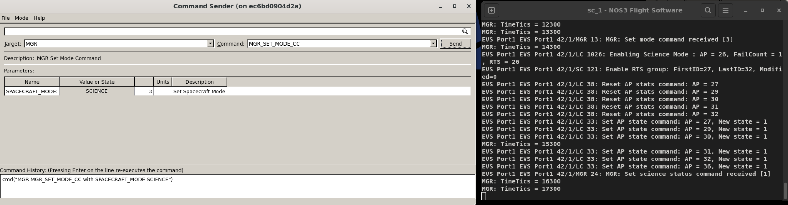

이 FSW 명령은 위성을 과학 관측 모드로 명령하여, 이 모드에 해당하는 RTS를 실행시키고 Actionpoint를 활성화합니다:
* 이번 시나리오에서는 과학 관측 모드에서 활성화되는 Actionpoint 36을 지켜볼 것입니다.
* `mgr_set_conus` 명령을 값 1로 보내야 합니다.
* 이렇게 하면 위성이 과학 관측 모드에 있으면서 동시에 북미 상공을 지나갈 때 Sample Device(샘플 장치)가 활성화됩니다. 이 명령은 아래와 같습니다:

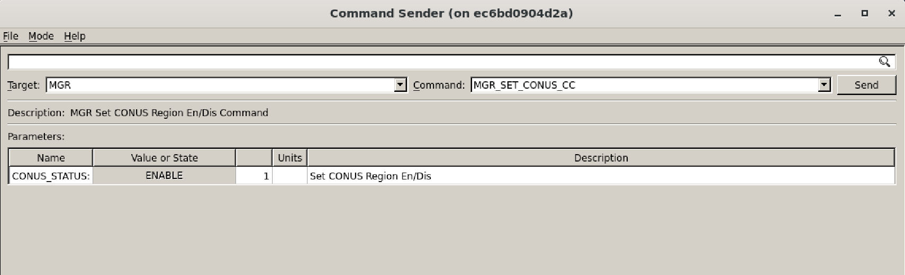

---
#### Sample 장치로 시뮬레이션된 결함 발생시키기

이제 위성이 북미 상공을 지나갈 때까지 기다려 샘플 장치가 활성화되게 하거나, 실습을 빠르게 진행하기 위해 수동으로 활성화할 수 있습니다.

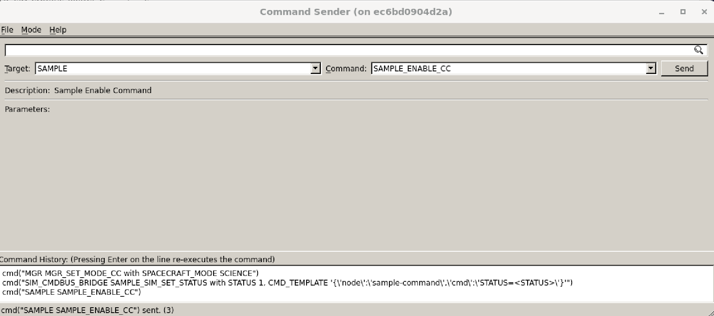

샘플 장치가 활성화되면, 아래 그림처럼 FSW 창에 cFS에서 'sample device enabled'라는 이벤트가 표시되는 것을 볼 수 있습니다. 또한 AP 36이 활성화된 점에 유의하세요.

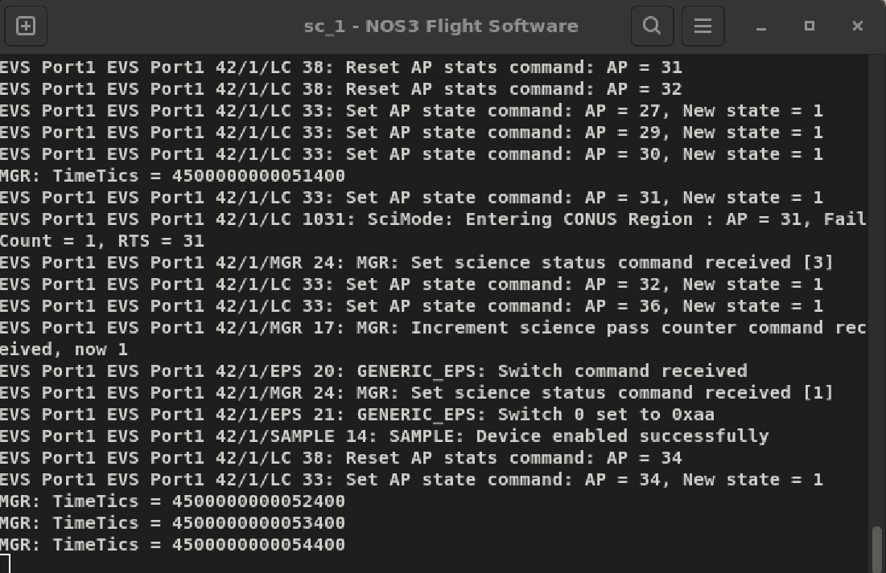

이제 샘플 시뮬레이터가 샘플 애플리케이션과 통신하고 있습니다.
* 샘플 애플리케이션은 정해진 주기로 장치에 데이터를 요청합니다.
* 다만 RTS를 테스트하려면 샘플 애플리케이션에 결함이 있어야 하는데, 다음과 같이 시뮬레이션할 수 있습니다:
  * Command Sender에서 SIM_CMD_BUS_BRIDGE 타겟으로 변경하세요.
  * 이 인터페이스를 통해 시뮬레이터를 직접 명령할 수 있어서, 비행 소프트웨어가 어떻게 반응하는지 볼 수 있습니다. 일종의 '뒷문(backdoor)' 역할을 합니다.

상태값(status)을 1로 설정하는 SAMPLE_SIM_SET_STATUS 명령을 보내봅시다.
* 이 명령은 샘플 장치에서 결함이 감지된 상황을 시뮬레이션합니다.

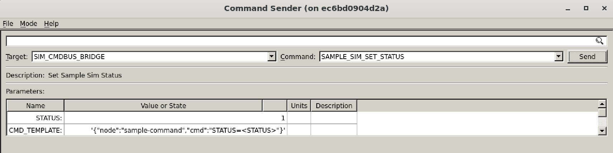

이제 샘플 장치에서 결함 감지를 시뮬레이션했으므로, Actionpoint 36이 트리거되어 RTS 36을 실행시켜야 합니다. 아래 그림에서 이를 확인할 수 있습니다:

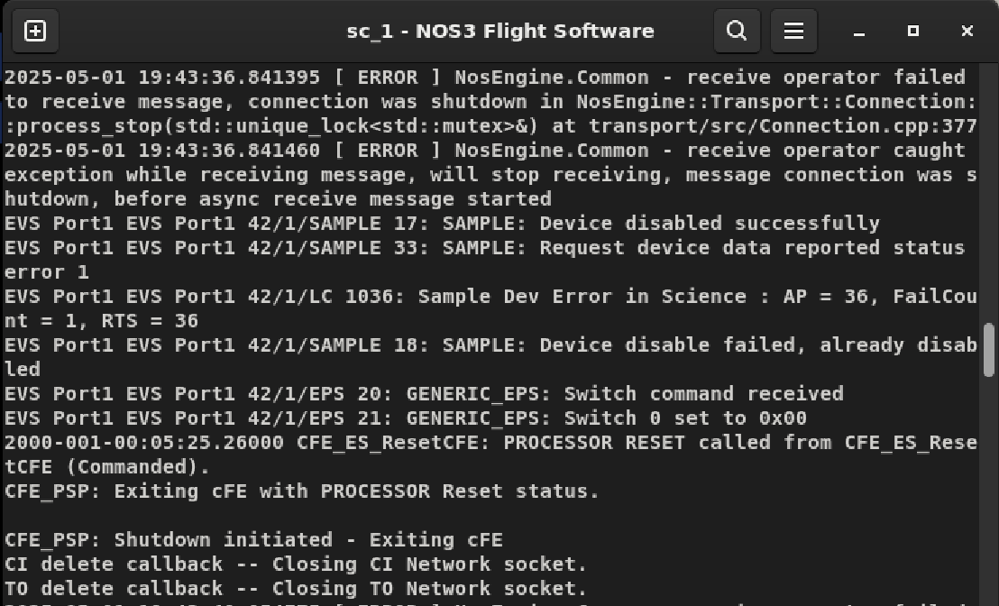

* 이 AP는 위성에 전원 순환(power cycle) 이벤트를 일으키는 RTS를 트리거합니다. 따라서 FSW가 리셋되어 위성을 다시 안전 모드로 부팅합니다.
* 아래와 같이 FSW 창에 STF 스플래시 화면이 다시 뜨는 것을 볼 수 있습니다:

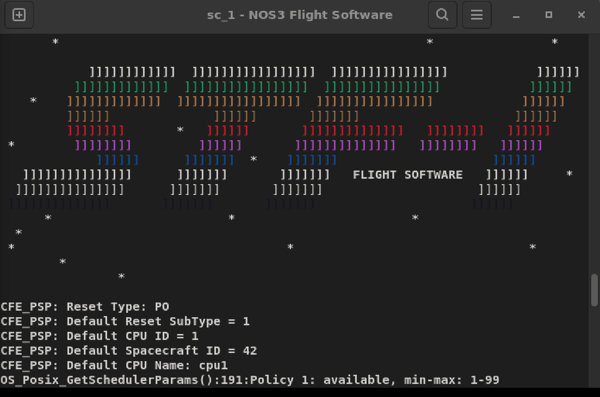

* 중요한 점은, 안전 모드로 부팅할 때 Actionpoint 36을 기본적으로 비활성화해두었지만, Science Mode에 있을 때는 활성화된다는 것입니다. 이는 위성이 계속 반복적으로 리셋되는 것을 막기 위함입니다.
* 이러한 순환 리셋을 방지하려면, 적절한 RTS 절차 안에서 이와 같은 Actionpoint를 비활성화하는 것이 중요합니다. 특히 향후 사용자가 이런 식으로 더 많은 AP, WP, RTS를 추가하려는 경우라면 더욱 그렇습니다.

### 문제 해결하기

문제를 재현했다면, 이제 해결에 나설 수 있습니다. 우리는 Watchpoint(감시점), Actionpoint(실행점), 그리고 새로운 RTS 36의 조합을 사용해 이를 해결할 것입니다. 이 개념들은 아래에서 설명합니다.

#### cFS용 Watchpoint 만들기

Watchpoint(WP)는 개별 텔레메트리 값을 감시하여 미리 정의된 조건을 위반하는지 판단하는 데 사용됩니다. Watchpoint는 결함 감지 및 수정(FDC)의 기본 구성 요소입니다. WP는 **단 하나**의 텔레메트리 포인트를 감시하며, WP를 포함한 패킷이 수신될 때마다 LC 애플리케이션이 WP를 업데이트합니다. Watchpoint는 한 번만 정의하면 되며, 여러 Actionpoint에서 재사용할 수 있습니다.

기본적인 Watchpoint 비교 옵션은 다음과 같습니다:
* Less Than (미만)
* Less Than or Equal (이하)
* Not Equal (같지 않음)
* Greater Than or Equal (이상)
* Greater Than (초과)

이번 시나리오에서, 우리 과학자들은 두 가지 조건이 충족되면 문제를 감지할 수 있다고 판단했습니다. 기존 Watchpoint를 확인해보면 그중 하나는 이미 존재한다는 것을 알 수 있습니다. WP 테이블을 살펴보고 이미 존재하는 WP가 무엇이고 번호가 몇 번인지 확인해보세요.

이미 하나는 존재하므로, 나머지 하나를 만들어야 합니다. 이 시나리오를 위해 **nos3/cfg/nos3_defs/tables/lc_def.wdt.c**의 LC 테이블에 WP 24를 이미 만들어 두었습니다. 이는 Sample HK에 있는 Device Status 텔레메트리 포인트를 추적합니다. 아래와 같습니다:

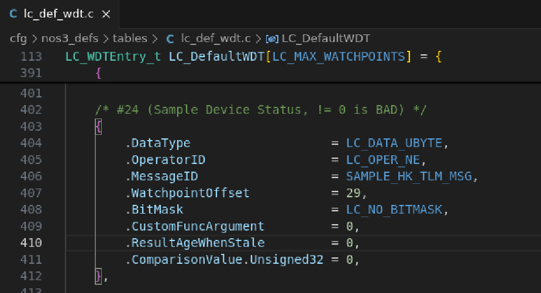

**watchpointoffset**이 29로 설정되어 있음에 유의하세요. 이는 해당 텔레메트리 포인트의 비트 오프셋(bit offset)이 232이기 때문입니다. 즉 232/8 = 29로, 이것이 우리 LC 테이블의 watchpointoffset에 필요한 바이트 수와 같습니다. 텔레메트리 포인트의 비트 오프셋은 COSMOS Packet Viewer에서 Sample Housekeeping 패킷 필드(Sample_HK_TLM->Device_Status)를 선택 -> 해당 필드 선택 -> 필드에서 우클릭 -> Details 선택을 통해 아래와 같이 확인할 수 있습니다:

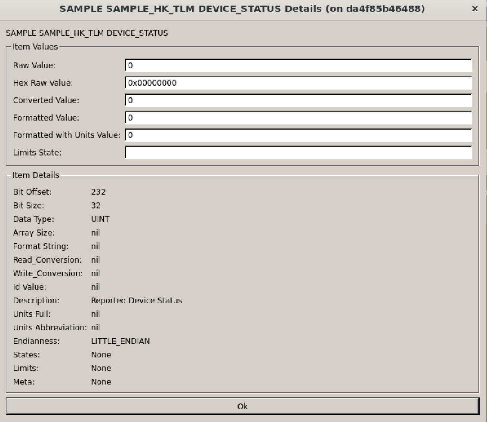

**오프셋 계산은 매우 중요하다는 점을 기억하세요.** 오프셋을 잘못 계산하면 위성에 심각한 결과를 초래할 수 있습니다.

---
#### cFS용 Actionpoint 만들기

Actionpoint(AP)는 Limit Checker(LC)에서 여러 WP의 조합을 평가하는 데 사용됩니다. 불리언 논리(boolean logic)를 사용해 WP들을 조합함으로써 더 의미 있는 평가를 할 수 있게 해줍니다. AP는 위성의 자동화와 이벤트 대응을 가능하게 할 뿐만 아니라, 지상 운영자에게 자동으로 이루어지는 조치를 알려주는 짧은 메시지도 생성합니다. AP는 초당 한 번씩 평가됩니다.

AP 논리의 형식이 독특한 이유는 이것이 '역폴란드 표기법(Reverse Polish Notation)', 다른 이름으로 '후위 표기법(Postfix Notation)'이라는 형식이기 때문입니다.

> 💡 **초보자 가이드**: 역폴란드 표기법은 연산자를 숫자 뒤에 쓰는 방식입니다. 예를 들어 "3 + 4"를 일반적으로는 그렇게 쓰지만, 역폴란드 표기법으로는 "3 4 +"라고 씁니다. 컴퓨터가 계산하기에 더 간단한 형식이라 다양한 소프트웨어 시스템에서 종종 사용됩니다.

AP의 불리언 논리가 트리거되면 두 가지 일이 발생합니다:
* AP가 어떤 조건이 발생했는지에 대한 이벤트 텍스트를 출력합니다.
* AP가 트리거된 조건에 대응하여 RTS를 '실행(fire)'시킵니다.

추적과 문제 해결을 쉽게 하기 위해, AP를 같은 번호의 RTS에 매핑하는 것이 중요합니다. 예를 들어 AP 36은 RTS 36을 실행시켜야 합니다. 이 규칙에 대한 예외가 적을수록 좋습니다.

이번 시나리오를 위해 **nos3/cfg/nos3_defs/tables/lc_def.adt.c**에 있는 LC 테이블에 Actionpoint 36을 만들어 추가했습니다. 아래 그림과 같습니다. 위에서 언급했듯이 AP 36은 RTS036과 연결되어 있습니다.

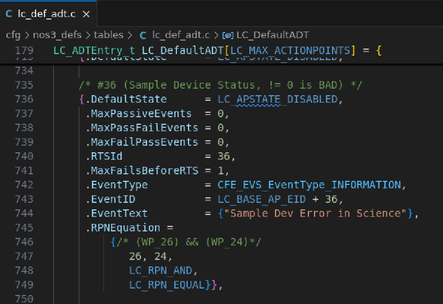

---
#### RTS 만들기

RTS는 Real-Time Sequence(실시간 시퀀스)의 줄임말입니다. Stored Command(SC) 애플리케이션이 위성에서 미리 정의된 명령 시퀀스의 실행을 자동화하는 데 사용됩니다.

이번 시나리오에서는 AP 36 조건이 참이 될 경우 실행되는 RTS를 만들었습니다. 즉, 샘플의 'device status' 텔레메트리 포인트가 0이 아니면서 동시에 과학 관측 모드에 있으면(AP 36의 논리), RTS036이 실행되어 위성이 전원 순환(power cycle) 이벤트에 들어갑니다. 이는 앞서 언급했듯이 다시 FSW를 리셋시킵니다. 새로운 RTS를 확인하려면 **nos3/cfs/nos3_defs/tables/sc_rts036.c**에서 RTS 36을 찾아 RTS 테이블을 살펴보면 됩니다.

해당 RTS 테이블에서는 순서대로 다음 작업이 수행됨을 볼 수 있습니다:
1. Instrument(계측기) 애플리케이션 비활성화
2. EPS의 Instrument 스위치 비활성화
3. cFS 재시작

다시 말하지만, cFS를 리셋 후 부팅할 때는 AP 36이 비활성화된 상태이므로, 장치가 여전히 고장 난 상태라면 위성이 FSW 리셋 루프에 빠지지 않게 됩니다. 또한 예방 조치로 안전 모드로 부팅합니다.
AP 36은 Science Mode 종료 RTS(rts029)에서 비활성화되고, Science Mode 부팅 RTS(rts026)에서 활성화된다는 점에 유의하세요. 이 두 RTS 테이블은 모두 **nos3/cfs/nos3_defs/tables/**에서 찾을 수 있습니다.

---
#### 상태 머신(State Machine) 업데이트하기

실제로 이 작업은 비교적 간단합니다. 우리는 하나의 새로운 Watchpoint를 추가하고, 하나의 새로운 Actionpoint를 정의했으며, 위성을 재부팅하는 짧은 RTS를 작성했습니다 - 하지만 한 가지 함정이 있습니다.

이 새로운 AP를 언제 켜야 할까요? 언제 꺼야 할까요? 이것이 위성의 기존 상태 머신(state machine)에 어떻게 들어맞을까요?

아래 다이어그램을 보면, 새로운 AP는 Science Mode에 진입할 때 켜지고, Safe Mode로 돌아갈 때 꺼져야 함을 알 수 있습니다. 따라서 관련 RTS들은 올바른 단계로 업데이트되어야 하며, 상태 머신 다이어그램도 업데이트되어야 합니다.

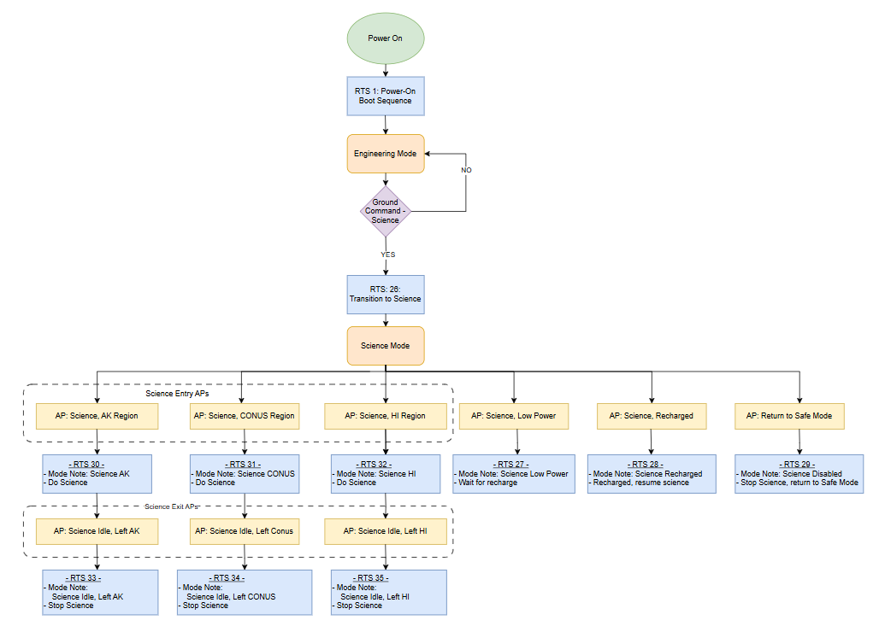

---
#### 결론

이제 사용자는 샘플 장치에 결함을 일으키고 위성이 스스로 복구하게 만들 수 있습니다. 이 과정을 통해 사용자는 cFS에서 AP, WP, RTS가 무엇이며 어떤 역할을 하는지 더 잘 이해하게 되었을 것입니다.

