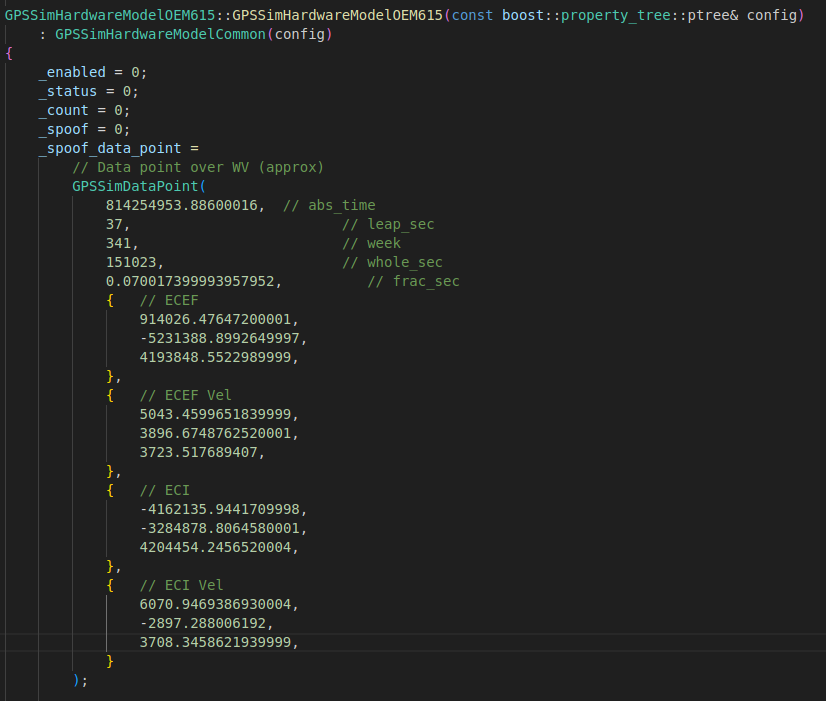
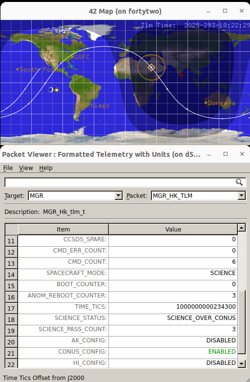
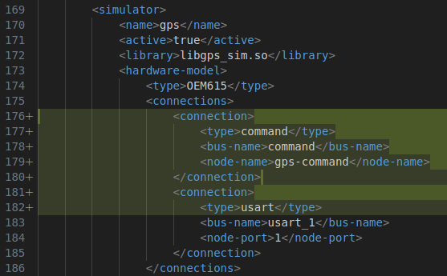
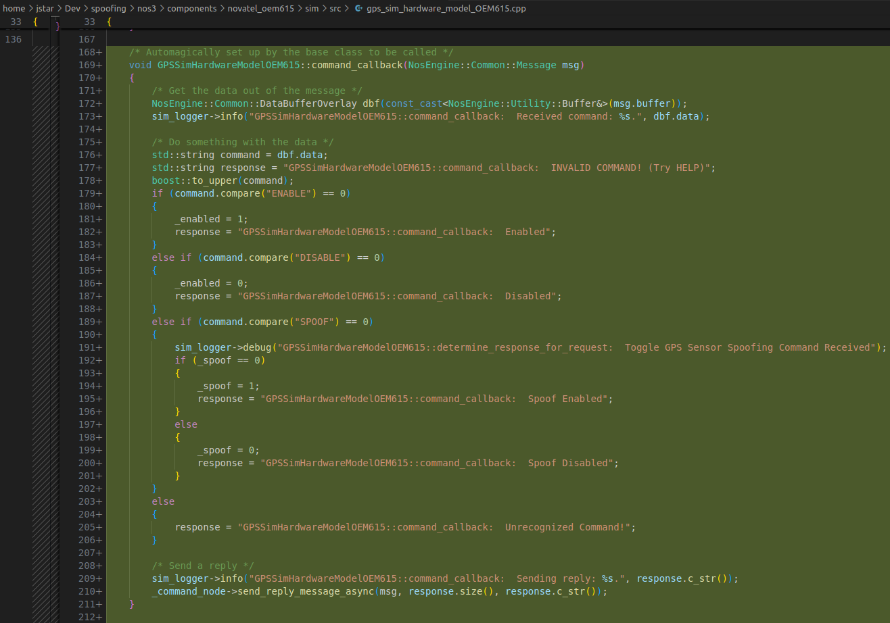
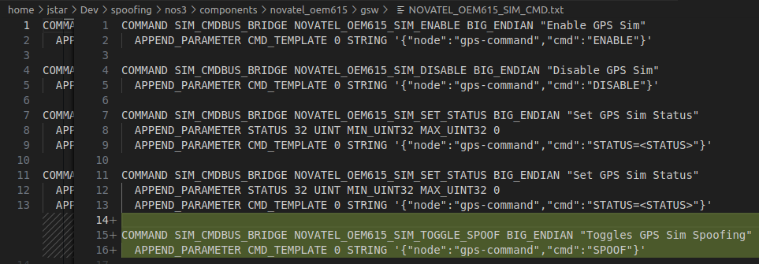

# 시나리오 - GPS 스푸핑(Spoofing)

이 시나리오는 비행 소프트웨어를 수정하지 않고도 센서 수준에서 스푸핑(속임)이 가능하다는 것을 NOS3를 이용해 증명하기 위해 만들어졌습니다.

> 💡 **초보자 가이드**: "스푸핑(Spoofing)"이란 실제 신호나 데이터가 아닌 가짜 정보를 진짜인 것처럼 시스템에 흘려 넣어 속이는 것을 말합니다. 여기서는 GPS 센서가 실제 위치 대신 미리 정해둔 가짜 위치 데이터를 위성에게 전달하도록 만드는 것을 의미합니다. 이는 실제 위협을 시뮬레이션해서 시스템의 취약점을 미리 파악하고 대비하기 위한 보안 연구 목적으로 활용됩니다.

이 기능은 사용자가 원할 때 GPS 데이터를 스푸핑할 수 있게 해주며, 다른 센서들을 스푸핑할 때 따를 수 있는 구조와 사고 과정을 보여줍니다. 이 시나리오의 목표는 위성이 CONUS(미국 본토), AK(알래스카), HI(하와이) 상공에 있지 않을 때도 과학 관측 모드에 진입하도록 속이는 것입니다.

이 시나리오는 2026년 1월 6일에 마지막으로 업데이트되었으며, `gps-sensor-spoofing` 브랜치(커밋 [1bb73b1])를 기반으로 합니다. 현재 이 내용을 정식(production) 코드에 병합할 계획은 없습니다.

## 학습 목표

이 시나리오를 마치면 다음을 할 수 있게 됩니다:

* GPS 하드웨어 모델 내에서 센서 수준으로 데이터 스푸핑하기.
* 이 스푸핑이 왜, 그리고 어떻게 동작하는지 이해하기.

## 사전 준비 사항

* [시작하기](./NOS3_Getting_Started.md)
  * {ref}`설치 <installation>`
  * {ref}`실행 <running>`
* [시나리오 - 데모](./Scenario_Demo.md)
* **중요:** `gps-sensor-spoofing` 브랜치로 체크아웃하세요
  * 이후 `git submodule sync`와 `git submodule update --init --recursive`를 실행해야 할 수도 있습니다

## 실습 과정

간단히 말해, 여러분은 다음을 하게 됩니다:

1. `SPACECRAFT_MODE`를 `SCIENCE`로 하여 `MGR MGR_SET_MODE_CC` 전송
2. `CONUS_STATUS`를 `ENABLE`로 하여 `MGR MGR_SET_CONUS_CC` 전송
3. 기본 파라미터로 `SIM_CMDBUS_BRIDGE NOVATEL_OEM615_SIM_TOGGLE_SPOOF` 전송

이렇게 하면 미리 정의된 데이터 포인트를 하드웨어 모델이 읽을 수 있게 됩니다. 이 데이터 포인트는 GPS SIM(시뮬레이터)까지 전달되며, 텔레메트리(`NOVATEL_OEM615 NOVATEL_OEM615_DATA_TLM`)에서 확인할 수 있습니다.

이 데이터 포인트는 위성이 과학 관측 모드에 진입하기 위한 파라미터 안에 위치해 있습니다. 스푸핑이 활성화되어 있는 동안, 원래는 CONUS 상공에서만 활성화되어야 함에도 불구하고 위성은 궤도상 어디에 있든 상관없이 계속해서 과학 관측 작업을 수행하게 됩니다.

### 재현 방법

먼저 `/cfg/sims/nos3-simulator.xml`에서 다음과 같이 GPS Sim을 SIM_CMDBUS에 연결합니다:

그런 다음 GPS를 활성화, 비활성화, 스푸핑할 수 있도록 하드웨어 모델에 `command_callback` 함수와 전역 `_spoof` 변수를 추가합니다:

`SIM_CMDBUS_BRIDGE NOVATEL_OEM615_SIM_TOGGLE_SPOOF` 명령이 전송되면, `_spoof` 변수가 토글(toggle)됩니다. 이는 하드웨어 모델에게 위 실습 섹션에서 미리 정의된 데이터 포인트를 사용하라고 지시합니다.

GPS 시뮬레이터가 센서에 데이터를 요청하면, 실시간 데이터 대신 스푸핑된 데이터 포인트를 받게 됩니다. 이 방법은 NOS3 환경 내 거의 모든 하드웨어 모델에 적용할 수 있습니다.

직접 시도해보고 [GitHub Discussions](https://github.com/nasa/nos3/discussions)를 통해 알려주세요!
