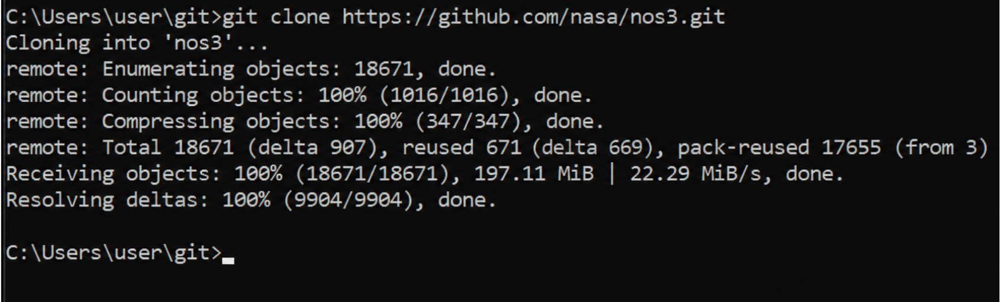
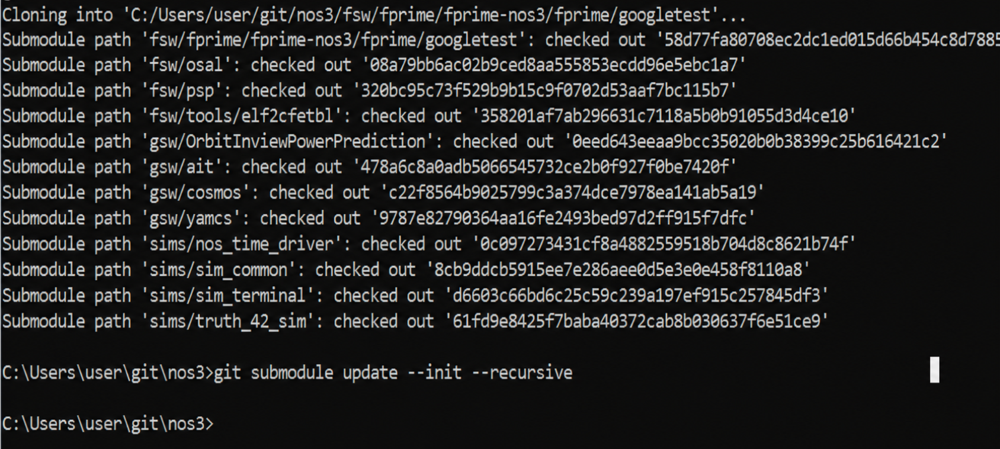

# 시나리오 - 설치(Installation)

이 시나리오는 NASA Operational Simulator for Space Systems(NOS3)의 설치 과정을 정리하기 위해 만들어졌습니다.

이 시나리오는 2025년 5월 28일에 마지막으로 업데이트되었으며, 당시 `dev` 브랜치(커밋 [a3e7c100])를 기반으로 작성되었습니다.

## 학습 목표
이 시나리오를 마치면 다음을 할 수 있게 됩니다:
* 원하는 플랫폼에 NOS3 설치하기.
* NOS3를 설치하고 실행하는 여러 방법 이해하기.

## 사전 준비 사항

이 시나리오에는 특별한 사전 준비 사항이 없지만, 설치 안내를 미리 읽어보면 도움이 될 수 있습니다:
* [시작하기](./NOS3_Getting_Started.md)
  * {ref}`설치 <installation>`

## 실습 과정

현재 환경과 원하는 결과에 따라 두 가지 NOS3 설치 옵션이 설명됩니다:
* 옵션 A는 로컬 NOS3 가상 머신(VM)을 만드는 것입니다.
  * 이 옵션은 전통적으로 NOS3 개발자들이 사용하는 방식입니다. 우리는 업무용으로 Windows 컴퓨터를 지급받으며, 서로 다른 환경이 필요한 여러 프로젝트를 진행하는 경우가 많기 때문입니다.
  * 모든 VM에 동일한 이미지를 사용하면 (Docker와 같은) 필요한 사전 요구사항이 처음부터 모두 설치되어 있음을 보장할 수 있습니다.
* 옵션 B는 여러분이 직접 준비한 Linux 환경을 사용하는 것입니다.
  * 직접 VM을 만들거나, Linux 컴퓨터에서 NOS3를 직접 실행하는 방식입니다.
  * Linux 배포판에 따라, 이 과정은 매우 까다로울 수도 있고 NOS3 VM을 사용하는 것보다 살짝 더 어려운 정도일 수도 있습니다.
  * 추가적인 가상화 계층 없이 직접 실행하면 실행 속도가 향상될 수 있습니다.

---
### 옵션 A: 로컬 가상 머신(VM) 만들기
VirtualBox에서 NOS3를 실행하려면 Git, Vagrant, VirtualBox를 설치해야 합니다.
* [Git 2.47+](https://git-scm.com/)
* [Vagrant 2.4.3+](https://www.vagrantup.com/)
* [VirtualBox 7.1.6+](https://www.virtualbox.org/)

#### 저장소 클론하기
Git Bash 터미널을 이용해 디렉토리를 클론하고 설정하세요:
* `git clone https://github.com/nasa/nos3.git`



* `cd nos3`
* `git pull`
* `git submodule update --init --recursive`



만약 첫 시도에서 무언가 실패했다면 submodule update를 다시 실행할 수 있으며, 모두 성공했다면 위 그림처럼 아무것도 보고하지 않습니다.
방금 클론한 저장소는 기본 설정에서 VM 안으로 공유(share)된다는 점에 유의하세요.
이러한 구성 덕분에 호스트에서 로컬로 코드를 편집하고도 여전히 가상 머신 안에서 빌드하고 실행할 수 있습니다.
이는 사용자가 여러 프로젝트에 동일한 IDE를 사용할 수 있게 해주어 유용하지만, 모든 것이 제대로 동작하려면 특정 파일에서 `dos2unix`를 실행해야 할 수도 있습니다.


#### VM 배포하기
방금 클론한 NOS3 저장소 안에 있는 [./Vagrantfile](https://github.com/nasa/nos3/blob/b76e6844b5c707af53d4265d93e7802872df88c0/Vagrantfile)에는 Vagrant가 VM을 생성하는 데 필요한 지침이 담겨 있습니다.
다음 항목들은 편집 가능하며 계속 진행하기 전에 수정할 수 있다는 점에 유의하세요:
* `config.vm.synced_folder`
  * 호스트에 있는 NOS3 저장소가 이 위치로 VM에 공유됩니다.
* `config.vm.disk`
  * VM이 사용하는 가상 디스크의 크기입니다.
  * 32GB로도 NOS3를 실행할 수는 있지만, 추가적인 임무 세부사항을 넣거나 Docker 파일을 편집하려면 64GB 이상을 권장합니다. 특히 VM을 생성한 후에는 크기를 늘리기가 어렵기 때문에 더욱 그렇습니다.
* `vbox.cpus`
  * 기본값인 4개의 CPU로도 실행되지만, 호스트에서 사용 가능한 CPU 개수의 절반 정도로 설정하는 것을 권장합니다.
  * CPU 개수를 모른다면 일단 진행한 후 배포 이후에 편집해도 됩니다 - 나중에 조정하기 꽤 쉽습니다.
* `vbox.memory`
  * 8192MB의 메모리로도 충분하지만, 그 두 배 또는 호스트에서 사용 가능한 메모리의 절반 정도로 설정하는 것을 권장합니다.
  * 이 설정 역시 VM 생성 후에 변경하기 매우 쉽습니다.

`config.vm.provision`을 사용하여 추가적인 프로비저닝(provisioning) 단계를 넣을 수도 있습니다. 또한 이 과정을 더 자세히 살펴보거나 수정하고 싶다면 [https://github.com/nasa-itc/deployment](https://github.com/nasa-itc/deployment) 저장소를 확인해보세요.

Vagrantfile을 원하는 대로 업데이트했다면, NOS3 디렉토리에서 다시 터미널이나 명령 프롬프트로 돌아갑니다:
* `vagrant up`
* 멈춘 것처럼 보이지 않도록 대기 중에 엔터를 몇 번 눌러주세요.

인터넷 속도와 이전 시도로부터 이미지가 캐시되어 있는지 여부에 따라, 이 과정은 몇 분에서 몇 시간까지 걸릴 수 있습니다.

---
### 옵션 B: 이미 Linux를 사용 중이거나 직접 Linux VM을 만들고 싶은 경우

Docker, python3-pip, python3-venv가 설치되어 있어야 합니다.

#### Docker 설치
* 다음 안내는 [docker.com](https://docs.docker.com/engine/install/ubuntu/#install-using-the-repository)의 내용을 그대로 옮긴 것입니다.
* Docker를 apt 저장소에 추가해야 합니다.
<pre>

#### Add Docker's official GPG key:
`sudo apt-get update`
`sudo apt-get install ca-certificates curl`
`sudo install -m 0755 -d /etc/apt/keyrings`
`sudo curl -fsSL https://download.docker.com/linux/ubuntu/gpg -o /etc/apt/keyrings/docker.asc`
`sudo chmod a+r /etc/apt/keyrings/docker.asc`
#### Add the repository to Apt sources:
echo \
  "deb [arch=$(dpkg --print-architecture) signed-by=/etc/apt/keyrings/docker.asc] https://download.docker.com/linux/ubuntu \
  $(. /etc/os-release && echo "${UBUNTU_CODENAME:-$VERSION_CODENAME}") stable" | \
  sudo tee /etc/apt/sources.list.d/docker.list > /dev/null```
sudo apt-get update
</pre>

이제 Docker가 apt 저장소에 추가되었으니, apt로 Docker를 설치하기만 하면 됩니다:

* `sudo apt-get install docker-ce docker-ce-cli containerd.io docker-buildx-plugin docker-compose-plugin`

sudo 없이도 Docker가 잘 동작하게 하려면, docker 그룹을 만들고 현재 사용자를 그 그룹에 추가해야 할 수 있습니다:
* `sudo groupadd docker`
* `sudo usermod -aG docker $USER`
* `sudo reboot now`

#### NOS3 설치
이제 NOS3를 VM 안에 직접 클론하세요:
* `git clone https://github.com/nasa/nos3`
* `cd nos3`
* `git submodule update --init --recursive`

NOS3를 실행하려면 그 전에 컨테이너 등을 다운로드해야 합니다. 사용자의 편의를 위해, 이 모든 것을 자동으로 처리해주는 `make prep`이라는 명령이 있습니다. NOS3를 클론한 뒤 이렇게 실행하세요:
* `make prep`
* 문제없이 실행되고 경고나 오류가 없는지 확인하세요.

#### Python 설정

먼저 모든 것이 최신 상태인지 확인하세요:
* `sudo apt update`

그런 다음 관련 python 패키지를 설치하세요:
* `sudo apt install python3-pip python3-venv python3-dev`

마지막으로, 최상위 NOS3 디렉토리로 이동해서 다음을 실행하세요:
* `python3 -m venv .venv`
* `source .venv/bin/activate`

이렇게 하면 python 가상 환경이 생성되고 활성화되어, `make prep`으로 설치되는 pip 패키지들이 이 디렉토리 안에 국한되도록 만들어줍니다.
