# 시나리오 - 정상 운영(Nominal Operations)

이 시나리오는 NASA Operational Simulator for Space Systems(NOS3)를 이용해 궤도상 위성의 표준(정상) 패스(pass) 운영을 설명하고 보여주기 위해 만들어졌습니다.
이 시나리오는 명령 전송과 예상되는 텔레메트리 수신을 위한 지상 소프트웨어(GSW) 사용법을 보여주며, 동시에 비행 소프트웨어(FSW)와 시뮬레이터도 함께 활용합니다.

이 시나리오는 2025년 6월 3일에 마지막으로 업데이트되었으며, 당시 `dev` 브랜치(커밋 [a3e7c100])를 기반으로 작성되었습니다.

## 학습 목표

이 시나리오를 마치면 다음을 할 수 있게 됩니다:
 * 시뮬레이션된 패스 시작 시점에 시뮬레이션된 위성에 연결하기.
 * 상태를 변경하거나 데이터를 다운링크하기 위한 명령 보내기.
 * 실제 위성 환경에서 NOS3의 어떤 부분이 접근 가능하고 보이는지 이해하기.
 * 비정상적인(anomalous) 텔레메트리 인식하기.
 * NOS3로 시뮬레이션된 패스 진행하기.

## 사전 준비 사항

시나리오를 실행하기 전에 다음 단계를 완료하세요:
* [시작하기](./NOS3_Getting_Started.md)
  * {ref}`설치 <installation>`
  * {ref}`실행 <running>`

## 실습 과정

NOS3 저장소의 최상위 경로로 이동한 터미널에서 make clean과 make를 실행하세요:
 * `make clean`

 * `make`

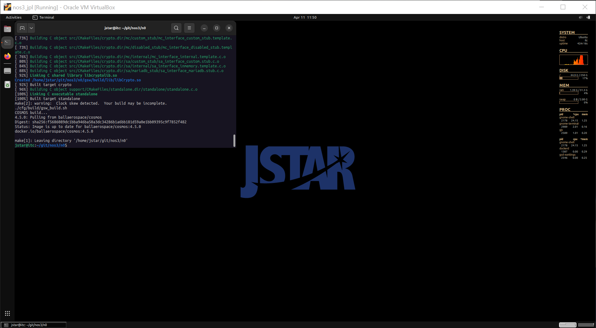

그런 다음 (`make launch`로) NOS3를 실행하고, `NOS3 Launcher` 창의 `COSMOS` 버튼을 이용해 COSMOS를 여세요:

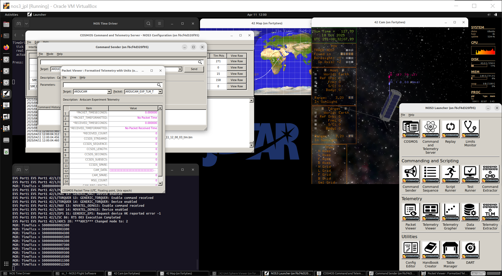

### 스크립트를 이용해 자동으로 패스 진행하기

#### 위성에 연결하기

위성으로 다른 무언가를 하기 전에, 먼저 위성에 연결해야 합니다.
다음 스크립트에서는 이 작업이 적어도 부분적으로 자동으로 이루어지지만(`RADIO` 인터페이스는 자동으로 연결됩니다), 실제 위성의 경우 지상국과 협력하여 여러분의 위성이 통신 범위 안에 들어오는 적절한 시점에 먼저 이 작업을 해야 합니다. COSMOS의 `DEBUG` 인터페이스는 지상 시스템에서 디버그 포트를 이용해 위성에 직접 연결한 것과 같은 역할을 하며, COSMOS의 `RADIO` 인터페이스는 무선을 이용해 지상 시스템을 위성에 연결한 것과 같은 역할을 한다는 점에 유의하세요.

#### 패스 스크립트 실행하기

`NOS3 Launcher`에서 script runner를 여세요.
script runner에서 `File->Open...`을 실행하고 `gsw/cosmos/config/targets/MISSION/procedures/nominal_ops.rb` 스크립트를 선택하세요.
`Start`를 누르세요:

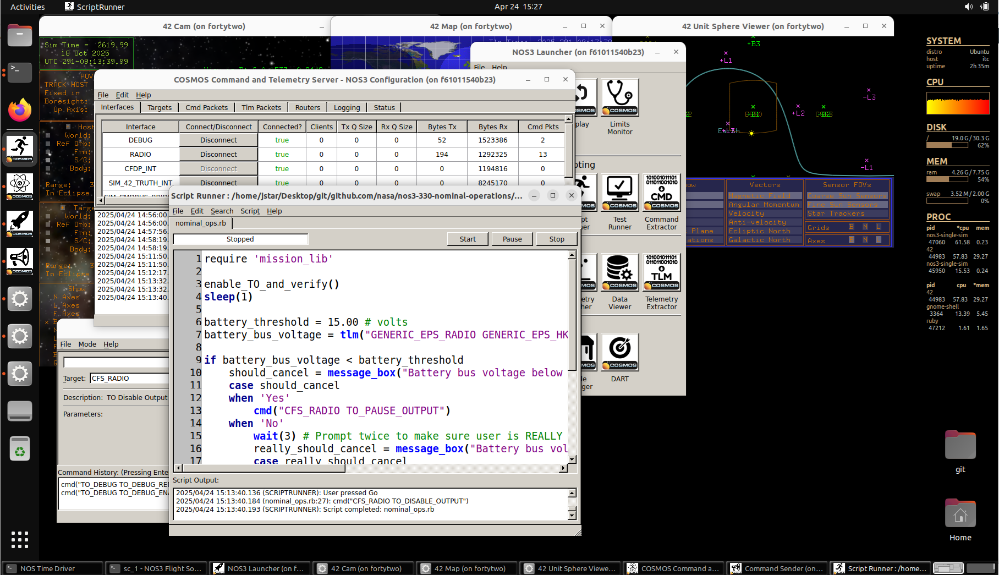

이 스크립트는 텔레메트리 출력 활성화, 배터리 텔레메트리를 통한 위성 건강 상태 검증, 파일 다운링크 등 패스 진행의 여러 측면을 대략적으로 재현합니다.

**_참고:_** 스크립트가 패스가 끝나면 COSMOS 연결을 자동으로 종료하지 않으므로, 명령을 다 보냈다면 사용자가 script runner 창에서 `Go`를 직접 선택해야 합니다.
또한 일반적인 패스는 지속 시간이 짧으므로(8~10분), 운영자가 직접 시간을 확인하며 패스가 언제 끝나는지 파악해야 합니다.

### 수동으로 패스 진행하기

#### 위성에 연결하기

위성으로 다른 무언가를 하기 전에, 먼저 위성에 연결해야 합니다.
실제 위성이라면 지상국과 협력하여 여러분의 위성이 통신 범위 안에 들어오는 적절한 시점에 먼저 이 작업을 해야 하지만, NOS3에서는 다음과 같습니다:
* 명령은 항상 `RADIO` 인터페이스에 연결되어 있습니다.
* 텔레메트리는 다음과 같이 `RADIO` 인터페이스에 연결할 수 있습니다:
  * COSMOS Command Sender에서 `CFS_RADIO` 타겟으로 이동하세요.
  * `CFS_RADIO`에 `TO_ENABLE_OUTPUT` 명령을 보내세요.
    * DEST_IP = 'radio_sim'
    * DEST_PORT = '5011'

#### 텔레메트리가 정상인지 확인하기

##### COSMOS만으로 확인하기

첫 번째 작업은 데이터가 다운링크되고 명령이 전송되는지 확인함으로써 위성 텔레메트리가 정상인지 확인하는 것입니다.
두 가지 모두 `NOOP` 명령으로 확인할 수 있습니다.
실제 위성에서는 여러분이 접근할 수 있는 유일한 정보가 COSMOS와 그 출력물뿐일 것입니다.
따라서, 우리는 시뮬레이션 전용의 다른 정보 출처를 보기 전에, 먼저 위성이 정상 상태에 있는지 확인하기 위해 이러한 정보만을 볼 것입니다.
COSMOS 창 중에서 Command Sender와 Packet Viewer가 모두 보이도록 하고, 둘 다 `GENERIC_IMU_RADIO` 타겟으로 이동하세요:

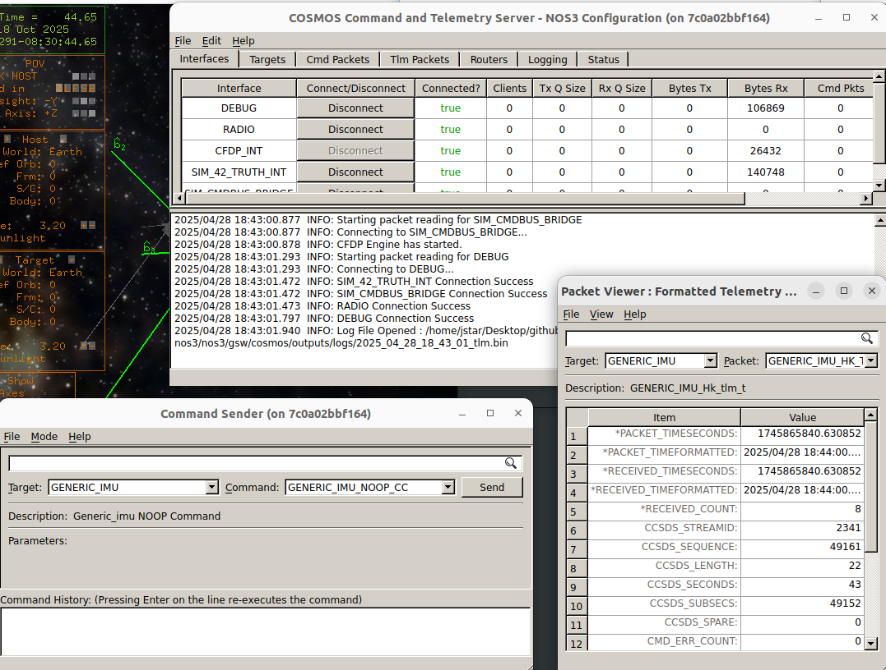

Packet Viewer 안에서는 하우스키핑(housekeeping) 정보와 일반 데이터를 모두 볼 수 있으며, 이를 통해 데이터가 다운링크되고 있는지, 위성이 회전하거나 나쁜 물리적 상태에 있지 않은지(IMU의 회전 센서 값들이 모두 0에 가까워야 함) 확인할 수 있습니다.
이제 지상 명령이 IMU에 영향을 주는지 확인하기 위해, `NOOP` 명령을 보내는 것으로 시작합시다.
이렇게 하면 하우스키핑 데이터 아래의 명령 카운터가 다음과 같이 증가해야 합니다:

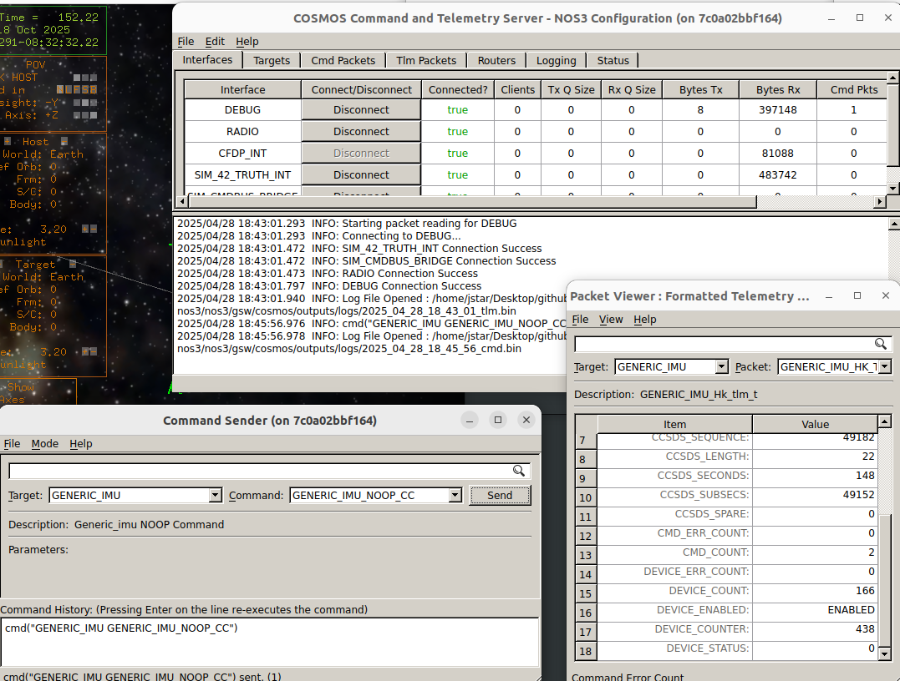

명령 카운터가 2가 되었으며, 이전에는 1이었어야 함에 유의하세요.
또한 텔레메트리가 몇 초에 한 번씩만 수신되기 때문에, 명령을 보낸 시점과 카운터가 수신을 반영하는 시점 사이에 몇 초의 지연이 있을 수 있다는 점에 유의하세요.

정상 운영을 확인하기 위해 점검해야 할 또 다른 구성 요소는 전력 시스템(EPS)입니다.
`NOOP` 명령을 보내고 명령 카운터가 증가하는지 확인함으로써 EPS가 텔레메트리를 전송하고 명령을 수신할 수 있는지 확인하세요.
EPS 텔레메트리에서는 `BATT_VOLTAGE`가 건강한 충전 상태(예: 24V 초과)를 나타내야 합니다.

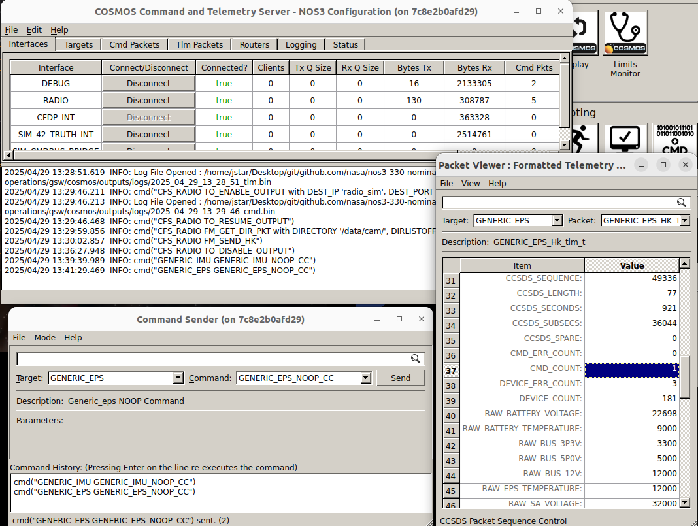

##### 42와 시뮬레이터

실제 임무에서는 COSMOS 명령과 텔레메트리가 여러분이 가진 모든 정보일 것입니다.
하지만 시뮬레이터에서 실행할 때는 더 많은 정보에 접근할 수 있으며, 이를 통해 위성의 상태와 정상 운영 여부를 비교적 빠르게 알 수 있습니다.

위성 상태에 대한 정보를 확인할 수 있는 다른 두 곳은 42와 여러 시뮬레이터입니다.
시뮬레이터들은 모두 NOS3를 실행한 터미널의 탭으로 실행되며, 정상 상태의 시뮬레이터는 실행 중일 뿐 아니라 (아마도) 버스에 성공적으로 연결되었음을 나타내는 메시지가 있을 것입니다.
아래는 Generic IMU 시뮬레이터 탭의 이미지로, 시뮬레이터가 성공적으로 생성 완료되었지만 아직 텔레메트리 전송을 시작하지 않은(자동으로 시작됨) 상태를 보여줍니다:

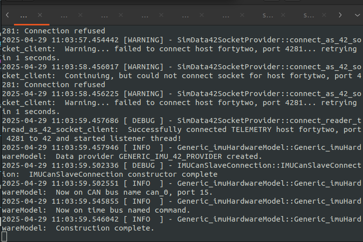

그리고 42는 어느 정도 위성의 상태를 나타내 줄 것입니다.
42 Cam 창은 위성이 상당히 회전하고 있는지 여부와, 태양에 대한 위성 자세를 보여줍니다.
42 Map 창은 지구 위 위성의 위치를 보여줍니다:

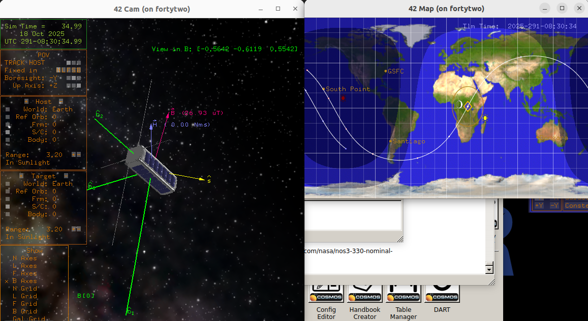

#### 명령 보내기

위성이 정상 상태에 있음을 확인했다면, 다음 단계는 명령을 보내거나 데이터를 다운링크하는 것입니다.
이 시나리오에서는 각각의 예시를 보여드리겠습니다.

명령을 보내는 예시로, 위성을 과학 관측 모드로 진입시켜 보겠습니다.
NOS3의 예제 위성은 미국 상공에 있을 때 샘플 계측기를 이용해 과학 관측을 수행하지만, 관측을 시작하려면 먼저 과학 관측 모드로 활성화해야 합니다.
COSMOS를 통해 이를 수행합시다:
* Command Sender를 타겟 `MGR_RADIO`로 이동하세요.
* Packet Viewer를 `MGR_RADIO`로 이동하세요.

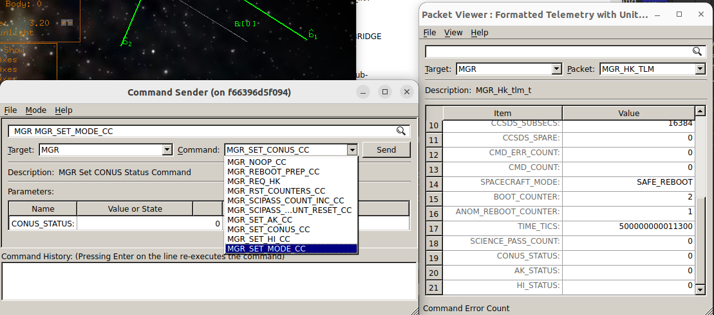

드롭다운 메뉴에 나열된 다양한 명령들을 확인해 보세요.
여기서는 과학 관측 모드를 활성화하는 명령을 보낼 것입니다(이는 위성에게 조건이 허락하면 과학 관측을 수행해도 좋다고 알려줍니다):
* 명령 `MGR_SET_MODE_CC`를 선택하세요.
* 이 명령의 드롭다운 메뉴에서 모드로 `SCIENCE`를 선택하세요.
* `Send`를 클릭하세요:

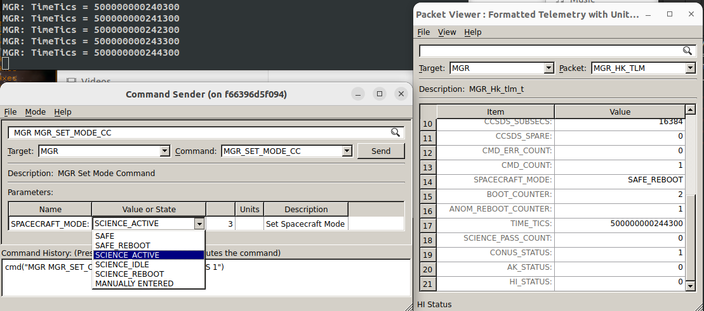

전송이 완료되면, Packet Viewer의 `SPACECRAFT_MODE`가 `SCIENCE`로 바뀌어야 합니다.
이 변화는 비행 소프트웨어(FSW) 터미널에서도 확인할 수 있습니다(`SCIENCE`는 모드 3입니다).

#### 데이터 다운링크하기

다음으로, 패스 중에 이루어질 가능성이 높은 또 다른 작업인 데이터 다운링크의 예시를 살펴보겠습니다.

이번 예시에서는 CCSDS 파일 전송 프로토콜(CFDP, Consultative Committee for Space Data System Standards File Delivery Protocol)을 이용해 탑재 데이터 저장소로부터 파일을 다운링크할 것입니다.
* 이는 `CFDP` 타겟과 `CFS_RADIO` 타겟을 이용해 수행됩니다.
* 먼저 타겟 `CFDP`와 패킷 `CFDP_ENGINE_HK`의 텔레메트리를 확인하세요.
* `ENG_INPROGRESSTRANS`가 0인지 확인하세요. 이는 현재 진행 중인 파일 전송이 없음을 나타냅니다.
* 같은 패킷에서 `ENG_TOTALSUCCESSTRANS`의 값을 기록해 두세요.
다음으로, Command Sender 창에서 데이터를 다운링크하는 명령을 추가하세요:
* Target을 `CFS_RADIO`로 설정하세요.
* 다음 파라미터로 `CF_TX_FILE` 명령을 실행하세요:
  * `CLASS 1 - NO FEEDBACK`
  * `KEEP`
  * `CHAN 0`
  * PRIORITY `1`
  * DEST_ID `0x18`
  * SRCFILENAME `'/data/dummy.txt'`
  * DSTFILENAME `'/tmp/nos3/data/dummy.txt'`
아래 Command Sender와 Packet Viewer 창은 위 설정을 반영합니다:

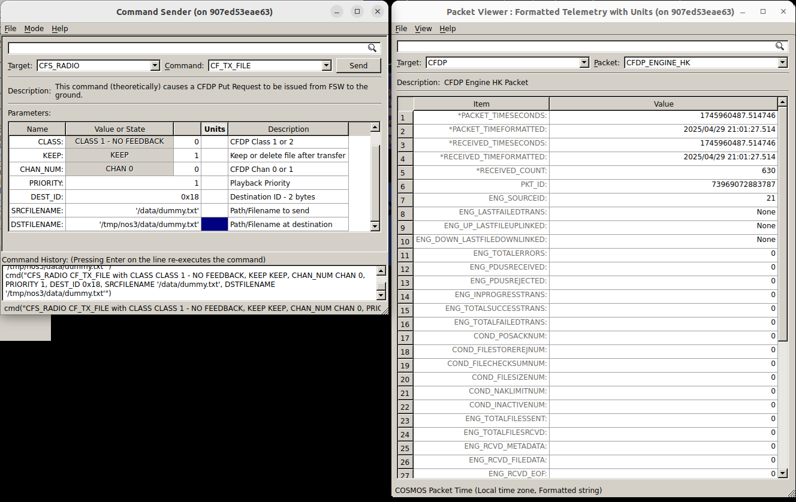

Command Sender에서 `Send`를 누른 후, Packet Viewer 창으로 전환하세요:
* 타겟 `CFDP`와 패킷 `CFDP_ENGINE_HK`를 확인하세요:
  * `ENG_PDUSRECEIVED`가 계속 증가할 것입니다.
  * `ENG_INPROGRESSTRANS`는 1이 될 것입니다.
* 이 두 지표는 파일 전송이 현재 진행 중임을 나타냅니다.
* 이 창들은 아래와 같습니다:

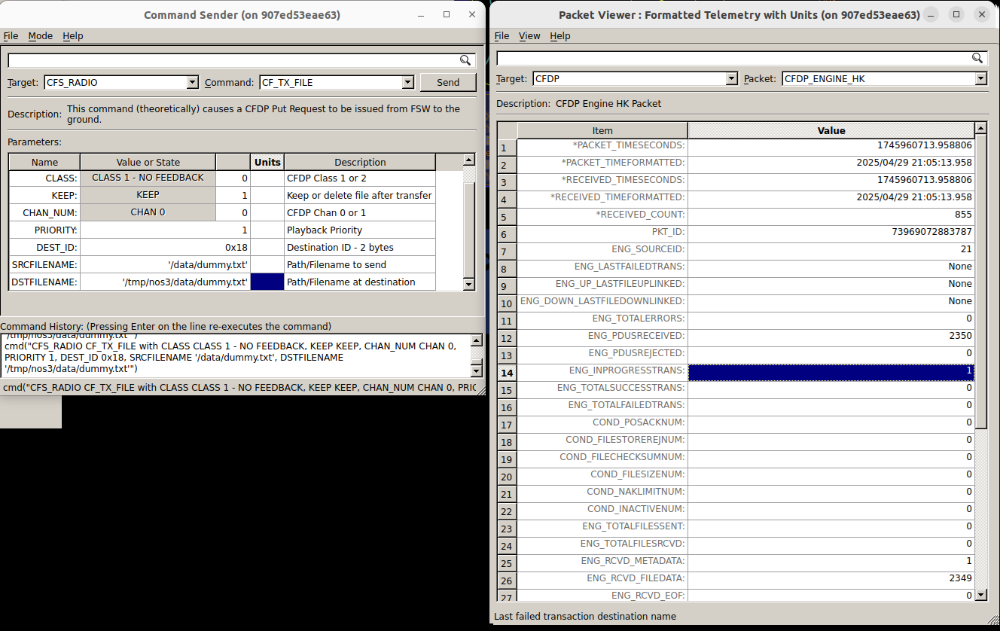

전송이 완료되면:
* 타겟 `CFDP`와 패킷 `CFDP_ENGINE_HK`의 Packet Viewer 창에는 `ENG_DOWN_LASTFILEDOWNLINKED`가 목적지 파일명으로 표시됩니다.
* `ENG_TOTALSUCCESSTRANS`는 위에서 기록해둔 값보다 1 증가해 있어야 합니다.
* 아래와 같습니다:

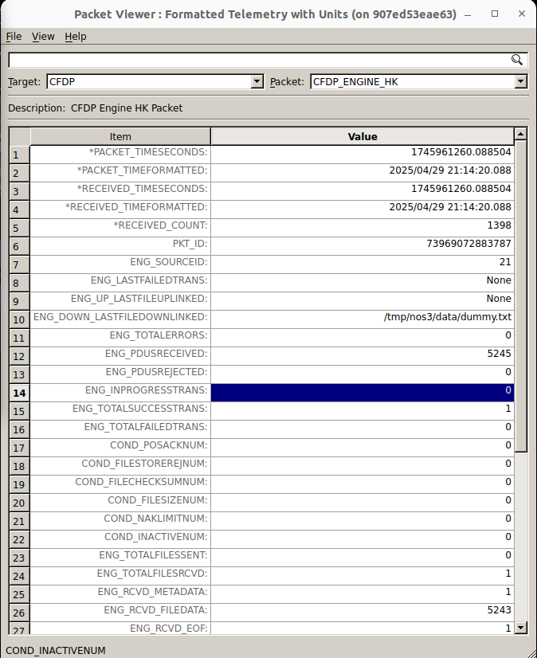

이것으로 이 시나리오의 학습 목표를 완료했습니다.
