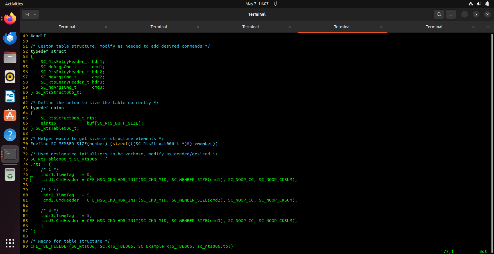
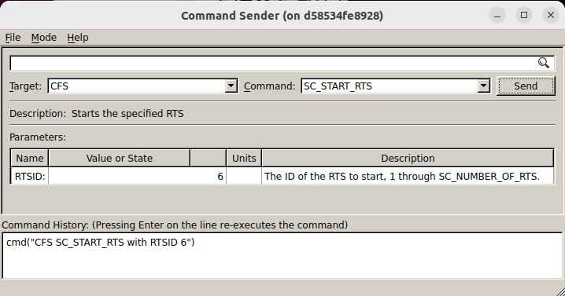
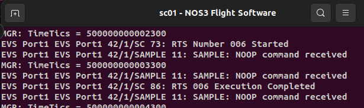
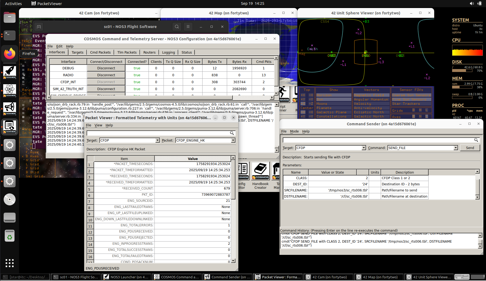
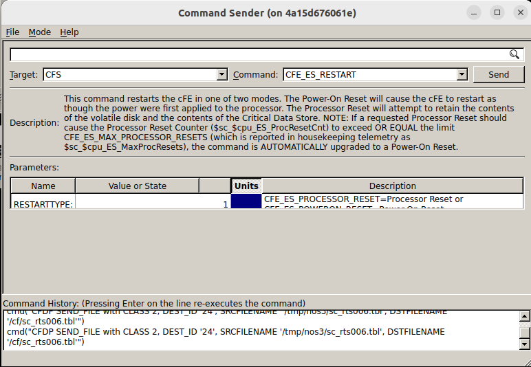
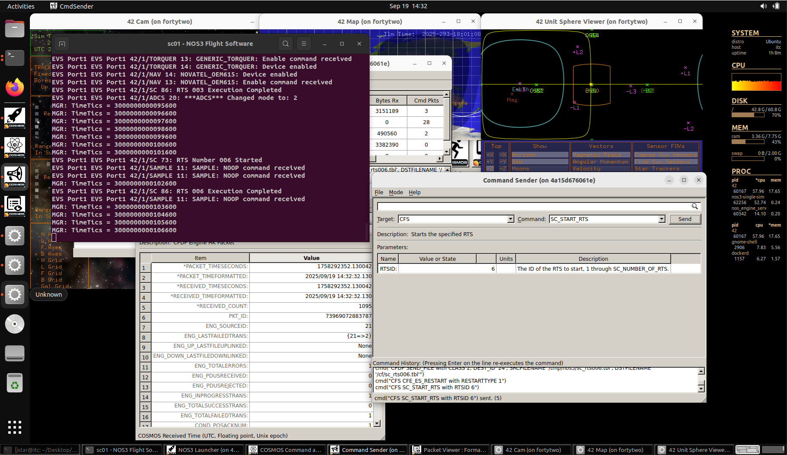

# 시나리오 - 앱 또는 테이블 패치하기

이 시나리오는 NASA Operational Simulator for Space Systems(NOS3)를 이용해 위성 운영자가 궤도상의 위성에 탑재된 앱이나 테이블을 어떻게 패치하는지 설명하고 보여주기 위해 만들어졌습니다.
이 시나리오는 패치를 테스트하기 위해 NOS3를 사용하는 방법과, 이후 단순히 명령을 보내는 것을 넘어 앱이나 테이블에 대한 업데이트된 코드를 전송하기 위해 지상 소프트웨어(GSW)를 사용하는 방법을 보여줍니다.

이 시나리오는 2025년 6월 9일에 마지막으로 업데이트되었으며, 당시 `dev` 브랜치(커밋 [a3e7c100])를 기반으로 작성되었습니다.

## 학습 목표

이 시나리오를 마치면 다음을 할 수 있게 됩니다:
 * 위성 테이블용 패치를 테스트하기 위해 NOS3를 사용하는 방법 이해하기.
 * 위성 앱이나 테이블에 패치를 전송하기 위해 GSW를 사용하는 방법 이해하기.

## 사전 준비 사항

시나리오를 실행하기 전에 다음 단계를 완료하세요:
* [시작하기](./NOS3_Getting_Started.md)
  * {ref}`설치 <installation>`
  * {ref}`실행 <running>`

이 시나리오 전에 [시나리오 - 정상 운영](./Scenario_Nominal_Ops.md)과 [시나리오 - cFS](./Scenario_cFS.md)를 먼저 진행해보는 것도 도움이 될 수 있습니다.

## 실습 과정

이전 시나리오들처럼 `make launch`로 NOS3를 실행하고 COSMOS를 여세요:

위성에 패치를 보내기 전에, 먼저 이를 만들고 테스트해야 합니다.
간단히 설명하기 위해 RTS를 패치하는 과정을 살펴보겠지만, 시뮬레이터를 패치하는 과정도 이와 매우 유사할 것입니다.

### RTS에 패치 테스트하기

먼저 NOS3에서 RTS를 조정하고 시뮬레이터/FlatSat으로 실행하여 변경 사항이 원하는 효과를 내는지 확인해 보겠습니다.
 * 'fsw/apps/sc/fsw/tables/sc_rts006.c'에서 RTS006을 'cfg/nos3_defs/tables/sc_rts006.c'로 복사하는 것부터 시작하겠습니다. 그런 다음, 새로 만든 sc_rts006.c를 여세요:

 * 5초마다 한 번씩 총 세 번 샘플 시뮬레이터에 NOOP 명령을 보내도록 다음과 같이 편집하세요:

 * 상단에 `#include "sample_app.h"`도 포함시키세요. 그렇지 않으면 컴파일러 오류가 발생합니다.

실제 시나리오에서는 먼저 테스트하지 않은 채로 위성에 곧바로 무언가를 밀어넣는 일은 없을 것입니다.
다음과 같은 일반적인 명령 순서를 실행하여 NOS3에서 이를 진행해 보겠습니다:
 * `make clean`
 * `make`
 * `make launch`
 * RTS의 동작을 확인하세요:
 
 
 * `make stop`

이제 시뮬레이션된 FlatSat 역할을 하는 NOS3에서 RTS의 새로운 변경 사항을 테스트했으므로, COSMOS를 사용해 궤도상의 위성에 이 새 파일을 업로드하는 상황을 시뮬레이션해 볼 수 있습니다.

### RTS 패치하기

먼저 나중에 업로드할 수 있도록 컴파일된 RTS 파일을 컴퓨터 어딘가에 저장해두세요:
 * `cp ./fsw/build/exe/cpu1/cf/sc_rts006.tbl /tmp/sc_rts006.tbl`

다음으로, 변경된 파일을 실제로 위성에 전송해봅시다.
먼저 시뮬레이션이 새 파일과 함께 시작되지 않도록 해야 하며, 다음 명령으로 이를 수행할 수 있습니다:
 * `make clean`
 * `git reset --hard --recurse-submodules`
 * `git clean -x -d -f`

이제 `make`를 실행한 뒤 `make launch`를 실행하고, 기존 RTS006이 활성 상태인지 확인하세요(즉, SC 앱에서는 NOOP 명령이 나오고 sample 앱에서는 NOOP 명령이 나오지 않아야 함).
실제 위성에서 업로드를 진행한다면, (위에서처럼) NOS3 그리고/또는 FlatSat에서 변경 사항을 테스트한 뒤 바로 이 지점부터 시작하게 될 것입니다.

`/tmp/sc_rts006.tbl` 파일을 `/tmp/nos3/sc_rts006.tbl`로 복사하세요. 이제 CFDP 명령을 이용해 새로운 sc_rts006.c 파일을 시뮬레이션된 위성의 올바른 위치('/cf/sc_rts006.tbl')에 업로드하세요.

COSMOS Command Sender로 이동해서 왼쪽 상단에서 "CFDP"를, 오른쪽에서 "SEND_FILE"을 선택하세요:

이 COSMOS 명령은 지상국에서 궤도상의 시뮬레이션된 위성으로 새 파일을 보낼 수 있게 해줍니다.
파라미터 목록을 살펴보면 로컬 파일 경로(SRCFILENAME)와 원격 위성 파일 경로(DSTFILENAME)를 볼 수 있습니다.

나머지 두 파라미터는 CLASS와 DEST_ID입니다:
 * CLASS는 Class 1 또는 Class 2 데이터 전송 방식 중 무엇을 사용할지를 나타냅니다:
    * Class 1 전송은 UDP와 동등하므로, 손실된 데이터는 영구히 손실됩니다.
    * Class 2 전송은 TCP와 동등하며, ACK/NAK 과정을 이용해 데이터 전송을 확인합니다.
 * Class 2가 일반적으로 선호되며, 부분적으로만 전송된 파일이 심각한 문제를 일으킬 수 있는 위성 패치의 경우에도 마찬가지입니다. 따라서 CLASS 파라미터는 2로 그대로 두겠습니다.
 * DEST_ID는 데이터가 어디로 전송되는지를 결정합니다. 더 구체적으로는, 데이터를 수신할 여러 위성이 있을 때만 바뀝니다. 따라서 이 값도 그대로 두겠습니다.

다음으로 CFE를 재부팅하여 FSW가 모든 테이블을 자동으로 다시 불러오도록 하세요.

이제 RTS 6을 실행하세요:

이전과 마찬가지로, NOS3 FSW 터미널에서 5초마다 한 번씩 세 개의 SAMPLE NOOP 명령이 오는 것을 볼 수 있어야 합니다.
COSMOS만 본다면, SAMPLE 앱의 Command Counter가 같은 속도로 세 번 증가해야 합니다.

이제 여러분은 위성 RTS 테이블의 테스트와 패치 모두를 성공적으로 시뮬레이션해 보았습니다!
앱을 패치하는 것도 같은 방식으로 이루어지며, 이는 독자를 위한 연습 과제로 남겨두겠습니다.

**_참고:_** 이 시나리오를 조금 더 확장해 보고 싶은 분들은 `make launch` 대신 `make cosmos-operator` 명령으로 다시 실행해 보는 것도 좋습니다.
전자의 명령은 NOS3 전체를 실행하지만 COSMOS만 표시합니다(실제 시나리오에서 위성 운영자가 보는 것이 바로 이것이기 때문입니다).
