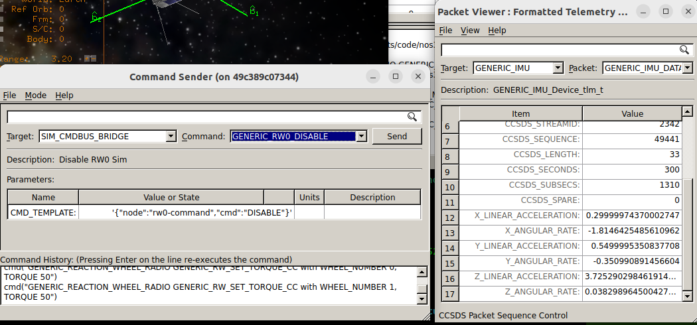
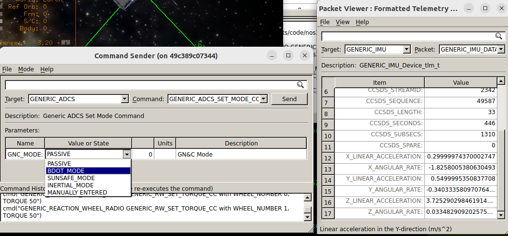

# 시나리오 - 급격한 텀블링(Rapid Tumbling)

여러 가지 이유로, 위성은 궤도상에서 통제 불능 상태로 회전하기 시작할 수 있습니다. 어쩌면 0이 아닌 초기 각운동량을 가진 채로 방출되었거나, 반작용휠 등의 오류로 인해 원래보다 훨씬 빠르게 회전하기 시작했을 수도 있습니다. 원인이 무엇이든, 회전 속도를 줄이고 정상 운영으로 되돌리는 방법을 아는 것은 중요하며, NOS3를 이용해 이를 시뮬레이션할 수 있습니다.

> 💡 **초보자 가이드**: "텀블링(Tumbling)"이란 위성이 의도치 않게 여러 축으로 계속 뒤집히듯 회전하는 상태를 말합니다. 마치 우주에서 손을 놓쳐버린 공이 계속 빙글빙글 도는 것과 비슷합니다. 이런 상태에서는 태양전지판이 태양을 향하지 못해 전력을 만들지 못하거나, 안테나가 지구를 향하지 못해 통신이 끊기는 등 심각한 문제가 발생할 수 있습니다.

하지만 현재 NOS3는 실행 속도가 느려서, 급격한 텀블링 시나리오를 끝까지 진행하려면 시간이 너무 많이 걸립니다. 따라서 이 문서는 직접 따라 해볼 수 있는 내용 없이, 밟아야 할 단계들만 설명합니다.

이 시나리오는 2025년 6월 10일에 마지막으로 업데이트되었으며, 당시 `dev` 브랜치(커밋 [a3e7c100])를 기반으로 작성되었습니다.

## 학습 목표

이 시나리오를 마치면 다음을 할 수 있게 됩니다:
* COSMOS만으로 위성이 급격히 텀블링하고 있는지 식별하기.
* 이러한 동작을 바로잡기 위한 조치 취하기.

## 사전 준비 사항

시나리오를 실행하기 전에 다음 단계를 완료하세요:
* [시작하기](./NOS3_Getting_Started.md)
  * {ref}`설치 <installation>`
  * {ref}`실행 <running>`
* 이 시나리오에는 추가적인 파일 변경이나 특별한 설정이 필요하지 않습니다.

## 개요

먼저, 급격한 텀블링 문제를 만들거나 유발할 몇 가지 조건을 갖고 스크립트를 실행하거나(또는 NOS3를 실행) 합니다. 이는 다음 두 가지 방법 중 하나로 할 수 있습니다:
 * 위성이 급격히 텀블링하는 상태로 NOS3를 실행하려면, 위성 설정 파일(`cfg/spacecraft/sc-mission-config.xml`의 80~82번째 줄)의 초기 자세 각속도(Initial Attitude Angular Velocity) 파라미터를 조정하여 위성에 이탈 시(tip-off) 각속도를 부여하면 됩니다.
 * NOS3를 정상적으로 실행한 뒤 위성을 과도하게 회전시키려면, 정상적으로 실행한 후 모드를 passive(`GENERIC_ADCS` `GENERIC_ADCS_SET_MODE_CC`)로 설정한 다음, 반작용휠 명령(`GENERIC_REACTION_WHEEL` `GENERIC_RW_SET_TORQUE_CC`)을 이용해 하나 이상의 반작용휠을 가속시키도록 명령하면 됩니다.

### 문제 파악하기

어떤 해결책도 시도하기 전에, 먼저 문제의 원인을 파악해야 합니다. 급격한 텀블링의 경우, 반작용휠 중 하나의 오작동으로 인해 회전이 시작되었을 수도 있고, 외부 원인으로 인한 것일 수도 있습니다. 이는 아래와 같이 COSMOS에서 IMU 상태를 확인함으로써 파악할 수 있습니다:

일반적으로 초당 10도(0.17 rad/sec, 1.7 RPM)를 넘는 값은 급격한 텀블링으로 간주됩니다. 만약 문제가 위성 자체에 있는 무언가로 인한 것이라면, 급격한 텀블링을 해결하기 전에 먼저 그 근본적인 문제를 해결해야 합니다. 다만 현재 NOS3에는 반작용휠이 "켜진 채로 고정"되는 것과 같은 상황이 구현되어 있지 않으므로, 다음 섹션으로 넘어갈 수 있습니다.

### 문제 해결하기

문제가 (위성 자체는 정상이지만) 환경으로 인한 것이라면, 해야 할 일은 위성을 Safe Mode(안전 모드)로 전환하고 BDot 모드(회전 속도를 0으로 줄이는 것이 목적)나 태양 지향(마찬가지로 회전 속도가 0이 되도록 요구함)에 진입시키는 것뿐입니다. 아래 이미지는 BDOT가 강조 표시된 COSMOS의 메뉴를 보여주지만, 기본적으로 "PASSIVE"가 아닌 어떤 위성 모드든 효과가 있습니다.

BDOT 모드가 초기화되면, 자기토커(magnetorquer)가 위성의 회전을 늦추기 시작합니다. STF의 매우 강력한 시뮬레이션된 자기토커로도, 완전히 멈추기까지 여러 궤도 주기가 걸릴 가능성이 높습니다.

> 💡 **초보자 가이드**: 자기토커(Magnetorquer)는 지구의 자기장과 상호작용하여 위성에 회전력(토크)을 가하는 장치입니다. 나침반 바늘이 지구 자기장에 의해 특정 방향을 가리키는 것과 비슷한 원리를 이용해, 전자석에 전류를 흘려보내 위성의 자세를 서서히 조정합니다. 연료가 필요 없다는 장점이 있지만, 힘이 약해서 천천히 작동합니다.

이것으로 급격한 텀블링 시나리오에 대한 설명을 마칩니다.
