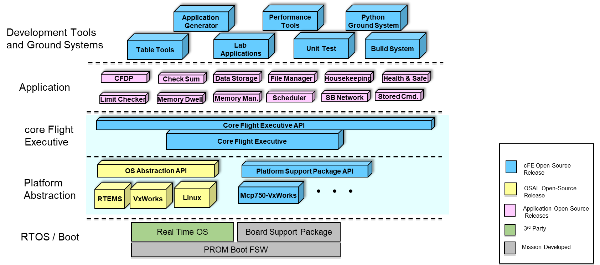
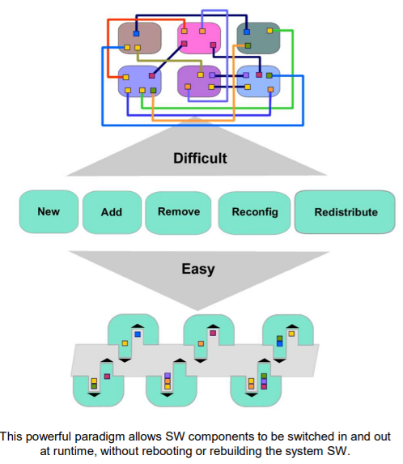
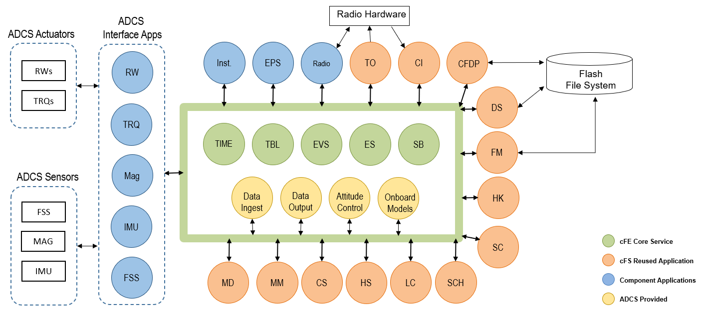
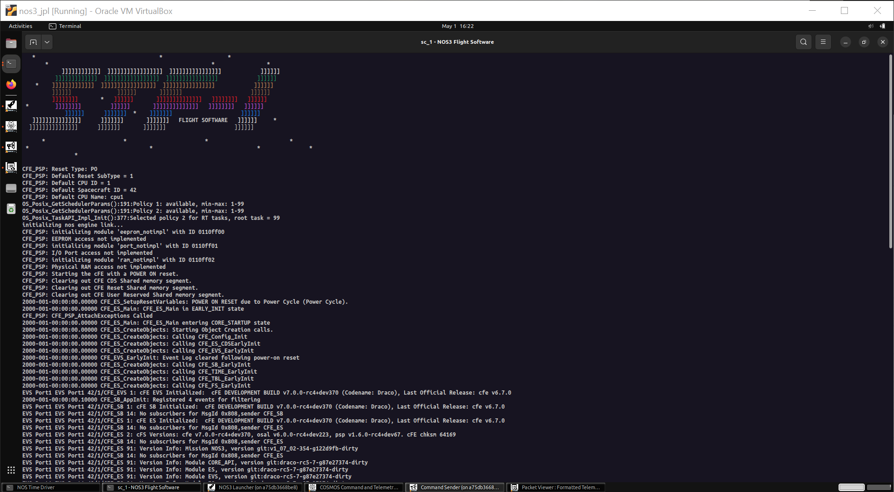
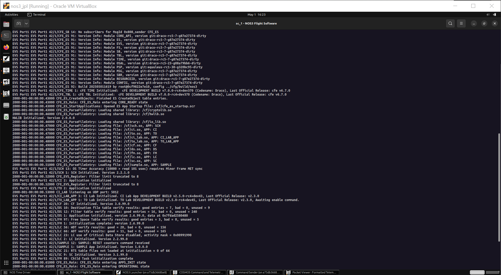
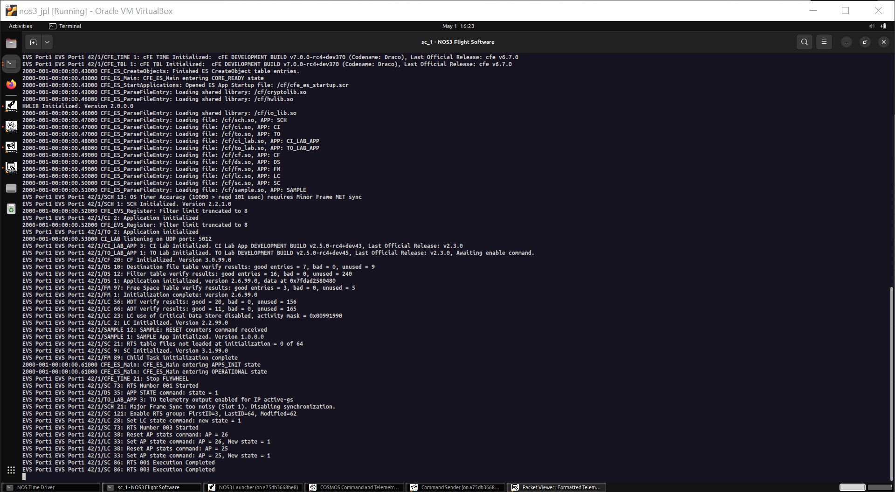
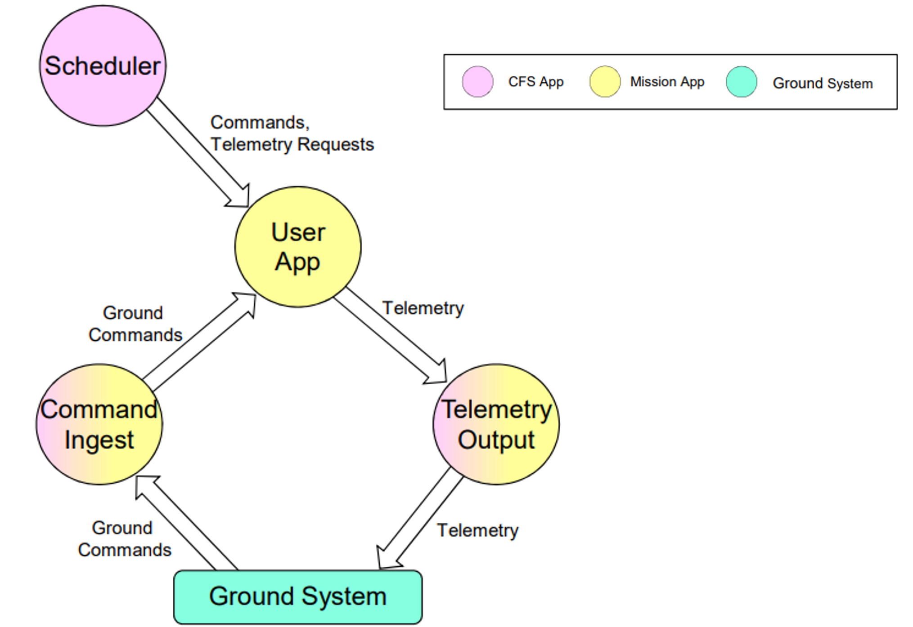
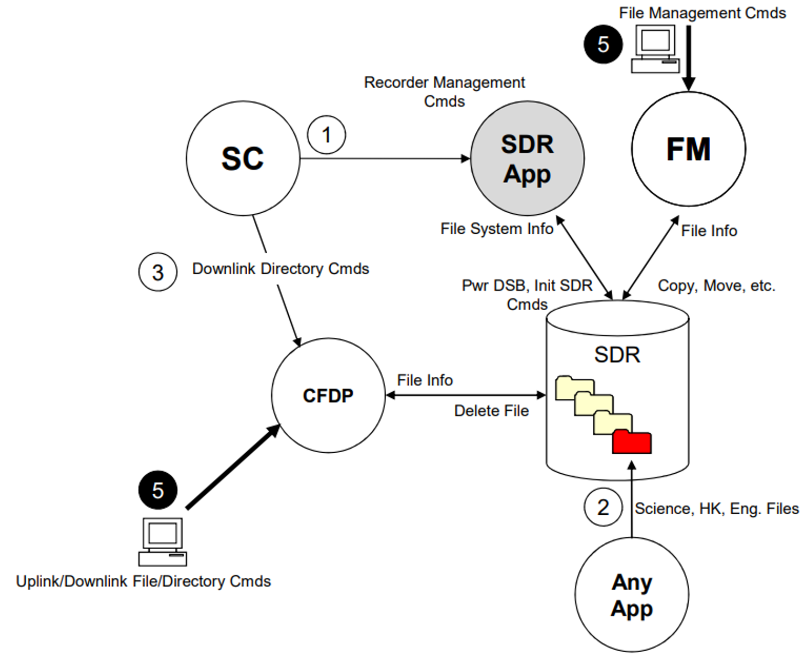
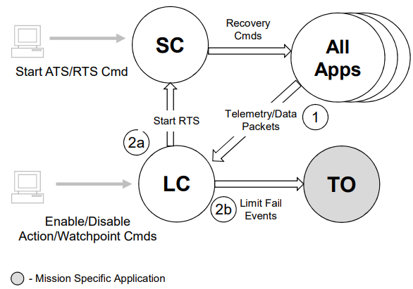

# 시나리오 - cFS

이 시나리오는 NASA Operational Simulator for Space Systems (NOS3)에 구현된 핵심 비행 시스템(core Flight System, cFS)의 개요를 제공하기 위해 작성되었습니다.

cFS의 소문자 "c"는 core Flight Executive (cFE)의 확장선상에서 구축된 가볍고 모듈화된 핵심(core) 설계를 의미합니다. cFE가 애플리케이션 로딩, 이벤트 로깅, 리소스 관리를 위한 기본 서비스를 제공하는 반면, cFS는 다음과 같은 기능을 통해 확장성을 제공합니다:
* 다양한 비행 하드웨어 간의 이식성을 가능하게 하는 운영체제 추상화 계층(OSAL) 및 플랫폼 지원 레이어(PSP).
* 특정 미션 요구사항에 맞게 설정할 수 있는 재사용 가능한 애플리케이션 모음.
* 미션 전용 컴포넌트를 개발하기 위한 표준화된 프레임워크.

NOS3는 cFS의 특화된 배포판 역할을 하며, 업스트림 코드베이스와의 호환성을 유지하면서도 커스텀 컴포넌트들을 통합하고 있습니다.
이러한 접근 방식을 통해 개발 팀은 오픈소스 생태계에 기여함과 동시에 커뮤니티의 최신 업데이트 이점을 누릴 수 있습니다.
이 시연에서는 NOS3의 최소 실행 모드(minimal mode)를 활용하여 주요 cFS 기능들을 살펴보고, 핵심 애플리케이션 및 서비스에 대한 실습 경험을 제공합니다.

이 시나리오는 2025년 9월 15일에 마지막으로 업데이트되었으며 당시 `dev` 브랜치 [422f66ec]를 활용했습니다.

## 학습 목표

이 시나리오를 마치면 다음 작업을 수행할 수 있게 됩니다:
* 비행 소프트웨어 프레임워크로서의 core Flight System (cFS)이 무엇인지, 그리고 그 기능이 무엇인지 이해하기.
* 필수 애플리케이션들(CI/TO, DS, FM, LC, SC, SCH)과 이들 간의 상호작용 탐색하기.
* 특정 미션 요구사항에 맞게 동작을 커스터마이징하기 위해 다양한 애플리케이션의 테이블 수정하기.
* 시스템 전체를 통과하는 엔드 투 엔드(End-to-End) 명령(Command) 및 텔레메트리(Telemetry) 흐름 추적하기.
* 여러 cFS 애플리케이션을 조합하여 기본적인 운용 시나리오 구현하기.

## 사전 준비 사항 (Prerequisites)

시나리오를 시작하기 전에 다음 단계를 완료하세요:
* [시작하기](./NOS3_Getting_Started.md)
  * {ref}`설치 <installation>`
  * {ref}`실행 <running>`
* [시나리오 - 데모](./Scenario_Demo.md)
* 최상위 파일인 [./cfg/nos3-mission.xml](https://github.com/nasa/nos3/blob/122d9fbb3d8095f8614b8cd18f188d10e643a08a/cfg/nos3-mission.xml)을 수정합니다.
  * `<sc-1-cfg>spacecraft/sc-mission-config.xml</sc-1-cfg>` 부분을 `<sc-1-cfg>spacecraft/sc-minimal-config.xml</sc-1-cfg>`로 변경하세요.

## 단계별 실습 (Walkthrough)

core Flight System (cFS)은 다음 목적을 달성하기 위해 개발되었습니다:
* 고품질 비행 소프트웨어의 배포 시간 단축.
* 프로젝트 일정 및 비용의 불확실성 감소.
* 정식화된 소프트웨어 재사용을 직접적으로 촉진.
* 여러 기관 간의 협업 가능.
* 지속적인 엔지니어링 단순화:
  * 즉, 궤도 상에서의 비행 소프트웨어(FSW) 유지보수 - 미션은 10년 이상 지속되는 경우가 많습니다.
* 소형 탑재체부터 허블 망원경 급 미션까지 유연하게 확장.
* 고급 개념 검증 및 프로토타이핑을 위한 플랫폼 구축.
* NASA 전체에서 공통으로 사용할 표준 및 도구 제작.

* 아키텍처 계층 (하단부터 설명)
  * **RTOS / BOOT (실시간 운영체제 및 부팅 계층):**
    * RTOS/Boot 계층은 cFS가 의존하는 운영체제 서비스, 장치 드라이버, C 라이브러리를 제공합니다.
    * 지원되는 운영체제로는 VxWorks, RTEMS, Linux 등이 있습니다. 대부분의 실제 비행 프로젝트는 실시간 운영체제(RTOS)를 사용합니다.
  * **Platform Abstraction (플랫폼 추상화 계층):**
    * OS Abstraction Layer (OSAL)은 하위의 실시간 운영체제 종류에 관계없이 core Flight Executive (cFE)에 단일 애플리케이션 프로그래밍 인터페이스(API)를 제공하는 소프트웨어 라이브러리입니다.
    * Platform Support Package (PSP)는 하위 항공전자기기(Avionics) 하드웨어 및 보드 지원 패키지(BSP)에 대한 단일 API를 제공하는 소프트웨어 라이브러리입니다. 스타트업 코드, 비휘발성 메모리, 워치독(Watchdog), 타이머 등 하드웨어와의 인터페이스를 포함합니다.
  * **core Flight Executive (cFE):**
    * cFE는 대부분의 비행 애플리케이션에 공통적으로 필요한 서비스를 제공함으로써 애플리케이션 런타임 환경을 생성하는 이식성 높고 플랫폼 독립적인 프레임워크입니다.
    * cFE 핵심 서비스 종류:
      * **Executive Services (ES):** 소프트웨어 시스템을 관리하고 애플리케이션 실행 환경을 생성합니다.
      * **Event Services (EVS):** 이벤트 메시지의 전송, 필터링, 로깅 서비스를 제공합니다.
      * **Table Services (TBL):** 애플리케이션의 데이터 테이블 이미지를 관리합니다.
      * **Time Services (TIME):** 우주비행체의 시간을 관리합니다.
      * **Software Bus (SB):** 애플리케이션 간의 발행/구독(Publish/Subscribe) 메시지 서비스를 제공합니다.
  * **Application (애플리케이션 계층):**
    * cFS 커뮤니티 앱과 미션 전용 앱을 조합하여 미션에 필요한 비행 기능을 제공합니다.
  * **Development Tools and Ground Systems (개발 도구 및 지상 시스템 계층):**
    * cFS를 테스트하고 실행하기 위해 다양한 개발 도구와 지상 시스템이 사용됩니다.
    * 프로젝트 특성에 따라 선택되는 지상 시스템과 도구가 달라집니다.

> 💡 **초보자 가이드: cFS 아키텍처 한눈에 이해하기**
> 소프트웨어를 건물의 층으로 생각하면 쉽습니다!
> 1. **RTOS**: 건물 바닥 (Linux, VxWorks 같은 실제 OS)
> 2. **OSAL/PSP**: 각기 다른 바닥재를 평평하게 덮는 카펫 (OS가 달라져도 상위 소프트웨어가 똑같이 동작하도록 만드는 범용 인터페이스)
> 3. **cFE**: 전원과 수도관 같은 기본 인프라 (앱 실행, 시간 관리, 메시지 전달 통로)
> 4. **Application**: 건물에 입주한 여러 매장들 (실제 위성 제어 기능 앱들)

* cFS API는 애플리케이션 추가 및 제거 기능을 지원합니다.
* 시스템을 재부팅하거나 다시 빌드하지 않고도 런타임 중에 애플리케이션을 동적으로 교체할 수 있습니다.
* 개발, 테스트 단계뿐만 아니라 실제 궤도 운용 중에도 변경 사항을 동적으로 추가할 수 있습니다.

* 새로운 애플리케이션의 추가가 매우 쉽게 수행됩니다.
* NOS3에는 기본적으로 검증된 전체 레퍼런스 미션 레퍼런스가 제공됩니다.
* 구조는 다음과 같으며, 각 앱은 소프트웨어 버스(SB)를 통해 필요한 만큼 서로 통신합니다:

---
### NOS3 구현체 확인

NOS3 리포지토리의 최상위 경로에서 터미널을 열고 진행합니다:
* `make clean`
  * 다른 시나리오로 인해 남아있을 수 있는 이전 빌드 파일을 정리하기 위해 clean을 실행합니다.
* `make`
* `make launch`
이제 `sc_1 - NOS3 Flight Software` 창을 열고 무슨 일이 일어나는지 하나씩 파헤쳐 봅시다:

위 화면은 NOS3의 모태가 된 STF-1(Simulation To Flight - 1) 미션을 기리는 기본 스플래시 화면입니다. 그 후 다음과 같은 동작이 이어집니다:
* PSP가 태스크(Task)와 메모리를 초기화합니다.
* 다양한 cFE 모듈들이 실행되기 시작합니다.
* ES가 부팅 상태(이 경우 전원 켜짐 리셋, Power On Reset)를 결정합니다.
* 탑재된 소프트웨어의 기록을 남기기 위해 모듈 버전들이 출력되고 로깅됩니다.

로드된 각 모듈에 대한 추가 버전 정보가 출력된 후 진행되는 과정:
* cFS 스타트업 스크립트(`cfe_es_startup.scr`)에 지정된 다양한 공유 객체(Shared Objects, .so 파일)들이 로드됩니다:
  * 목록을 순서대로 내려가며 각 객체를 로드합니다.
  * 각 라이브러리의 스타트업 스크립트에 지정된 초기화 함수가 실행됩니다.
  * 각 애플리케이션의 스타트업 스크립트에 지정된 메인(Main) 함수가 실행됩니다.
  * 각 모듈은 초기화가 완료되면 보통 성공 메시지를 출력합니다.

* 모든 애플리케이션이 초기화되면 **OPERATIONAL(운용)** 상태로 진입합니다.
* 부팅 유형에 따라 상대 시간 시퀀스(Relative Time Sequence, RTS)가 실행됩니다:
  * RTS1 - Power On Reset (POR, 전원 켜짐 리셋)
  * RTS2 - Processor Reset (프로세서 재부팅)
* NOS3에서는 시스템을 시작할 때마다 항상 하드 POR을 수행합니다.

---
### 핵심 서비스 (Core Services)

* **Command Ingest (CI) 및 Telemetry Output (TO):**
  * 명령을 수신하고 텔레메트리를 외부로 출력하는 필수적인 기능을 담당합니다.
  * NOS3에서 사용되는 NASA JSC의 CI 및 TO 앱은 모듈형 아키텍처를 활용하여 필요에 따라 다양한 모듈을 설정할 수 있습니다.
  * 다양한 모듈을 이용해 다양한 인터페이스나 프레임 타입을 처리할 수 있습니다.
    * CI가 수신한 모든 프레임은 소프트웨어 버스(SB)에 발행되기 위해 설정된 CCSDS Space Packet으로 분해되어야 합니다.
    * TO는 발행된 소프트웨어 버스 메시지들을 수집한 후, 이를 대형 프레임(예: CCSDS TM)으로 패키징하여 보낼 수 있습니다.
* **Scheduler (SCH):**
  * SCH는 텔레메트리 수집이나 프로세스 깨우기와 같은 주기적인 작업 실행을 유도합니다.
  * 기본적으로 SCH는 100Hz로 동작하며, 제공된 테이블의 각 슬롯에 지정된 작업이 해당 슬롯 주기마다 반복 실행됩니다.
  * SCH 테이블에서는 특정 패킷에 대한 지연 시간(Delay)과 오프셋(Offset)도 설정할 수 있습니다.

---
### 데이터 관리 (Data Management)

* **File Manager (FM):**
  * 디렉토리와 파일을 생성/삭제하고, 현재 존재하는 파일 상태를 조회하는 기능을 제공합니다.
* **Data Storage (DS):**
  * 정의된 테이블을 바탕으로 파일들을 생성합니다.
  * 또한 소프트웨어 버스에서 텔레메트리를 리스닝하며 필요에 따라 다운샘플링하고, 데이터를 하나 이상의 파일에 기록합니다.
  * 최대 파일 크기 및 보관 기간을 지정할 수 있으며, 생성 시점의 카운트나 현재 시간을 기반으로 파일 이름을 결정할 수 있습니다.
* **CCSDS File Delivery Protocol (CFDP):**
  * 우주비행체와 지상 간의 파일 전송을 가능하게 합니다.
  * **Class 1**: UDP 전송 방식과 유사하여 데이터가 손실되면 재전송 없이 그냥 손실됩니다.
  * **Class 2**: TCP 전송 방식과 유사하여 ACK(수신 응답) 및 NAK(부정 응답) 프로세스를 통해 전송 중 손실된 모든 데이터를 재전송합니다.
  * 일반적으로 Class 2가 선호되지만, 복잡성을 줄여야 하거나 데이터의 정확성보다 양이 중요할 때 Class 1이 사용되기도 합니다.

---
### 고급 운용 (Advanced Operations)

* **Limit Checker (LC)**
  * LC는 '와치 포인트(Watch Points)'라고 불리는 테이블에 정의된 텔레메트리 항목들을 모니터링합니다.
  * 또한 액션 포인트 및 조건문(예: 특정 설정값 초과 여부)을 평가하고 그에 맞는 동작을 실행합니다.
* **Stored Command (SC)**
  * 상대 시간 시퀀스(RTS) 테이블을 사용하면 위성의 운용 및 명령 제어를 간소화할 수 있습니다:
    * RTS는 명령과 명령 사이에 지연 시간을 두어 일련의 명령들을 연속으로 전송할 수 있습니다.
    * SC 자체에는 별도의 조건 판단 로직이 없으므로, 조건에 따라 실행하려면 LC의 액션 포인트나 지상 운용자의 실행 명령에 의존해야 합니다.
  * 절대 시간 시퀀스(Absolute Time Sequence, ATS) 테이블을 사용하면 정해진 실제 시각에 다양한 명령을 실행할 수 있습니다:
    * ATS는 실제 시간을 기반으로 포함된 명령들을 실행한다는 점을 제외하면 RTS와 유사합니다.
    * ATS는 주로 고급 과학 관측 미션이나 향후 지상국 교신 시간대 및 데이터 수집 주기를 예약할 때 활용됩니다.

---
### 추가 참고 자료

cFS와 관련된 추가 참조 문서 및 교육 자료는 다음 링크에서 확인할 수 있습니다:
* [cFS Github Repository](https://github.com/nasa/cFS)
* [NASA cFS 공식 교육 자료 (PDF)](https://ntrs.nasa.gov/api/citations/20205000691/downloads/TM%2020205000691.pdf)