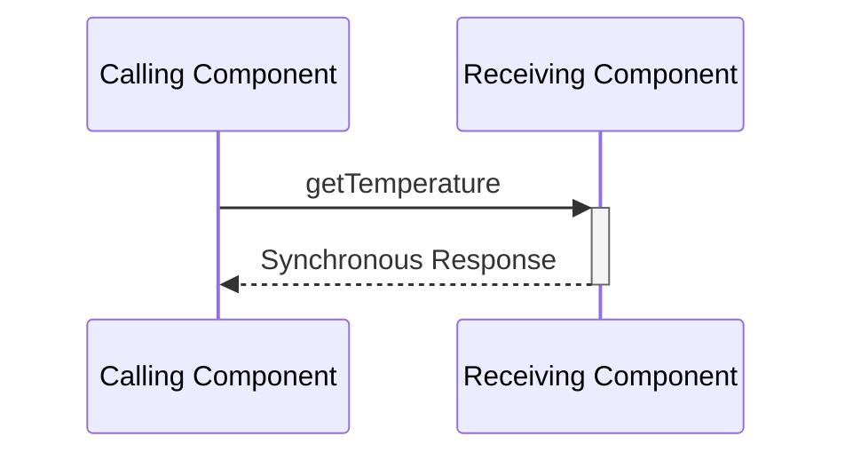
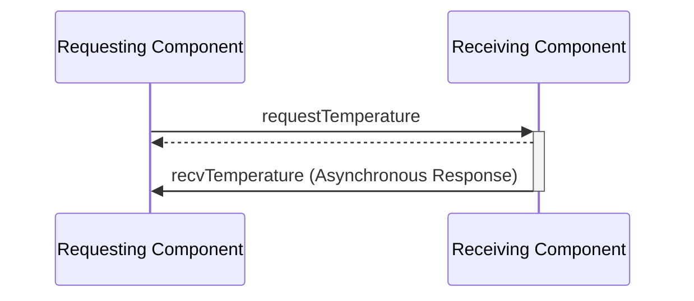
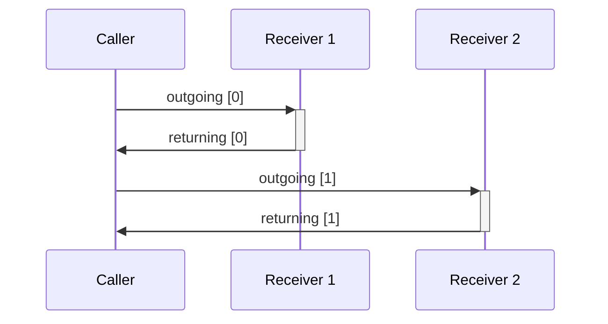
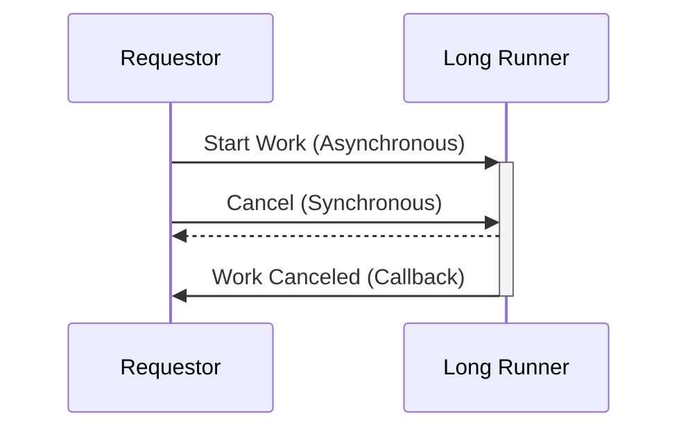
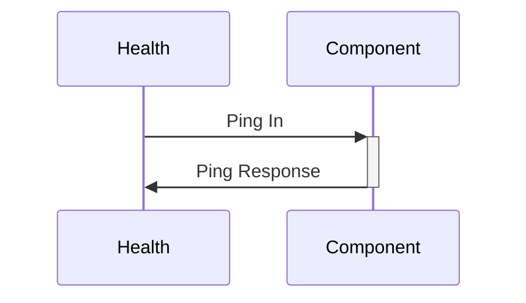
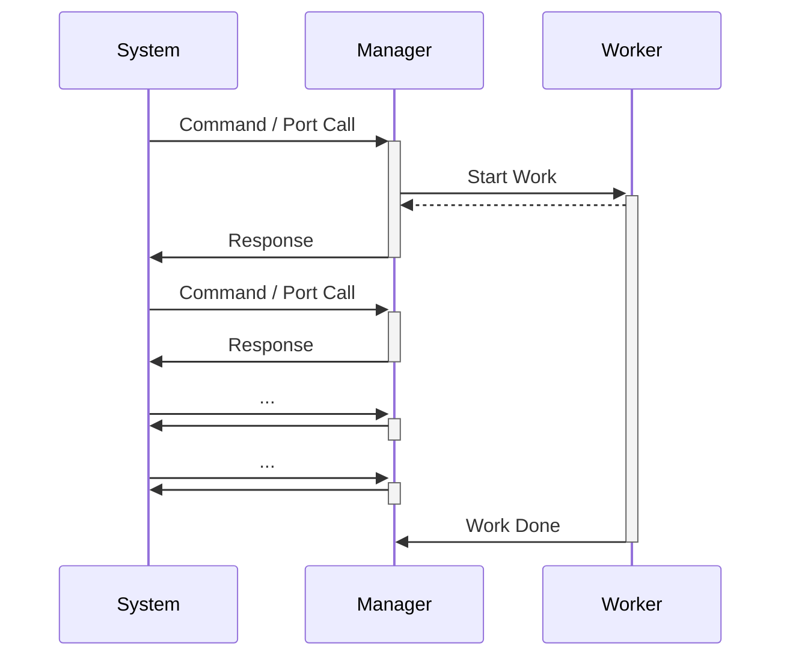

<!-- Generated by tools/generate_nos3_inventory.py; do not edit. -->
# design-patterns

**경로:** `fsw/fprime/fprime-nos3/lib/fprime/docs/user-manual/design-patterns/`

## 이 폴더의 파일

## `app-man-drv.md`

**경로:** `fsw/fprime/fprime-nos3/lib/fprime/docs/user-manual/design-patterns/app-man-drv.md`


```text
# Application-Manager-Driver Architecture

Standard F´ applications typically break down into various layers. This is done to apply standard software layering
techniques to F´ applications. Each layer is dependent on layers below it, however; these layers do not depend on layers
above them. These layers are composed of individual modules (usually **Components**) that represent concrete units of
functionality. These units have defined interfaces for communicating with other modules. In F´ these interfaces are the
list of **Ports** the component uses.

This guide covers the following:

- [A Brief on Software System Architecture](#a-brief-on-software-system-architecture)
    - [Software Layering](#software-layering)
- [Application Manager Driver Pattern](#application-manager-driver-pattern)
    - [Application Component](#application-component)
    - [Manager Component](#manager-component)
    - [Driver Component](#driver-component)
- [Conclusion](#conclusion)

## A Brief on Software System Architecture

The software system architecture is designed to break down software into modules. These modules provide separation of functions, definitions of interfaces, behavioral characteristics, testing at the unit level, and ownership. These modules are known as **Components** in F´ and all external functions of the component are defined as an interface for interacting with the component. In F´ the component’s **Port** list is its external interface. In addition, initialization functions and Constructors allow for setup and construction from the main thread.


### Software Layering

Software layering allows the separation of concerns by implementing logic such that a module only interacts with the layer below it. In addition, layering allows for decoupling code dependencies, as upper layers depend down the later stack, but layers do not depend up the stack. Thus preventing circular dependencies.

Layers can be replaced to support reusability, simulation, and testing. Fault protection can be isolated to a single layer and thus handled at the appropriate level.

## Application Manager Driver Pattern

The F′ component architecture comfortably fits into a layered software architecture. This can be done using an F´ design
pattern known as the Application Manager Driver pattern. F´ applications are assembled into layers of components. There
are typically three layers to this design pattern:

 1. application
 2. manager
 3. driver

These layers are further discussed below using the example shown in Figure 1. Each layer defines components for only
that layer’s functionality.


**Figure 1.** The three layers to a component model as shown in an example that drives a robotic arm using four servos
attached to an I2C bus.

## Application Component

The application layer implements mission specific functionality. It is the layer that defines cross-cutting
functionality that links together many parts of the system. However, it is not privy to the details of the parts of the
system. It represents system logic and uses peripherals and other components to perform the detailed behaviors of the F´
application.

In our example, the application level performs the function of a robotic arm, however; it only knows that the arm is
composed of servos and the high-level interface to those servos, but knows nothing of the hardware interface to
run those servos nor how to translate high-level servo interface into data packets.

## Manager Component

The manager layer manages a particular peripheral by using the interface driver at the abstract level (through the
driver’s interface of ports). The manager does not know how the peripheral will be used by the application. It does not
even know that it is used at all by the Application. However, the manager does know of the driver that is used
to talk to its peripheral and how to translate high-level commands into driver messages.

In our example, a servo manager is defined to know how to control servos through a driver and provides a generic
high-level servo interface to any application that might use servos.

## Driver Component

The driver layer is dedicated to a particular hardware interface. It is written to interact with only that type of
device, and does not need to know the use of hardware connected at the other end of the driver.

In the example, the driver provides an interface to the hardware device (I2C), but not an interface to the servo. It is
up to the manager to know how to control the servo via the driver. In our example, the driver runs an I2C bus but doesn't
know what I2C hardware it is talking to.

## Conclusion

By layering F´ projects using the Application Manager Driver pattern, standard software architecture techniques can be
adapted to an F´ project. In complex systems, there are often more components (multiple drivers, multiple managers) at
each layer, but these components should still fit into a single layer.
```

## `common-port-patterns.md`

**경로:** `fsw/fprime/fprime-nos3/lib/fprime/docs/user-manual/design-patterns/common-port-patterns.md`


````text
# Common Port Design Patterns

This guide will walk you through several common patterns using [ports](../overview/03-port-comp-top.md#ports-f-communication) in F Prime. 

You should be familiar with [Ports, Components, and Topologies](../overview/03-port-comp-top.md) in F Prime as well as have a basic understanding of modeling in [FPP](https://nasa.github.io/fpp/fpp-users-guide). To build an understanding of these concepts, you should consider running through our [Hello World Tutorial](https://fprime.jpl.nasa.gov/latest/tutorials-hello-world/docs/hello-world/).

**Common Port Patterns:**
1. [Synchronous Get Ports](#synchronous-get-ports)
2. [Callback Ports](#callback-ports)
3. [Parallel Ports](#parallel-ports)
4. [Synchronous Cancel](#synchronous-cancel)

## Synchronous Get Ports

Synchronous get ports are used to return data immediately from a component. These ports allow for the immediate query of data between components in an F Prime topology.

These ports can provide function-call like behavior between components that are connected together in an F Prime topology while still working within the bounds of the F Prime component architecture.

An example of synchronous get ports can be seen in the [PrmDb component](https://github.com/nasa/fprime/blob/devel/Svc/PrmDb/PrmDb.fpp#L42-L43).



> [!WARNING]
> When the value needed requires non-trivial work to compute a [Callback Port](#callback-ports) should be used instead.

Synchronous get ports maintain the architectural distinction between components while facilitating the return of data possible like in a standard function call. However, since these port calls execute on the thread of the caller, they should not perform substantial work as that would slow down the calling component..

Synchronous get component port instances typically use a name of the form "get<Value>" to designate their function (e.g. getTemperature).

> [!NOTE]
> Ensuring the work performed when in the synchronous handler is as minimal as possible is crucial to prevent delays from propagating back to the caller.

### Implementation

Synchronous get ports are implemented using a port type with a return value:

```fpp
@ Port synchronously returning an F32
port GetMyF32() -> F32
```

Component implementations will use a port instance of either of the synchronous port [kinds](https://nasa.github.io/fpp/fpp-users-guide.html#Defining-Components_Port-Instances_Basic-Port-Instances) (`sync` or `guarded`) and the "get" naming scheme described above.

```fpp
component MyComponent {
    guarded getTemperature: GetMyF32
}
```

Finally, the port handler should be minimal often returning just returning the value of a member variable previously set.

```c++
F32 getTemperature_handler() {
    return this->m_previously_set_temperature;
}
```
> [!NOTE]
> This snippet used the `guarded` kind to ensure data member protection provided through the `guarded` port's mutex.

### Conclusion

Synchronous get ports are used to return values from one component in the F Prime topology to another when little or no work is necessary to produce that value.


## Callback Ports

The callback port patten is used to separate a request port invocation from a following response port invocation allowing the requestor to return to other work while the request is completed. The ports used may be of any type and may contain port arguments to communicate results.

An example of this pattern can be found as part of the [Manager/Worker](https://github.com/nasa/fprime-examples/tree/devel/FlightExamples/ManagerWorker) interaction seen in F Prime examples.



Callback ports use two port connections between two components. The first port connection is an output port from the requester and an input to the receiver. The second port is an output of the receiver and an input back to the requester.

Command dispatch in F Prime uses the callback pattern.  The command dispatch port is invoked from the dispatcher (callback requester) to a component (callback receiver). The component will callback using the command completion port sending the success/failure status of the command execution.

Callback port instances receiving the results of a request should distinguish themselves from synchronous get ports by using naming of the form "recv<Value>".

Callback ports can be of any instance kind (`sync`, `guarded`, `async`) but are most commonly seen with `async` request ports as these cannot return a value upon invocation like synchronous get ports.

### Implementation

The requestor side of the callback port patten instantiates an `output` request port instance of any port type, and an `input` receive port instance of any type.  In the example below, `Fw.Signal` is used as the request type, and response port types, however; any port type may be used.

```fpp
component MyRequestor {
    @ Start long-running request
    output startRequest: Fw.Signal

    @ Receive data from long-running request
    guarded input recvResponse: Fw.Signal
}
```

The receiver contains the same ports with opposing directions. 

```fpp
component MyReceiver {
    @ Start long-running request
    async input startRequest: Fw.Signal

    @ Send data from long-running request
    output sendResponse: Fw.Signal
}
```

Finally, in the system topology the two component instances are cross-connected.

```fpp
connections CallbackPattern {
    requestor.startRequest -> receiver.startRequest
    receiver.sendResponse -> requestor.recvResponse
}
```

### Conclusion

The callback port patten is used to separate a request from the response allowing the requestor to return to other work while the request is completed.

## Parallel Ports

Parallel ports are can be used to manage a set of [callback ports](#callback-ports) and other sets of ports that attach to a set of external components. The advantage of the parallel port pattern is that it makes managing the call-response across this set of components easier by ensuring that ports are treated as parallel arrays. FPP modeling provides checks for parallel ports as well.

An example of parallel ports is the [Command Dispatcher](https://github.com/nasa/fprime/blob/875fa11f07480bd966bb9fd209c75534306f7572/Svc/CmdDispatcher/CmdDispatcher.fpp#L36) where `compCmdSend` is parallel to `compCmdReg` allowing correlation between command sending and registration.



By connecting a given component from the set of external component using the same index across ports the source component implementations can correlate the messages by port index.

### Implementation

In order to implement the parallel-port pattern, the user should define the ports using like-sized port arrays.  Parallel ports may use any kind of port (`sync`, `async`, `guarded`) and any port types as long as the port instance are arrays of the same size. It is best practice to define a constant to hold the dimension of the parallel port array.

The FPP modeling language provides a mechanism to automatically check parallel ports. This is called [matched ports](https://nasa.github.io/fpp/fpp-users-guide.html#Defining-Components_Matched-Ports). Using `match` and `with` you can establish a parallel relationship between two port arrays. This will yield an error if matched ports are not hooked up in parallel.

In the snippet below, we implement outgoing/incoming ports using parallel ports.

```
@ Parallel Port Array Count
constant PARALLEL_PORT_COUNT = 10

@ Outgoing parallel port
output port outgoing: [PARALLEL_PORT_COUNT] Fw.Signal

@ Incoming Parallel Port
async input port incoming: [PARALLEL_PORT_COUNT] Fw.Signal

@ Establish a model-checked parallel relationship
match incoming with outgoing
```

In the system topology, components should be wired to the same port index on the outgoing and incoming sides. 

```
connections ParallelPorts {
    myComponent.outgoing[0] -> comp0.in
    myComponent.outgoing[1] -> comp1.in

    comp0.out -> myComponent.incoming[0]
    comp1.out -> myComponent.incoming[1]
}
```

Notice how `comp0` in this snippet is is wired to `myComponent`'s ports always using the 0th index. The same is true for `comp1` on the 1st index. This allows the component to correlate the remote component via index.

In the C++ implementation this would look like:

```c++
    // Send a message to comp0
    this->outgoing_out(0);
    // Send a message to comp1
    this->outgoing_out(1);

void incoming_handler(FwIndexType portIndex) {
    switch (portIndex) {
        case 0:
            // Handle message from comp0
            break;
        case 1:
            // Handle message from comp1
            break;
    }
}
```
> [!NOTE]
> `comp0` and `comp1` could be any components. The important part is that a given component's ports (outgoing and incoming in this example) always use the same index for the same remote component.

### Conclusion

Parallel ports are useful in correlating port calls to a set of components using the port index. Parallel ports can be automatically checked using `match A with B` syntax in FPP.

## Synchronous Cancel

The synchronous cancel pattern is used to stop work running inside an asynchronous port handler.

Asynchronous components performing long-running work inside an `async` port handler or `async` command handler may need to stop that work before it has completed. However, another `async` message would be queued behind the long-running work and would be unable to halt the ongoing work.

This situation can be remedied by using a `sync` port call to set a cancel flag, which the long-running work can poll to determine if the work should be stopped early.

An example of this pattern can be found as part of the [Worker Component](https://github.com/nasa/fprime-examples/tree/devel/FlightExamples/ManagerWorker/Worker) in F Prime examples.



> [!NOTE]
> This pattern works equally well with `sync` commands allowing ground operators and sequences to cancel long-running work instead of other components.

> [!NOTE]
> The thread invoking cancel and the thread performing work are on different threads. Cancel flags or other shared data items must be operated on atomically.

### Implementation

Implementation of this pattern requires a synchronous port, perhaps using the `Fw.Signal` type:

```fpp
@ Port used to cancel long-running work
sync input port cancel: Fw.Signal

@ Example port performing long-running work to be canceled
async input port exampleRun: Fw.Signal
```

The component implementation class must provide a member variable (or other mechanism) to set synchronously when cancel is invoked. Here we use `std::atomic` to guarantee atomicity, however; a plain member variable could also be used in conjunction with `Os::Mutex` to also ensure atomicity.

```cpp
#include <atomic>

class MyComponent {
    ...
  private:
    std::atomic<bool> m_cancel;
}
```

The port handler of the cancel port then atomically sets a cancel flag to indicate that the long running work should stop.

```cpp
void cancel_handler() {
    // std::atomic ensures an atomic set of the cancel flag
    this->m_cancel = true;
}
```

Finally, the long-running work must occasionally poll to see if cancel is set.  This is shown below using a `while` loop .  Again, use of `std::atomic` or `Os::Mutex` is critical to ensure this read (and the above write) are safe as the read/write occur on different threads.


```cpp
void exampleRun_handler() {
    // Reset cancel flag before doing work
    this->m_cancel = false;

    // Loop until the work is done or the cancel request was received
    while (not work_done && not this->m_cancel) {
        ... do work ...
    }
}
```

### Conclusion

The synchronous cancel  pattern is used to stop work running inside an `async` handler. It is performed by atomically setting a cancel flag in a `sync` handler and polling that flag during the work running in the `async` handler.

## Conclusion

You should now be able to understand and apply common port patterns in F Prime.
````

## `health-checking.md`

**경로:** `fsw/fprime/fprime-nos3/lib/fprime/docs/user-manual/design-patterns/health-checking.md`


````text
# Health Checking Pattern

Certain services in flight software are critical for the correct execution of the system. For example, command dispatching is crucial to maintain control of the system. It is good practice to monitor these services to ensure they remain responsive during execution of the system. The health checking pattern is used to establish a component as a critical component of the system and periodically check it for responsiveness. 

The fprime-examples repository provides an example of the health checking pattern in its [Manager Component](http://github.com/nasa/fprime-examples/tree/devel/FlightExamples/ManagerWorker) as the Manager is intended to stay responsive at all times.

## Applicability

Any `active` component that must remain responsive for the system's continued functioning should implement the health checking pattern. Such components represent most active components in the system and might include:

  - Command Dispatch
  - Telemetry Handling
  - Event Handling
  - File Management
  - Data Product Management
  - Communications

Additionally, if a component is at-risk for losing responsiveness (e.g. potentially long-running operations, unbounded file i/o, etc.), the health checking pattern can be applied to ensure it remains alive.

## Design

An `active` component needing periodic health-checking should implement a set of [callback ports](./common-port-patterns.md#callback-ports) of type `Svc.Ping` and should be connected to the `Svc.Health` component.  The input `Svc.Ping` port must be asynchronous to ensure the test is run on the component's thread.  Upon receiving a ping, the component responds immediately back with the same message.



`Svc.Health` tracks how long it takes for the component to respond to the ping message placed on its queue.  `Svc.Health` will produce a `WARNING_HI` event after a configurable amount of time followed by `FATAL` event after a longer configured time. Thus the system will issue a WARNING_HI event if a component does not respond, and escalate to a FATAL event (triggering a reset or other FATAL handling) if the component remains unresponsive.

## Implementation

Implementation of the health checking pattern involves placing a pair of `Svc.Ping` ports on your `active` component, one as an `async input` and the other as an `output`.  Typically these ports are named `pingIn` and `pingOut` respectively.

**Component Model Snippet**
```
active component CriticalComponent {
    @ Ping input port to show responsiveness
    async input port pingIn: Svc.Ping

    @ Ping output port for response to the ping
    output port pingOut: Svc.Ping
}
```

The C++ implementation of the component must respond via `pingOut` when handling `pingIn`.

**Component C++ Snippet**
```c++
void CriticalComponent ::pingIn_handler(FwIndexType portNum, U32 key) {
    this->pingOut_out(portNum, key);
}
```

> [!NOTE]
> This implementation of a component's `pingIn_handler` is always the same.  It is safe to copy the above code verbatim as long as `CriticalComponent` is replaced with your component's name.

At the system topology level, you must specify a component handling system health.

```
topology MyTopology {
    ...
    health connections instance $health # Use instance 'health' as the handler of health (Svc.Ping) connections
}
```

You must also configure the delays (measured in the Health component's [rate group](./rate-group.md) ticks) that invoke a warning and fatal response from `Svc.Health`. This is done by defining a component instance configuration block in the `PingEntries` namespace under your topology's namespace

```c++
namespace MyTopology {
    namespace PingEntries {
        // Health 
        namespace criticalComponent {
            enum {
                WARN = 3, // WARNING_HI after 3 ticks without a response from criticalComponent instance of CriticalComponent
                FATAL = 5 // FATAL after 5 ticks without a response  from criticalComponent instance of CriticalComponent
            };
        }
    }
}
```
> [!NOTE]
> This configuration is set for **each instance** of the component.  In this example `criticalComponent` is an instance of `CriticalComponent`

## Testing and Verification

The health checking pattern can be tested by a combination of unit and integration tests. For basic functionality, invoke the `input` Svc.Ping port in a unit test, dispatch the component, and assert the `output` Svc.Ping port returned the supplied key.

Integration tests can be used to test this pattern alongside the Svc.Health component. Set the ping timeout of the component below the minimum time for the component using `HLTH_CHNG_PING` and assert that appropriate WARNING and/or FATAL events occur.

## Other Considerations

The health checking pattern can be used to test any active component, not just critical ones.  However, care should be taken with configured values as Svc.Health will FATAL the system in response to unresponsive components leading to system reset or other FATAL handling actions.

## Conclusion

The health checking pattern can be used to ensure critical services within the system remain responsive over the course of the software's execution. Should the component fail to respond for a pair of configurable durations, a WARNING_HI and FATAL event will respectively result.
````

## `hub-pattern.md`

**경로:** `fsw/fprime/fprime-nos3/lib/fprime/docs/user-manual/design-patterns/hub-pattern.md`


```text
# A Quick Look at the Hub Pattern

The Hub pattern is a way to distribute F´ applications across some barriers. These barriers may be address-space barriers, platform barriers, or other divides. With the hub pattern, we connect F´ ports through a serialized comm link
and then out the interface on the other side of the barrier. It is built around the hub.

A hub is a component with multiple serialization input and output ports. Typed ports from a calling component are
connected to the Hub's serialization ports. These ports allow any inputs which serialize to the communication bridge
across the divide. On the other side of the divide, the Hub unwraps the calls back into the typed ports. In this way,
typed ports are connected to typed ports using the Hub as an intermediary to get across the divide.


**Figure 9. Hub pattern.** Each hub instance is responsible for connecting to a remote node. Input port calls are
repeated to corresponding output ports on a remote hub. These hubs have been demonstrated on Sockets,
ARINC 653 Channels, High-speed hardware buses between nodes, and UARTs between nodes in an embedded system.

## Generic Hub

There is now a standard implementation of the hub pattern. The [GenericHub](../../../Svc/GenericHub/docs/sdd.md) is an
implementation of the hub pattern that passes through F´ ports and `Fw::Buffer`s.
```

## `manager-worker.md`

**경로:** `fsw/fprime/fprime-nos3/lib/fprime/docs/user-manual/design-patterns/manager-worker.md`


````text
# The Manager/Worker Pattern

The manager/worker pattern is used to perform long-running background work within a component that needs to remain highly responsive to the rest of the system. It is an adoption of the "worker thread" pattern (commonly seen in Computer Science) into the F Prime architecture.

The fprime-examples repository provides an example of the [Manager/Worker Pattern](http://github.com/nasa/fprime-examples/tree/devel/FlightExamples/ManagerWorker).

## Applicability

Often a component needs to perform some long-running work while still remaining responsive to commands and port dispatches coming in from the rest of the system. A few examples of such work are:

  - File Operations 
  - Algorithms with Long Compute Time
  - Machine Learning

Any work that is long enough to lock-up a component when it should be responsive to the larger system can be considered for this pattern.

You may also determine that some work of a component needs to be high-priority (e.g. responding to commands) and other work of that same component needs to be low-priority (e.g. loading a large file in the background).  This is another clear indication that you should consider the manager/worker pattern.


## Design

The manager/worker pattern is composed of two separate components: an `active` worker set to a low-priority that performs background work, and a manager component that off-loads background work to that worker. The worker component performs a [callback](./common-port-patterns.md#callback-ports) when the work is finished. This callback often contains the status of the work (complete, canceled, errored, etc). You could add in additional statuses if you wish to indicate work that is partially done (50% complete, on step 3, etc).



All interactions with the worker should be through the Manager in order to ensure that the worker need not be responsive while working.

The worker must be asynchronous in order to free up the manager's execution context.  Typically the worker is set to a lower priority in the system topology to ensure that its background work does not disrupt higher-priority work in a real-time operating system.

## Implementation

The implementation of the manager/worker pattern starts with two `active` components. A set of [callback ports](./common-port-patterns.md#callback-ports) is used for the manager to dispatch work to the worker and receive status in response. 

**Manager Model Snippet**
```
active component Manager {
    ...

    @ Signal to start the worker
    output port startWorker: Fw.Signal

    @ Signal from the worker that the work is finished
    async input port doneRecv: Fw.CompletionStatus

    @ Event to indicate that the work is starting
    event StartWork() severity activity high format "Manager starting work"

    @ Event to indicate that work is already happening
    event WorkerBusy() severity warning high format "Worker is currently busy"

    ...
}
```
> [!NOTE]
> Any port types can be used to start work and signal completion as long as the worker component matches.

> [!NOTE]
> The manager component typically has commands, port calls, and other design elements. This above snippet just represents the interaction with the worker.

**Manager Implementation Snippet**
```
void Manager ::START_cmdHandler(FwOpcodeType opCode, U32 cmdSeq) {
    if (this->m_busy) {
        this->log_ACTIVITY_HI_WorkerBusy();
    } else {
        this->m_busy = true;
        this->log_ACTIVITY_HI_StartWork();
        this->startWorker_out(0);
    }
    this->cmdResponse_out(opCode, cmdSeq, Fw::CmdResponse::OK);
}

void Manager ::doneRecv_handler(FwIndexType port, const Fw::Completed& status) {
    this->m_busy = false;
    ... handle status of work ...
}
```
Here the manager responds to a command by delegating work to the worker, and then returning a command status.

**Worker Model Snippet**
```
active component Worker {
    @ Signal to start the work
    async input port start: Fw.Signal

    @ Signal that the work is done
    output port workDone: Fw.CompletionStatus
}
```

> [!NOTE]
> Workers typically have no inputs (commands, ports) except those that are controlled by the manager component.

**Worker Implementation Snippet**
```
void Worker ::start_handler(FwIndexType port) {
    ... do work ...
    this->workDone_out(0, Fw::Completed::COMPLETED);
}
```


The [synchronous cancel port](./common-port-patterns.md#synchronous-cancel) pattern can be applied to the manager and worker components should the worker need to support the ability to cancel ongoing work.

There is one critical aspect of the manager/worker pattern that is set up at the system topology level: priority of the manager and worker.  Managers are by definition responsive, and thus run at a high-priority. Workers are typically background tasks, and thus run at a low-priority.

**Manager/Worker Instance Priorities**
```
instance manager: Manager base id Manage 0x0000 \
    queue size ... \
    stack size ... \
    priority 90 # High-priority (Linux) for the Manager

instance worker: ManagerWorker.Worker base id 0x1000 \
    queue size ... \
    stack size ... \
    priority 20 # Low-priority (Linux) for the Worker
```

> [!NOTE]
> Actual priorities should be determined relative to the other instances in the system. 

## Testing and Verification

Standard F Prime [Unit Testing](../overview/unit-testing.md) can be applied to test each component individually. However, this pattern typically requires integration testing to ensure that the manager/worker perform in-unison.

** Manager Response Testing **
```
def test_manager_response(fprime_test_api):
    """ Test that the manager remains responsive during work"""
    fprime_test_api.send_and_assert_command("manager.START", events=["manager.StartWork"])
    fprime_test_api.send_and_assert_command("manager.START", events=["manager.WorkerBusy"])
```

This simple test tries to start the manager twice and ensure it is up and responsive by looking for a manager busy `manager.WorkerBusy` event.  A more complete test is shown in the provided example.

## Other Considerations

There are other things that may be considered as part of this pattern.

### Manager Command Completion

Some implementations of the manager will respond with command complete calls immediately on receipt of a command. This unblocks waiting command sequencers to continue executing commands. However, it does not accurately represent that the work itself has been done.  

You may prefer to store the command completion parameters and respond with command complete calls on the work done handler in the manager instead. This will ensure an accurate reflection of the work getting done, but will also block command sequencers from progressing while the work is done.

Your specific manager will need to choose which path is right for your system.  Here are a few hints to help you decide:

1. Do you need to directly perform an action once the work is completed? If so, store the command response and respond later.
2. Do you want a blocking sequencer to continue while the work is performed? If so, respond immediately.

> [!NOTE]
> This pattern is about responsiveness of system components. Responding to commands later does not affect responsiveness but will prevent sequencing from continuing when running in BLOCK mode.

### Multiple Requests

Typically the manager/worker pattern is set up such that a worker will only perform one job at a time. The manager component will typically respond to additional requests with one of the following responses:

1. Respond with a busy event
2. Queue the request
3. Dispatching to a worker pool 

Busy events are most common and are used for the case when only a single worker request makes sense at a time. File loading workers often respond with busy.

Queuing requests can be done when all requests must eventually happen, but timeliness is not an issue. The manager should use a separate queue from the command queue when queueing future work requests.

Dispatching to a worker pool is used when more work needs to get done than a single worker can handle and the system needs to take advantage of parallelism.  This work is typically of medium-priority since timeliness is desired, and worker-pool workers are typically placed at a higher priority than their background worker counterparts.

## Conclusion

The manager/worker pattern can be used to off-load background work from a highly-responsive component to a low-priority worker. The worker then reports when the task is done thus ensuring the manager can remain responsive to requests during the duration of the work performed.
````

## `rate-group.md`

**경로:** `fsw/fprime/fprime-nos3/lib/fprime/docs/user-manual/design-patterns/rate-group.md`


```text
# Rate Groups and Timeliness

Often embedded software must perform actions at a fixed rate. In a given system there are usually collections of actions
that must run at similar rates. For example, control algorithms may run at 10Hz while telemetry collection may run at
1Hz and background tasks may be updated at 0.1Hz. F´ provides a mechanism to trigger time-based actions called "rate
groups". The `ActiveRateGroup` component contains multiple output `Sched` ports that it sends a message to at a repeated
rate. Thus, components having an input `Sched` port can run a repeated action at this rate. Rate groups are driven by a
central rate group driver and achieve their rates by dividing the incoming signal from the rate group driver.


## Rate Group Driver

The `RateGroupDriver` component is the source of the "clock" or tick for the various rate groups. It is usually driven
off a system timing interrupt or some other reliable clock source, and it performs the clock divider functionality to
produces a series of slower repeating tick signals that are sent to the rate groups attached to it.

### System Clock Sources

A system clock source needs to be supplied to the rate group driver. This clock source must run at some common multiple
of the rates required by the various rate groups. This signal drives the `CycleIn` port of the rate group driver, and is
divided into sub signals sent to the rate groups. Most projects implement a clock component that translates between the
system clock and the port call to rate group driver's `CycleIn` port.

The reference application calls the `CycleIn` port followed by a sleep for the system clock time within a while loop to
simulate a system-driven clock.

## Passive and Active Rate Groups

The passive and active rate groups receive the input source signal or "tick" at the divided rate as provided from the
rate group driver these components are attached to. These components then call each of those components at the
subdivided rate. For example, if the rate group driver is being called at 1000Hz it will provide a repeated divide this
signal into a set of slower rates (e.g. 100Hz, 10Hz, and 1Hz) and call a rate group at this rate.

Passive rate groups and the rate group driver are passive components.  Thus, all work done by the rate group driver, the
passive rate groups, and any synchronous ports triggered on components attached to the rate group will be performed in
the context of the caller of the rate group driver. This has the advantage of ensuring synchronous and high-priority
execution, but care must be taken to ensure that this work quick and critical because it will delay other rate groups
from executing.

Active rate groups run on a thread and thus there is some jitter between the system driver and the execution of the rate
group. However, multiple active rate groups can start up in unison.  However, there is no added concern about the work
blocking other rate group executions.

Should the synchronous work done by a rate group take longer than the rate group's cycle time to complete, the rate
group will be unable to run the next cycle. This is known as a rate group slip and will produce a WARNING_HI event.
Frequent slips indicate that the system is failing to keep up with the repetitive work and the cycle time may need to
be increased or child components need to be moved to slower rate groups.

### Active Rate Groups, Ordering, and Priority

Active rate groups are dependent on thread priority. Typically, rate groups are the highest priority components in the
system. This is because they are fairly low impact but start components that are of high priority and thus should be
assigned a thread priority higher than that of its children. Faster rate groups tend to be the highest priority of the
rate groups.

The active rate group sends messages in order to each of the attached components. Thus, higher priority children tend to
be attached to lower index `Sched` ports than lower priority children.

### Passive and Active Components

Passive components will run synchronously on the rate group. This has the advantage that if too many things are done on
one clock cycle the rate group will slip. However, each child will run in sequence. Active components will receive the
message from the active rate group but will not start until their thread becomes active. This allows children to run
without blocking each other, however; it becomes harder to detect when more work is scheduled in a cycle than can be
completed during the cycle because all work runs concurrently and competes for time across multiple threads.


## Rate Group Example: `Ref`

The `Ref` application uses rate groups to drive several system components as well as the demonstration SignalGen components.
In the `Ref` application, the `blockDrv` component is used to drive the rate group driver. That drives active rate groups
that then drive the components.

The topology connections for rate groups can be seen here:
[Rate Group Topology](https://github.com/nasa/fprime/blob/ddcb2ec138645da34cd4c67f250b67ee8bc67b26/Ref/Top/topology.fpp#L97-L124)

A sample schedule handler can be found here:
[Sample Schedule Handler](https://github.com/nasa/fprime/blob/ddcb2ec138645da34cd4c67f250b67ee8bc67b26/Ref/SignalGen/SignalGen.cpp#L98-L140)
```
