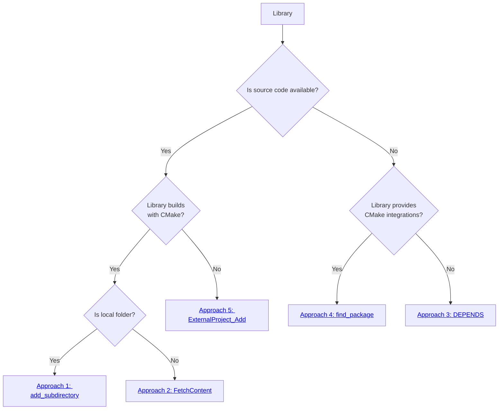

<!-- Generated by tools/generate_nos3_inventory.py; do not edit. -->
# NOS3 파일 인벤토리

**경로:** `fsw/fprime/fprime-nos3/lib/fprime/docs/how-to/`

## 이 폴더의 파일

### `custom-framing.md`

**경로:** `fsw/fprime/fprime-nos3/lib/fprime/docs/how-to/custom-framing.md`


````markdown
# Implement a Framing Protocol

This How-To Guide provides a step-by-step guide to implementing a custom framing protocol in F Prime Flight Software.

The default [F Prime Protocol](../../Svc/FprimeProtocol/docs/sdd.md) is a lightweight protocol used to get development started quickly with a low-overhead communications protocol that the [F Prime GDS](https://github.com/nasa/fprime-gds) understands. However, as projects mature, there may be a need to implement a framing protocol that fits mission requirements. This document provides an overview of how to implement a custom framing protocol in F Prime Flight Software, and how to integrate it with the F Prime GDS.

## Overview

This guide demonstrates how to implement a custom framing protocol, referred to here as **MyCustomProtocol**. The protocol defines how data is wrapped (framed) for transmission and how frames are validated and unpacked (deframed) on reception. 

A reference implementation of a custom framing protocol (the "Decaf Protocol") is available in the `fprime-examples` repository:
- [C++ CustomFraming Example](https://github.com/nasa/fprime-examples/tree/devel/FlightExamples/CustomFraming)
- [GDS Plugin Example](https://github.com/nasa/fprime-examples/tree/devel/GdsExamples/gds-plugins/src/framing)

This guide is divided into two main sections: flight software implementation and GDS integration. Note that if you are aiming to integrate with another GDS and do not wish to use the F´ GDS, you can skip the GDS section.

## Flight Software Implementation

To implement a custom framing protocol in F´, will need to implement the following:
- **Framer**: A component that wraps payload data into frames for transmission.
- **Deframer**: A component that unpacks received frames, extracts the payload data, and validate the frame.
- **FrameDetector** (optional): A helper class that detects the start and end of frames in a stream of data, if your transport is stream-based (e.g., TCP, UART).

The following examples will walk through the implementation of a custom framer and deframer for a hypothetical **MyCustomProtocol** protocol. Implementation details are left to the reader, but examples of such implementations can be found in the [fprime-examples repository](https://github.com/nasa/fprime-examples/tree/devel/FlightExamples/CustomFraming), or within the F´ codebase itself ([Svc.FprimeFramer](../../Svc/FprimeFramer/docs/sdd.md) and [Svc.FprimeDeframer](../../Svc/FprimeDeframer/docs/sdd.md)).

1. **Define the Framer and Deframer FPP Components**

   Framer and Deframer components should implement the FPP interfaces by including them.

   In  `MyCustomFramer.fpp`:
   ```
    passive component MyCustomFramer {
        include "path/to/fprime/Svc/Interfaces/FramerInterface.fppi"
        [...]
    }
   ```
   And in `MyCustomDeframer.fpp`:
   ```
    @ Deframer implementation for MyCustomProtocol
    passive component MyCustomDeframer {
        include "path/to/fprime/Svc/Interfaces/DeframerInterface.fppi"
        [...]
    }
   ```

2. **Implement the Framer C++ Component**

   Implement the required handler functions:
   ```cpp
   // ...existing code...
   void MyCustomFramer ::dataIn_handler(FwIndexType portNum, Fw::Buffer& data, const ComCfg::FrameContext& context) {
       // TODO: Implement framing logic
   }

   void MyCustomFramer ::comStatusIn_handler(FwIndexType portNum, Fw::Success& condition) {
        this->comStatusOut_out(portNum, condition); // pass comStatus through (unless project requires otherwise)
   }

   void MyCustomFramer ::dataReturnIn_handler(FwIndexType portNum, Fw::Buffer& data, const ComCfg::FrameContext& context) {
        // TODO: handle return of data ownership
        // For example, if component required to allocate from a buffer manager, return the buffer to the manager
   }
   // ...existing code...
   ```

3. **Implement the Deframer C++ Component**

   Similarly, implement the required handler functions:
   ```cpp
   // ...existing code...
   void MyCustomDeframer ::dataIn_handler(FwIndexType portNum, Fw::Buffer& data, const ComCfg::FrameContext& context) {
       // TODO: Implement deframing logic
   }

   void MyCustomDeframer ::dataReturnIn_handler(FwIndexType portNum, Fw::Buffer& data, const ComCfg::FrameContext& context) {
        // TODO: handle return of data ownership
   }
   // ...existing code...
   ```

4. **(Optional) Implement a Frame Detector**

   _When is this not needed?_  
   If your communications manager component always receives complete frames, you do not need to implement frame detection. This can be the case when using radios with built-in frame synchronization or when another subsystem handles frame delimiting.

   _When is this needed?_  
   If your data transport is stream-based (for example, relying on TCP or UART), or if you cannot guarantee that frames will always be received in full, you must implement a mechanism to delimit frames. F Prime provides this capability with the [Svc.FrameAccumulator](../../Svc/FrameAccumulator/docs/sdd.md) component, which uses a circular buffer and a helper `FrameDetector` to identify complete frames in the data stream.

   To use the `Svc.FrameAccumulator`, you need to configure it with a FrameDetector that detects when a frame is present:
   **MyCustomFrameDetector.hpp**
   ```cpp
    #include <Svc/FrameDetector/FrameDetector.hpp>

    class MyCustomFrameDetector : public Svc::FrameDetector {
      public:
        Svc::FrameDetector::Status detect(const Types::CircularBuffer& data, FwSizeType& size_out) const override;
    };
   ```

   **MyCustomFrameDetector.cpp**
   ```cpp
   // ...existing code...
   Svc::FrameDetector::Status MyCustomFrameDetector::detect(const Types::CircularBuffer& data, FwSizeType& size_out) const {
       // TODO: Implement frame boundary detection
       // Refer to the Svc.FrameDetector documentation for details on how to implement this
       return Svc::FrameDetector::NO_FRAME_DETECTED;
   }
   // ...existing code...
   ```

   Then configure the `Svc.FrameAccumulator` component to use your custom frame detector in your Topology CPP:
   **Top/Topology.cpp**
   ```cpp
    #include <path/to/MyCustomFrameDetector.hpp>
    // ...existing code...
    MyCustomFrameDetector frameDetector;
    // ...existing code...
    frameAccumulator.configure(frameDetector, 1, mallocator, 2048);
    ```


## F´ GDS Implementation

To support your custom protocol in the F´ GDS, implement a GDS framing plugin. The GDS plugin system allows you to customize GDS behavior with user-provided code. For new framing protocols, you will need to implement a plugin that extends the `FramerDeframer`. This is further documented in the [How-To Develop a GDS Plugin Guide](./develop-gds-plugins.md) and [F Prime GDS Framing Plugin reference](../reference/gds-plugins/framing.md).

For example, in Python:

```python
from fprime_gds.common.communication.framing import FramerDeframer
from fprime_gds.plugin.definitions import gds_plugin

@gds_plugin(FramerDeframer)
class MyCustomFramerDeframer(FramerDeframer):
    """GDS plugin for MyCustomProtocol framing"""
    def frame(self, data):
        # TODO: Implement framing logic
        return frame

    def deframe(self, data, no_copy=False):
        # TODO: Implement deframing logic
        return packet, leftover_data, discarded_data
```

Make sure to [package and install the plugin in your virtual environment](./develop-gds-plugins.md#packaging-and-testing-plugins) for the GDS to be able to load it, then run it:

```
fprime-gds --framing-selection MyCustomFramerDeframer
```

## References 

- [C++ CustomFraming Example](https://github.com/nasa/fprime-examples/tree/devel/FlightExamples/CustomFraming)
- [GDS Plugin Example](https://github.com/nasa/fprime-examples/tree/devel/GdsExamples/gds-plugins/src/framing)
- [F Prime GDS Framing Plugin](../reference/gds-plugins/framing.md)
- [F Prime Communication Adapter Interface](../reference/communication-adapter-interface.md)
- [F Prime GDS Plugin Development](https://fprime.jpl.nasa.gov/devel/docs/how-to/develop-gds-plugins/)

````

### `develop-fprime-libraries.md`

**경로:** `fsw/fprime/fprime-nos3/lib/fprime/docs/how-to/develop-fprime-libraries.md`


````markdown
# Develop an F´ Library

This guide will walk you through the structure and best practices in developing an F´ library.  F´ libraries are used to share modules (components, ports, topologies, etc.), toolchains, and platforms between F´ projects.  These libraries help with code reuse between projects by enabling direct sharing of F´ software.

*Contents:*

1. [F´ Library Structure](#f-library-structure)
2. [Required: `library.cmake`](#required-librarycmake)
3. [Optional: Toolchain Folder and Toolchain Files](#optional-toolchain-folder-and-toolchain-files)
4. [Optional: Platform Folder and Platform Files](#optional-platform-folder-and-platform-files)
5. [Optional: F´ Module Directories](#optional-f-module-directories)

## F´ Library Structure

In this section, you will learn about the expected structure of an F´ library. An F´ library must have a `library.cmake` and may have any of the following items:

1. Module Directories and Modules (Components, Ports, Topologies, etc.)
2. `cmake/toolchain` Folder and Toolchain Files
3. `cmake/platform` Folder and Platform Files

That means that a complete F´ library might look like the following:

```bash
my-library/
├── cmake
│   ├── platform
│   └── toolchain
├── MyLibrary
│   ├── Components
│   │   └── MyComponent
│   │       └── ...
│   └── MyDeployment
│       └── ...
└── library.cmake
```

> [!NOTE]
> Module directories shall be namespaced (i.e. `MyLibrary` above) to ensure that modules do not collide with F´ and other libraries. Placing container directories (e.g. `Components`, `Svc`, `Drv`, etc.) directly at the root of the repository is *strongly* forbidden.

You will see how to develop each of these parts of the library in the following sections.

##  Required: `library.cmake`

The `library.cmake` file is the only required file for an F´ library.  It consists of a series of `add_fprime_subdirectory` calls that include the various modules that are part of the library.  For libraries that just contain toolchains and platforms, this file may be empty. 

**Sample `library.cmake`**
```cmake
####
# library.cmake for MyLibrary
####
add_fprime_subdirectory("${CURRENT_CMAKE_LIST_DIR}/MyLibrary/Components/MyComponent")
add_fprime_subdirectory("${CURRENT_CMAKE_LIST_DIR}/MyLibrary/MyTopology")
```

`library.cmake` should exist at the root of the library's directory structure.


## Optional: F´ Module Directories

F´ libraries share F´ code through modules. These module directories are created by `fprime-util new --component` or by hand and may include any F´ code (Components, Ports, Topologies, Data Types, etc.).  These types are made available to users of the library by ensuring that they are added to the `library.cmake` file.  The only restriction is that these component should be placed under a namespacing directory for the library (e.g. `MyLibrary`) to avoid collisions with other libraries and F´ code.

Developing component, ports, topologies, etc. are the subject of our [tutorials](../tutorials/index.md).


## Optional: Toolchain Folder and Toolchain Files

F´ libraries often need to supply new toolchain integrations with F´. These libraries must define a `cmake/toolchain` folder and place toolchain files within that folder.  Any file ending in `.cmake` and placed within the `cmake/toolchain` folder will be available as a toolchain via `fprime-util generate <toolchain>`.

The example toolchain above (`cmake/toolchain/my-toolchain`) would be found as `my-toolchain` in `fprime-util`.

```bash
fprime-util generate my-toolchain
```

The `cmake/toolchain` folder may contain any number of toolchains and must be placed in the root of the library's directory structure.

## Optional: Platform Folder and Platform Files

In a similar manner to toolchains, platforms may be provided in the `cmake/platform` folder. Any file ending in `.cmake` and placed within the `cmake/platform` folder will be available to F´  to be loaded as a platform. Commonly, this means that a toolchain would include the line `set(FPRIME_PLATFORM <platform>)`.

The example platform would thus need to include `set(FPRIME_PLATFORM "my-platform")`.

The `cmake/platform` folder may contain any number of platform files and must be placed in the root of the library's directory structure.

## Conclusion

You should now understand the structure of an F´  library an know how to assemble one.
````

### `develop-gds-plugins.md`

**경로:** `fsw/fprime/fprime-nos3/lib/fprime/docs/how-to/develop-gds-plugins.md`


````markdown
# Develop a GDS Plugin

This guide will walk through the process of developing GDS plugins.  GDS plugins allow users to add functionality to the
GDS in several ways. These include:

1. SELECTION plugins: add another choice for key GDS functionality
2. FEATURE plugins: add functionality as an addition to the GDS.

This guide will walk through the development of a `framing`  SELECTION plugin to see the basic development of a plugin. Then
the guide will walk you through the development of a start-up application FEATURE plugin, which will also discuss
taking arguments to plugins. Finally the guide will close with a discussion of testing and distributing your plugins.

Examples covered here are available at: [https://github.com/fprime-community/fprime-gds-plugin-examples](https://github.com/fprime-community/fprime-gds-plugin-examples)

## Contents

- [Plugin System Design](#plugin-system-design)
- [Developing a Plugin](#developing-a-plugin)
  - [Basic Plugin Skeleton](#basic-plugin-skeleton)
  - [Implementing Virtual Functions](#implementing-virtual-functions)
- [Application Plugins](#application-plugins)
  - [Application Plugin Skeleton](#application-plugin-skeleton)
  - [Plugin Arguments](#plugin-arguments)
- [Packaging and Testing Plugins](#packaging-and-testing-plugins)
- [Distributing Plugins](#distributing-plugins)
- [Conclusion](#conclusion)


## Plugin System Design

GDS plugins are built on top of the [pluggy](https://pluggy.readthedocs.io/en/stable/). This means that each implementor
of a GDS plugin must define a function for behavior and mark that function with an implementation decorator. GDS plugins
all define a registration function, which returns an implementation class for the given plugin category.

The GDS defines several categories of plugins that the user may implement. These categories and the plugin type of each
category is summarized in the table below.

| Category      | Type          | Description                                                              | Reference                                                                    |
|---------------|---------------|--------------------------------------------------------------------------|------------------------------------------------------------------------------|
| framing       | SELECTION     | Implement a framer/deframer pair to handle serialized data               | [Framing Plugin Reference](../reference/gds-plugins/framing.md)              |
| communication | SELECTION     | Implement a communication adapter for flight software communication      | [Communication Plugin Reference](../reference/gds-plugins/communications.md) |
| data-handler  | FEATURE | Implement custom data item handling (for channels, events, etc)          | [Data Handler Plugin](../reference/gds-plugins/data-handler.md)              |
| gds-app       | FEATURE | Implement a new GDS application isolated to a separate process           | [Gds Application Plugin](../reference/gds-plugins/gds-app.md)                |
| gds-function  | FEATURE | (Advanced) Implement new GDS functionality with control over the process | [Gds Function Plugin](../reference/gds-plugins/gds-function.md)              |


Plugins should define a function called `register_<category>_plugin` that return a concrete subclass of the category's
implementation base class from the above table.  These concrete classes may additionally define `get_arguments`,
`get_name`, and `check_arguments` functions used by the plugin system to provide and validate arguments from the CLI.

This guide will walk through the development of a framing plugin and compare that to a gds-app plugin.

## Developing a Plugin

The first step in developing a framing plugin is to determine the function that must be implemented and the class that
must be derived to develop the plugin. For the case of a `framing` plugin, the `register_framing_plugin` function
must be defined to return a concrete subclass of `FramerDeframer`. This information was found in the above table.

> [TIP]
> Use the decorator `@gds_plugin(<BaseClass>)` to help define your plugins (e.g. `@gds_plugin(FramerDeframer)`).
> This will:
>  1. Check the supplied base class is a valid plugin base class
>  2. Add the appropriate register function
>  3. Ensure the decorated class is an appropriate sub class
>  4. Ensure all virtual functions are implemented

### Basic Plugin Skeleton

GDS plugins define a class that inherits from the implementation base class and implements all virtual functions. These
classes also define a properly decorated class method for the registration function, and may define the other class
methods used for CLI interaction.

A basic framing plugin skeleton would thus look like:
**`src/my_plugin.py`:**
```python
from fprime_gds.common.communication.framing import FramerDeframer
from fprime_gds.plugin.definitions import gds_plugin

@gds_plugin(FramerDeframer)
class MyPlugin(FramerDeframer):
    # TODO: implement virtual functions
    @classmethod
    def get_name(cls):
        """ Name of this implementation provided to CLI """
        return "my-plugin"

    @classmethod
    def get_arguments(cls):
        """ Arguments to request from the CLI """
        return {}

    @classmethod
    def check_arguments(cls):
        """ Check arguments from the CLI """
        pass
```

### Implementing Virtual Functions

Each plugin implementation base class (e.g. `FramerDeframer`) has a set of virtual methods that plugin implementors
*must* implement  in order to support the plugin implementation.  These functions are marked as ` @abc.abstractmethod`
and can be found in the virtual class definition.

[FramerDeframer virtual functions](https://github.com/fprime-community/fprime-gds/blob/devel/src/fprime_gds/common/communication/framing.py#L29-L51)
consist of a `frame` and `deframe` method. Below the frame function adds the bytes `MY-PLUGIN` to the start of each
frame and strip the same bytes off the start of each frame. This is a trivial example of a start word.

**`src/my_plugin.py`:**
```python
from fprime_gds.common.communication.framing import FramerDeframer
from fprime_gds.plugin.definitions import gds_plugin

@gds_plugin(FramerDeframer)
class MyPlugin(FramerDeframer):
    START_TOKEN = b"MY-PLUGIN"
    
    def frame(self, data):
        """ Frames data with 'MY-PLUGIN' start token """
        return self.START_TOKEN + data

    def deframe(self, data, no_copy=False):
        """ Deframe data with 'MY-PLUGIN' start token """
        discarded = b""
        data = data if no_copy else b"" + data # Copy data if no_copy
        
        # Deframing can deframe until data length isn't enough to provide start token
        while len(data) > len(self.START_TOKEN):
            # Starts with start word and a second start word found
            if data[:len(self.START_TOKEN)] == self.START_TOKEN and self.START_TOKEN in data[1:]:
                data = data[len(self.START_TOKEN):] # Remove initial start token
                # Return packet (data to next start token), unconsumed data, and discarded data
                return data[:data.index(self.START_TOKEN)], data[data.index(self.START_TOKEN):], discarded
            # Starts with start token, but beginning of next packet was not found
            elif data[:len(self.START_TOKEN)] == self.START_TOKEN:
                # Wait for new data
                break
            # Does not start with requested token throw away one byte and continue
            else:
                discarded += data[1]
                data[1:]
                continue
        # No packet found, all data unconsumed, and discarded
        return None, data, discarded
    
    @classmethod
    def get_name(cls):
        """ Name of this implementation provided to CLI """
        return "my-plugin"

    @classmethod
    def get_arguments(cls):
        """ Arguments to request from the CLI """
        return {}

    @classmethod
    def check_arguments(cls):
        """ Check arguments from the CLI """
        pass
```

This is the basic implementation of a no-argument framing plugin. The above plugin tracks a single start `MY-PLUGIN`
string and deframes that as a packet.  Next, this guide will cover how to integrate this plugin via python packaging. 
Following that, plugin arguments will be covered.

You may now continue to read about "Application Plugins" that show the other type of plugin available for the `fprime-gds`.
This section also covers how arguments to plugins work.  Otherwise, jump to the
[Packaging and Testing Plugins](#packaging-and-testing-plugins) section to begin testing your plugin!

## Application Plugins

Unlike the example `framing` plugin, application plugins run in addition to the GDS. These plugins can be used to start
new services that connect to the larger GDS network.  Application plugins will be used to show how to solicit arguments
from the command line.

Our plugin ill run python to print a message supplied via arguments. This is the equivalent to running the following
command line:
```bash
python -c "print('Hello World')"
```

### Application Plugin Skeleton

Here is the basic structure for a `gds-app` plugin.  It prints "Hello World".  gds-app plugins must implement the
function `get_process_invocation` that returns command line arguments to be run as a separate process using the
`subprocess` module.

**`src/my_app.py`:**
```python
import sys
from fprime_gds.executables.apps import GdsApp
from fprime_gds.plugin.definitions import gds_plugin

@gds_plugin(GdsApp)
class MyApp(GdsApp):
    """ An app for the GDS """

    def get_process_invocation(self):
        """ Process invocation """
        return [sys.executable, "-c", "print('Hello World')"]

    @classmethod
    def get_name(cls):
        """ Get name """
        return "my-app"
```

### Plugin Arguments

Plugins can source arguments from the command line. Although, all types of plugins can source arguments using the pattern
described here, you will see them shown with our application plugin.

It is time to add in plugin arguments. This plugin will take one argument `--message` and will inject this message into
the printed message.  To do this we return the argument using the `get_arguments` class method.  Add this to your plugin
`MyApp` class:

```python
    @classmethod
    def get_arguments(cls):
      """ Get arguments """
      return {
        ("--message", ): {
          "type": str,
          "help": "Message to print",
          "required": True
        }
      }
```

`get_arguments` is a class method that returns a dictionary whose keys are tuples containing the flags, and whose value
is a dictionary of keyword arguments passed to
[`argparse.add_argument`](https://docs.python.org/3/library/argparse.html#the-add-argument-method).

Arguments are supplied to the plugin at instantiation via keyword arguments. Add the following to your `MyApp` class.

```python
    def __init__(self, message):
        """ Constructor """
        super().__init__()
        self.message = message
```

Change the `get_process_invocation` to use the new member variable.

```python
    def get_process_invocation(self):
        """ Process invocation """
        # Inject message into command line to print
        return [sys.executable, "-c", f"print(f'{self.message}')"]
```

Finally, security-minded developers will notice there is an injection vulnerability above. This can be check using the
`check_arguments` class method.  This method should raise a `ValueError` or `TypeError` when an argument value is
malformed.  Add this function to `MyApp` fix the injection:

```python
    @classmethod
    def check_arguments(cls, message):
        """ Check arguments """
        if "'" in message or '\n' in message:
            raise ValueError("--message must not include ' nor a newline")
```

Now our plugin may be run.  The GDS will automatically solicit the message argument as seen should the user run
```bash
fprime-gds --help
```

The complete plugin would look like:

**`src/my_app.py`:**
```python
import sys
from fprime_gds.plugin.definitions import gds_plugin
from fprime_gds.executables.apps import GdsApp

@gds_plugin(GdsApp)
class MyApp(GdsApp):
    """ An app for the GDS """

    def __init__(self, message):
        """ Constructor """
        super().__init__()
        self.message = message

    def get_process_invocation(self):
        """ Process invocation """
        # Inject message into command line to print
        return [sys.executable, "-c", f"print(f'{self.message}')"]

    @classmethod
    def get_name(cls):
        """ Get name """
        return "my-app"
    
    @classmethod
    def get_arguments(cls):
        """ Get arguments """
        return {
            ("--message", ): {
                "type": str,
                "help": "Message to print",
                "required": True
            }
        }

    @classmethod
    def check_arguments(cls, message):
        """ Check arguments """
        if "'" in message or '\n' in message:
            raise ValueError("--message must not include ' nor a newline")
```

## Packaging and Testing Plugins

Plugins are supplied as python packages with an entrypoint used to load the plugin. In the root of the package a basic
python package will need to be configured. This consists of two files: pyproject.toml representing the package, and
setup.py for backwards compatibility.

The project structure should look like:
```
    src/my_plugin.py
    pyproject.toml
    setup.py
```

A sample pyproject.toml file would look like:

```toml
[build-system]
requires = ["setuptools", "wheel"]
build-backend = "setuptools.build_meta"

[project]
name = "fprime-gds-my-plugin"
version = "0.1.0"
dependencies = [
    "pluggy>=1.3.0",
    "fprime-gds>=3.4.4"
]

[project.entry-points.fprime_gds]
my_plugin = "my_plugin:MyPlugin"

[tool.setuptools_scm]
```

A sample `setup.py` would look like:
```python
from setuptools import setup

# Configuration is in pyproject.toml
setup()
```

We can add our application plugin with the following additional line in the `project.entry-points.fprime_gds` section:

```toml
my_app = "my_app:MyApp"
```

Once these files have been written, the plugin can be installed locally for testing with the following command:

```
cd /path/to/plugin/directory
pip install -e .
```

> [!WARNING]
> Users must be in the same virtual environment that the `fprime-gds` package has been installed into
>
> `-e` allows local changes to take effect without a reinstall

The first step in testing a plugin is to run `fprime-gds --help`. This should show arguments associated with your plugin.
The plugins implemented here would produce the following output:

```
usage: fprime-gds ...
...
Framing Plugin Options:
  --framing-selection {fprime,my-plugin}
                        Select framing implementer. (default: fprime)
...
Gds_App Plugin 'my-app' Options:
  --disable-my-app      Disable the gds_app plugin 'my-app' (default: False)
  --message MESSAGE     Message to print (default: None)
```
> [!WARNING]
> Syntax errors, indentation errors, and other exceptions can arise during this step. Resolving these errors will allow the help message to display properly.

To test SELECTION plugins, select them during a normal GDS run:

```
fprime-gds --framing-selection my-plugin
```
> [!WARNING]
> Remember to supply any arguments needed for your plugin!

Application plugins run automatically at start-up. To test these plugins, just supply any desired arguments:

```
fprime-gds --message "Hello Plugin
```

## Distributing Plugins

Plugins are implemented as python packages.  Thus plugins may be distributed in the following ways:

1. Source Distribution: send users your source code and install with `pip install .` as shown above
2. Binary Distribution: send users a wheel of your package to install with `pip install /path/to/wheel`
3. PyPI: distribute your wheel via PyPI

A tutorial on python packaging including building wheels and uploading them to PyPI is available from packaging.python.org:
[https://packaging.python.org/en/latest/tutorials/packaging-projects/](https://packaging.python.org/en/latest/tutorials/packaging-projects/)

## Conclusion

This guide has covered how to develop GDS plugins, their design, and SELECTION vs FEATURE plugins. You should now
be capable of writing plugins and handling arguments.
````

### `develop-subtopologies.md`

**경로:** `fsw/fprime/fprime-nos3/lib/fprime/docs/how-to/develop-subtopologies.md`


````markdown
# Develop a Subtopology

Subtopologies are topologies for smaller chunks of behavior in F Prime. It allows for grouping bits of topology architecture that fit together, to then be imported into a base deployment's topology. The use case for this is seen when working with shareable components, specifically in the form of [libraries](./develop-fprime-libraries.md).

There are two ways that subtopologies can be created in F Prime. The first (native) way to do so is by hand-writing subtopologies. This method is less complex, but more tedious and restrictive on the capabilities of subtopologies. **This document covers hand-written subtopologies**. 

The second method of creating subtopologies is through the [Subtopology Autocoder](https://github.com/fprime-community/fprime-subtopology-tool) (also described in [a later section of this document](#the-subtopology-autocoder)). This method is more complex, however expands upon the feature set and capabilities of subtopologies. A document that details the process for creating a subtopology with it is available [at the repo for the tool](https://github.com/fprime-community/fprime-subtopology-tool/blob/main/docs/Example.md).

*Contents*
1. [Subtopology Structure](#subtopology-structure)
2. [Individual File Contents](#individual-file-contents)
    1. [Example Scenario](#example-scenario)
3. [Integration into a "Main" Deployment](#integration-into-a-main-deployment)
4. [Subtopology Autocoder](#the-subtopology-autocoder)
5. [Conclusion](#conclusion)

## Subtopology Structure

A subtopology is a folder that contains a `topology.cpp` file, which includes a `topology.fpp` file, which is a *unified* topology file including your wiring, component instances, and init specifications. As opposed to having separate files for component instances and the topology itself, the single file encapsulates both. A `topologydefs.hpp` defines a struct that is used when instantiating your subtopology. A `CMakeLists.txt` file links your `topology.cpp` file to the build for your project.

Thus, the required structure for your subtopology should be:

```bash
MySubtopology/
├─ CMakeLists.txt
├─ intentionally-empty.cpp
├─ MySubtopology.cmake
├─ MySubtopology.fpp
└─ MySubtopologyTopologyDefs.hpp
```

All files will be discussed in more detail in later sections of this guide. Additionally, note that there are optional files that can be included in your subtopology to extend its capability.

- It is highly recommended to include a `docs` folder to document your subtopology. Simple markdown files (`sdd` for subtopology design document) work well in this case.
- Other `.fpp` files can also be included in your subtopology. For example, a `config.fpp` may prove to be quite useful.
- Unit tests can also be added to your subtopology, using a similar structure to unit tests for components.
- Subtopology configuration behavior for components are written with [phases](https://nasa.github.io/fpp/fpp-users-guide.html#Defining-Component-Instances_Init-Specifiers_Execution-Phases).
- `intentionally-empty.cpp` is a necessary file to include. It will be discussed why this is included [later](#cmake-and-buildstep-files).

> Note that with the latest release of `fprime-tools`, you can run `fprime-util new --subtopology` to generate the subtopology structure.

> [!NOTE]
> Remember, this document covers hand-written subtopologies. See [a later section](#the-subtopology-autocoder) for information about the Subtopology Autocoder tool, the other way of creating subtopologies.

## Individual File Contents

This section will provide an overview to the contents of the individual files that make up a subtopology. We will use the names of the required files structure as shown in the [above](#subtopology-structure) section. However, note that the file names shown are not required to be duplicated within your own custom subtopologies.

### Example Scenario

For this section, it would be helpful to come up with an example scenario where the subtopology is used, such that it can be better understood. Let's imagine that we would like to create a component called `RNG` that will write a random integer to some telemetry channel when it is hooked up to a 1Hz clock (rate group). The `RNG` component will have an input port called `run`, that will be the entry point from the clock (rate group). The `RNG` component will be an active component, and is under the `MyLibrary` namespace.

### MySubtopology.fpp

As mentioned, this is a unified `.fpp` file. It not only includes the instances instance declarations for components that you'd like your subtopology to use, but also the definitions for the instances.

Based on our example, we may have the following instance declarations:

```
instance rng // RNG component instance
instance rateGroup // rate group instance
``` 

and thus the following instance definitions:

```
instance rng: MyLibrary.RNG base id 0xFF2FF \
    queue size Defaults.QUEUE_SIZE \
    stack size Defaults.STACK_SIZE \
    priority 100

instance rateGroup: Svc.ActiveRateGroup base id 0xFF4FF \
    queue size Defaults.QUEUE_SIZE \
    stack size DEFAULTS.STACK_SIZE \
    priority 150
```

and also the following wiring:

```
connections MyWiring {
    // we will hook up the cycle for our rate group later on
    rateGroup.RateGroupMemberOut[0] -> rng.run
}
```

Thus, your unified fpp file, and so `MySubtopology.fpp` could look like:

```
module MySubtopology {
    instance rng: MyLibrary.RNG base id 0xFF2FF \
        queue size Defaults.QUEUE_SIZE \
        stack size Defaults.STACK_SIZE \
        priority 100

    instance rateGroup: Svc.ActiveRateGroup base id 0xFF4FF \
        queue size Defaults.QUEUE_SIZE \
        stack size DEFAULTS.STACK_SIZE \
        priority 150

    topology MySubtopology {
        instance rng // RNG component instance
        instance rateGroup // rate group instance

        connections MyWiring {
            rateGroup.RateGroupMemberOut[0] -> rng.run
        }
    } // end topology
} // end MySubtopology
```

## Unified fpp with Phases

"Phases" are a way to be able to write C++ based configuration functions on a component instance-basis. They aim to replace a topology.cpp/hpp pair of files with the single, unified fpp file. For subtopologies, we enforce the usage of phases to maintain consistency and simplicity in the subtopology.

In a standard cpp/hpp configuration model, your topology would be initialized using the following three functions:

```cpp
namespace MySubtopology{
    void configureTopology(const TopologyState& state) {
        // ... your code here ...
    }

    void startTopology(const TopologyState& state) {
        // ... your code here ...
    }

    void teardownTopology(const TopologyState& state) {
        // ... your code here ...
    }
}
```

In the phase pattern, these three (as well as others, [described in detail](https://nasa.github.io/fpp/fpp-users-guide.html#Defining-Component-Instances_Init-Specifiers)) are tied as "init specifiers" to fpp component instances. So, instead of configuring all components in one place, each instance defines its own init specification. 

This looks like the following example, and can be done inline within your unified fpp file:

```
passive component C1

instance c1: C1 base id 0x4444 \
{
    phase Fpp.ToCpp.Phases.configComponents """
        // your cpp code here for configuring
    """
}
```

As aforementioned, we enforce the utilization of phases for subtopologies. Notably, not shown here is that phases can still take in the `TopologyState state` variable. `TopologyState` is that struct, which can include any variables you would like a developer to be able to modify. This provides dynamic-ness to your subtopology.

We're now going to interject information about `MySubtopologyTopologyDefs.hpp`, because it is more relevant to the current topic.

## MySubtopologyTopologyDefs.hpp

In our example, we may want to allow the user to customize the initial seed for our random number generator:

```cpp
struct TopologyState {
    // ...
    U32 initialSeed;
    // ...
}
```

This struct definition is included within `MySubtopologyDefs.hpp`. In addition to this, we may notice that we need to include global definitions in our `Defs.hpp` file; however depending on your subtopology, you may find this part optional. An example of how these definitions may be written is here:

```cpp
// Example; may not be required

namespace GlobalDefs {
    namespace PingEntries {
        MySubtopology_rateGroup {
            enum { WARN = 3, ERROR = 5 };
        }
    } // end PingEntries
} // GlobalDefs
```

Notice that we wrap `PingEntries` in a namespace called `GlobalDefs`. This is important, as it allows us to use the namespace `GlobalDefs` across multiple topologies, and then link them all together in the main deployment. This will become more clear in the [next section](#integration-into-a-main-deployment).

This brings us to a unique naming scheme for variable names for subtopologies. On the development-end of the subtopology, we see names like `configureTopology`. However, on the build end when these subtopologies are folded into a bigger project, these functions are added to namespaces via their names. Inherently this makes sense, so that we don't confuse a function, or especially a component instance, with each other. So:

| fpp                     | cpp syntax              |
| ----------------------- | ----------------------- |
| MySubtopology.rateGroup | MySubtopology_rateGroup |

## CMake and buildstep files

The last step is to include our CMake-specific files. This includes `CMakeLists.txt`. There is a very repeatable structure, and inherently just notifies the compiler that our topology exists when we build a deployment. 

In `CMakeLists.txt`: 

```cmake
set(SOURCE_FILES
    "${CMAKE_CURRENT_LIST_DIR}/RNGTopology.fpp"
    "${CMAKE_CURRENT_LIST_DIR}/intentionally-empty.cpp"
)

register_fprime_module()

set_target_properties(
    ${FPRIME_CURRENT_MODULE}
    PROPERTIES
    SOURCES "${CMAKE_CURRENT_LIST_DIR}/intentionally-empty.cpp"
)
```

As you can see, we have reached the point where we need to use `intentionally-empty.cpp`. Remember the syntax renaming from earlier, where `MySubtopology -> rateGroup` becomes `MySubtopology_rateGroup...`? Well, if we run `fprime-util build`, the *main* deployment that uses our subtopology as well as our subtopology will build and create that syntax. In this case, we get a namespace error, where we try to use `MySubtopology_rateGroup` in a place where it's "not defined". The empty file tells CMake that when our subtopology is built, return the empty file, so there is only a single place where the syntax is defined.


# Integration into a "Main" Deployment

At this point, we're ready to integrate our subtopology into the topology of our main deployment (you can think of this being our deliverable, with `MySubtopology` being a portion of it). We will assume, given our example, that you have the RNG component developed alongside the topology. Additionally, we assume that you have created an F Prime project and an associated deployment for it. Let's call this deployment "MainDeployment", and the project "MainProject".

First step is to ensure that our subtopology is linked to our project; within `project.cmake` add:

```cmake
# before the line adding your main topology
add_fprime_subdirectory("${CMAKE_CURRENT_LIST_DIR}/MySubtopology/")
```

Then, let's `cd` into `MainDeployment/Top/`. We have some files here we need to configure to use our subtopology. Before anything let's go to `CMakeLists.txt` to include your own subtopology's CMake file:

```cmake
...
include("${CMAKE_CURRENT_LIST_DIR}/../../MySubtopology/MySubtopology.cmake")
register_fprime_module()
...
```

Head over to `MainDeploymentTopologyDefs.hpp`. We want to not only include our subtopology's definitions header, but also modify `PingEntires` to use `GlobalDefs::PingEntries`. At the end of `namespace MainDeployment`, include:

```cpp
namespace PingEntries = GlobalDefs::PingEntries;
```

Then modify the current `PingEntries` namespace call to be surrounded by GlobalDefs:

```cpp
namespace GlobalDefs {
    namespace PingEntries {
        namespace blockDrv {
            enum { WARN = 3, FATAL = 5 };
        }
...
```

Then, we want to tell our MainDeployment's topology to import and use our unified topology file from our subtopology. While we're here, we should also hook up the `CycleOut` port of our main deployment's rate group driver to the `CycleIn` port of our subtopology's rate group. Ensure that the rate group driver has an appropriate output port array size. We head over to the `topology.fpp` file, and include:

```cpp
...
topology MainDeployment {
    import MySubtopology.MySubtopology
    ...

    connections RateGroups{
        ...
        rateGroupDriver.CycleOut[3] -> MySubtopology.rateGroup.CycleIn // you'll notice that the syntax here is <Namespace>.<instance>
        ...
    }
}
...
```

At this point, we want to now call our subtopology's configure/start/teardown functions within the corresponding functions of our `MainDeployment` topology. So, in `MainDeploymentTopology.cpp`:

<!--  -->
```cpp
// at the top, include our topology.hpp
#include <MySubtopology/MySubtopologyTopology.hpp>

...
// MODIFY this line to include the 4th divider
Svc::RateGroupDriver::DividerSet rateGroupDivisorsSet{{{1, 0}, {2, 0}, {4, 0}, {1, 0}}};

void configureTopology() {
    ...
    MySubtopology::TopologyState = myState;
    myState.clockRate = 1; // we set our clock rate to whatever standard we want
    MySubtopology::configureTopology(myState);
}

...

void setupTopology(const TopologyState& state){
    ...
    MySubtopology::startTopology({});
}

...

void teardownTopology(const TopologyState& state){
    ...
    MySubtopology::teardownTopology({})
}
```
<!--  -->

Lastly, since our RNG component has some telemetry, we need to include (or ignore) these channels within the `Packets.fppi` file in this folder. As with any other component that is added to a deployment, you use the same syntax with the name of the instance followed by the name of the telemetry channel.

Now go ahead and run and build your deployment, and you should see that you have a built deployment that uses a subtopology.

# The Subtopology Autocoder

As you may notice, the current implementation of subtopologies lacks in a few areas of simplicity and especially reusability. A couple of these issues are tabulated here:

1. It may be the case that I would like to have multiple uses of a subtopology `st` within a main topology `main`. For example, `st` could define the topology for managing a single temperature sensor, but I would like to implement $n$ number of those sensors. At the moment, to do this one would need to duplicate the entire subtopology and make proper modifications to instances, the TopologyDefs file, and more.
2. Let's maintain our example of `st` being the topology for managing a single temperature sensor. It may be the case that `st` only implements the software behavior, as is reasonable: the developer of the subtopology probably cannot write hardware interface drivers for every platform possible. So, the user would provide the proper driver to `st`, which is again reasonable. However, to accomplish this one would need to modify the contents of a subtopology, changing instance definitions and possibly the connection graphs as well. Such a task could become monstrous if, say `st` now implements the [hub pattern](../user-manual/design-patterns/hub-pattern.md).

Thus, an autocoder [tool](https://github.com/fprime-community/fprime-subtopology-tool) dubbed the "Subtopology AC Tool" has been developed to be able to provide features like instantiation, local components, and formal subtopology interfaces. The tool itself provides examples of the syntax required to use these features, as well as a design methodology and a worked example with diagrams using a similar context to the one [in this document](#example-scenario).

We recommend that subtopologies are built around the syntax of this tool, as it is on the road map to introduce the patterns in this tool into native FPP syntax.

# Conclusion

This how-to guide has walked through the development of a subtopology. Deployments can include multiple different subtopologies, and thus this feature truly paves the way for making F Prime more accessible to quick prototyping. 
````

### `index.md`

**경로:** `fsw/fprime/fprime-nos3/lib/fprime/docs/how-to/index.md`


```markdown
---
hide:
  - toc
---

# How-To

How-To guides offer step-by-step instructions for specific development tasks in F Prime.


<div class="grid cards" markdown>

-   <span class="card-title">__F´ GDS Plugin Development__</span>

    ---

    This guide will walk you through the process of developing GDS plugins.

    [View Develop F´ GDS Plugins](develop-gds-plugins.md){ .md-button .md-button--primary }

-   <span class="card-title">__F´ Library Development__</span>

    ---

    This how to will walk you through the structure and best practices in developing an F´ library.

    [View Develop F´ Libraries](develop-fprime-libraries.md){ .md-button .md-button--primary }

-   <span class="card-title">__Integrating Third-Party Libraries__</span>

    ---

    This how to will walk you through how to integrate non-F´ libraries into your F´ project. It
    will cover multiple approaches based on examples with [OpenCV](https://github.com/opencv/opencv), [OpenSSL](https://github.com/openssl/openssl) and [ETL](https://github.com/etlcpp/etl).

    [View Integrating Third-Party Libraries](integrate-external-libraries.md){ .md-button .md-button--primary }

-   <span class="card-title">__Porting F´ To a New Platform__</span>

    ---

    This how to will walk you through porting F´ to a new platform.

    [View Porting Guide](porting-guide.md){ .md-button .md-button--primary }

</div>
```

### `integrate-external-libraries.md`

**경로:** `fsw/fprime/fprime-nos3/lib/fprime/docs/how-to/integrate-external-libraries.md`


````markdown
# Integrate a Third-Party Library

> [!IMPORTANT]
> For this How-To guide and many other advanced F´ CMake use cases, it is recommended to have a basic understanding of CMake. If you are unfamiliar with CMake, please refer to the [CMake documentation](https://cmake.org/getting-started/). They provide a [great tutorial to get you started](https://cmake.org/cmake/help/latest/guide/tutorial/index.html).

It is common practice to use third-party libraries in F´ projects. CMake provides multiple ways to integrate external libraries into a project, and the F´ build system facilitates it even further. This document will cover four different approaches to integrate external libraries into your F´ project design and build process. You should also refer to each library's documentation for any specific requirements or recommendations for integration, as there are many different ways to build and use libraries in CMake.

> [!TIP]
> The source code for the examples shown in this guide can be found in our examples repository here: [https://github.com/nasa/fprime-examples/tree/devel/FlightExamples/ExternalLibs](https://github.com/nasa/fprime-examples/tree/devel/FlightExamples/ExternalLibs)

## Common considerations

CMake provides a [Using Dependencies Guide](https://cmake.org/cmake/help/v3.24/guide/using-dependencies/index.html) which we recommend reading for a deeper understanding of how to integrate dependencies into CMake projects.

When integrating a library into your F´ project, there are considerations based on how the library is built and what it provides.

- **Source or Pre-compiled**: Do you have the source code for the library, or is it pre-compiled (installed on your system, or `.a / .so` files provided)?
    - **Build System:** _If you have the source code_, does it use CMake as its build system?
    - **Local or Remote**: _If you have the source code_, is it available in a subfolder of your project (e.g., a git submodule), or is it at a remote location?
- **CMake integration**: Does the library provide CMake configuration files such as `<libName>Config.cmake`? (refer to the [CMake documentation](https://cmake.org/cmake/help/latest/guide/using-dependencies/index.html) for more information)

The following flowchart summarizes recommendations on which approach to use based on the above considerations.




Note that these are mere recommendations, and you may choose to use a different approach based on your project's needs or the library's requirements. The following sections will cover each of these approaches in detail.

---

## <a id="add_subdirectory"></a> Approach 1: CMake library with add_subdirectory

|     |     |
| --- | --- |
| **Benefits** | Very easy to set up; portable |
| **Drawbacks** | None |
| **Considerations** | Recommended approach if available |

Many popular libraries use CMake as their build system and should likely be able to be added to your build with a [add_subdirectory()](https://cmake.org/cmake/help/v3.24/command/add_subdirectory.html) call. This requires the library to be available in your project source tree, for example through a git submodule. This is the preferred method if available because it allows you to build the library alongside your project, ensuring that the library is built for the same architecture and with the same compiler settings as your project.

> [!NOTE]
> Some libraries may not build properly with this method. OpenCV, for example, [does not support it](https://github.com/opencv/opencv/issues/26955#issuecomment-2690702771) due to the complexity of its CMake set up (as of April 2025). In such cases, you will need to use `find_package()` or `ExternalProject_Add` as described in the sections below.


##### Step 1: Use add_subdirectory (or equivalent FetchContent) to include the library in your project

The following excerpt demonstrates how to integrate the [ETL libraries](https://github.com/ETLCPP/etl) using `add_subdirectory()`:

```cmake
# This code can be located in the root project.cmake file if the library is used by multiple modules
# or directly in the module's CMakeLists.txt if it is only used by that module.
# Here, the ETL library is a submodule of the current project, under ./lib/etl/
add_subdirectory("${FPRIME_PROJECT_ROOT}/lib/etl" "${CMAKE_BINARY_DIR}/etl")
```

In the `fprime-examples` repository, this is done in [ExternalLibs/CMakeLists.txt](https://github.com/nasa/fprime-examples/tree/devel/FlightExamples/ExternalLibs/CMakeLists.txt) file. This allows any module within the ExternalLibs module to use the `etl` library.
If the library is only needed by a single component, it is also acceptable to place the `add_subdirectory` code directly in that component's `CMakeLists.txt` file. If the library is needed at the project level, it is best to place the `add_subdirectory` code in the root `project.cmake` file. The bottom line is the following: the `add_subdirectory` command must be called before registering any module that uses the library.

##### Step 2: Set the library as a dependency of the module

Any component or module that depends on ETL can now link against it by adding the following entry to its `DEPENDS`:

```cmake
# In MyComponent/CMakeLists.txt 
register_fprime_module(
  SOURCES
    "${CMAKE_CURRENT_LIST_DIR}/MyComponent.cpp"
  AUTOCODER_INPUTS
    "${CMAKE_CURRENT_LIST_DIR}/MyComponent.fpp"
  DEPENDS
    etl::etl   # This is the target name for the ETL library
)
```

---

## <a id="fetchcontent"></a>Approach 2: CMake library with FetchContent

|     |     |
| --- | --- |
| **Benefits** | Very easy to set up; portable |
| **Drawbacks** | None |
| **Considerations** | Recommended approach if available |

This method is very similar to the previous one, only it applies if the source code for the library is not available in your source tree, but rather at some remote location (git repository, web archive, etc.). In this case, you can use the [FetchContent module](https://cmake.org/cmake/help/v3.24/module/FetchContent.html) to download the library source code and add it to your project. In many cases, this approach will perform a clone and then a `add_subdirectory()` call ([reference](https://cmake.org/cmake/help/latest/module/FetchContent.html#command:fetchcontent_makeavailable)). For this reason, the same considerations and details apply. 

##### Step 1: Use FetchContent to include the library in your project

The following excerpt demonstrates how to integrate the [ETL libraries](https://github.com/ETLCPP/etl) using `FetchContent`:

```cmake
# This code can be located in the root project.cmake file if the library is used by multiple modules
# or directly in the module's CMakeLists.txt if it is only used by that module.
include(FetchContent)
FetchContent_Declare(
    etl
    GIT_REPOSITORY https://github.com/ETLCPP/etl
    GIT_TAG        20.40.0
)
FetchContent_MakeAvailable(etl)
```

The same considerations as [Approach 1 (add_subdirectory)](#add_subdirectory) apply with regards to where to place that code.

##### Step 2: Set the library as a dependency of the module

Any component or module that depends on ETL can now link against it by adding the following entry to its `DEPENDS`:

```cmake
# In MyComponent/CMakeLists.txt 
register_fprime_module(
  SOURCES
    "${CMAKE_CURRENT_LIST_DIR}/MyComponent.cpp"
  AUTOCODER_INPUTS
    "${CMAKE_CURRENT_LIST_DIR}/MyComponent.fpp"
  DEPENDS
    etl::etl   # This is the target name for the ETL library
)
```


---

## <a id="DEPENDS"></a>Approach 3: DEPENDS - Depending on pre-compiled library files

|     |     |
| --- | --- |
| **Benefits** | Easy to set up; no additional build time |
| **Drawbacks** | Not portable across platforms |
| **Considerations** | May be provided by a vendor or third-party |

A pre-compiled library file is a library that has already been compiled and is ready to be used, often named `lib<libName>.a` or `lib<libName>.so`. There are many ways to obtain pre-compiled libraries, such as downloading them from a vendor repository or building them from source yourself.

To integrate a pre-compiled library, you need to add the path of that library file to the `DEPENDS` list of the module(s) that depend on it (DEPENDS = module dependencies). The following example demonstrates how to integrate the OpenSSL `libcrypto` library into an F´ wrapper component:

```cmake
register_fprime_module(
  SOURCES
    "${CMAKE_CURRENT_LIST_DIR}/OpenSslWrapper.cpp"
  AUTOCODER_INPUTS
    "${CMAKE_CURRENT_LIST_DIR}/OpenSslWrapper.fpp"
  DEPENDS
    ${FPRIME_PROJECT_ROOT}/lib/openssl/libcrypto.a # Full path to the pre-compiled library file - do not use relative paths here
)
target_include_directories(${FPRIME_CURRENT_MODULE} PUBLIC "${FPRIME_PROJECT_ROOT}/lib/openssl/include")
```

This assumes that the `libcrypto.a` is available for the targeted architecture in the `lib/openssl/` directory of your F´ project root, and that the necessary header files are in `lib/openssl/include/`.

> [!NOTE]
> If you are attempting to cross-compile but also want to build for your local machine for testing, you must ensure to have a version of the precompiled library that matches the platform you are building for.

---

## <a id="find_package"></a>Approach 4: Install once and integrate with find_package()

|     |     |
| --- | --- |
| **Benefits** | Easier than approach 5 |
| **Drawbacks** | Additional step managed outside of CMake |
| **Considerations** | Need to ensure developers will install the dependency |

Some libraries may not be built with CMake but still integrate with CMake through [installed config files](https://cmake.org/cmake/help/v3.24/guide/using-dependencies/index.html). In this case, you may choose to install the library manually on your machine and use [`find_package()`](https://cmake.org/cmake/help/v3.24/command/find_package.html) in CMake to locate it. This is a common approach for libraries that have complex build requirements.

##### Step 1: Install the library on your system

There can be many ways to install the library, such as using a package manager (e.g., `apt`, `brew`, `yum`, `conda`, etc.), or building from source. Refer to each the library installation instructions to decide which fits your project best. Also keep in mind that the installed library must be built for the target architecture. If you are cross-compiling you may want to look into the compiler's [sysroot](https://gcc.gnu.org/onlinedocs/gcc/Directory-Options.html#index-sysroot) option.

##### Step 2: Use find_package() to locate the library

CMake will look for installed packages in standard locations as well as additional locations based on your PATH. Should you install the library in a non-standard location, you may need to set the [`CMAKE_PREFIX_PATH`](https://cmake.org/cmake/help/latest/variable/CMAKE_PREFIX_PATH.html) variable to point to the directory containing the library's CMake configuration files (in the form `<libName>Config.cmake` or `<libName>-config.cmake`).

The [ImageProcessor component](https://github.com/nasa/fprime-examples/tree/devel/FlightExamples/ExternalLibs/ImageProcessor) component demonstrates this approach by encapsulating the OpenCV library after it has been installed on the system. The following code shows how to integrate the OpenCV library using `find_package()`:

```cmake
# The following requires that OpenCV is installed on the system and may need to be added to CMAKE_MODULE_PATH
find_package(OpenCV REQUIRED)
register_fprime_module(
  SOURCES
    "${CMAKE_CURRENT_LIST_DIR}/MyComponent.cpp"
  AUTOCODER_INPUTS
    "${CMAKE_CURRENT_LIST_DIR}/MyComponent.fpp"
  DEPENDS
    ${OpenCV_LIBS} # You may only need a subset of the libraries
)
```

The `find_package()` command searches for the OpenCV library and sets the `OpenCV_LIBS` variable to the appropriate libraries. You may refer to your own library's documentation to find the correct variable or direct library names to use.  

> [!IMPORTANT]
> When using this approach, you must ensure that users of your project have the library installed on their system. This can be done by providing instructions in your project's documentation.

---

## <a id="externalproject_add"></a>Approach 5: Build from source alongside your project with ExternalProject_Add

|     |     |
| --- | --- |
| **Benefits** | High control over the environment |
| **Drawbacks** | Can be very hard to set-up correctly; builds only at project build-time |
| **Considerations** | Sometimes it's the only way... |

> [!NOTE]
> This section is using the OpenSSL library to illustrate. However, should you need OpenSSL in your project, note that OpenSSL is also available through the find_package() API mentioned above.

The ExternalProject module is highly flexible and allows you to build external projects as part of your CMake project, regardless of their build process. The full documentation can be found here: [https://cmake.org/cmake/help/v3.24/module/ExternalProject.html](https://cmake.org/cmake/help/v3.24/module/ExternalProject.html).

#### Step 1: Understand the library's build process

Before you can use `ExternalProject_Add`, you need to understand how the library is built. This includes knowing the build system it uses (e.g., CMake, Makefile, etc.), any dependencies it may have, any configuration options that need to be set, as well as where the installation artifacts are placed.

#### Step 2: Use ExternalProject_Add to build the library within CMake

The library source code must be made available to the ExternalProject_Add command. This can be done with a local path (e.g. a git submodule or local tarball) or by specifying a remote URL. 

The `ExternalProject_Add` command is used to build the library as part of your CMake project. This is done by specifying the steps identified in Step 1 through the `CONFIGURE_COMMAND`, `BUILD_COMMAND`, `INSTALL_COMMAND`, and more. Please referer to the [ExternalProject documentation](https://cmake.org/cmake/help/v3.24/module/ExternalProject.html) for more information. 

After this is done, you can create a CMake library using `add_library()` and set its properties to point to the built library and its include directories. This allows you to use the library in your F´ modules just like any other library.

The following example demonstrates how to integrate the OpenSSL library using `ExternalProject_Add`:

```cmake

include(ExternalProject)
set(OPENSSL_SOURCE_DIR ${FPRIME_PROJECT_ROOT}/lib/openssl)
set(OPENSSL_INSTALL_DIR ${CMAKE_BINARY_DIR}/openssl)
set(OPENSSL_INCLUDE_DIR ${OPENSSL_INSTALL_DIR}/include)
set(OPENSSL_LIBCRYPTO_LIB ${OPENSSL_INSTALL_DIR}/lib/libcrypto.a)

ExternalProject_Add(
    OpenSSL
    SOURCE_DIR ${OPENSSL_SOURCE_DIR}
    CONFIGURE_COMMAND
        ${OPENSSL_SOURCE_DIR}/config
        --prefix=${OPENSSL_INSTALL_DIR}
        --openssldir=${OPENSSL_INSTALL_DIR}
        --libdir=lib # this makes sure libcrypto.a is in lib/ (instead of lib64 on some systems)
        no-tests
    BUILD_COMMAND make -j8 build_generated libcrypto.a
    TEST_COMMAND ""
    INSTALL_COMMAND make install_sw
    INSTALL_DIR ${OPENSSL_INSTALL_DIR}
    BUILD_BYPRODUCTS ${OPENSSL_INCLUDE_DIR} ${OPENSSL_LIBCRYPTO_LIB} # allows the build to know libcrypto.a is a byproduct of this ExternalProject_Add
)
# Since ExternalProject_Add will only build OpenSSL at project-build-time, we need to create the
# include directory so it exists at project-configure-time
file(MAKE_DIRECTORY ${OPENSSL_INCLUDE_DIR})
# Declare the properties needed for the OpenSSL::Crypto library
add_library(OpenSSL::Crypto STATIC IMPORTED GLOBAL)
set_property(TARGET OpenSSL::Crypto PROPERTY IMPORTED_LOCATION ${OPENSSL_LIBCRYPTO_LIB})
set_property(TARGET OpenSSL::Crypto PROPERTY INTERFACE_INCLUDE_DIRECTORIES ${OPENSSL_INCLUDE_DIR})
add_dependencies(OpenSSL::Crypto OpenSSL)

```

> [!NOTE]
> The source code for this example can be found at [ExternalLibs/OpenSslWrapper](https://github.com/nasa/fprime-examples/tree/devel/FlightExamples/ExternalLibs/CMakeLists.txt).


#### Step 3: Set the library as a dependency of the module/component

Any component or module that depends on OpenSSL can now link against it by adding the following entry to its `DEPENDS`:

```cmake
# OpenSslWrapper component
register_fprime_module(
  SOURCES
    "${CMAKE_CURRENT_LIST_DIR}/OpenSslWrapper.cpp"
  AUTOCODER_INPUTS
    "${CMAKE_CURRENT_LIST_DIR}/OpenSslWrapper.fpp"
  DEPENDS
    OpenSSL::Crypto   # Target name we just registered for the OpenSSL crypto library
)
```

> [!NOTE]
> The source code for this example can be found at [ExternalLibs/OpenSslWrapper](https://github.com/nasa/fprime-examples/tree/devel/FlightExamples/ExternalLibs/OpenSslWrapper).

---

## Patterns for using a library in the F´ architecture

When integrating a library into your F´ project, you may want to consider how the library will be used within the F´ architecture. The following patterns are common when using libraries in F´:

### 1. Wrapper Component

A wrapper component is a component that encapsulates the library's functionality and provides an interface to the library functionalities for other F´ components to use through port calls. This allows for other components of the system to benefit from the library functionalities directly through F Prime objects. In the [ExternalLibs examples](https://github.com/nasa/fprime-examples/tree/devel/FlightExamples/ExternalLibs/) that we have seen so far, we have used this pattern to wrap the OpenSSL cryptographic functions in the `OpenSslWrapper` component so that we encrypt and decrypt Fw::Buffer objects directly, through a port call. This also allows to centralize the management of cryptographic keys and other configuration parameters in the wrapper component, making it easier to manage and update the library's usage across the system.

### 2. Global library usage

You may wish to use library code in multiple places, without wrapping it in a component. This can be the case for libraries that provide utilities that are not tied to a specific component or unit of behavior. This can for example be the case for the [ETL library](https://github.com/ETLCPP/etl) – used in both `OpenSslWrapper`  and `OpenCvWrapper` – which provides a set of utilities for working with C++ containers and algorithms in embedded systems. In this case, each component that needs to use the library can define it in their `DEPENDS` for direct usage.

### 3. Others

It is ultimately up to the project to determine how to best use a library within the F´ architecture. The above patterns are common, but you may find that your project requires a different approach based on the library's functionality and how it fits into your system's architecture.


---

## Common Issues

- `The dependency target "libfoo.a" of target "XYZ" does not exist.` this error can occur when a library file (`libfoo.a`) is specified using a relative path in the `DEPENDS` list of a module. The F´ build system requires absolute paths for library files in the `DEPENDS` list. To fix this, use the full path to the library file, such as `${FPRIME_PROJECT_ROOT}/lib/foo/libfoo.a`.
````

### `porting-guide.md`

**경로:** `fsw/fprime/fprime-nos3/lib/fprime/docs/how-to/porting-guide.md`


```markdown
# Porting to new platforms

Porting F′ to a new hardware platform is often required for using F´ on
new missions and projects. Fortunately, F´ is designed to be mostly
independent of hardware. There are four parts of F´ that need to be
developed to run on a new platform:

1.  CMake Toolchain and F´ platform files. These files specify the
    location of compilers and other build tools for compiling F´ for a
    given platform.

2.  Fw::Types and configuration. A Fw::Types header may be needed along with appropriate configuration if the hardware needs settings that are different from the default.

3.  Hardware drivers. Any drivers that are outside the provided Linux
    Driver package would need to be developed for the hardware-specific
    interfaces to be supported.

4.  OSAL support. Should a non-Linux operating system be needed to run
    on the platform, OSAL support files must be developed.

Once these areas are implemented, the user should be able to run on a new system or platform.
```
